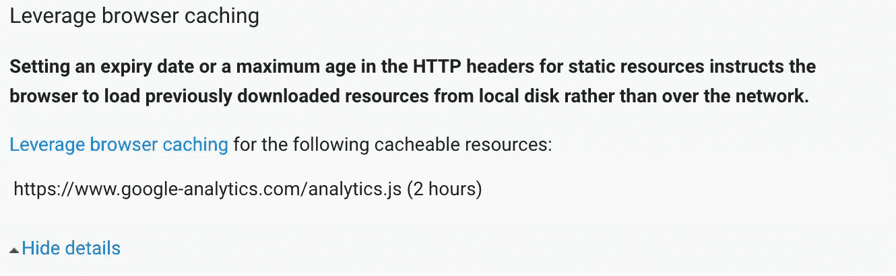

# 修复谷歌分析缓存问题

> 原文：<https://medium.com/hackernoon/fixing-google-analytics-caching-issue-d30af0913ef2>

从 Google PageSpeed Insights 获得满分可能是一项单调乏味的任务，尤其是在网站上有 Google Analytics 的情况下。你最终会认为 99/100 是满分。那一分到底意味着什么？而你每晚入睡都知道还缺一分。朋友，解决办法就在这里。

# 解决方案

答案很简单——使用 [CloudFlare 谷歌分析应用](https://www.cloudflare.com/apps/google-analytics)。就这么简单！对于那些不熟悉 CloudFlare 的人，我将指导你们如何做。

# 设置

[CloudFlare](https://www.cloudflare.com/) 是一项出色的服务，可以让您的项目更快、更安全。我用的是[免费计划](https://www.cloudflare.com/plans/)，它给你提供了很多选择。第一步是将网站添加到 CloudFlare。你必须扫描网站，添加 DNS 记录，并更新域名服务器。不用担心；您的域名将始终可用，在过渡期间不会停机。

当您的网站添加到 CloudFlare 后，您将会收到通知，您可以开始配置。有大量的配置设置超出了本文的范围。每个选项都有很好的记录，慢慢来，仔细设置每个选项。不要忘记在每次更改后检查你的网站是否正常工作，因为之后很难调试问题。相信我；我经历了惨痛的教训才明白。

# 谷歌分析应用

第一步是删除当前安装的谷歌分析跟踪代码。要安装 Google Analytics 应用程序，请转到应用程序选项卡并搜索它。点击“预览”，添加跟踪代码，并选择要安装谷歌分析的页面。不要忘记点击“安装”按钮来完成安装。现在去 [Google PageSpeed Insights](https://developers.google.com/speed/pagespeed/insights/) 测试你的网站是否工作正常。

# 最后的想法

这个问题困扰了我几个月，现在我有了[满分](https://developers.google.com/speed/pagespeed/insights/?url=https%3A%2F%2Fwww.silvestarbistrovic.from.hr)。

你有满分吗？你有替代方案吗？

请在下面的评论中或者在我的推特页面上告诉我。

*如果你想让我帮你评分，我可以* [*招*](https://www.silvestarbistrovic.from.hr/hire-me) *。*

更多文章，请关注我的推特或我的个人网站。

*本帖最初发布在我的个人网站上，* [*查看一下*](https://www.silvestarbistrovic.from.hr/articles/fixing-google-analytics-caching-issue/) *。*