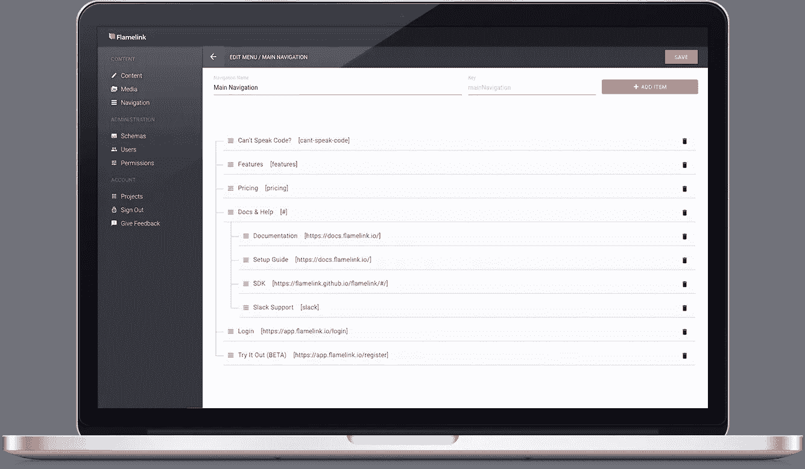
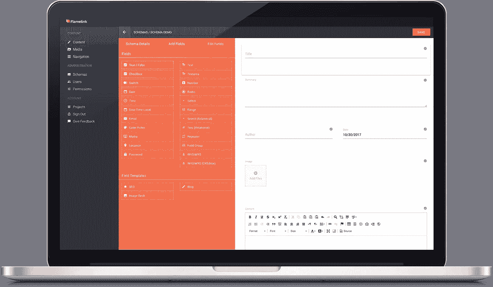
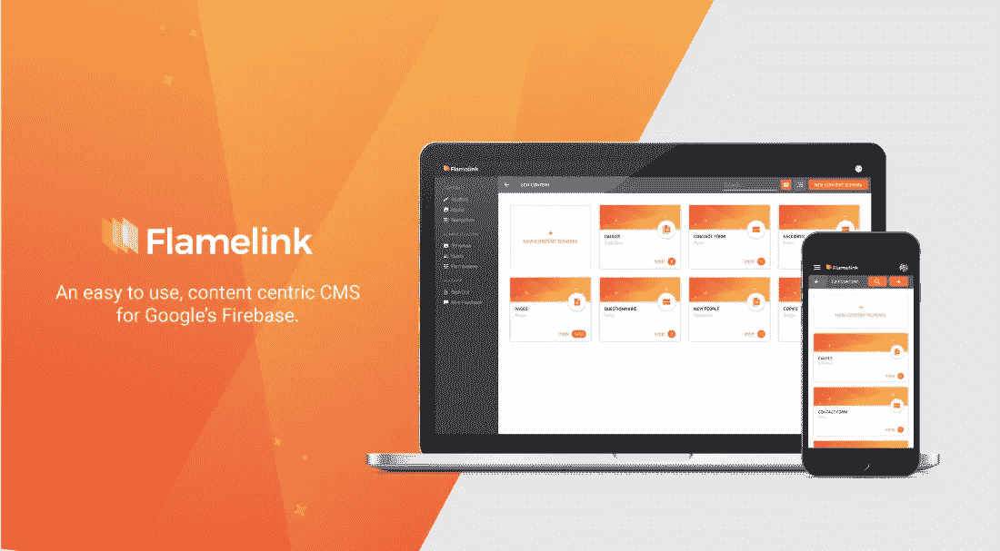

# Flamelink，你一直在寻找的 Firebase 的 CMS，就在这里。

> 原文：<https://medium.com/hackernoon/flamelink-the-cms-for-firebase-youve-been-searching-for-is-here-dac5bfccdd4a>

你好。

我叫杰森。我为一家初创公司工作，该公司开发了一款名为 Flamelink 的非常酷的产品，这是一款易于使用、以内容为中心的内容管理系统，可以与谷歌的 Firebase 无缝集成。

查看我们的解说视频，快速了解 Flamelink:

事情是这样的。我不是一个 [Firebase](https://hackernoon.com/tagged/firebase) 用户。老实说，那可能是因为我不是一个搞技术的人。如果说实话，这可能是唯一的原因。

问题是，我们的团队喜欢使用 Firebase。它安全、可靠、快速。但最重要的是，它得到了作为开发者解决方案的[谷歌](https://hackernoon.com/tagged/google)的支持。正是在使用 Firebase 构建我们的一个项目时，我们发现缺少添加和管理内容的界面非常令人沮丧。像我这样的家伙，不应该让**接近任何代码**，需要改变这个价格，调换那个图像，或者修改某一行文字。所以我不得不缠着我们的开发人员放下他们正在做的改变。这通常包括尖叫、眼泪和某种贿赂。

一定有比这更简单的方法？

进入火焰链接。易于使用的 CMS 专为与 Firebase 集成而构建。我们的开发人员可以继续做他们最擅长的事情——编写白热化的代码，留下有用的 Flamelink 界面来帮助内容管理者(也就是像我这样的非技术人员)添加和管理他们的内容。

Well? Do you?

## **Flamelink 的特点**

在 Firebase 上构建项目时，我们发现了 Flamelink CMS 的一些最有用的特性。因此，我们构建了这些惊人的功能来充分利用 Firebase 引擎的能力。

补充说明:开发人员发给我一份特性列表，我必须弄清楚他们应该做什么。凌晨 3 点。喝了太多咖啡后。如果你是一名开发人员，你实际上会知道这些特性是多么有用。如果没有，请享受我的旅程，我会弄清楚这些功能是做什么的…

1.  **灵活的内容类型**

Flamelink 比我妈妈周四早上的瑜伽课更灵活，允许你创建自己的内容类型。

Flamelink’s slick drag-and-drop content builder.

**2。关系数据字段**

比假期里那个古怪的阿姨更亲密。你知道我在说哪一个。还可以引用不同内容类型的数据。

**3。JAVASCRIPT SDK (NPM 软件包)**

让开发人员和编码人员更容易一起工作。

更新:使开发者和编码者更容易处理内容。

抱歉，我弄错了...我的错…

**4。媒体管理**

Upload any file type, automatically resize your images, create folders to keep tabs on your media — all seamlessly integrated with Firebase Storage buckets.

**5。用户管理**

你知道像我这样的人不应该被给予自由支配来摆弄和调整后端的东西吗？用户管理有助于防止这种情况发生。你可以以后再感谢我们。

**6。导航**

我们光滑的界面允许你用一个拖放菜单生成器创建多个菜单，添加自定义类和可排序的层次结构子菜单。

**7。与 FIREBASE 无缝集成**

Flamelink 可以毫不费力地利用 Firebase 发动机的动力。

*   您的所有内容都存储在 Firebase 实时数据库中
*   所有介质都存储在 Firebase 存储桶中
*   用户管理与 Firebase 的认证服务相集成
*   菜单作为数据存储在 Firebase 数据库中

## 先睹为快即将推出的 Flamelink 功能。

我们真的想构建一个健壮、功能丰富、经得起未来考验的解决方案。所以我们把一些功能放在了次要位置，所以现在我们已经推出了 Flamelink，所以我们开始讨论这些功能。这些功能包括:

*   多语言支持，允许您在项目中使用多种语言
*   多环境，这样您就有了一个生产和暂存环境来测试您的更改，然后再将其推送到您的实际项目中。
*   备份(目前你可以用 Google Firebase 打开备份——这是一个付费功能)
*   用户控制设置(图像尺寸等)
*   帮助您添加所需内容的附加内容类型字段。

**免费试用 Flamelink】**

免费开始使用 Flamelink，这样您就可以了解它所有令人惊叹的功能，以及这些功能如何使您和您所有的 Firebase 项目受益。访问 https://flamelink.io/了解更多信息。你可以直接进入并连接你的 Firebase 项目，看看通过我们的界面添加和管理内容是多么简单。

Flamelink 于 2017 年 10 月 31 日推出了测试版。

你也可以在脸书和推特上关注我们。

 [## 火焰链

### 火焰链接。215 喜欢 12 谈论这个。Flamelink 是谷歌 Firebase 的一个易于使用、以内容为中心的内容管理系统。

www.facebook.com](https://www.facebook.com/FlamelinkCMS/)  [## flamelink(@ FlamelinkCMS)| Twitter

### Flamelink 的最新推文(@FlamelinkCMS)。Flamelink 是一个易于使用的，以内容为中心的内容管理系统，特别是…

twitter.com](https://twitter.com/FlamelinkCMS)