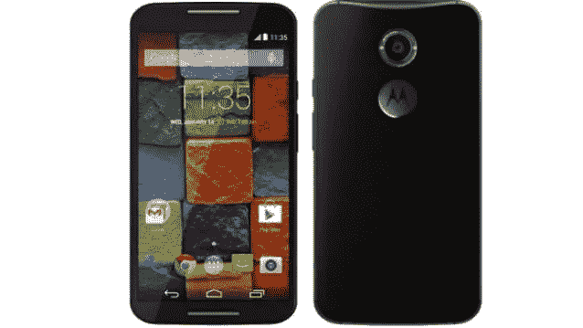
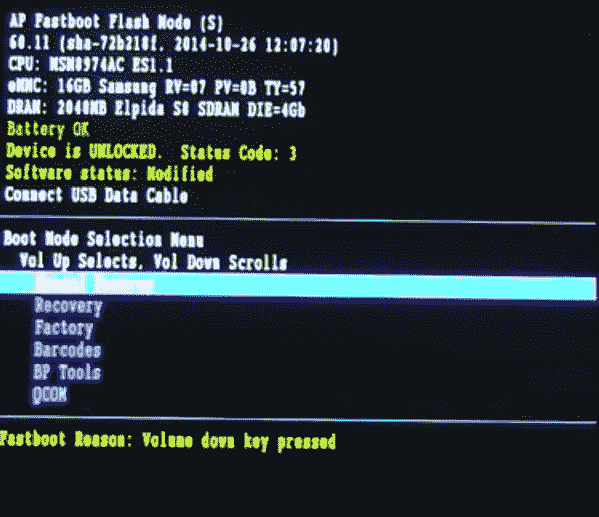

# Moto X(第二代)上的 Flash Stock 工厂图像

> 原文：<https://medium.com/hackernoon/flash-stock-factory-images-on-moto-x-2nd-gen-6b7c90b4e5ab>

Moto X 2nd Generation

我最近将我的[摩托罗拉](https://hackernoon.com/tagged/motorola) X 二代上的[安卓](https://hackernoon.com/tagged/android)操作系统从安卓 5.1 棒棒糖升级到安卓 6 棉花糖，遇到了一些问题。我不能打电话或接电话。我手机上的网络指示灯刚刚显示“ ***无服务****”*。这让我很困扰，我开始进行研究，并向人们寻求帮助。然后我问了一些修理手机的专家，他们建议我试着回到 Android 5.1，所以我决定尝试一下，因为我真的没有选择。

恢复到 Android 5.1 工作，我可以再次拨打和接听电话。我将解释我是如何将股票图片*(这只是指设备的原始操作系统)*闪存到我的手机上的，这帮助我恢复到 Android 5.1 Lollipop。

# 步伐

*   确保您的引导加载程序已解锁。
*   您需要登录摩托罗拉网站才能下载[股票图片](https://motorola-global-portal.custhelp.com/app/standalone/bootloader/recovery-images)。
*   仔细阅读说明，接受条款和条件。阅读它(*我做了*)，然后继续在下面提供的列表中寻找您的设备。点击请求下载，摩托罗拉将在 24 个工作小时内与您联系，您可以通过该链接为您的特定设备下载图片。
*   之后，确保你设置了 ADB，Android SDK 和 fastboot。这很重要。这是一个[视频](https://www.youtube.com/watch?v=oaNM-lt_aHw)详细讲述了这个过程。
*   然后，我按照这个令人惊叹的视频[一步一步地运行](https://www.youtube.com/watch?v=kS0eVAfpBIo)，它展示了所有要运行的命令。它在 Windows 上，我用 Linux(基本上是一样的，别担心)。
*   按照上面的视频，它应该会顺利进行，因为它对我来说。

> 我可以再打电话给:D

Snapshot of the device booted in fastboot mode.

> 希望这篇文章能帮助你解决你的问题。感谢阅读。

> [黑客中午](http://bit.ly/Hackernoon)是黑客如何开始他们的下午。我们是 [@AMI](http://bit.ly/atAMIatAMI) 家庭的一员。我们现在[接受投稿](http://bit.ly/hackernoonsubmission)，并乐意[讨论广告&赞助](mailto:partners@amipublications.com)机会。
> 
> 如果你喜欢这个故事，我们推荐你阅读我们的[最新科技故事](http://bit.ly/hackernoonlatestt)和[趋势科技故事](https://hackernoon.com/trending)。直到下一次，不要把世界的现实想当然！

