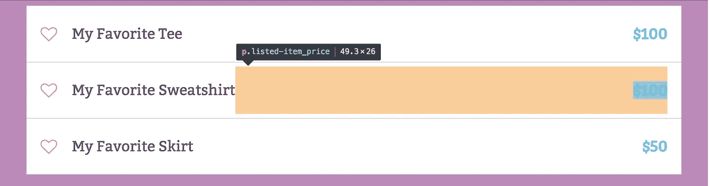

# Flexbox 保守得最好的秘密

> 原文：<https://medium.com/hackernoon/flexbox-s-best-kept-secret-bd3d892826b6>

在过去的几个月里，我一直在使用 Flexbox，非常喜欢它让最复杂的布局变得如此简单和直观。我的 CSS 是免费的，我的标记是合乎逻辑的，有序的，看起来我可以在任何地方放置任何东西(align-items:center；FTW！).这种感觉在我问自己这个问题的那一天戛然而止，“我如何覆盖 justify-content 来沿着主轴独立定位一个 flex 项目？”我试图在一行中沿着主轴均匀地间隔 flex 项，最后一项一直浮动到右侧。在没有浮动或固定边距的情况下，我很难做到这一点。

我读过许多关于 Flexbox 的文章，在生产中使用过它，甚至做过一些关于这个主题的技术演讲，但它似乎缺少了一些东西。关于这个主题的每篇文章都解释了 align-self 如何在横轴上覆盖 align-items，但是没有一篇文章展示了如何在主轴上做同样的事情。当我的一个朋友(他已经阅读了整个 CSS 灵活框布局规范)问我是否在使用自动边距时，我正要接受这一事实，即要做到无黑客攻击是不可能的。当然，自动边距对 CSS 来说并不陌生，但是当与 Flexbox 配合使用时，神奇的事情就会发生！

> “TL；DR Flexbox 和 auto margins 是天生的一对。”

## **让我们灵活一点！**

当然，如果你阅读规范，你会看到自动边距被引用在正中间:[规范引用:8.1。与自动边距对齐](http://www.w3.org/TR/css-flexbox-1/#auto-margins)。如果对 flex 项目应用自动边距，该项目将根据自动边距的应用方向，自动扩展其指定的边距，以占据 flex 容器中的额外空间。例如，一个样式为 **margin-left: auto** 的< div >将被一直推到 flex 容器的右侧，左侧边距占据了元素左边缘与其前一个兄弟元素之间的任何额外空间。如果你没有指定方向，简单地应用 **margin: auto** ，一个 flex 项将会在它自身的两边平均分配额外的空间。这是一种将一个或多个项目沿主轴居中的方式。将 **margin: auto** 添加到两个或更多 flex 项目本质上与将 justify-content: space-around 应用到 flex 容器是一样的。

将自动边距与 Flexbox 结合使用的神奇之处在于，它允许您在单个 flex 项目上覆盖由 justify-content 指定的默认对齐方式。在下面的例子中，您可以看到价格应用了 **margin-left: auto** 。这允许它浮动到容器的右边缘，而其余的 flex 项根据 justify-content 对齐，在本例中是 flex-start。需要注意的是，如果使用自动边距，文本对齐属性将不起作用，因为沿主轴的所有额外空间将首先分配给边距，不会留下用于对齐文本的额外空间。

Margin-left: auto example

另一个常见的用例是沿着主轴对 flex 项目进行分组。在本例中， **margin-left: auto** 应用于导航链接列表中的 Li:n-child(4)**以将账户导航项目与主导航列表分开。使用这种技术，所有链接仍然是 flex 项目，但是您可以更好地控制它们的位置。**

FThis is also useful for “grouping” nav items

当使用 flex-direction: column 时，同样的技术也可以沿主轴垂直应用。在本例中，justify-content: space-around 应用于 flex 容器，并且在按钮上使用了 **margin-top: auto** 来将行动号召按钮和文本推到 flex 容器的底部。您可以通过将按钮和文本包装在一个< div >中来达到同样的效果，但是这样按钮和文本就不再是 flex 项目了。请注意，您需要对 flex 容器应用一个高度，以便查看它的运行情况。

Auto margin vertical example

## **那么底线是什么？**

在 Flexbox 中使用自动边距是一种有效的方法，可以获得 css 浮动的所有灵活性，而不会破坏文档正常流程中的元素。它可以水平或垂直应用，并使您能够更好地控制主轴上的伸缩项目。

这是 Flexbox 保守得最好的秘密，但现在它是你的秘密武器。尽情享受吧！

> [黑客中午](http://bit.ly/Hackernoon)是黑客如何开始他们的下午。我们是阿妹家庭的一员。我们现在[接受投稿](http://bit.ly/hackernoonsubmission)并乐意[讨论广告&赞助](mailto:partners@amipublications.com)机会。
> 
> 如果你喜欢这个故事，我们推荐你阅读我们的[最新科技故事](http://bit.ly/hackernoonlatestt)和[趋势科技故事](https://hackernoon.com/trending)。直到下一次，不要把世界的现实想当然！

