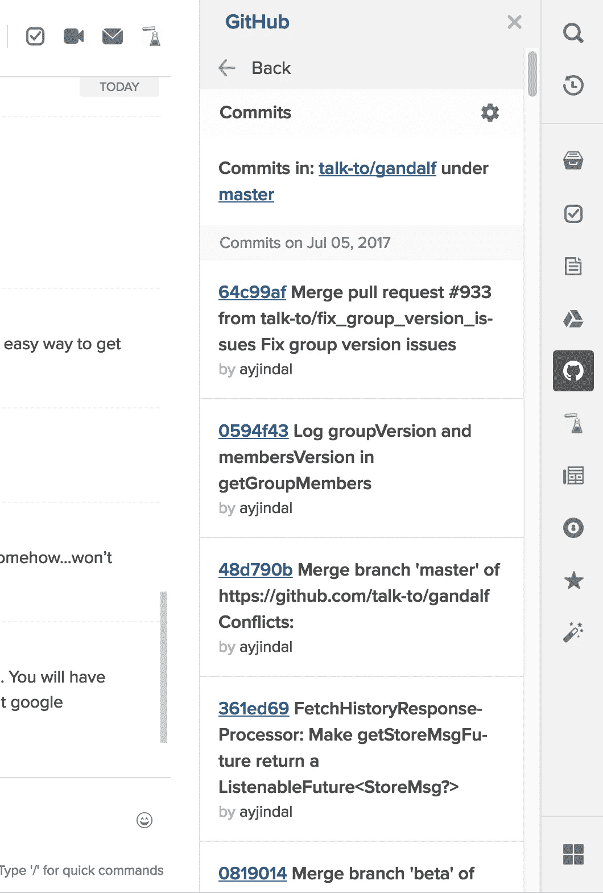
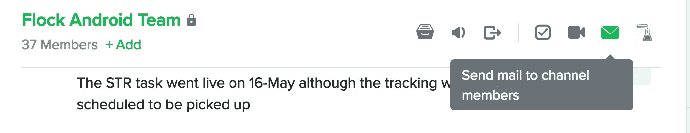
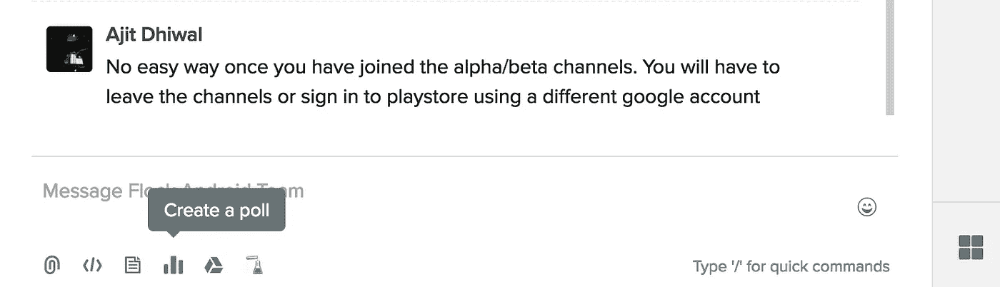

# ` FlockOS:世界上第一个聊天操作系统

> 原文：<https://medium.com/hackernoon/flockos-worlds-first-chat-operating-system-bdf367b4b34c>

团队信使席卷了全世界。我仍然记得 8 年前在我的第一家公司使用 Lync，它非常简单。虽然它提供的与 outlook 和其他微软软件的整合是非常出色的，但它仍然仅限于聊天。 [Slack](http://www.slack.com/‎) 、 [Hipchat](http://www.hipchat.com) 、[微软团队](https://products.office.com/en-us/microsoft-teams/group-chat-software)、 [Flock](http://flock.com) 、 [Twist](http://twistapp.com) 等是团队聊天软件的新品种，它们旨在提高生产力，提供的远不止是[聊天](https://hackernoon.com/tagged/chat)。

有了 Flock，我们试图完成的事情之一就是创建一个比其他任何东西都更易于使用和扩展的平台。我们认为它非常强大，可以被认为是 zeroPC 和 eyeOS 等其他 [webOS 的同类产品之一。](https://en.wikipedia.org/wiki/WebOS)

有了 [FlockOS](https://docs.flock.com/) ，我们带着以下目标出发了:

*   应用程序应该感觉像是原生界面的一部分
*   应用程序发现应该很容易，这样才能让用户和应用程序开发者受益

这是我们到目前为止已经完成的工作

应用程序应该感觉像是本地界面的一部分

一些平台依靠“斜杠命令”来触发应用程序。因此，要创建投票，您必须按以下格式键入语法

> */poll“双引号中的池问题”“双引号中的第一选项”“双引号中的第二选项”*

要创建便笺

> /备注我的私人备注

要列出笔记

> /notes 列出全部

诸如此类。你安装的每一个应用程序都会增加一堆你现在必须记住的命令。斜杠命令只对某些精通技术的用户有用。它们很难记住，使用起来也很麻烦，因为它们涉及多个参数，所有这些参数都可以取不同的值。我使用 linux 已经超过 10 年了，仍然不记得 find 的参数顺序。

因此，虽然 flock 提供了 slash 命令，但我们也在用户界面内部提供了各种钩子，用户可以从那里启动应用程序。

开发者可以选择在 3 个主要区域显示他们的应用图标。

*   应用启动器
*   聊天选项卡按钮
*   附件选取器

***应用程序启动栏***

此栏列出了您当前已安装的所有可以独立启动的应用程序。所以你可以用这个直接启动一个 app。例如，在这里，我已经从应用程序启动栏(最右边)的侧边栏中启动了 github 应用程序，以检查 repo 中最近的提交。

App launcher on the far right

***聊天标签按钮***

每一个消息应用都有一些你可以在当前聊天中执行的操作，这些操作本质上是与上下文相关的。Flock 允许你创建可以从当前聊天标签中获取上下文的应用程序。

例如，如果你想查看你和另一个人之间共享的待办事项，你只需打开他的聊天标签，点击待办事项的聊天标签按钮，就可以获得你和那个人之间所有待办事项的列表。

Chat tab buttons on the top right

***附件拾取器***

大多数通讯软件都允许你添加附件。电子邮件允许你附加文件、图片等。即时消息领先一步，像 whatsapp 这样的应用程序允许你附加你的位置、音频剪辑、相机剪辑等。通过 flock，我们也向开发者展示了这一领域。

这允许你创建可以添加任何内容到聊天窗口的应用程序。

例如“投票”。如果你必须安装投票应用程序，那么你只需点击“投票”附件按钮，就会弹出一个 html 模式窗口，你可以在其中添加选项。与 notes 类似，只需单击 notes attachment 按钮，它将弹出一个模态窗口，您可以在其中用一个完整的富文本编辑器输入您的注释。

Attachment picker buttons on the bottom left

**应用程序发现应该很容易**

即时通讯正在慢慢转变为一种模式，在这种模式下，应用程序与即时通讯平台本身一样重要，甚至更重要。我们认为斜杠命令对应用开发者和用户都不好。它们不仅很难被新用户发现和学习(首先是哪个参数，像参数这样的命令的顺序等等)，它们对应用程序开发人员也是不好的，因为他们几乎没有任何接触。斜杠命令只是一个文本，开发者做品牌推广的机会很少。我们认为应用中的品牌非常重要，因为这可以确保用户可以向其他人推荐高质量的应用，同时也为应用开发者提供了急需的曝光率。

在 flock 中，我们试图通过确保所有应用程序都有应用程序图标来解决这个问题。这样，应用程序在主界面上总是可见的，人们可以从他们工作的第一天就开始使用它们，他们必须了解 flock 中的应用程序是什么。一些不了解技术的人甚至没有意识到他们正在使用一个外部应用程序！这允许你完全为你的团队定制 flock，如果你是一个营销团队，你的 flock 界面上的所有按钮都可以是营销应用程序，同样适用于技术，设计甚至大学！由于应用程序是 html/js 格式的，你甚至可以创建只在团队内部运行的应用程序，并且可以访问内部 API！最棒的是，这些应用可以在手机、网络和桌面上运行。

FlockOS 一直专注于开发者。作为开发人员，我们知道您也应该获得应用程序的可见性。在斜线命令的情况下，用户看到的只是你的应用程序的名称。这就是为什么我们为应用程序开发者提供了多个挂钩来展示他们的图标。这对品牌召回有很大帮助。因此，如果你的待办事项应用程序是最好的，用户在新团队中安装它或向朋友推荐它时，可以很容易地回忆起它，因为他们会熟悉你的应用程序图标。因为所有的应用程序都是基于 html/css 的，所以你可以提供你自己的 UI/UX 来改变应用程序的外观和感觉。我们相信 UX 也是应用程序体验不可或缺的一部分，开发者可以利用它来改善用户与应用程序的交互。

我们才刚刚开始，虽然第一版的 FlockOS 已经稳定，你现在就可以开始为它开发应用程序，但还有很长的路要走。我们很乐意听到来自开发者社区的反馈和建议，告诉我们如何让这个平台变得更好。

声明:我为 flock 工作，可以通过 flock dot com 直接联系 ajit.dh