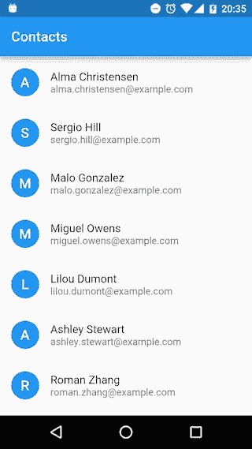
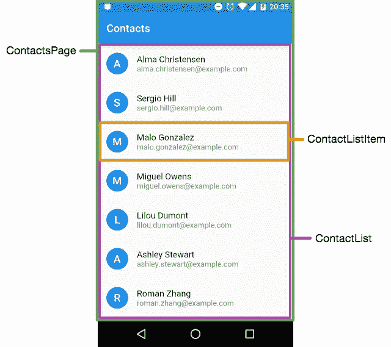
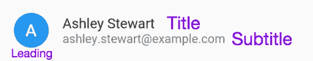
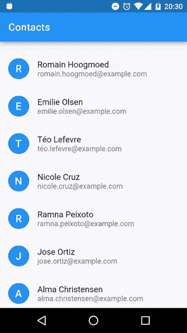

# Flutter III -列表和项目— [Flutter 1.0]

> 原文：<https://medium.com/hackernoon/flutter-iii-lists-and-items-6bfa7348ab1b>


关于 Flutter 的第三个帖子将重点解释如何建立一个项目列表。包含代表每个联系人的小部件的可滚动联系人视图将沿着文章实现。

> **更新至 Flutter 1.0—2018 年 12 月**



# 索引

*   [Flutter I:介绍并安装](/@develodroid/flutter-i-intro-and-install-a8bf6dfcc7c8)——【Flutter 1.0】
*   [颤振二:材料设计](/@develodroid/flutter-ii-material-design-f437e3e8e6a9)——【颤振 1.0】
*   Flutter III:列表和项目— [Flutter 1.0]
*   [颤振四:MPV 架构](/@develodroid/flutter-iv-mvp-architecture-e4a979d9f47e)——【颤振 1.0】
*   [颤振五:材料设计二](/@develodroid/flutter-v-material-design-ii-flutter-1-0-3a5a52811707) —【颤振 1.0】

> 提示:完整的颤振系列代码可以在这个[库](https://github.com/fabiomsr/Flutter-StepByStep)中获得。

# 概观

在回顾代码之前，让我们先讨论一下**将要做什么**以及**如何做**。首先，要完成一个联系人视图，该视图将包含三种不同的小部件，如下图所示。

*   **ContactListItem** 显示每个联系人的信息。
*   **ContactList** 为了建立一个联系人列表，这个小部件将包含一个 ContactListItem 小部件列表。
*   这个小部件包含整个页面，由 AppBar 小部件和 ContactListItem 列表组成。



# 主应用程序和材料应用程序

正如在以前的帖子中看到的，main()调用包含 MaterialApp 小部件的 runApp 方法。

home 属性将 ContactsPage 小部件实例作为参数。

# 联系数据

为了使示例尽可能简单，ContactsList 构造函数将直接获取代码中创建的数据(硬编码)。如何使用服务获取数据将在下一篇文章中解释。

首先要做的是在 lib 文件夹中创建一个名为 **contact_data.dart** 的文件，该文件与 **main.dart** 文件位于同一层。

下一步是在 **contact_data.dart** 文件中定义一个类来指定联系人数据，即:姓名、电子邮件、电话号码、地址等。

这是一个简单的类，其中定义了联系数据。使用 **{}** 使构造函数取为可选的参数允许通过名称引用它们。此外，为了在编译时创建[实例常量，构造函数被定义为 const。](https://www.dartlang.org/guides/language/language-tour#final-and-const)

下一步是创建一个示例联系人列表，下面的例子显示了一个包含两个联系人的列表。

看一下第一句，左边的 **const kContacts，**定义了一个不能被重新赋值的常数。在右侧， **const < Contact > []** 定义了一个不可变列表。在此列表中，必须为每个现有联系人创建一个联系人实例。当我们想要创建一个新的联系人时，我们使用 **const Contact** 而不是 **new Contact** ，因此它在编译时成为一个常量。如您所见，将联系人类属性标记为可选允许按名称分配它们。

# ContactListItem

让我们从内向外讨论这三个小部件。内部的是 ContactListItem。

在以前的帖子中，解释了 Flutter 提供了两种不同类型的小部件，StatelessWidget 和 StatefulWidget。ContactListItem 将是一个无状态的小部件，原因是因为这个小部件将显示完全不会改变的信息，一个联系人将总是拥有相同的数据。下面的例子显示了这个小部件应该是什么样子。

> 与处理联系人数据的方式相同，为联系人小部件创建一个文件，将其命名为 **contact_view.dart** ，并将其放在存储 main.dart 和 **contact_data.dart** 的 lib 文件夹中。

构造函数将一个联系人作为参数，而 ListItem 小部件 instant 必须由 build 方法返回。这是一个由 Flutter 和 keeps Material 设计规范提供的小部件，可能会返回其他小部件(文本，图像…)，但使用 ListItem 小部件将节省很多工作。

一些 ListItem 属性包括:

*   **前导**它是一个放在标题前的小部件，通常是一个代表用户的图像，或者是一个圆圈内的字母，或者是 Flutter 中的 CircleAvatar。
*   **标题**定义第一个文本行的小部件
*   **副标题**定义第二个文本行的小部件，它被放置在标题下。

这是一个 ListItem 结构的例子。



在本例中，构建的 ListItem 有一个表示联系人姓名中第一个字母的文本，它嵌套在一个 CircleAvatar 中作为前导。它也有一个文本显示联系人全名作为标题，其电子邮件作为副标题。

定义 ContactListItem 的一个更简单的方法是使它扩展 ListItem，因为这是已经从 build 方法返回的内容。

# 联系人列表

项目完成后，让我们开始列清单。将使用一个材料列表小部件。这个小部件在内部返回一个 ScrollableList 小部件，它允许构建一个可滚动的列表。

ContactListItem 和 ContactList 小部件都是无状态小部件，在这种情况下，联系人列表被声明为最终状态。

为了使用 Contact 类，它的文件( **contact_data.dart** )必须被导入到文件的顶部，在该文件中将按以下方式使用。

```
import ‘contact_data.dart’;
```

在上面的例子中，在 build 方法中返回了一个 MaterialList 小部件，一些指定的属性是描述带有标题和副标题的 tems 的**类型**，垂直**填充**和携带 ContactListItem 列表的**子属性**。

函数 **_buildContacList** 将负责创建列表，它将迭代联系人数据列表并将其映射到一个 ContactListItem，最后使用 **toList** 方法创建一个包含所有 contact listitem 的列表。

如果你不熟悉函数式编程，下一个函数将是等效的。

```
List<_ContactListItem> _buildContactList() { var items = new List<_ContactListItem>(); for (var contact in _contacts){
        items.add(new _ContactListItem(contact));
    } return items;
}
```

# 联系人页面

所需的最后一个小部件必须包含一个 AppBar 和一个 ContactList。

ContactsPage 扩展 StatlessWidget，因为它不会改变其状态。这个小部件将使用 Scaffold 实例创建，因此它提供了一个布局，其中可以放置一个 AppBar 和一个列表。

在这个例子中，一个 AppBar 被添加到了 Scaffold 中，属性 body 采用了一个 contacts list 实例(ContactList 小部件)。使用在 **contact_data.dart** 中创建的 kContacts 创建联系人列表。

最后，只需在 MaterialApp home 属性中设置一个新的 ContactPage。

```
home: new ContactsPage()
```

运行应用程序并查看联系人列表。



## 综上

在使用 Flutter 创建了联系人列表之后，让我们考虑一下如何使用 Android 以原生方式实现同样的工作。

我们可以使用两种不同的。xml 文件，其中一个用来定义 AppBar 和 RecyclerView，另一个用来定义联系人的布局。还需要一个活动(或者一个活动和一个片段)，一个适配器和一个视图容器。

代码量和时间的差别是相当大的。这篇文章展示了 Flutter 在规格方面有多强大。

下一篇文章将关注如何使用 Flutter 创建一个 MVP(模型-视图-展示者)架构。

本教程中显示的所有代码都可以在这里[找到](https://github.com/fabiomsr/Flutter-StepByStep)如果你错过了什么。

[](http://bit.ly/HackernoonFB)[](https://goo.gl/k7XYbx)[](https://goo.gl/4ofytp)

> [黑客中午](http://bit.ly/Hackernoon)是黑客如何开始他们的下午。我们是 AMI 家庭的一员。我们现在[接受投稿](http://bit.ly/hackernoonsubmission)并乐意[讨论广告&赞助](mailto:partners@amipublications.com)机会。
> 
> 如果你喜欢这个故事，我们推荐你阅读我们的[最新科技故事](http://bit.ly/hackernoonlatestt)和[趋势科技故事](https://hackernoon.com/trending)。直到下一次，不要把世界的现实想当然！

[](https://goo.gl/Ahtev1)