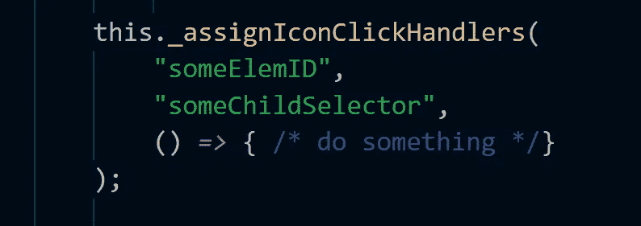
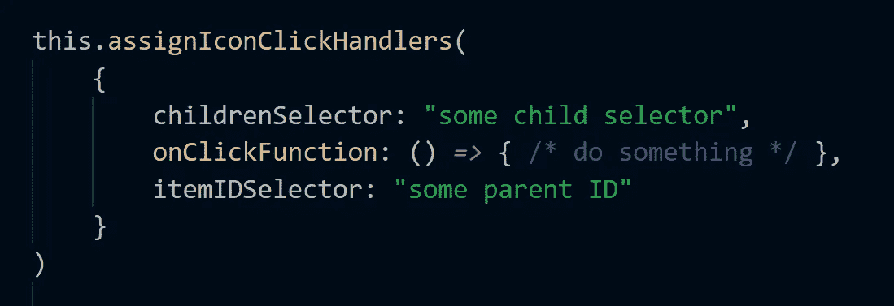

# 在带有参数对象的 TypeScript 中遵循单参数原则

> 原文：<https://medium.com/hackernoon/follow-single-argument-principle-in-typescript-with-parameter-objects-c8a259dd7191>

我是鲍伯·马丁的《干净代码》( Clean Code)的忠实粉丝，这是一本关于敏捷软件技术的手册。我在这里(简要地)写了一下:[https://medium . com/@ pagal vin/I-m-work-with-the-first-of-some-of-my-Collins-on-a-official-set-of-programming-standards-47 f 79d 46 f 183](/@pagalvin/i-m-working-with-a-few-of-my-colleagues-on-an-official-set-of-programming-standards-47f79d46f183)。他和合著者提出了一套原则，其中包括:

*   函数的最佳参数数是零。
*   如果你需要参数，单参数函数是可以的:)。
*   两个或更多可能表明需要重构函数。

我在这里不是引用这本书，只是转述一下。

我努力让我的函数参数降到 1 或 0，但有时，感觉不对。这里有一个例子:

上面的[要点显示了一个使用](https://gist.github.com/pagalvin/b851bcb4dcdab308c460cefc8c101340) [jQuery](https://hackernoon.com/tagged/jquery) 为图标分配点击处理程序的函数。这些图标是父元素的子元素。我知道父图标的 ID，也知道查找适当图标所需的 jQuery 选择器。

要点显示了以两种方式实现的相同方法。第一种方法有三个不同的参数，调用方式如下:

在第二个例子中，我传递了一个对象:

它看起来非常类似于[的三参数](https://hackernoon.com/tagged/three-parameter)版本，可能仍然违反了单参数原则。也就是说，这种方法感觉很好，有几个原因:

*   调用函数时，intellisense 提示我输入参数。
*   我可以按任何顺序填写参数。由此得出一个小推论——我更难错误地交换参数，因为智能感知基本上是在我面前扔标签(见下面的视频)。
*   当我填写参数时，intellisense 会将它们从建议列表中删除。
*   最后，当有人查看代码时，程序员的意图对他们来说是显而易见的。在第二个例子中，字符串参数之间的区别是显而易见的。在第一个例子中，你只是传递字符串。一看就知道那些是干什么用的不容易。意图不太清楚。

简而言之，intellisense 引导我完成填写参数的过程，并帮助我降低出错的风险。

这是一个展示智能感知工作的视频:

还有人这么做吗？试过就停了？还有其他反对意见吗？请留下评论，让我知道。

**后记**:如果你喜欢这篇文章，你可能也会喜欢我的免费书，[又一本打字本](https://www.gitbook.com/book/pagalvin/yet-another-typescript-book/details)。请检查一下。