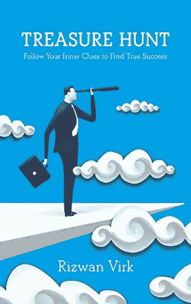

# 跟随线索，为你的非风险投资创业想法赢得 20，000 美元的比特币投资

> 原文：<https://medium.com/hackernoon/follow-the-clues-and-win-20-000-in-bitcoin-investment-for-your-non-vc-startup-idea-c7b770e7ae4>

或者为什么我要把比特币投资到某人的疯狂梦想中！

我最近宣布，作为我的新书《T2 寻宝:跟随你内心的线索找到真正的成功》发布会的一部分，我将投资 20，000 美元在比特币(或遗产现金！)在一位选手的商业理念中。我特别寻找非风险投资支持的项目。更多详情请见 www.zenentrepreneur.com/contest。

Win a Bitcoin Investment to Seed Your Idea!

***风投和大多数创业者的问题***

我与许多企业家和潜在的企业家交谈过。这部分是因为我的写作，部分是因为我在创业公司的工作。因为我在硅谷和麻省理工学院生活和工作，这些企业家中的许多人试图从天使投资人和风险投资人那里为他们的商业想法筹集资金。

我通常从企业家那里得到的最大抱怨是，风投不会投资他们的公司，因为它不是一个“足够大的市场”，或者它不是一个“风投规模的企业”。任何走这条路的人都可能会感到沮丧，因为投资者不认为几年后这可能是一个 10 亿美元的生意。

当然，当我与风投交谈时，这通常是他们决定放弃投资的原因——因为它不够“大”

这让双方都很沮丧。

从某种意义上说，企业家是对的，当大多数企业开始时，市场一点也不明朗……所以几乎不可能预测一个市场是否会变得足够大。毕竟，风险投资是错误的，而不是正确的(因为大多数风险投资支持的企业都失败了)，所以他们不是一个很好的判断者。

***一种不同的商业投资***

另一方面，风险投资是正确的，因为不是所有的企业都能提供风险投资规模的回报——他们也不应该这样做！

我遇到过许多企业家，他们的商业创意一旦推出，就能满足市场上非常特殊的需求，但不是“传统的”“新技术的”商业。因此，他们不太适合正常的硅谷模式——筹集种子资金，然后进行数百万的风险投资，将用户(或收入)扩大到一定程度，筹集 B 轮资金，然后出售给更大的公司或上市(通常没有任何利润)。

这可能包括服务企业、零售企业、许多类型的创意产品、以任务为导向的项目、娱乐，或者只是没有人知道会奏效的疯狂想法。而且，有些业务只需要一点点资本就可以启动，不需要 VC 类型的投资。

那么这些创业者该何去何从呢？第一个答案是与天使投资者交谈。虽然这在一定程度上行得通，但如今许多天使投资者都希望将资金投入下一个脸书，因此他们寻找风投会在下一轮投资中支持的企业。银行吗？一个常见的答案是去银行贷款，但这更有问题。大多数银行不会基于没有抵押品的想法放贷，而是要求个人担保。

***每次启动都是寻宝***

最后，作为我的新书《寻宝》的一部分，许多人希望跟随他们的直觉和为他们提供的“线索”去追求一个小生意或创意，而银行或风投投资者都不合适。

许多创业公司——风投支持的和非风投支持的——经常去他们意想不到的地方。微软开始构建开发者工具，而不是操作系统。Slack 和 Discord 这两个非常知名的聊天应用，一开始都是游戏公司，后来发现自己。

在我的项目 Play Labs @ MIT 中，我经常将创办公司与寻宝游戏相提并论——就像印第安纳·琼斯的电影一样。在这些电影中，如果藏宝图摆在我们的主角(印第)面前，他所要做的就是去取回约柜(或其他神器)，那就太好了。但是那不会成为一部非常有趣的电影，不是吗？相反，他跟随第一条线索，这也引出了…第二条线索！

现实是，大多数企业家都在遵循他们脑海中看到的一些想法的线索，而这条线索可以通向许多不同的地方。像印第安纳·琼斯一样，大多数企业家都必须一个接一个地“循着线索”才能找到宝藏。这种情况下的线索可能基于直觉、预感、直觉、模式识别或一些完全不确定的东西。

***现实生活中的寻宝游戏——赢得 2 万美元的比特币(或遗产现金)***

我为那些对风险投资有非传统想法的人提供这个新的竞赛——这可能是一个电影项目，一个零售企业，一个服务公司，一个利基市场的应用程序，或者完全在那里的东西——一个基于电引力的宇宙飞船的原型，一个比特币采矿服务——你能想到的！

我将向一名幸运的获胜者提供 2 万美元的比特币(或现金)投资，以实现他们的想法。就像在热门节目《鲨鱼池》中一样，我会面试入围者，并向他们中的至少一人发出邀请，按商定的比例投资他们的公司。要获得资格，你不仅要购买，而且要真正阅读《寻宝》的副本。更多细节在这里——比赛将于 10 月 17 日开始:[www.zenentrepreneur.com/contest](http://www.zenentrepreneur.com/contest)

我这样做是因为我相信这里有许多伟大的想法和企业家，而硅谷的传统风险投资家并没有很好地为他们服务。

如果你按照自己的线索建立了一个召唤你的项目——特别是如果它是一个终生的召唤，而你只是需要一些资本来开始——请参加比赛，我可能会加入你的旅程！