# 沿着{黄色}砖路走

> 原文：<https://medium.com/hackernoon/follow-the-yellow-brick-road-da5112bcdb74>

## 增强现实导航的案例

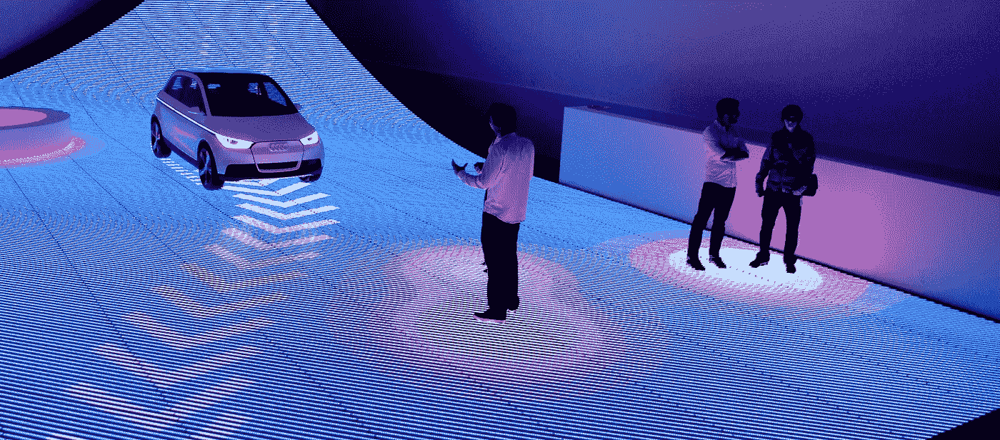

当我几年前第一次坐下来写这篇文章时，它完全是关于[增强](https://hackernoon.com/tagged/augmented)现实[导航](https://hackernoon.com/tagged/navigation)和它带来的真实世界安全功能的想法。当时这只是一个想法，但从那以后，许多公司已经开始研究其中的一些想法。因此，在这篇文章中，我想展示其中一些解决方案，让您注意到这些概念，甚至想出我们可以通过 AR Nav 采取的一些未来方向。

## 纸

古老的纸质地图已经陪伴了我们几个世纪，帮助我们发现、探索和找到回家的路。它曾经方便便携，但随着数字世界开始占据主导地位，两个问题变得清晰起来。首先，它是静态的:虽然我们可以带着它到处走，但它仍然只是一堆文件，又厚又重，而且是地方性的。它只迎合一个城市或一个国家的一般覆盖。

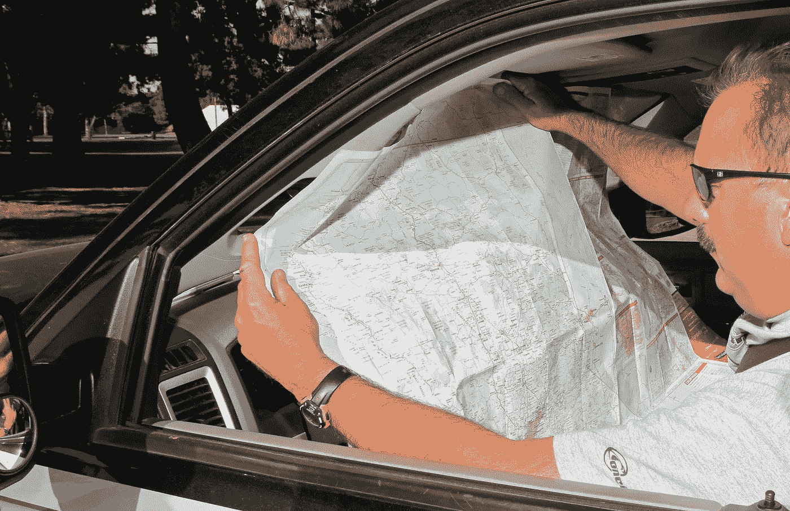

第二个问题与背景有关:一旦你确定了你的位置，你必须首先理解地图的背景；然后，你必须环顾四周，了解你周围的环境，即地标和街道；然后，你必须在你的头脑中创建一个模型，将这两种情况结合起来，这样你就可以继续进行计算，你将需要到达下一个地方。

## 数字的

现在你有了一个可以放进口袋的小设备。你可以拥有世界上所有的地图，它不会变得更重！但是我们还没有完全解决语境的问题。认知负荷比过去小得多:以前你需要把车停在路边，重新定位自己，并找出旅程的下一段，现在你只需低头看看手机，获得下一个指令，你就成功了。

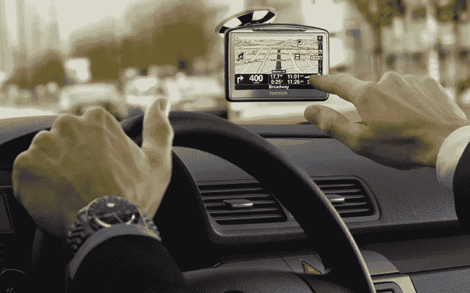

然而，我们仍然把目光从路上移开！！虽然只有几秒钟，但这几秒钟可能是致命的，尤其是在高速公路上以 100 公里/小时(60 英里/小时)的速度行驶时。我们过去常常把车停在路边，因为这些认知计算需要一两分钟；但是现在只需要几秒钟，我们决定我们可以在开车的时候这样做，这可能是致命的。

想象一下:你正在去见医生的路上。作为一名新医生，你不知道他的地址，所以你在谷歌地图上输入他的详细信息，然后开始开车。你知道出城的路，所以你忽略了前几个方向。这意味着你可能错过了你真正需要的第一个方向，所以你疯狂地按下一些按钮，让你回到你应该开始注意的地方。你纠正你的路线，然后听到，“左转到 4 号高速公路”你不知道它在说什么，但看一眼屏幕，你会发现它实际上是指“公主高速公路”谁叫它 4 号公路？但这是一条大路，你知道路在哪里，所以你会没事的。然后，当你接近你的目的地时，它冒险“稍微右转到霍普街”稍微右转？我们说的有多轻微？它是同一条弯曲的街道还是有分支？快速回头看屏幕，当你靠近时再看一次以确认。现在你快到了。"在希尔斯伯勒路左转"好的，这条街在哪里？..而且路牌太小，很难看清。你觉得这次你得摘下眼镜了。你摸索着你的包，拿出你的眼镜，戴上，现在你发现自己在每条街上都放慢速度，只是为了看街道标志，这样你就可以拐进正确的街道。减速…加速…对于路上的其他司机来说，你看起来非常不确定和不可预测。

听起来熟悉吗？因为我们的 GPS 系统中的地图处于不同的环境中，需要我们将视线从道路上移开，所以我们使用语音来帮助我们。VUI(语音用户界面)很棒，它是我们相互交流的主要方式，但我们在 GPS 中使用它作为一个创可贴，一个让我们不要太往下看的小补丁。我们需要让道路对每个人都更安全，但这是我们最好的办法吗？

> 如果我们可以摆脱大多数这些额外的功能，并创建一个易于遵循的映射系统，不需要两个世界的不断映射，减少认知负荷，并允许我们有效地遵循{黄色}砖路，会怎么样？

# 输入 AR。语境之王。

## hud 和眼镜

这里 AR 导航主要有两种方式。第一个是平视显示器或抬头显示器。这有很多种风格，从谷歌眼镜类型的设备到非常酷的价值 50 万美元的 F-35 HMD。这里我们将谈论更传统的挡风玻璃 HUD。第二种方法是一副通常由司机佩戴的 AR 眼镜，类似于 [Hololens](https://www.google.co.il/url?sa=t&rct=j&q=&esrc=s&source=web&cd=1&cad=rja&uact=8&ved=0ahUKEwiWpOa9lYXRAhWdMVAKHYNQAcYQFggaMAA&url=https%3A%2F%2Fwww.microsoft.com%2Fmicrosoft-hololens%2Fen-us&usg=AFQjCNGCDClr2EQVaue4bz4mqUmTW77lEw&sig2=y5UKAwobD4nDXrV0Lipa2A) 或 [Meta](https://www.google.co.il/url?sa=t&rct=j&q=&esrc=s&source=web&cd=3&cad=rja&uact=8&ved=0ahUKEwj3o5rHlYXRAhVEMlAKHcR9CvUQFggpMAI&url=https%3A%2F%2Ftechcrunch.com%2F2016%2F03%2F02%2Fhands-on-with-the-949-mind-bending-meta-2-augmented-reality-headset%2F&usg=AFQjCNGI8vrBcjYtLAEH1bbDKTYVRilv8Q&sig2=A9KU0zBn_mW9fz7CAvvz4g) 眼镜的未来版本。

出现了第一波平视显示器，如 [Navdy](https://www.navdy.com/#discover) 和[大陆组合平视显示器](http://continental-head-up-display.com)。这些大多是挡风玻璃前的较小的透明塑料条，用来显示你的信息。它们可以让你看到你前面的导航，而不必把你的眼睛从路上移开，它们有点像我们挡风玻璃的玻璃。然而，你仍然有一个认知负荷，试图绘制方向图和你一起行驶的实际道路。

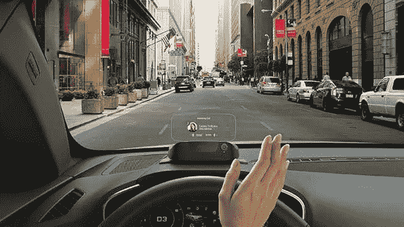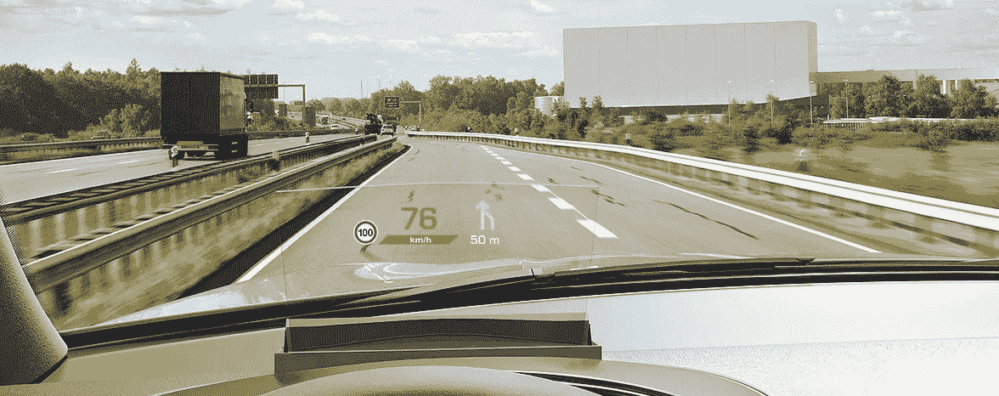

Navdy and Continentals products; Windshield HUDs inside their own context

然后是第二波。这就是眼镜也要加入的地方；它开始变得有趣，我们开始在现实世界的背景下处理道路。在这里，像福特、[迷你](https://www.google.co.il/url?sa=i&rct=j&q=&esrc=s&source=images&cd=&cad=rja&uact=8&ved=0ahUKEwjn2JTa8vjQAhVGVhoKHc6DA0kQjhwIBQ&url=http%3A%2F%2Fwww.usatoday.com%2Fstory%2Ftech%2F2015%2F04%2F19%2Fmini-qualcomm-team-on-augmented-reality-glasses-to-enhance-ride%2F25921741%2F&psig=AFQjCNHJ4xUrrYckjKkRByd_1Hidogicbw&ust=1481976273384435)、[宝马](http://www.bimmertoday.de/2011/10/10/video-das-bmw-head-up-display-mit-augmented-reality-im-simulator/)和[威瑞](https://wayray.com/navion)这样的公司开始发布一些有趣的概念。我们开始看到实际上“画”在路上的方向。这完全摆脱了需要在我们头脑中进行的映射过程，因为我们将它直接映射到世界上。我们仍然有不同的图标和箭头贴满了所有的地方，它并不觉得完全充实，但至少我们正朝着正确的方向前进。

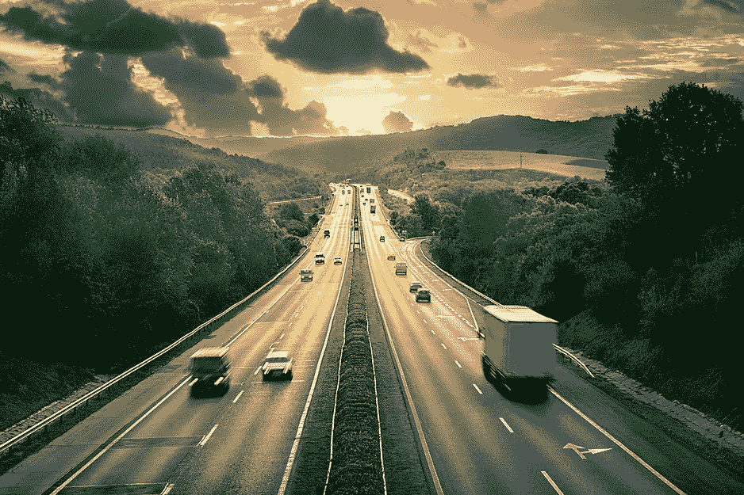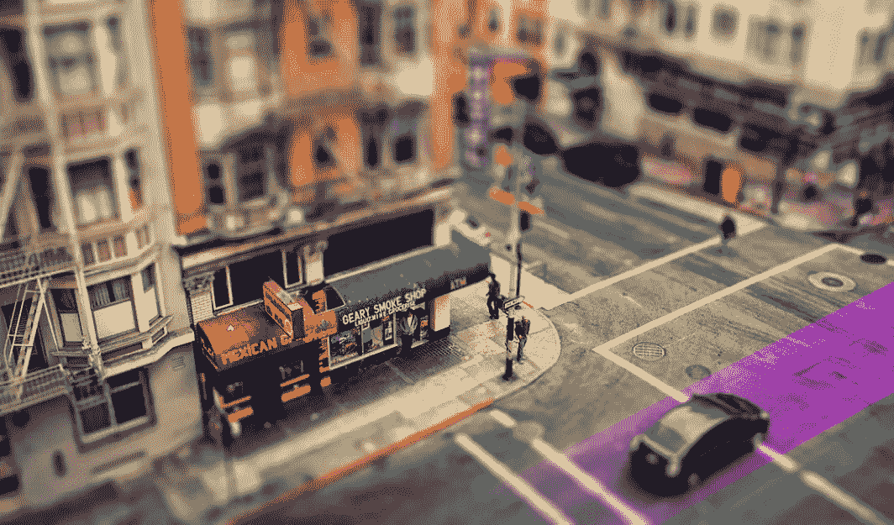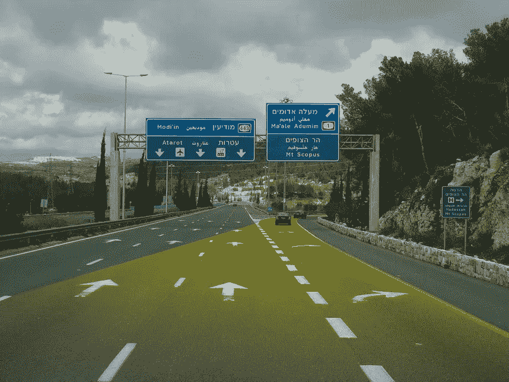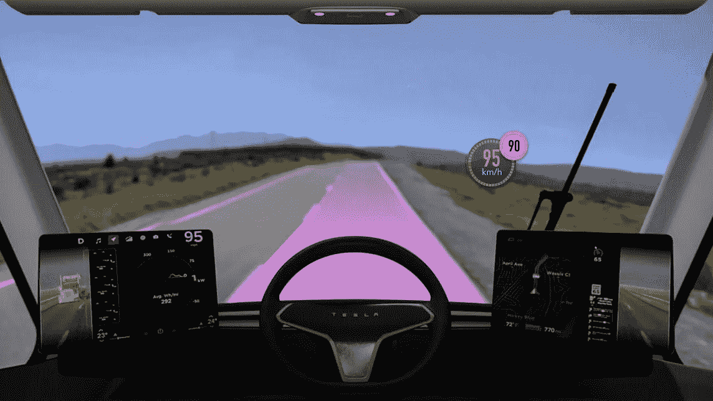

follow the {yellow} brick road

有一些猜测认为，特斯拉将在即将到来的 Model 3 中用 HUD 取代传统的仪表盘。这将把他们牢牢地放在第二波 hud 中，因为你的方向不会被塞进汽车前面的一个小小的塑料屏幕上，而是会占据挡风玻璃的整个空间。这将把 Model 3 前面的技术牢固地植入 AR 空间，因为如果不知道周围的景观，你就无法在眼前投射信息。特斯拉需要在车外安装摄像头来完成这项计算机视觉任务——好在他们有这种传感器来实现自动驾驶功能。

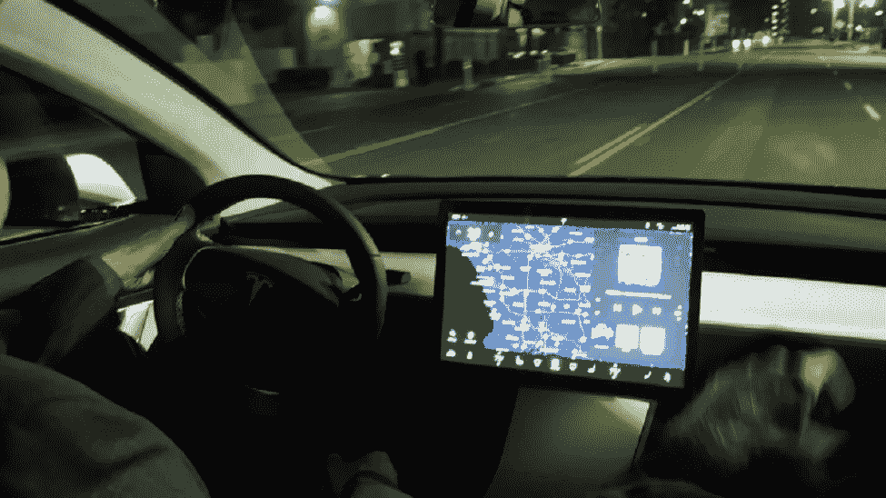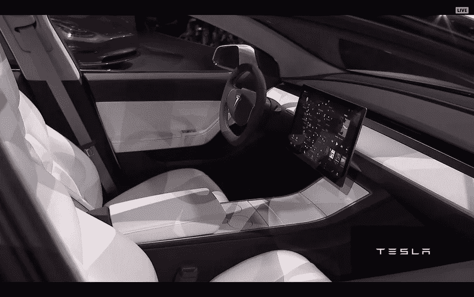

[Pretty empty looking dashboard on the Tesla Model 3](http://www.digitaltrends.com/cars/tesla-model-3-hud-dashboard/)

# 未来方向

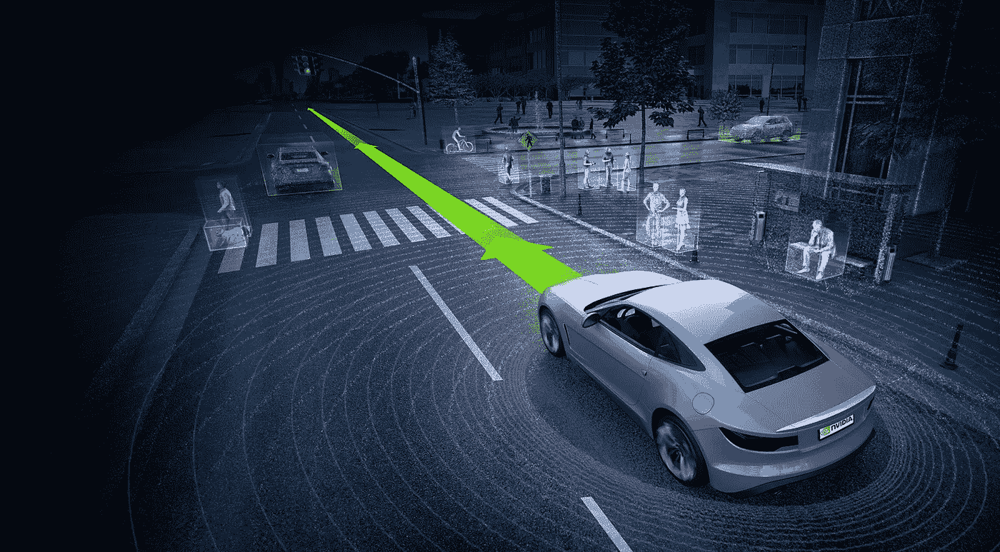

[Understanding the world around the Car](https://www.google.co.il/url?sa=i&rct=j&q=&esrc=s&source=images&cd=&cad=rja&uact=8&ved=0ahUKEwid083o3_jQAhWHtxQKHQyXB8sQjhwIBQ&url=http%3A%2F%2Fwww.electronicproducts.com%2FAutomotive%2FSmart%2FWorld_s_first_in_car_AI_supercomputer_announced_at_CES_2016.aspx&psig=AFQjCNHJ4xUrrYckjKkRByd_1Hidogicbw&ust=1481976273384435)

当我们开始在世界的背景下工作，培养不仅仅是导航，我们可以开始思考新的方向:

*   我们可以将你的个人方向、绕行路线和指示增加到如今点缀在高速公路上的广告牌上。
*   在限速标志上显示你的速度
*   突出地标和你感兴趣的地方
*   根据不可预测的汽车的速度投射一辆幽灵车，比如看它们是否会漂移到你的车道上，或者看一辆转弯的汽车是否会撞上你的车
*   跟随虚拟之旅，从你的汽车安全出发
*   当你经过加油站时，显示你的汽油状况
*   路边的侧影危险或汽车，这是一种放大的 Waze，你可以从远处看到危险，然后竖起大拇指确认危险仍然在路边
*   用 x 光照射一座山；利用汽车上的传感器，你可以看到一辆汽车穿过大山或拐过街角向你驶来
*   夜间模式；路灯和大灯只是用光照亮地方。你可以画出特定动物、汽车或危险物的轮廓，而不会不必要地打扰其他人
*   路上的天气

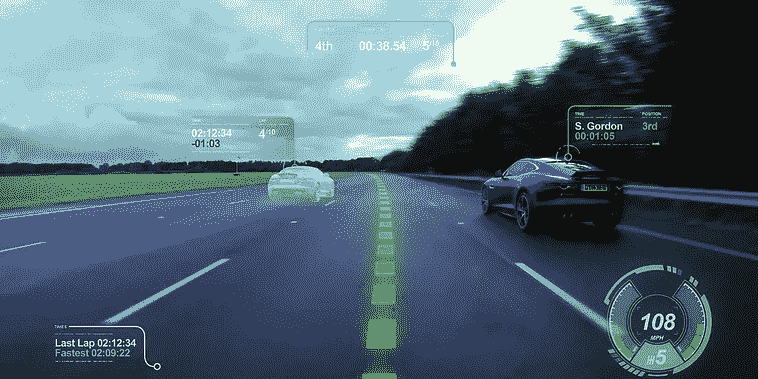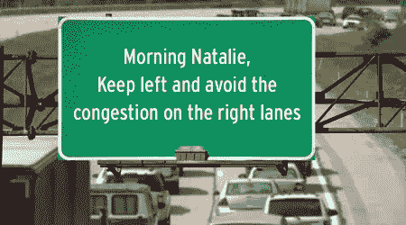

一旦我们回到现实世界，汽车导航的可能性真的变得无穷无尽，但我不仅期待 GUI(图形用户界面)进入现实世界，我也非常期待 VUI 的加入。我写了几篇关于 VUI[未来](https://hackernoon.com/the-future-of-the-telephone-call-65e93457af15)的文章，我认为在未来几年这将是一个潜力巨大的领域。现在，在不深入 VUI 的情况下，我认为这些地方是语音可以真正脱颖而出的地方，它不再仅仅是传达下一个指令。

*   声音应该变得更像对话而不是指导
*   示意你的盲点上有辆车
*   就天气和路线与导航对话
*   3D 声音取代仪表板控件
*   对屏幕上可能被遮挡或容易错过的内容保持警惕。有人要从车后走过，动物要过马路

如果我必须给出一个原因，为什么我对 AR 如此乐观，为什么我毫无疑问地相信这是下一波浪潮，那就是因为 AR 将解决上下文，真的就这么简单。有了自动驾驶汽车和智能增强现实，我们不仅仅是把视觉推到面前，而是精心设计位置和时间，这不仅会带来更安全的道路，还会带来更安全的世界。

> [黑客中午](http://bit.ly/Hackernoon)是黑客如何开始他们的下午。我们是 [@AMI](http://bit.ly/atAMIatAMI) 家庭的一员。我们现在[接受投稿](http://bit.ly/hackernoonsubmission)并乐意[讨论广告&赞助](mailto:partners@amipublications.com)机会。
> 
> 如果你喜欢这个故事，我们推荐你阅读我们的[最新科技故事](http://bit.ly/hackernoonlatestt)和[趋势科技故事](https://hackernoon.com/trending)。直到下一次，不要把世界的现实想当然！

