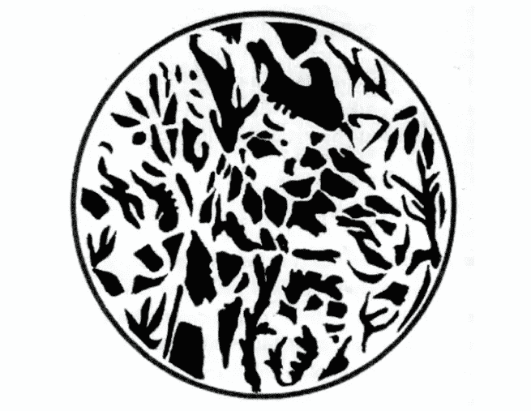
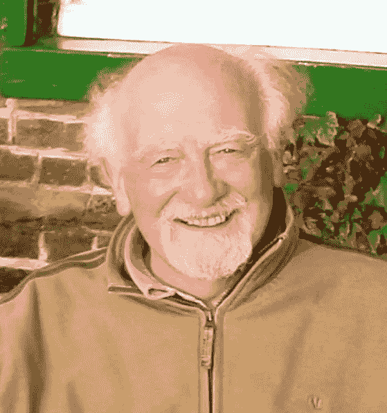
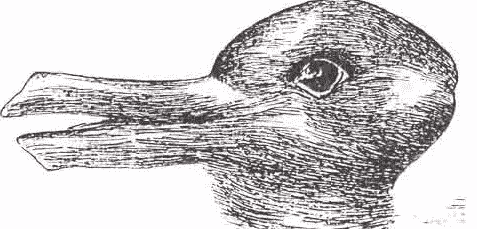

# 跟随感知的上游:组织观念和现象的产生

> 原文：<https://medium.com/hackernoon/following-perception-up-stream-organizing-ideas-the-coming-into-being-of-phenomena-240025bcc894>

Pixabay

> 组织观念在认知知觉中的作用是如此积极，如果观念改变，那么所见也会改变
> 
> 亨利·博尔托夫特(1996 年，第 142 页)

如果我们想了解我们的世界观对我们看待世界和行为的影响有多深，我们需要了解塑造我们看待世界的组织思想的力量。在*的《自然的整体性》*、[的亨利·博尔托夫特](http://en.wikipedia.org/wiki/Henri_Bortoft)中强调，组织思想是如此强大，以至于精神或认知的改变会导致对物质世界感知的改变，以至于物质世界似乎也在改变。“在这种情况下，所看到的东西是从视觉本身内发生变化*，而不是通过增加一个进一步的感官因素”(Bortoft，1996 年，第 142 页)。博尔托夫特解释说:“仅仅通过感官感知根本无法直接获得事实，实际上每个事实中都有一个非感官因素。在每一个认知的行为中，都有一个组织的想法，而不是没有想法”(Bortoft，1996，第 145 页)。*

这里重要的是要理解感知是*而不是*，这是一个单向过程，例如在视觉感知的情况下，我们睁开眼睛，世界进入我们。当我们睁开眼睛时，我们真正看到的是我们自己对现有事物的理解。我们可以在视觉感知的生物极限内感知的视觉刺激的范围降低了复杂性。

The power of organizing ideas. See the main text. An Example of the Role of Organizing Ideas in Perception (Reproduced from Bortoft, 1996, p.50)

同时，我们在感知过程中的认知参与进一步降低了这种复杂性。我们的组织思想通过将感知组织成我们认可的模式来理解它。看到或感知的行为本身已经有了非视觉的、完全概念性的成分。我们的观念对我们的感知有着至关重要的影响。

*The Wholeness of Nature*, by [Henri Bortoft.](http://en.wikipedia.org/wiki/Henri_Bortoft)([image](http://ecx.images-amazon.com/images/I/41AdS5QivkL._SX329_BO1,204,203,200_.jpg))

为了说明感知的非感官、认知元素，我想请读者仔细看看[上面的黑白圈]。看着这张图片，你会发现自己属于两个类别中的一个。要么，你只是在白色背景上看到一个带有不规则黑点的圆圈(相当于黑色圆圈上的白色网状图案)，要么，你属于立即看到图案内动物的一部分的读者。在继续阅读之前，花点时间冷静地看看上面的黑白图片！你在黑白图案中看到了什么？]

一旦你有了“长颈鹿的头”这个组织概念，一旦你认识到这个组织概念描述的图案，你对图像的感知就会改变。你能够把黑点组织成长颈鹿的头部，用她的右眼看着你，她的鼻子指向四点钟方向，脖子在六点和七点之间，眼睛在十二点钟线上，距离圆心大约五毫米。这是一种有趣的感知练习和体验，在让自己看到长颈鹿和让它与背景融为一体之间来回切换。

关键的一点是:我们还看不到长颈鹿。有一个非感官因素参与了观察和感知。黑点的模式没有改变，然而长颈鹿的组织思想构建了看似随机的点。它让我们能够辨别一种模式。随着对所见事物的概念的改变，我们对图像的实际感知也随之改变。如果我们将这一经历类比为我们的组织想法和概念对我们感知现实的方式的影响，我们可以开始理解[文化]元设计的力量，这种设计改变了组织想法，这将在后面的章节中讨论。

【本文节选自[盖亚教育](https://www.gaiaeducation.org/index.php/en/about-us/who-is-gaia)在线课程[可持续发展设计](https://www.gaiaeducation.org/index.php/en/online)的[世界观](https://www.gaiaeducation.org/index.php/en/online/2016-07-07-17-44-52/worldview-design)维度。该课程基于四维空间和一个设计工作室。2012 年我为盖亚教育写了这个课程，2016 年修改更新了这个维度。]

[Henri Bortoft.](http://en.wikipedia.org/wiki/Henri_Bortoft)([image](http://ih.constantcontact.com/fs086/1103841383940/img/50.jpg?a=1104828765141) )

> 经验主义的错误在于这样一个事实，即物质对象是意义的浓缩。例如，当我们看到一把椅子时，我们看到的是一个浓缩的意义，而不仅仅是一个物理实体。因为意义不是感官知觉的对象，所以看到一把椅子并不是我们想象中的感官体验。 ***什么经验主义，什么常识主义，误将意义误认为物质是心灵在认知知觉中的维度。***
> 
> *亨利·博尔托夫特(1996 年，第 53-54 页，着重部分由丹尼尔·瓦尔添加)*

*欧文·巴菲尔德(Owen Barfield)提到了现代倾向于将意义与物理对象混淆，这被认为是“偶像崇拜”(巴菲尔德，1988)。博尔托夫特认为，我们的“认知过程可以在主体和客体的笛卡尔分离框架中理解的前提，意识与世界的分离”使我们无法意识到组织思想在我们对有意义世界的感知中的积极作用(博尔托夫特，1996 年，第 54 页)。*

*亨利·博尔托夫特区分了注重数量和质量的组织思想。他解释说，注重数量的组织思想引导我们将自然分为同质的部分，我们实际上“在智力上叠加在自然上”在这样做的过程中，我们忽略了自然界中的定性关系，并开始联系到“对自然界的一种智力重组，将它简化为纯粹的定量”，从而联系到“彼此外部的部分”并彼此分离。博尔托夫特强调，这种观察方式“当然赋予了我们凌驾于自然之上的力量，但却产生了将我们与自然分离的效果。我们开始体验到自己是独立的，本质上不同于自然，而自然反过来开始显得毫无生气和空虚”(Bortoft，1996 年，第 174 页)。*

*“概念的固体对象模式”是另一个重要的组织思想，大多数人已经习惯于使用它，以至于他们完全没有意识到它只是一种构想现实的方式，而不是现实本身。*

*博尔托夫特认为，一种定量的、测量的、分析的看待事物的方式会使我们倾向于陷入一种概念的固体物体模式的习惯。通过将数量视为“基本范畴，我们自动将自然简化为物质。”博尔托夫特将原子论称为“一个承载定量看待方式的容器”，并强调“自然被现代科学还原为物质，以至于我们现在认为它们是同一件事。”定量的，固体世界，被认为是我们外部的，都对应于一个特定的概念模式。*

> **“无论怎么强调都不为过，固体的世界并不是这样给出的，而是一种特定的观察方式揭示了这个世界。我们理所当然地认为，固体世界是独立存在的世界，而事实上，它是按照‘固体世界’概念模式出现的世界”。**
> 
> **—亨利·博尔托夫特(1996 年，第 176 页)**

*意识的整体和分析模式*

> *陷入大量的抽象概念中，我们的注意力被一大堆人造技术催眠，这些技术只能把我们反射回自己，我们太容易忘记我们在一个超乎人类的感觉和情感矩阵中的肉体本性。我们的身体在与生物地球的多种纹理、声音和形状的微妙互动中形成了自己——我们的眼睛在与其他眼睛的微妙互动中进化，因为我们的耳朵通过其结构适应了狼的嚎叫和鹅的鸣叫。将我们自己与这些其他的声音隔绝，继续我们的生活方式，谴责这些其他的情感，使它们被遗忘或灭绝，这就剥夺了我们自己的感觉的完整性，也剥夺了我们的思想的连贯性。 ***我们是人类只有在接触和欢宴中，才能拥有不是人类的东西。****
> 
> **大卫·艾布拉姆(1997 年，第 22 页，着重部分由丹尼尔·瓦尔标明)。**

**西方哲学所关注的认识论问题直接产生于笛卡尔的主体-客体分离。博尔托夫特解释了[埃德蒙德·胡塞尔](http://en.wikipedia.org/wiki/Edmund_Husserl)关于[现象学](http://en.wikipedia.org/wiki/Phenomenology_%28philosophy%29)的工作是如何强调，如果我们“以自然物体的方式”感知意识，并“想象一个面对外部世界的空虚意识”，我们就无法理解意识(博尔托夫特，1996 年，第 54 页)。**

> ***“现象学所依据的根本发现是* ***意识具有意向性的结构——不如说意识是意向性*** *。这通常通过说意识总是“意识到”来表达。“换句话说，意识总是指向一个对象。因此，在认知知觉中，有意识的头脑和它所意识到的对象之间存在着不可分割的统一性。”***
> 
> **亨利·博尔托夫特(1996 年，第 54 页，着重部分由丹尼尔·瓦尔添加)。**

**博尔托夫特区分了两种互补的主要意识模式。他指出:“在我们的科技文化中，我们只专注于发展其中一种模式，而我们的教育体系几乎完全是为这种模式服务的。”博尔托夫特将这种模式称为“意识的分析模式”他解释道:**

> **意识的分析模式*…****…与我们感知和操纵固体的经验一起发展。我们对这些身体的封闭边界的经验的内在化导致了一种自然地强调区别和分离的思维方式。因为固体世界的基本特征是外在性——也就是说，一切都是外在的——那么这种思维方式必然是分析性的。出于同样的原因，它也必然是顺序的和线性的，以渐进的方式从一个元素到另一个元素——机械因果性原理是这种意识分析模式中的典型思维方式。* [*亨利·柏格森*](http://en.wikipedia.org/wiki/Henri_Bergson) *注意到逻辑与概念的关系以及空间与立体的关系之间的密切关系，他总结说“我们的逻辑几乎不超过表达立体之间最一般的关系。“逻辑的原则——同一性(A 是 A)、非矛盾性(不同时是 A 和非-A)以及排中律(要么是 A 要么不是 A)——是从这些被认为普遍适用的有限情况中推断出来的。因此，与逻辑思维相关的意识模式必然是分析性的。”*****
> 
> **亨利·博尔托夫特(1996 年，第 61 页)**

****

**Bi-resolution images like this Duck-Rabbit illustrate the role of organizing ideas in perception ([image](http://www.howiesiegel.com/wp-content/uploads/2013/03/url1.jpeg))**

**现象学主要关注对意识结构和意识行为中出现的现象的系统思考和研究。([图片](https://bat020.files.wordpress.com/2011/05/escher-1.jpg)左—埃舍尔蚀刻；[图片](http://www.howiesiegel.com/wp-content/uploads/2013/03/url1.jpeg)右图——鸭子兔子)**

**博尔托夫特还指出，语言本身将我们引入意识的分析模式。现代语言的一个基本结构是主谓语法，它的作用是把经验分成独立的成分，然后把它们当作彼此独立存在博尔托夫特强调:“语言的语法结构以分析的方式表达世界。它揭示了分析的世界。但我们认为这是“世界的本来面目”，独立于语言，因为语言本身在揭示这个世界的行为中是透明的”(Bortoft，1996，第 62 页)。**

****

**This painting by Escher also plays with the organizing ideas that help us make sense of what we perceive ([image](https://bat020.files.wordpress.com/2011/05/escher-1.jpg))**

**此外，语言的线性和序列特征使我们倾向于意识的分析模式。博尔托夫特认为“意识的分析模式，因此，对应于为了完整性，应该被称为语言-智力头脑的话语思维”(博尔托夫特，1996 年，第 63 页)。第二种意识模式是所有人都可以理解的，博尔托夫特称之为“整体意识模式”他建议:**

> ******意识的整体模式*** *是对这种分析模式的补充。相比之下，这种模式是非线性的、同时的、直觉的，而不是语言-智力的，并且更关注关系而不是相关的离散元素。重要的是要认识到这种意识模式是一种观察方式，因此它只能以自己的方式被体验。特别是，它不能被语言-智力头脑理解，因为这在意识的分析模式中起作用，对于这种模式来说，不可能充分理解说一种关系可以被体验为某种真实的东西本身意味着什么。在意识的分析模式中，在经验中突出的是相关的元素，与之相比，关系只是模糊的抽象。这种关系的体验只有通过从零碎的思维方式转变为对整体的同步感知才有可能。这样的转变相当于意识本身的重组。……我们以分析的方式想象运动和变化，好像这个过程真的是由一系列瞬时静止状态组成的(就像一系列快照)，而当运动和变化被整体地体验时，它们被作为一个整体来体验。因此，在这种模式中同时被体验的元素是动态地相互关联的，这种动态的同时性取代了分析模式的静态的同时性。”****
> 
> **亨利·博尔托夫特(1996 年，第 63-64 页)。**

**博尔托夫特指出，为了进入整体意识模式，我们必须能够跳出意识的分析模式。这可以通过关注感官体验 ***来实现，因为它是被体验的*** 。沉思冥想或正念是一种转变为整体意识模式的方法。在整体意识模式中，头脑开始凭直觉而不是理智运作。博尔托夫特使用了奥恩斯坦对直觉的定义，即“不借助推理的知识”，它与“对整体的同时感知”联系在一起。罗伯特·e .[奥恩斯坦](https://en.wikipedia.org/wiki/Robert_E._Ornstein)将“直觉思维与意识的整体模式联系在一起——就像智力思维与分析模式联系在一起一样(博尔托夫特，1996 年，第 67 页)。**

> ***“我们错过了活跃在我们生活中的思维维度……认知中的思维维度对我们来说就像地球的运动一样看不见。正如对我们来说如此明显的是，我们看到的关于我们的一切都是“就在那里”，也就是说，对象而不是意义，认知知觉只是感觉知觉。我们习惯于认为思维在我们体内——“在我们的头脑里”。“但事实正好相反。我们生活在思维的一个维度中，这个维度对我们来说就像我们呼吸的空气一样无形。* *我们通常只有在出现故障的时候才会发现。”***
> 
> **亨利·博尔托夫特(1996 年，第 132 页；丹尼尔·沃尔加了重点)。**

**…续。**

****注:**这是[盖亚教育](https://gaiaeducation.org/about/)在线课程[可持续设计](https://gaiaeducation.org/elearning/design-for-sustainability/)中[世界观维度](https://gaiaeducation.org/elearning/design-for-sustainability/worldview/)的摘录。2012 年，作为盖亚教育和加泰罗尼亚开放大学(UOC)合作的一部分，我被要求重写这个维度，2016 年，我再次将其修订为当前版本。下一次加入[课程](https://gaiaeducation.org/elearning/design-for-sustainability/faq/)的机会是在 2018 年[5 月 21 日](https://gaiaeducation.org/elearning/design-for-sustainability/worldview/)开始[世界观维度](https://gaiaeducation.org/elearning/design-for-sustainability/participants-quotes/)。你可能也会喜欢我的书《设计再生文化》。**

**这一节选大体上是对亨利·博尔托夫特工作的总结，他是我所见过的最有智慧的人之一，在我有幸向他学习舒马赫学院整体科学硕士课程和同年(2001-2002)质量科学短期课程的五个星期中，他确实扩展了我的意识。我永远感激亨利给我介绍了一种动态的观察方式。他的最后一本书[认真对待外表——歌德和欧洲思想中的动态观察方式](http://www.florisbooks.co.uk/book/Henri-Bortoft/Taking+Appearance+Seriously/9780863159275)也是必读之作！**