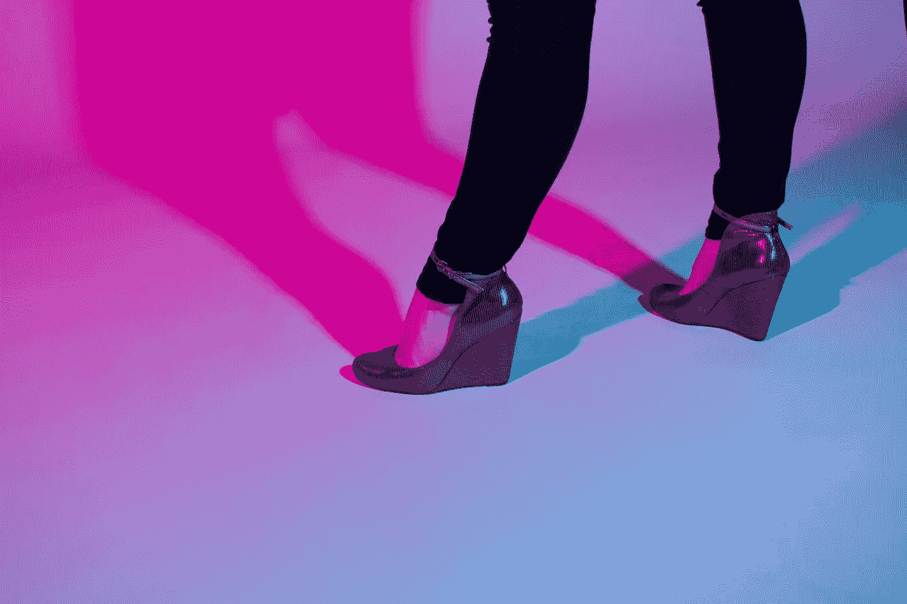

# 步法、头法、心法:我如何在我的第一次产品发布上突破 10，000 美元以上的销售额

> 原文：<https://medium.com/hackernoon/footwork-headwork-heartwork-how-i-cracked-10-000-in-sales-on-my-first-product-launch-9bdcc60a39c1>

Photo by [Jeff Weller](http://jeffweller.tumblr.com/)

我惊恐地看着，几乎是以慢动作，我的拳头撞到了我师傅的脸。

幸运的是，我对咏春武术还很陌生，所以我没有足够的力量让 Paak Sau(一种阻挡技术)受伤。

…这可能就是为什么当我疯狂地开始为我摇晃的拳头道歉时，我的教练师傅伊森立即笑了起来。

伊森是[布鲁克林咏春](http://www.bkwingtsun.com/)学校极其耐心、极其令人敬畏的老师。他技艺精湛，对工作充满热情，速度惊人，而且(在那一刻)完全下定决心要在我的脑袋里钻一个非常重要的细节:

**“好吧。回想一下。上周我们学了什么？”**

“嗯……”我咕哝着，把我的手塞进我的制服口袋，仍然从我的屈辱瞬间恢复。

他指着我的黑色永春平底鞋。

“哦！对！”我哭了。“脚！[箭步](https://www.youtube.com/watch?v=4et0YyzGRi8)！”

(这是任何咏春练习者的基础动作。它允许你快速向你的对手移动，而不会失去你的战斗姿态，或者让你的脚离地太远——这可以防止攻击者从你下面扫你的腿。)

“是的！”他胜利地举起双手。“步法。做到这一点，其他一切都会水到渠成。”

我又练了一遍舞步，拖着脚往前走。

“很好。”他证实了。“你想开快点吗？步法。你想用力打吗？步法。好的。我们再试一次……”

这是武术教会我的最重要的事情之一，就像初中和高中舞蹈一样:

人们很容易被眼前的事情分心——你的手臂和拳头，你的对手和竞争对手，以及你对自己能做什么的愿景——但实际上呢？

你拥有的最强大的工具是你的基础。你的步法。

几周后，当我震惊地看到我的第一道菜****推出后，我的总销售额突破 1 万美元时，我想起了这一刻。****

**这辆车开了不到一个星期。**

**我是在周五发布的，我的课程的现场版在周二就已经售罄。**

**现在是周四，每日更新版仍在继续销售。**

**虽然我的一部分完全兴高采烈，但我的一个更吵闹、更蠕动的部分完全困惑，还有点惊慌。**

**我的邮件列表很小。我花了 35 美元在脸书为博客写作挑战做广告，最终吸引了近 350 名优秀的参与者，几乎完全是有机的！但没有一个是针对课程本身的。**

**我本打算这是一个测试概念的“试运行”,而大的广告推广将在今年冬天晚些时候落下。(更不用说，当我意识到我正在开设业内最大的文案课程之一时，已经太晚了。)**

**那么… *现在这是怎么回事？！***

****虽然我努力工作，并在 6 年的商业生涯中获得了许多难以置信的好运，但我也是一个现实主义者。****

**首次产品发布极具挑战性。我见过无数有天赋的人投入了数千美元，结果他们最初的努力收效甚微，或者一无所获。**

**原因是什么？人们*喜欢*你(甚至*爱*你)之间有着巨大的差异！)，还想把他们的钱给你。更别说他们的钱了。**

**然而，我却站在厨房里，穿着我的 PJ，往我的咖啡里倒鲜奶油，因为我们已经喝完了一半一半，震惊地盯着我的小 Shopify 销售图表。**

**在我考虑庆祝之前，我大声说出的第一句话是:“*为什么？”***

**当然，我做了功课。我先和我的观众谈过，并且测试了所有的东西。**

**当然，我已经做了一件体面的工作，通过博客写作挑战来激起人们的兴奋，并在发布前谈论它。**

**但我见过很多疯狂聪明的人那样做，但都失败了。事实上，我几乎确定我会成为他们中的一员。**

**也许我只是有很多初学者的运气？**

**我确信运气是其中的一部分。但是也许还有别的什么…**

**这时我想起了我师傅说过的话:**

*****步法*！做到这一点，其他的事情就会水到渠成。****

**在“文字商店”正式推出的过程中，我一直被眼前的东西分散注意力——天哪，我前面有很多 T21。**

**有电子邮件要写，有创意要发，有消息要发，有最后的课程部分要问答。**

**但是，在那一瞬间，我对金钱的到来感到震惊，忘记了之前发生的一切——以及在设计一个标志或拍摄一张照片之前，我为建立自己的声誉和部落所做的所有工作。**

**我忘记了我在课程中进行的两轮测试已经让一些学生变成了狂热的粉丝。**

**我忘记了花在免费辅导电话、播客和舞台上的时间。**

**我忘记了花了太多时间在我的脸书和推特上，尽我所能帮助其他作家和企业家。**

**我们在业内谈了很多如何营销自己；或者如何提出你的概念，如何吸引潜在客户并把他们培养成买家，如何克服挑战...**

**但是我们谈论得不够的是，在我们为这个世界做出贡献之前，我们需要打下的基础。**

**这并不性感，它需要大量的努力，而且当它发生时，你很难量化它。**

**但是如果你看不到它，或者认为没有它你也能前进？你可能会发现你的每一拳都没有落地。**

## ****我逐渐意识到:为这个世界建造东西需要多种工作的结合:脑力劳动+心力劳动+(最重要的)步法。****

****首先，源头工作:你必须想出一个人们愿意投资的想法。****

**这是最沉重的精神负担。你必须四处打听，找出人们在寻找什么——然后你必须建造那个该死的东西。**

**这意味着把你最想要的专业知识倾注到你所创造的东西中，同时想办法让它对你来说是独一无二的、原创的。这意味着找出如何将你本能地做的事转化到纸上，转化成简单的步骤。**

**因此，我做了数小时的客户访谈，并在谷歌文档中创建了一页又一页的速记笔记，详细记录了我自己的思维过程。这也是我进行两轮测试的原因，这样我可以从我的学生那里获得完整的 360 度反馈。**

**(我在这里稍微谈了一下[我是如何构建 Wordshops 的](/@HCWeiss/the-fire-fury-of-whole-assery-how-my-course-the-wordshops-finally-got-made-6f817a9b8395)，不要担心:我很快会用更多关于我的过程的信息让你们厌烦到流泪。)**

**接下来是核心工作:你必须学会如何向想买你东西的人谈论你卖的东西。**

**啊，[营销](https://hackernoon.com/tagged/marketing)。**

**如果你只是简单地向人们扔一个销售页面，然后看着钱滚滚而来就好了。**

**但是没有！今天的消费者不仅聪明，他们的眼光也高得惊人。**

**如果你想得到结果？你必须全心投入分享想法的方式。你需要确保你的概念是你的观众能够理解和认同的——所以你必须找到一种方法来揭开你投入其中的所有灵魂，你的客户可以获得的价值，以及你可以帮助他们创造什么样的结果。**

**这就是我决定开始博客挑战的原因，以确保我想服务的部落与我能为他们做的一切联系起来。没有烟，没有镜子，只有我这边的工具和帮助，以及他们那边的一点点奉献来让事情发生。**

**然后，是时候写我的促销邮件了？我剥去了噱头和公式，并拍摄的诚实。**

**虽然未来推广单词商店的活动可能会更倾向于说服方面？对于这一个，我只是把我的心放在桌子上，告诉我如何和为什么建造它们的故事。**

****为什么所有的前期工作和核心工作都成功了？我敢打赌，这是因为拼图的最后一块(或许是第一块):我的步法。****

**我的客户和同事会毫不留情地嘲笑我，说我谈论了 3 年的课程，却没有拿出来。**

**但是他们也许*不知道*知道什么？**

**我在完善我的基础——我的步法。**

**我在这个领域已经呆了很长时间，现在明白了:你可以拥有最耀眼的品牌、最好的概念、最花哨的特别嘉宾和奖金——但如果没有人认识你呢？你完蛋了。**

**所以你必须踏上数字之路。你必须一遍又一遍地把自己放在那里，直到人们开始注意到并认可你。你必须建立信任。你必须*展示*，而不是仅仅*告诉*，为什么人们应该在你向他们提供任何东西之前就投资于你。**

**这就是为什么我花了 18 个月的时间在任何地方，任何时间，以任何方式教学。我在和潜在的未来学生交朋友，巩固关系，并给他们一些关于课程的暗示，以建立兴奋感。当有人走近我问我一个问题时(当面，在脸书或 Twitter 上，或在我的收件箱里)，我试图给他们我能给的每一点帮助——不是因为我私下里希望他们会买我的未来课程，而是因为我喜欢教授和分享我所知道的东西，*和*我喜欢拥有那种能真正为全球企业家带来变化的专业知识。这才是我真正喜欢出名的原因，也是我建立 Wordshops 的很大一部分原因。**

**因此，有时是有意识的，有时是下意识的，普遍来说是不完全的:我在做一项缓慢燃烧的工作，将自己树立为一个可见的作家和写作教练。我在练习步法。**

****但是，嘿，让我们直截了当地说吧:你可以把你所有的头功、心功和步法都准备好，但是*还是*很容易被第一次发布所淹没。****

**忽略这一点:你很容易被你试图推动的概念货运列车的重量、你必须投掷的拳头以及一路上飞向你的障碍完全压垮。(感谢什么，技术小鬼。)也差点发生在我身上。**

**我不会假装第一次 Wordshops 发布会失败的可能性不是很大。**

**但是如果有呢？我已经准备好掸掉身上的灰尘，收起我的尊严，继续前进，决心在下一轮做得更好——因为这就是生意。**

**幸运的是，结果并不是那样。我感谢我的步法是我走向成功的最大动力。**

****有没有可能先发动，*再*专注步法？绝对的。****

**(毕竟，你的课程可能会给你首先建立基础所需的材料和重点。)**

**但这就像你在投掷拳头时在垫子上移动之前完善拳头一样:这是一种不同的学习方式——一旦你开始融入身体的其他部分，你可能会突然意识到你必须重新学习如何投掷拳头。**

**…你也可能会不小心打中老师的脸。**

****所以我想提醒你，无论你即将推出一个新的概念，还是你正在构思一个新的概念****

**不要迷失在你对未来的憧憬中，以至于忘记了注意你脚下的东西，以及你现在正在为自己搭建的平台。**

**如果你选择可见性，你就不能忽视你是如何在你所选择的领域中站立和行走的。**

**"*你想开快点吗？步法。你想用力打吗？步法。*”**

**如果你搞砸了呢？**

**挺起你的肩膀，调整好你的姿势，回到垫子上……再来一轮。**

**—**

****希拉里·韦斯是一名文案、代笔、写作教练，也是《The Wordshops:非常规企业家文案课程的作者。**自 2011 年以来，她一直是 200 多个品牌的代言人、代言人和代言人，并专注于品牌代言人的开发，以及为极具影响力的品牌提供有价值的信息。想了解更多类似的东西，想加入她的邮件列表，就去 hillaryweiss.com/subscribe.了解她的课程，顺便去 http://thewordshops.org。**