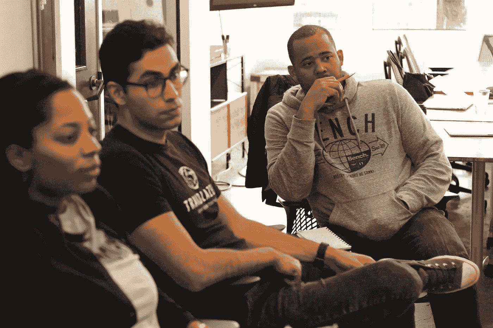

# 对于企业家来说

> 原文：<https://medium.com/hackernoon/for-entrepreneurs-1002a04840d4>

众所周知，有色人种企业家在科技领域的代表性长期不足。就像我们学生的失败一样，企业家经常带着被排斥和被疏远的感觉来找我们。虽然成为一名企业家本身就是一场过山车，但我们社区的成员更有可能在没有足够资金、成长空间或指导的情况下在市场上航行。具体来说:目前只有不到 1%的种子基金和首轮基金被授予黑人和/或拉丁裔创始人。在一个黑人和拉丁裔美国人的购买力总和超过一万亿美元的国家，我们发现缺乏支持和代表性是令人不安的。

幸运的是，很多事情已经开始改变。专门帮助第一次创业的少数民族企业家的项目在美国遍地开花。枢纽和世界级加速器提供了直接针对代表性不足的企业家及其公司的办公时间。去年，我们在 CODE2040 Residency 的第一批项目中，邀请了三位来自美国三个城市的驻校企业家。根据他们的经验，我们与谷歌合作，今年将企业家计划扩展到 7 个城市。

塔利布·格雷夫斯-曼恩斯是 2040 代码最初的三位常驻企业家之一。在北卡罗来纳州达勒姆完成了一年半的长期居住后，我们看到他和第一批的其他成员在他们的社区和公司采取了惊人的措施。在申请 2016 年住院医师资格的最后几天，我们问塔利布，成为这个项目的一部分感觉如何。

## 是什么促使你申请住院医师资格？

在常驻计划申请宣布的时候，我正在访问硅谷，完成一轮融资，并会见了 CODE2040 团队的一些成员。在与 CODE2040 团队成员交谈的几分钟内，我知道这些人是我想与之结盟的人。

回到北卡罗来纳州后，我完成了对该组织历史和使命的尽职调查，并于第二天提出了申请！

## **EIR 人的一天是什么样的？**

我的一天=生意+社区发展+更多生意。

如果你做对了，一个 EIR 人可以拥有他们的“蛋糕并吃掉它”。(正如我的祖父母过去常说的)。

## **为什么住院医师培训这样的项目很重要？**

它让美国各社区的企业家能够接触到全国的创业现场和资源。技术领域太多的商业支持和资本都集中在硅谷——这扼杀了增长和创新。为了国家的发展，山谷外的实体必须被施肥。

## **你会给其他有色人种申请者/创业者什么建议？**

一句简单的话，“你看到的一切只是一个显化的思想。”走进这个世界并实现你的梦想，同时帮助他人实现他们的梦想。

(还有一件事——如果你这一轮没有被选中，试着想办法支持 EIR 和你所在城镇的社区！这绝对会有回报的！)

> [黑客中午](http://bit.ly/Hackernoon)是黑客如何开始他们的下午。我们是 [@AMI](http://bit.ly/atAMIatAMI) 家庭的一员。我们现在[接受投稿](http://bit.ly/hackernoonsubmission)，并乐意[讨论广告&赞助](mailto:partners@amipublications.com)机会。
> 
> 如果你喜欢这个故事，我们推荐你阅读我们的[最新科技故事](http://bit.ly/hackernoonlatestt)和[趋势科技故事](https://hackernoon.com/trending)。直到下一次，不要把世界的现实想当然！

