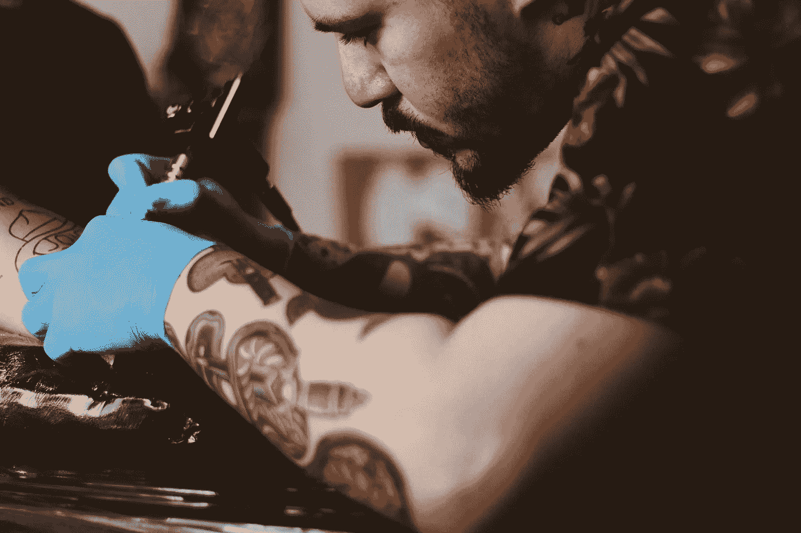

# 永远在锁链上

> 原文：<https://medium.com/hackernoon/forever-on-the-chain-c755838dfc79>

***TL；博士:*** *区块链技术将永久性和不变性引入数字世界。我们为每个人建立了一个工具，让他们以一种切实和亲密的方式体验这种不变性。结果令人惊讶，从着迷到震惊。事情是这样的。*

当我谈论区块链技术时，我经常发现退一步画出下面的大弧线是有用的。建设现代社会需要三个方面。首先是记忆。这就是我们如何建立神话、文化、传说，并从他人的成就和错误中学习。第二是沟通。交流让我们形成社区，交流记忆和知识，进行互动。

支撑其他两个要素的第三个要素是信任。在缺乏信任的情况下，记忆和交流的作用是有限的——你需要能够相信你所记得的，以及别人告诉你的。我们对此并不重视，但一切都依赖于信任。我们相信银行会保护我们的钱的安全。我们信任谷歌处理我们的个人和工作邮件。我们相信法院会做出公正的判决并保留适当的记录。

> 在缺乏信任的情况下，记忆和交流的作用有限。

在很大程度上，这种信任并没有放错地方。银行和法院是受到高度监管的实体，即使它们的动机不一定与我们的一致。但这种信任仍然是人类的事情，因此经常被背叛。更不用说信托是要花钱的——我们向这些机构支付信托税，这实际上转化为厚厚的法律协议和保险费。

在我看来，印刷机是一场使记忆商品化的革命。由于书籍的爆炸式增长，能够从人类共享记忆中受益的人数急剧增加。后来，互联网使交流商品化了。曾经是地方性的或极其缓慢的事情，现在变成了全球性的和即时的。尽管存在资本主义的困境和滞后的监管，但现代社会却因此变得更加美好。

> 区块链是将信任商品化的技术革命。

进入区块链。区块链是将信任商品化的技术革命。它通过将基础架构级别的信任集成到任何基于区块链的服务中来实现这一点。信任通常必须通过法律、法院、军队和其他代价高昂、容易出错的机构来实施。用无私的加密技术取代这些技术，预示着我们实现信任的方式将发生一场革命。

如果你想知道更多，请阅读我的简短讲解文章**区块链如何运作，它能为你做什么** : [区块链能为你做什么？](/@julio_santos/what-can-blockchain-do-for-you-746ed436a371)

# 永远在锁链上

我们的软件咨询公司“火星生活”已经迅速采用了区块链的技术。

我们的黑客马拉松的一个令人兴奋的结果是一个非常简单的演示，我们称之为[永远在链上](https://forever.lifeonmars.pt)。这相当于一个数字纹身:一个智能合同，任何人都可以免费使用(减去交易成本)，在以太坊区块链上留下永久的信息。永久性和不变性是区块链上所有交易的特性，因此，存储在区块链中的任何信息都被铭刻在成千上万台计算机中，永不褪色，永远存在。

> 这相当于一个数字纹身:一个智能合同，任何人都可以免费使用(减去交易成本)，在以太坊区块链上留下永久的信息。

有趣的是，将这种抽象的不变性和持久性知识转化为每个人都容易使用的体验，而不仅仅是数字原住民。我和朋友分享了《永远在锁链上的 T4》，有些反应完全出乎意料。

人们对区块链能够“做到这一点”感到惊讶。有人说，他们对这让他们想起了[黑镜](https://en.wikipedia.org/wiki/Black_Mirror)感到不安，指的是[一集](https://en.wikipedia.org/wiki/The_Entire_History_of_You)中每个人的经历都被不断记录下来，可以随时随地即时重新体验。我被告诫要“想想你将要在这里发布的怪物”，不要“仅仅因为你可以就心血来潮地发布如此强大的技术”。

> 可以说，随着技术成为我们延伸思维的一部分，被遗忘的权利就等同于记忆操纵。

另一个回答提到了被遗忘的权利。在某些情况下，赋予个人要求网站删除其个人信息的权利的法律。然而，在像区块链这样的分布式共识系统中，实施被遗忘的权利在技术上变得不可能。

## 持久性的影响

随着技术成为我们延伸思维的一部分，被遗忘的权利可以被理解为等同于记忆操控。你可能会认为这是为了保护社会和谐，我们必须做的一件重要而必要的事情，或者你可能会厌恶它，认为它是对你个人自由的侵犯。而区块链技术，却没有意见。这不需要道德立场。它保护我们的集体记忆不被掺假，不管是出于恶意还是其他原因，不管后果如何。

不管个人观点如何，被遗忘的权利背后有很多好的理由，就像在刑事系统中允许诽谤诉讼有很多好的理由一样。交流和表达都有后果，表达自由不应该与后果自由混为一谈。

> 这里的要点是，如果我们要继续保护我们已经庄严载入的权利，区块链技术必须开创一个监管的新时代。

我现在无意对这个话题进行太深入的探讨。这些和其他道德方面的考虑将在以后的文章中探讨。这里的要点是，如果我们要继续保护我们已经庄严载入的权利，区块链技术必须开创一个监管的新时代。此外，在后区块链时代，上述法规将如何部署仍不明朗。

# 展望未来

正如每一项新的、不为人所知的技术一样，区块链引发了人们的担忧。然而，我很乐观。我相信我们会像利用人类拥有的其他技术一样利用它。此外，技术有一种独立于我们的意愿和担忧的方式来建立自己。现在区块链在这里，你能做的最好的事情就是探索它，理解它，并让它为你工作而不是反对你。

我还没有老到必须说服企业相信互联网的优点，但早在 2012 年，我仍然很难说服一些大公司客户，这种社交网络(脸书、Twitter 等)将会流行起来。不要成为那些家伙。拥抱一场和互联网本身一样大的革命。

**想探索区块链？** [**跟我们聊聊**](https://lifeonmars.pt/) **。**

如果你想知道更多，请阅读我关于**区块链如何运作以及它能为你做什么的简短解释文章。**

 [## 区块链能为你做什么？-朱里奥·桑托斯-中等

### 区块链技术自 20 世纪 90 年代初就已经出现，但比特币是真正带来它的“杀手级应用”

medium.com](/@julio_santos/what-can-blockchain-do-for-you-746ed436a371) 

非常感谢 Charles Ulin、Frederik Eichelbaum、Jack 金塞拉、joo Gradim、Lukas Egger、Nele Wollert、Paulo kch、Paulo Pereira、Sean Perkins 和 Vanessa Costa 阅读本文的草稿。