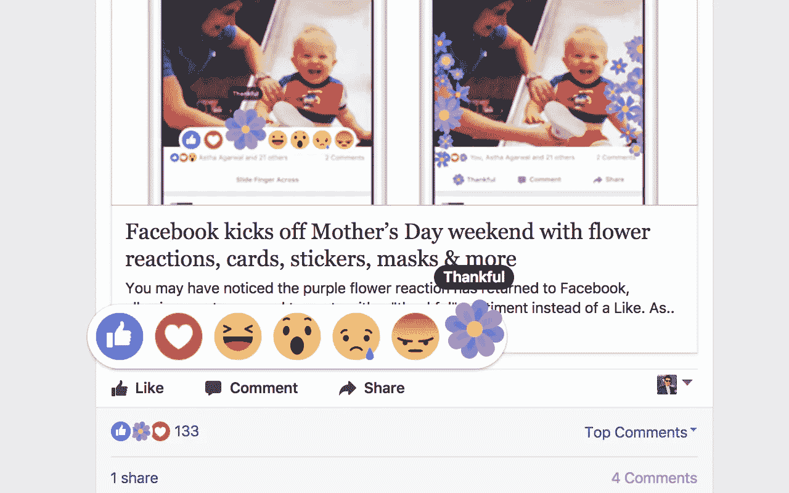
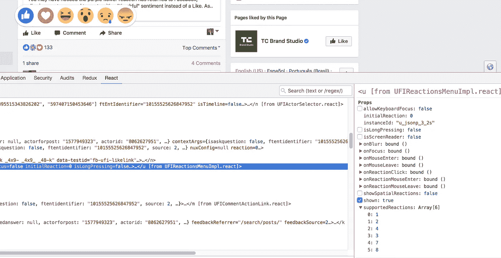
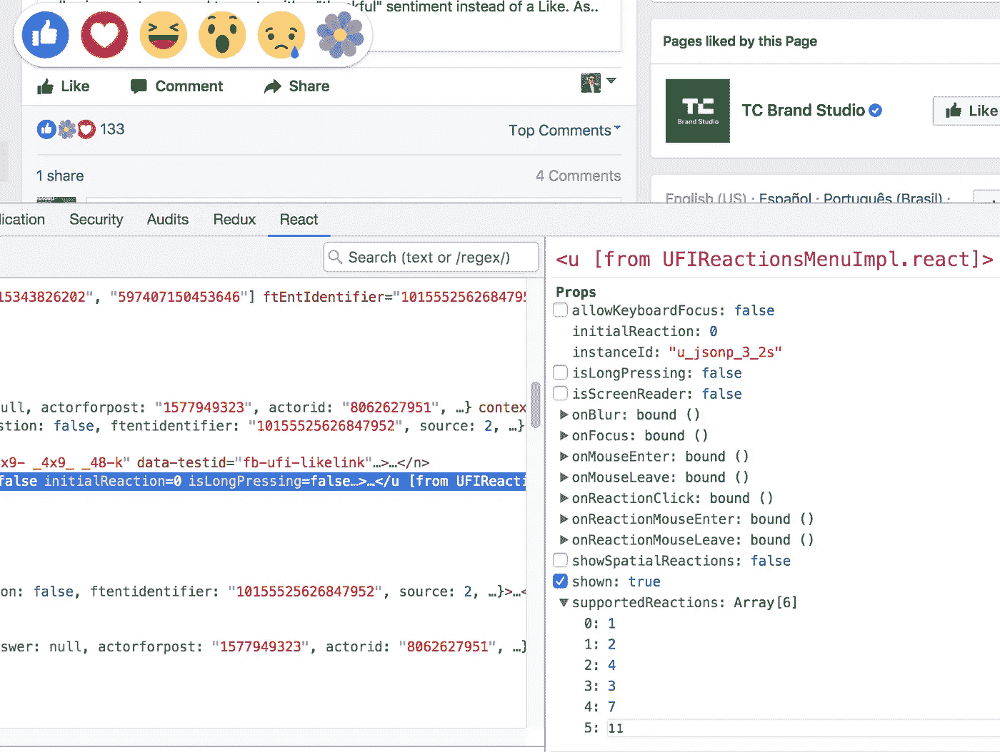
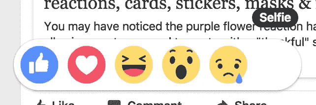
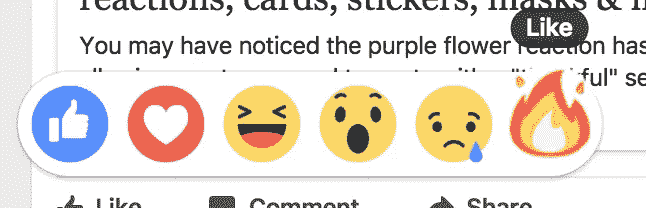
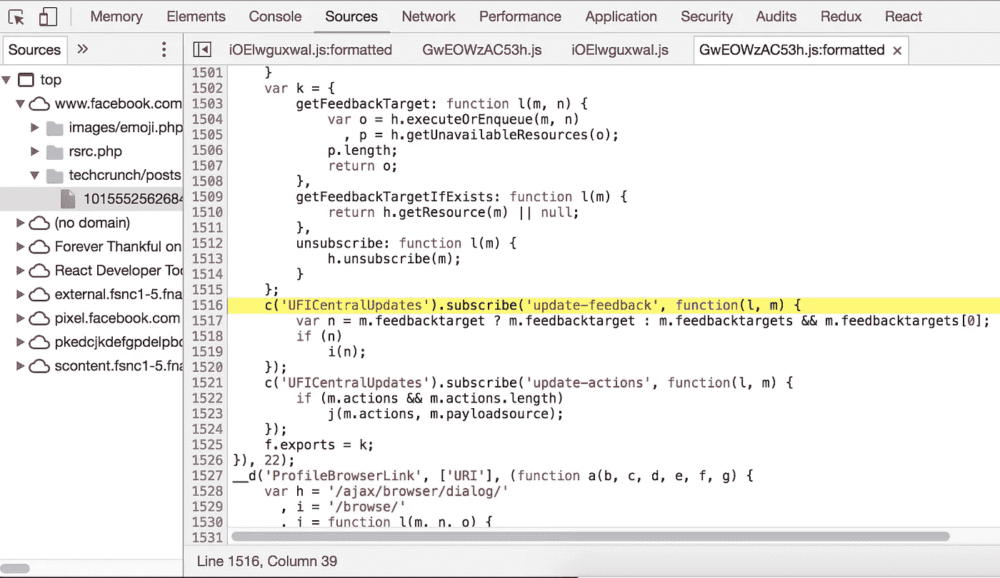
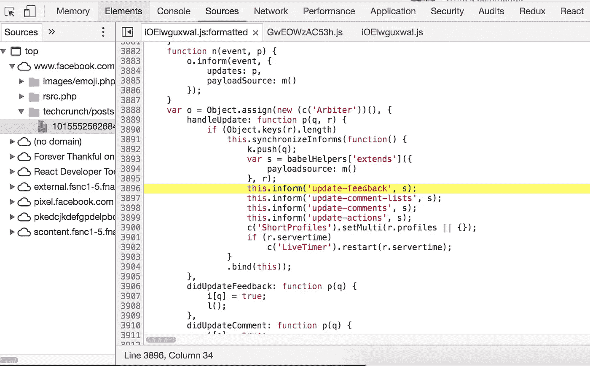

# 永远在 FB 上感恩——使用 React 将感恩的反应带回脸书🌸

> 原文：<https://medium.com/hackernoon/forever-thankful-on-fb-using-react-to-bring-the-thankful-reaction-back-to-facebook-96e31025c5d1>

# 编辑:在我的产品搜索扩展发布几个小时后，脸书已经从服务器端对此进行了修补。当它持续的时候很有趣。GG，FB。

[脸书](https://hackernoon.com/tagged/facebook)带回了限量版的“感恩”[反应](https://hackernoon.com/tagged/reaction)这样人们可以在今年的母亲节表达他们的感谢和赞赏。人们用左拥右抱的花束来表达他们的感激之情，一切都是花团锦簇。

> 但是，关键时刻到来了，马克·扎克伯格夺走了我们心中的感激，让我们心碎。花又不见了，人们都吓坏了。— [山杜卡尼·穆洛齐](https://twitter.com/ShanduMul)

 [## 互联网正在崩溃，因为脸书之花反应又消失了。原因如下…

### 啊哦。脸书花反应已经过去了，现在我们不知道如何表达我们的感激之情。那朵花回到了…

www.huffingtonpost.co.za](http://www.huffingtonpost.co.za/2017/05/17/the-internet-is-freaking-out-because-the-facebook-flower-reactio_a_22095055/) 

母亲节过了，并不意味着我们不能向他人表达我们的感激之情。每天都是感恩的日子。我决定要恢复人性，带回感恩的反应。

找回突然从我们身边偷走的反应的唯一可能的方法是利用浏览器扩展的力量。凭借我在 React 和构建谷歌 Chrome 扩展*方面的经验(例如，我的* [*Chrome IG Story 扩展*](/@calialec/chrome-ig-story-bribing-the-instagram-story-api-with-cookies-c813e6dff911) *拥有 37 万以上的用户)*我能够对脸书 Reactions React 组件进行逆向工程(FB 由其自己的 React 框架提供支持)，并让枯萎的花朵重新绽放。

我是怎么做到的？好吧，我必须为 Alexandre Kirszenberg 的精彩博文而欢呼，这篇博文详细介绍了如何检查和连接 React 组件。不过，他最终还是收到了脸书的停止通知函，所以希望我的命运不会和他一样。我只想说谢谢你们。

我首先检查了当您将鼠标悬停在 Like 按钮上时出现的反应菜单弹出窗口。

Inspecting the Facebook Reactions menu with [React Developer Tools](https://chrome.google.com/webstore/detail/react-developer-tools/fmkadmapgofadopljbjfkapdkoienihi?hl=en)

从上面的截图可以看出，在右边，'**ufireactionsmenuipl . react '**是处理反应-交互的主要组件之一。如果你仔细观察，你会发现其中一个道具是一个名为***supported reactions***的数组。*宾果*。从这里我发现数字映射到反应的类型 ID。1 是‘喜欢’，2 是‘喜欢’，等等。最后一个 ID 是 8，但是如果改成别的会怎么样？

Modifying the props of the component allows us to dynamically change its behavior with little effort

在增加数字后，当我达到 11 时，我终于得到了我想要的。在 React Dev 工具中编辑道具的美妙之处在于，一旦你更新了它，它就会传播到状态，一切都会按预期工作。这不像你只是在 DOM 中编辑一些 HTML，然后不得不改变一些 JS 逻辑。通过简单地将最后一个索引的 ID 从 8 改为 11，愤怒的反应变成了感激的反应，当你点击它时，它实际上向服务器提交并粘贴。脸书的服务器不会验证你发送的反应类型 ID 不再可用，所以你可以自由地感谢和被感谢。

如果你像我一样对脸书的所作所为感到好奇，我尝试了一些其他的 id。还有一些其他隐藏的反应，你可以用这种技术发现，但是脸书实际上是验证这些请求，如果你试图提交请求，就会阻止它。

通过我的实验，我发现了 5 个隐藏的脸书反应:**耶**、**迷糊**、**自拍**、**火**、… **飞机**？唯一有图标的是火和飞机。

Hidden ‘Selfie’ Reaction with a missing icon

Hidden ‘Like’ Reaction with a Fire icon

Hidden ‘Like’ Reaction with an Airplane icon

现在，我知道我可以通过手动编辑 React 组件来发布感谢的反应，但是我能够构建一个其他人可以用来做同样事情的产品吗？🤔

使用前面提到的博文中描述的技术，我开始开发一个 Chrome 扩展，它可以让大众产生感恩的反应。

现在，实际上花了一段时间来逆向工程和跟踪组件树，以找到我可以以编程方式挂钩、截取和修改***supported reactions****数组的确切位置，但最终我发现我需要的一切都存在于名为“**uficentruupdates**和“ **UFIFeedbackTargets** 的两个组件中。*

*使用在脸书的窗口对象上公开的“requireLazy”模块，我可以需要这两个组件并使用它们的方法。*

**

*The sight of a callback being registered is surely a sign of an easy in to hook and mutate data*

*在 **UFIFeedbackTargets** 中，我看到它正在订阅一个名为*‘更新-反馈’*的事件，一旦服务器用一个恰好包含***supported reactions****数组的对象进行响应，就会调用这个事件。如果我挂钩到这个订阅，我可以确切地知道我何时获得了***supported reactions***数组，并且我可以通过附加我们的感恩反应 ID 来改变它。现在唯一的问题是，在对它进行变异后，我如何让它在 React 应用程序中传播和实际反映？**

****

**Once you’ve hooked into a callback, it’s time to broadcast your changes.**

**在**uficentrulupdates**中，我看到我刚刚订阅的同一个事件“更新反馈”是由一个“通知”方法发出的。这是最后一步。从我订阅的回调中，我可以检索到***supported reactions***数组，将“11”附加到该数组中，并使用修改后的数组广播新对象。现在，由于代码同时订阅和发出相同的事件，我们需要防止无限的回调循环。我的逻辑是，当我们收到数组***supported reactions***时，简单地检查它的大小。如果它的大小是 6，这是默认反应的当前数量，我们添加新的感恩反应并发出它。回调将再次接收数组，但是这次它的大小是 7，所以我们不发出任何东西。一旦事件发出，React 照常运行并接受我们的新道具，现在呈现我们美丽的花卉感恩反应。😀**

**暂时的反应可能很有趣，但我真的恳求脸书正式带回感激的反应。生活中的一切都是短暂的，直到我们失去了对我们来说重要的东西，我们才意识到我们是多么珍惜它们。表达我们的感激之情，让我们爱的人知道我们有多在乎，这很好。永远心存感激，在脸书，在其他任何地方。谢谢🙏✌️**

# **在 FB 分机上安装永久感恩**

**你准备好对脸书表示感谢了吗？您可以从 Chrome 网络商店安装 Chrome 扩展:**

** [## 永远感谢 FB

### Chrome 扩展带来了感恩的反应，因为每一天都是感恩的日子。

chrome.google.com](https://chrome.google.com/webstore/detail/forever-thankful-on-fb/cliikahdjacboccjamlbnfekeooiiicc) 

# GitHub 上的开源

好奇它到底是怎么运作的？请随意查看源代码。

 [## 卡利亚力克/永远感恩

### forever-thanking-On-FB-Chrome 扩展，带回了感恩的反应，因为每天都是感恩的日子。

github.com](https://github.com/CaliAlec/Forever-Thankful-On-FB) 

> [黑客中午](http://bit.ly/Hackernoon)是黑客如何开始他们的下午。我们是 [@AMI](http://bit.ly/atAMIatAMI) 家庭的一员。我们现在[接受投稿](http://bit.ly/hackernoonsubmission)，并乐意[讨论广告&赞助](mailto:partners@amipublications.com)机会。
> 
> 如果你喜欢这个故事，我们推荐你阅读我们的[最新科技故事](http://bit.ly/hackernoonlatestt)和[趋势科技故事](https://hackernoon.com/trending)。直到下一次，不要把世界的现实想当然！

**