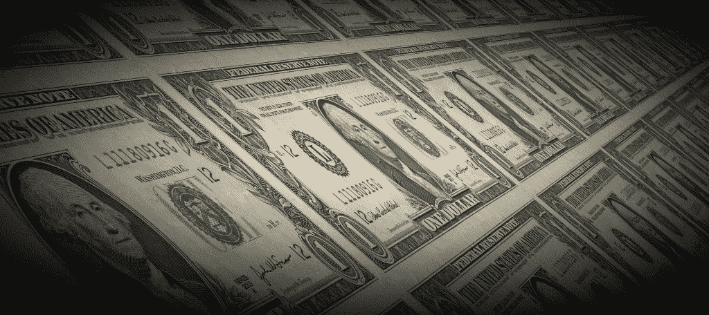

# 忘记教会和国家:货币和银行即将分离

> 原文：<https://medium.com/hackernoon/forget-church-and-state-the-coming-separation-of-money-banks-485abe0ec522>

*由*[诺亚杰索普 ](http://njess)

*Photo:* [*Anthony Quintano*](https://www.flickr.com/photos/quintanomedia/32956945963/in/photolist-SdhXQg-aoaczA-4Lbxc6-kmji-5t74wg-9g61Gw-4LsLhF-TpbChj-SdYGkD-cFfbXj-dfABGi-cpdZfQ-hL8NYQ-5jeyim-adYV17-5vAbk-d9uEqJ-mMm5-7AzFL9-aySTdM-8qjLc-mFxqJD-eUE84-6GC53X-aCw5iu-SdYGtz-6GCfLF-TpbDGJ-aCtoP8-Rktfwq-VwYPbT-hL9u8D-d76B5w-aCtqBx-aCtq3g-d76AVN-g6HS4t-5yPj7g-aMRnzF-6QHjQR-24Skrs-9RTsto-6yM4bv-aCtqM8-c2neRy-apx3D4-eUXhRq-TpbCqq-biW3T4-SdYHdv)

众多比特币衍生品、替代币和其他基于代币的协议创造了一个繁荣(尽管有些疯狂)的市场。为了理解我们狂躁的货币时刻，考察传统货币政策的历史会有所帮助。在历史上的大部分时间里，央行或其他监管机构决定发行多少货币，发行速度有多快，进而决定可以赚取多少利息。

正如每个国家的中央银行可以为他们的公民制定规则一样，加密项目和代币支持的经济也可以为代币的创造和发展制定规则。从 PayPal 的创立到最新的 ICO，我们已经知道，当你把 1000 多万自由市场参与者放在一起，有数十亿美元处于危险之中时，异常行为将比其创造者设计的任何行为都更加极端。但这并不是加密货币独有的。美国货币有用户主导扭曲的历史。毕竟，持有的大部分美元实际上是由私人手中创造的。这听起来很疯狂，美国政府是如何对自己的货币失去控制到这种程度的？

Photo: [Pixabay](https://pixabay.com/en/dollar-money-us-dollar-arrangement-1443244/)

很简单:借贷的发明。

假设我买下你在旧金山的(小)一居室公寓。我从当地信用合作社或类似机构贷款 100 万美元。我付给你 100 万美元，并取得公寓的所有权。

这里发生了两件事:

1.  你把这笔新的 100 万美元存入你的银行账户(暂时忽略 FDIC 保险)
2.  但我给你的最初 100 万美元来自我在当地信用合作社的存款——对储户来说，它仍在等待，随时可以提取。

欢迎来到银行业的炼金术:100 万美元的存款刚刚变成了 2M 美元的存款。

一种货币的价格稳定性是建立在假设的供应可预测性基础上的——几乎任何政策都可以——只要这是一条市场观察者可以感知的总体预测路径。因此，在最好的时期，各国都渴望制定货币政策，以产生缓慢、最小的通胀。人们至少可以知道会发生什么。

但我刚刚向你展示了，我们可以通过弹指一挥间让供给中的钱翻倍。

我们的中央银行家——试图刺激经济像 90 年代那样运转——多年来一直将实际利率保持在零。这做了什么？

10 月 7 日的《经济学人》有一个想法:封面[自豪地宣布“一切牛市”的到来。](https://www.economist.com/printedition/2017-10-07)

但如果资产价格只是在实际基础上上涨，我们实际上是在加速我刚才展示的货币创造引擎。通过银行业的核心炼金术，更高的价格导致更多的货币被创造出来。

# 流动性紧缩

银行业的炼金术在繁荣时期无人问津。只有当你和最初的存款人都试图同时取款时，问题才会出现:贷款银行不能强迫我立刻卖掉公寓(如果我卖了，它会打折)。流动性就是这样棘手的。

想象一下，你和最初的储户是整个银行系统的唯一参与者。如果你们两人同时要求提款，发卡银行将无法支付。为了防止银行挤兑，美国银行为储户提供保险——现在，储户将通过美国税收得到补偿。发放给银行员工的奖金可能早就发放出去了。这将是一次小额救助。

银行能够支付的唯一情况是，如果它有足够的自有股本缓冲，即银行的股东和所有者将有足够的准备金来支付成本。但这家银行只有一笔贷款，因此没有真正的“股本”价值。在过去的 30 年里，由于放松监管，银行的股本与账面价值之比大幅下降。

那么，我们如何才能防止银行激励变成“正面我赢/反面你输？”大萧条之后，一些最聪明的人在 1933 年聚集在一起寻求解决方案:芝加哥计划。

# 芝加哥计划:100%抵押品

*Photo:* [*Ibrahim Old*](https://ar.wikipedia.org/wiki/User:Ibrahim_Old)

该计划背后的著名经济学家(包括埃尔文·费雪、弗兰克·奈特(Frank Knight)和亨利·舒尔茨(Henry Schultz)提出了一个相对简单的计划:银行必须拿出发行贷款价值的 100%。因此，如果有任何贷款变成坏账，就有现成的资金支付给储户。

这个提议的一个非常重要的因素是，它将打破信贷和货币创造之间的联系。

这个计划最终被淡化了，从未实施到这种程度。在这个对信贷要求更高的新世界里，信贷可能会更难获得——一些贷款通过债务而非公司股权更容易获得。例如，为出售每套公寓发行股票是不切实际的。但是给予货币发行者控制权而不是银行控制权的想法直到今天仍然很强大。

# 输入加密

Crypto 还没有银行——没有固定利率。因此，借贷市场并没有照搬当地发行的货币规范。出现的东西更加强大。

迄今为止，加密经济中的借贷不同于我们在历史上见过的任何事情。与其说储户将债务交给银行，接受被动的资本增长，不如说早期已经产生了一个积极得多的体系。

从历史的角度来看，那些寻求信贷的人可以做一些了不起的事情:他们只需创建自己的“[货币国家](https://www.forbes.com/sites/noahjessop/2017/10/09/5-things-ray-dalio-hasnt-learned-about-crypto-yet/%234906a0ae1fa1)”这个货币国家向任何想兑换储备货币的人发行自己的货币。

这允许“借出”不直接使储备货币货币供应量翻倍的货币——它将“流动”存款(通常是比特币或以太币)转换为借贷兼股权混合。贷款是钱，也是股权。

# 举例来说:一床公寓硬币

让我们回头看看我们之前的借贷例子。与其从一系列银行储户那里贷款，我可以简单地创造一个新的货币国家(“我的一床公寓硬币”，如果你愿意的话)，将这套公寓的未来价值与其储备货币价格挂钩，或者我将为居住这套公寓而支付的储备货币流。个人货币持有者可以选择将他们的一部分储备货币转换成这种新的货币，无论其比例符合他们的财务目标。

如果任何个人货币持有者(或所有人)选择将价值(加上任何上涨或下跌)转换为储备货币，他们可以在公开交易所将他们在我的公寓中的股份无缝交易给另一个个人(或金融机构)。如果“我的一床公寓硬币”的货币国家变坏，这些代币的买家将失去其储备货币的价值——这里没有政府支持或 FDIC 保险。

许多挑战仍然存在，特别是当将加密经济与现实世界的资产(如公寓或其他与一国本币合法挂钩的东西)联系起来时。监管仍需发展——短期内可能会增加基于密码的信任和评级机制。

最终，我们将看到市场参与者出现，他们将捆绑这些类型的持有，以给你的储备货币带来回报——投资组合的构建将看起来更像共同基金或指数基金，而不是纯粹的存款。

# 新大陆

Crypto 给了我们芝加哥计划:100%由真实资本支持的贷款。我们融入了类似股权的概念，这可能有助于所有市场参与者“参与游戏”

这个新时代已经让货币政策和货币价值与银行业和发行信贷脱钩。它可能会阻止我们所看到的传统本币计价银行业的金融炼金术的大部分激励。在早期，非精明的持有者面临更多的风险，但不会有更多的救助。

任何一个较小货币国家内部的流动性竞赛都可能使它们陷入瘫痪。但储备货币的生态系统将保持弹性和稳定。

各国多年来所尝试的——对其货币的完全控制——已经成为这种新的秘密经济的新兴属性。最好系好安全带。

*披露:该作者投资(个人或通过创始人集体)加密资产和初创公司。*

*这篇文章的大部分内容来自与央行专业人士的讨论和他们的想法。如果你正在思考这些问题，因为它们与你的货币或国家有关，并希望继续讨论，请联系作者。*