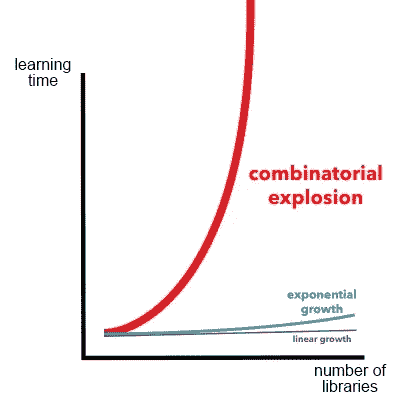

# 忘记框架，成为一名全能的黑客

> 原文：<https://medium.com/hackernoon/forget-frameworks-become-a-versatile-hacker-775128a22a32>

大约在 2013 年，全栈开发人员这个术语开始出现在职位描述和博客帖子中。公司意识到雇佣只懂一种语言的开发人员已经不够了。能够处理各种任务和环境的 web 开发人员要有用得多，并且开始成为标准。

尽管如此，关于 web 架构本身的知识并没有普及。许多开发者一直在构建网站，却没有很好地理解幕后的工作原理。网络表单，缓存，HTTP 协议，Apache。所有这些都是次要的好东西。

# 上网络课程够跟得上吗？

也许是几年前开始的在线学习热潮的结果，自学成才的 web 开发人员对 web 的底层技术知之甚少。**面向语言的课程无法覆盖整个 web 栈**，学生们最终将会对 htaccess 文件的功能，或者如何重启 Unix 守护进程，或者不同类型的 POST 编码是如何工作的一无所知。

不管怎样，全栈开发人员应该知道些什么？职位描述经常提到前端和后端技术的组合，比如 JavaScript 和 Node、PHP 和 jQuery、Angular 和 Spring，以及许多其他技术。事实上，在这些领域之外有大量的信息可以提高一个人建立网站的能力，你可以坚持你所知道的，并在单一技术上做出一番事业的日子已经一去不复返了。

如果坚持己见已经不够了，那么我们能做什么，还有**我们怎样才能跟上网络图书馆的指数增长？**如今有如此多的软件发布，各种技术之间可能的组合数量正在快速增加。这种[组合爆炸](https://en.wikipedia.org/wiki/Combinatorial_explosion)将推动软件开发进入一个更加特别的领域。你知道如何整合两个随机库 X 和 Y 的机会正在减少，谷歌搜索能提供的任何帮助也在以同样的速度减少。窗口就要关闭了，很快就会有一天，我们会被要求每次都当场解决这些棘手的问题。不是为我们当中的懒人准备的。

# 黑客:反脆弱的程序员

我是在摇滚明星约翰·卡马克的一篇文章中被介绍到这个非常有趣的概念的。下面引用[的一本抗脆弱的书](https://www.amazon.com/Antifragile-Things-That-Disorder-Incerto-ebook/dp/B0083DJWGO/ref=as_li_ss_tl?ie=UTF8&btkr=1&redirect=true&ref_=dp-kindle-redirect&linkCode=ll1&tag=chrimaiospo06-20&linkId=4e7ef17ce6f211b37d91cd6334370b83)来描述它:

*“正如人类的骨骼在承受压力和紧张时会变得更强壮，当有人试图压制它们时谣言或骚乱会加剧，生活中的许多事情都受益于压力、无序、波动和动荡。塔勒布认为并称之为* ***“抗脆弱”的是那种不仅从混乱中获益，而且为了生存和繁荣而需要它的东西。***

这个想法反映了那些曾经被称为黑客的人所共有的态度。今天这个词有负面的含义，但在早期，它指的是一个对技术有某种态度的人。根据行话文件的定义，黑客是: *"* ***一个喜欢探索可编程系统的细节*** *以及如何扩展其能力的人，这与大多数用户相反，他们只喜欢学习最少的必要知识*

曾经有一段时间，当你有问题的时候，在栈溢出上查找东西是不可行的，而且许多软件都有不可读的文档，如果它们有任何文档的话。我记得当我还是个孩子的时候，我试图解决一个声卡问题，并且阅读了声卡的使用手册，却发现那里有汇编代码列表，有中断代码等等。那是黑客们茁壮成长的环境，那是我们迟早要回到的地方。如果在处理一个影响多种技术的复杂问题时，你的第一反应是从谷歌搜索开始，那么你应该重新考虑你的工作习惯。

当然，过于好奇会让你误入歧途，尤其是在时间总是很短的公司环境中。举个例子，当[学习](https://hackernoon.com/tagged/learning)一个新的库时，为基本用例编写测试代码是非常有启发性的，但是希望给老板留下深刻印象的编码人员会采取更务实的方法，从文档中复制例子，完全不知道它们是如何工作的。**作为一名开发人员，提供价值需要一定的时间管理和设定期望值的技巧，**这样可以让你寻找你需要的知识，并从长远来看为公司节省资金。

# 如何成为一名全能黑客

*   每当你不得不谷歌一些错误信息或问题，阅读所有的答案。**尽可能多地了解你的问题的背景**，不要仅仅满足于找到一个解决方案。
*   了解技术，也了解**在其设计和开发过程中做出的权衡**。
*   问问你自己，怎样才能让你认为自己是一个“完整的”开发人员，然后**为你**写下一条通往那里的道路。
*   做别人不喜欢做的事，去他们不想去的地方，你经常会从这些经历中得到启发。

软件开发正在快速发展。学习编码比以往任何时候都容易，很快我们就会处于适者生存的环境中。但是制作它的人不会是第一个了解这个很酷的新框架的人。这个人会问自己有什么新的东西，这次有什么不同。如果你想与技术栈保持同步，那么就不要太担心是否同步，开始做黑客吧。

注:本文[最早出现在 TechBeacon](http://techbeacon.com/what-full-stack-developer-should-mean) 上。