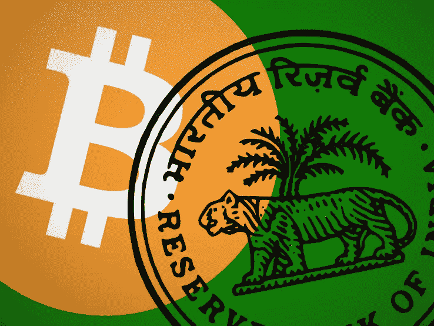
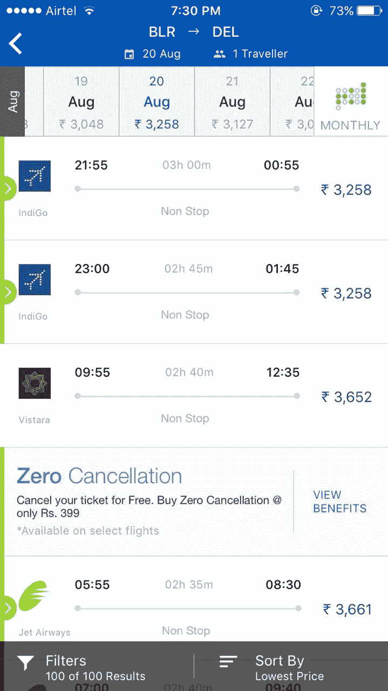
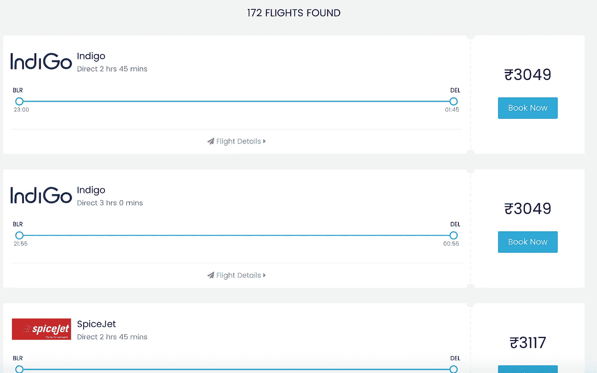

# 印度首个接受比特币的主流大额商户服务已经到来。。。

> 原文：<https://medium.com/hackernoon/forget-makemytrip-this-is-indias-cheapest-site-to-book-air-tickets-aa79560be774>

自从去货币化导致比特币价格在印度飙升以来，我已经密切关注比特币热潮好几个月了。

 [## 比特币在印度因去货币化而反弹

### 印度停止货币流通后，比特币在印度的交易量比国际市场高出近 10%

factordaily.com](https://factordaily.com/bitcoin-price-in-india-goes-up/) 

当有人在一个允许使用比特币预订国内机票的印度网站上发帖时，作为众多阴暗的[加密货币](https://hackernoon.com/tagged/cryptocurrency)团体的一部分终于有了回报。

对于那些不知道的人来说，比特币是一种数字货币，用于在世界任何地方安全、即时地转移价值。这是被称为加密货币的不断增长的货币类别的第一个例子。

它不受任何银行或政府的控制或发行——相反，它的价值是由公开市场上的买卖决定的，类似于股票或房地产。比特币的价格会根据特定时刻想要购买或出售比特币的人数而实时变化。

2013 年初，它的价值约为 13 美元，2015 年初涨到 260 美元，今年 6 月飙升至创纪录的 3000 美元。目前徘徊在 2600 美元关口附近。

比特币交易分析师克里斯·伯恩斯克(Chris Burniske)的数据显示，过去一个月，印度占全球加密货币交易的近 11%。

这并不特别令人惊讶，因为比特币价格最近的飙升使其成为一种可行的替代投资工具，具有快速短期收益的潜力。如今比特币在印度的价值已经飙升至 17 万卢比。

印度有很多创业公司已经开设了比特币交易所，用印度卢比购买比特币很容易。Unocoin、Coinsecure 和 Zebpay 是印度三大比特币玩家，用户总数超过 100 万。

到目前为止，虽然 Zebpay 和 Unocoin 允许你为手机、DTH、数据卡充值，并在 BookMyShow 上购买电影票，但大多数印度人并没有真正使用比特币购物。

由于法定货币(由政府支持的法定货币，不同于加密货币)的普遍性、安全性和易用性，比特币今天更多地履行了货币的“价值储存”功能，而不是经济学家传统上用来定义货币的“交换媒介”功能。

尽管比特币相对于传统货币有许多优势:它天生稀缺(协议规定只能创造 2100 万个比特币)，是分散的(其价格不能被任何政府操纵)，易于在互联网上传输，易于存储，并且可以无限分割；对普通人来说，所有这些都不算什么。

虽然我们这些科技行业的早期采用者可能会尝试一些有潜力的东西，但只有将这种潜力转化为实际的 T2 体验，它才能跨越鸿沟进入主流。

今天街上的普通人需要有更多的体验，在某种程度上，使用比特币比使用菲亚特更容易、更安全或更有优势。对于他们来说，在不知道任何底层协议的情况下使用比特币就像你可以在不知道印度储备银行如何运作的情况下使用印度卢比一样。

虽然印度已经有一些商家开始接受比特币，这是一个很好的推文，但一直没有明确说明为什么用比特币支付比用其他方式支付好得多。

 [## 孟加拉鲁鲁的一家餐馆可能是印度第一家接受比特币的餐馆，但极客们对此并不感冒

### 在英迪拉纳加，一个高档酒吧和主题餐厅星罗棋布的高档社区，是一家…

factordaily.com](https://factordaily.com/bitcoin-accepted-bangalore-suryawanshi/) 

对于一个新进入者来说，要颠覆现有的解决方案，它必须更好，不仅仅是几度，而是大到足以让用户摆脱惰性的程度。

而 [Flybit](https://flybit.in/) 击中了印度的甜蜜点——更便宜的价格！

我在印度最受欢迎的 OTA 上查看了班加罗尔—新德里航班的价格。

加上便利费后的票价约为 3508 卢比。

当我在 Flybit 上查看同样产品的价格时，我惊喜地发现它只需 3049 卢比，比 450 卢比还要低。

Cheaper prices on Flybit!

Flybit 要求我向一个特定的比特币地址支付 0.01843519 比特币，并在支付后几分钟内将门票发送给我。

据运营 Flybit 的 Prayank Gahlot 称，大多数国内航线的价格都比传统在线旅行社低 15%以上，但他不愿透露提供 Flybit 背后 API 的第三方旅行社的名称。他还计划很快为每张国内机票提供一张免费的奥拉/优步优惠券。

Flybit 通过计算印度交易所任何时刻的所有汇率的平均值来计算比特币-印度卢比汇率，这也意味着那些从美国交易所购买比特币的人(那里便宜 1.5-2%)可以节省更多的钱。

Flybit 目前在盈亏平衡的基础上运营，为用户提供尽可能便宜的国内机票，以促进比特币在印度的应用。

越来越多的此类加密货币项目正在印度涌现:让你用比特币从亚马逊、Flipkart 和 Snapdeal 等电子商务网站购买任何产品。

正在推出 PocketBits 的 Sohail Merchant 告诉我，尽管市场的潜力吸引了许多投机者和交易者，但围绕比特币的整个生态系统(而不仅仅是比特币交易所)必须出现，才能让主流的“noob”人群进入。

在成为多起信用卡欺诈的受害者，并见识到使用比特币在国际电子商务网站上购物的便利后，他创办了 Pocketbits。

他声称，自 2 月份推出以来，Pocketbits 的注册人数已超过 1.5 万，在购物服务上发生的交易价值超过 1200 比特币。

金钱在本质上起作用是因为它是一个普遍的相互信任的系统。

即使不信仰同一个上帝，不服从同一个国王，或者属于完全不同的文化的人们也非常乐意拿一张相同颜色的纸。

*“金钱是人类创造的唯一信任体系，它可以弥合几乎任何文化鸿沟，并且不会基于宗教、性别、种族、年龄或性取向进行歧视。由于有了钱，即使是互不认识、互不信任的人也能有效地合作。—《智人》的作者尤瓦尔·诺亚·哈拉里*

那么，金钱就是最终的网络效应，它之所以有效，是因为每个人都相信它。

如果我相信你会接受比特币作为货币，那么我想要更多的比特币，你也想要更多的比特币，就这样，创造了一个网络效应。比特币的吸引力甚至更大，因为它是完全去中心化的，没有一个政府能够像去年年底在印度发生的那样宣布它一文不值。

虽然比特币跨越鸿沟成为主流可能还需要几年的时间，但就目前而言，我很高兴能买到一张划算的机票。

【https://upscri.be/hackernoon/ 