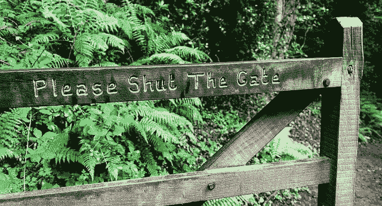

# 忘记你所知道的密码安全，这样做

> 原文：<https://medium.com/hackernoon/forget-what-you-know-about-password-security-and-do-this-instead-1be474a3cf60>

管理您的密码可能会非常令人沮丧。此外，设置安全密码的要求也很难满足。至少使用一个大写字母、一个特殊字符、一个数字、你的星座和你未出生的孩子的名字(我们认为只是开玩笑)。关键是，所有这些要求使得你的密码几乎不可能被记住。当你输入这个极其复杂的密码足够多的次数来记住它的时候，是时候再次改变它了！

不仅仅是你。创建和管理密码令人沮丧。我们要为此感谢的那个人最近承认“我现在很后悔我做过的很多事情。”比尔·伯尔，前国家标准和技术研究所经理，是负责编写我们都知道的密码指南的人。

好消息是，[国家标准与技术研究院](https://www.nist.gov/)(NIST)[最近修订了创建密码的指导方针](https://pages.nist.gov/800-63-3/sp800-63b.html)，它们变得简单多了。NIST 公司的高级标准和技术顾问保罗·格拉西告诉 NPR ，“传统的指导实际上是产生对坏人来说很容易，对合法用户来说很难的密码。”

# 新的指南

这对密码意味着什么？首先，不需要特殊字符或大小写字母的混合。密码应该简单、长且容易记忆。信不信由你，遵循这个公式会让黑客更难猜出你的密码。

以下是一些建议:

*   使用常见的英语单词。
*   避免重复或连续的字符(例如，1234，wxyz)。
*   摆脱密码提示和密码重置问题——它们是麻烦。
*   使用密码管理器。
*   除非密码已经泄露，否则无需更改密码。
*   让你的密码至少有 8 个字符长——但是密码越长越好(想想:冗长的无意义短语，比如“carpetsunshinedog”)。

是的，“密码”及其各种变体仍然是不可接受的。

在 NIST 网站上查看全套指南。

*原载于 2017 年 8 月 25 日*[*【rtslabs.com】*](https://rtslabs.com/forget-what-you-know-about-password-security-and-do-this-instead/)*。*