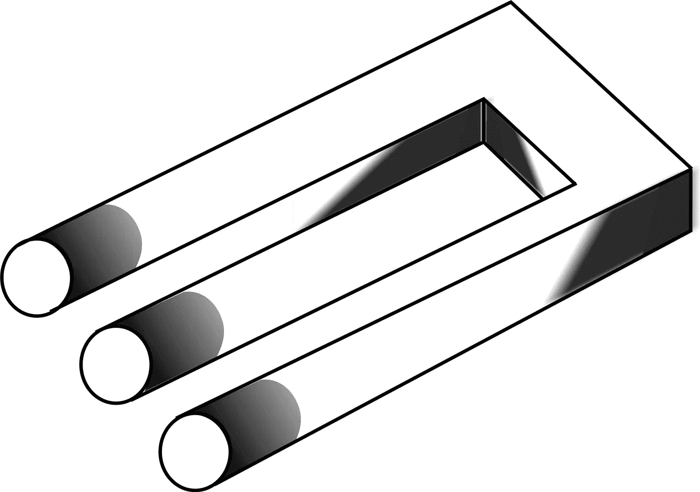

# 叉子？什么叉子？

> 原文：<https://medium.com/hackernoon/fork-what-fork-47e6f8d46b3b>

看待最近事件的一种方式:

经过两年的争吵，比特币社区最终就如何最好地扩大网络规模达成了一致。他们首先同意在这个问题上 80%的同意(而不是通常的 95%)就足够了，因为辩论似乎陷入了僵局。由于网络“堵塞”,这个问题急需解决。一切都很顺利，比特币协议从一开始就按照预期的方式升级了。最长的链条*是*比特币，人们一致决定如何向前推进。

与此同时，那些反对缩放解决方案的人决定做一些不寻常的事情。分叉网络。但是这里有一个惊喜给你们中的一些人:

*没有叉子。*

比特币还是比特币。其核心是 2100 万硬币的限制。其核心思想是，网络中的共识构成了比特币。将硬币数量增加一倍就是犯了密码灭绝罪！

那么什么是“比特币现金”呢？

“比特币现金”是一种备用硬币，为所有拥有比特币的人，所有控制其私钥的人提供预挖掘的硬币。如果你做到了，你就赚了！在写这篇文章的时候，一枚 BCH 代币几乎价值五分之一比特币！比特币仍然非常接近其历史高点。这里的每个人一夜之间都变得富有了 20%。让那件事过去一段时间。所谓的叉子几乎没有在神秘的海洋中激起涟漪。还有什么资产能做到这一点？比特币的每一天都不无聊…