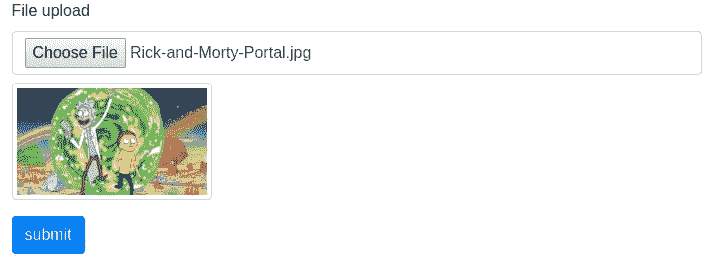
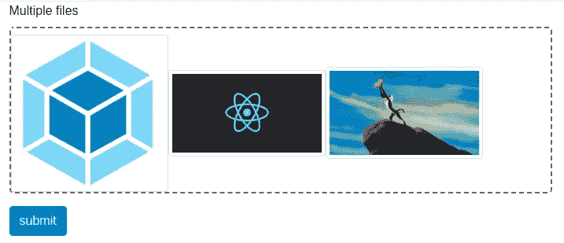
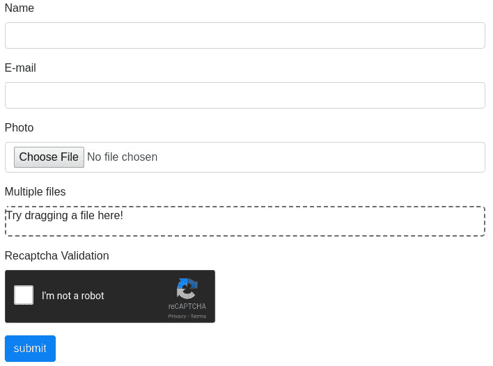
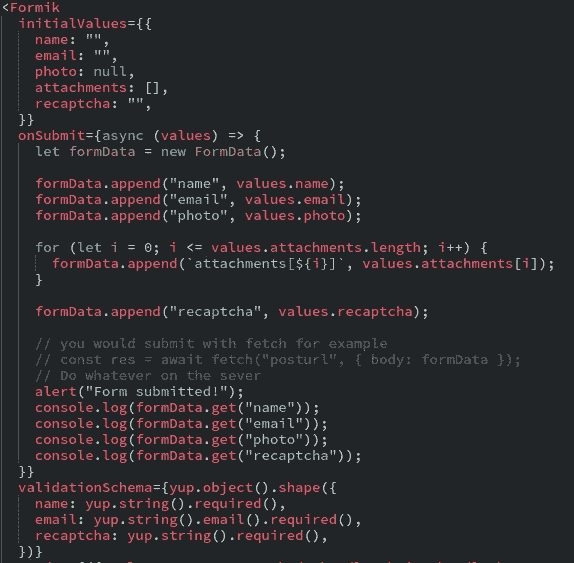

# Formik —处理文件和 reCaptcha

> 原文：<https://medium.com/hackernoon/formik-handling-files-and-recaptcha-209cbeae10bc>


formik logo

这篇文章的目的是展示一些人们在开始使用 [Formik](https://hackernoon.com/tagged/formik) 时可能会遇到的困难。

如果你还不知道 Formik，请参考其 [Github](https://github.com/jaredpalmer/formik) 或这些帖子:

*   [与 React 和 Formik 同形式的喜悦](https://keyholesoftware.com/2017/10/23/the-joy-of-forms-with-react-and-formik/)
*   [与 Formik 更好的反应形式](https://mead.io/formik/?utm_source=github&utm_campaign=formikrepo)
*   [无痛反应形式与 Formik](https://hackernoon.com/painless-react-forms-with-formik-e61b70473c60) (我写的)

出于演示目的，我将使这些示例简单易懂。我还会故意省去一些功能，这样我就可以在最后给你一些挑战了！

# 上传一个文件📎

我很确定我们都尝试过在表单中上传文件。在 Formik 文档中，没有关于文件上传的指示或指导，但它就像处理一个**反应-选择**选择框一样简单。

您真正需要的只是一个 Formik 值的条目(在本例中称为*文件)*，并设置**onChange** 以使用 Formik 的 **setFieldValue** 函数。记住我们可以通过使用**event . current target . files[0]轻松访问上传的文件！**

这很简单，因为:

example function for handling file input

而 Formik 为你持有[文件](https://developer.mozilla.org/en-US/docs/Web/API/File)对象。你可以用它做任何你想做的事。知道名字，尺寸和类型吗？

example code for showing file data

有了这些数据，你可以在输入下方的小缩略图中显示图像，如下所示:



thumbnail example

查看下面的 **CodeSandbox.io** 示例，看看如何轻松实现这一点。对于缩略图生成，我非常简单。演示时不需要花哨的东西。

one file upload with thumbnail example

# 上传多个文件📎 📎 📎

我们已经看到了单个文件的上传，那么多个文件呢？和一个空投区？那些文件的缩略图呢？

我将使用优秀的 [react-dropzone](https://github.com/react-dropzone/react-dropzone) 库来处理所有这些 dropzone 细节。为了简单起见，我还将重用上一个示例中的缩略图组件。

这将是最终的结果



3 files uploaded

福米克让处理这种事情变得很容易。 **setFieldValue** 就是你需要的全部。基本上，你可以跟踪一系列文件，并做你需要做的一切。**请随意使用下面的 CodeSandbox.io 示例！**

Multiple file upload example

# reCaptcha 支持🔐

我敢打赌，几乎每个人在过去都与某种形式的[谷歌](https://hackernoon.com/tagged/google) r [eCaptcha](https://www.google.com/recaptcha/intro/android.html) 互动过。也许甚至在今天，你填了一张表格，打了勾，或者玩了一个小游戏来证明你不是机器人。重点是，当人们希望通过不断提交表单来防止机器人向他们发送垃圾邮件时，reCaptchas 非常常见。

让我向您展示如何在表单上处理简单的 recaptcha。对于这个例子，我将使用 [react-recaptcha](https://github.com/appleboy/react-recaptcha) 包来获取 api 连接。

> **我使用了一个仅用于演示目的的键。如果在你读这篇文章的时候，因为任何原因它下降了，请随意输入你自己的并尝试一下。**

Google reCaptcha v2 example

什么？！😅你期待更多的工作吗？还记得福克斯的目标吗

> 就是用最小的 API 创建一个可伸缩的、高性能的表单助手，它可以做一些非常烦人的事情，剩下的就交给你了。

我们可以简单地用 **setFieldValue** 函数控制它，并用值来处理它。稍后，您将把它提交给服务器，并对给定的 reCaptcha 响应执行服务器端验证！

# 都在一起！💯

太好了！您已经走了这么远，现在您想知道如何在实际场景中应用它并将数据提交给服务器。让我来帮忙吧！

让我们为一个用户构建一个表单，该表单有一个**名称、电子邮件、照片、一些附件**，并且必须通过验证 reCaptcha 来提交表单。

最后，我们将了解如何向服务器发送信息，以便服务器接受文件和用户模型。



the final form look

正如您在下面的 **CodeSandbox.io** 中看到的，只有当 recaptcha 被验证并且我们所有的必填字段都被填写时，表单才被提交。你可以随意摆弄它。

the full example

福米克已经为我们免费办理了**姓名**和**电子邮件**。所以我们只需要插入其他字段。就像你想的那么简单



initial values, validation schema and submition code

为了让这些文件进入服务器，你必须通过[表单数据](https://developer.mozilla.org/en-US/docs/Web/API/FormData)提交它们。我选择了简单的方法，因为它用于演示目的，我必须让它对你来说简单明了。

我建议 [async/await](https://developer.mozilla.org/en-US/docs/Web/JavaScript/Reference/Statements/async_function) 但是你可以使用任何你想要的！

```
const res = await fetch(“your post url”, { method: “POST”, body: formData });
```

其余的取决于您的服务器堆栈。

**注意:下面这段代码可能会有所不同，这取决于你的后端栈。**

```
for (let i = 0; i <= values.attachments.length; i++) { formData.append(`attachments[${i}]`, values.attachments[i]);}
```

# 对你来说有些挑战🎲

在这一点上，你可能想知道为什么我没有做一些基本的功能，比如清除上传的文件，清除单个上传的文件(来自多次上传的例子)，或者甚至清除和重置 reCaptcha。

嗯，那就是**你的**挑战！😏 😄

为了提高这些技能，你可以自由地使用代码沙箱并开始工作！

你可以试试

*   制作一个更智能的缩略图组件(react-dropzone 实际上给了我们一个预览斑点，所以也许可以使用它？😄)
*   从单一上传输入中移除文件
*   从多个上传输入中移除一个(一些)文件
*   重置加盖器
*   简化表单数据追加代码
*   对一些 API 进行真正的提交

尽情编码吧！💻 🎲