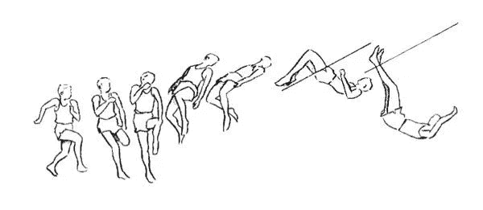
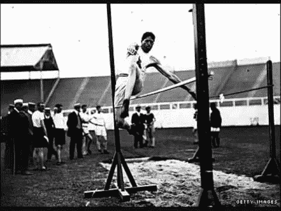
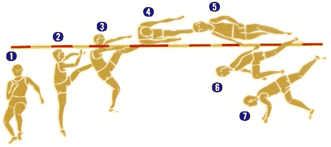
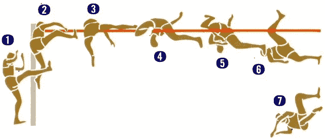
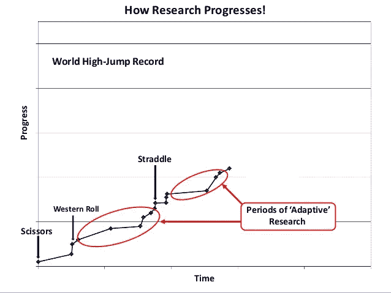

# 福斯贝里效应和进步的概念

> 原文：<https://medium.com/hackernoon/fosbury-effect-and-the-idea-of-progress-6c2879b9f379>

早在 2011 年，我读过一个关于某个我从未听说过的人的故事。他是一名跳高运动员，他的名字叫理查德·福斯贝里。这个故事最终成为我在 2011 年读过的最好的故事之一。

[*福斯贝里*](https://hackernoon.com/tagged/fosbury) 当时是一名退役的奥运会金牌得主。让我印象深刻的不是他获得了一枚奥运金牌，而是他是如何获得这个奖项的。

在我们深入研究如何做之前，我们必须后退一大步，看看 60 年代以前的跳高世界是什么样子的。

第一次有记录的跳高比赛发生在 19 世纪的苏格兰。这是人类历史上第一次面对这一新学科。他们有一个明确的问题要解决:尽可能跳得高。他们用最直观的方式解决了这个问题。

于是剪刀技术就产生了。

很简单。助跑是一条与横杠成 30 到 50 度的直线，越过横杠的最低点，通常是中点。

这碰巧是解决问题的最自然的方法。

*东部分界点*一直持续到 1936 年**的**奥运会**为止。在 1936 年柏林奥运会上，东方的裁剪风格演变成了西方风格。**

*西滚*持续了 10 年左右才在多空合并。*跨骑*成为快速最常用的技术。

人类用来解决这个问题的技术在两个世纪的过程中自然发展。事后，你可以追溯清楚且定义明确的线索，人类已经经历了数年来一厘米接一厘米地变小。

他们尝试了第一个基本的解决方案，然后年复一年地用细致的改善方法稳步改进。这看起来像是 150 年后的跳高纪录时间线。

直到 1968 年在墨西哥城举行的夏季奥运会上发生了一些事情。

这就是来自俄勒冈州波特兰市的 21 岁美国跳高运动员迪克·福斯贝里的用武之地。他不是一个顶尖的跳高运动员。在 1968 年夏天之前，他没有赢得任何特别奖，在那届奥运会之后，他结束了在家乡执教小球队的生涯。

但是事情是这样的！他不是天才，但他足够疯狂，可以思考别人从未思考过的问题。他认为他可以跳得更高，向后跳。他证明了最违反直觉的事情是最有效的，一天之内，他就把以前做过的事情一扫而光。

> 我们习惯于认为[进步](https://hackernoon.com/tagged/progress)是当下自上而下的自然发展，而大多数时候进步是通过试错对当下自下而上的破坏。