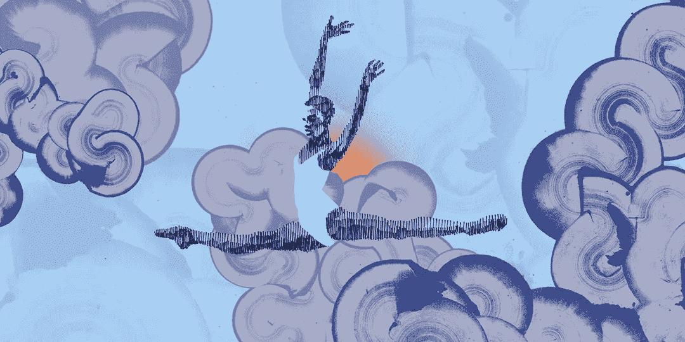

# 基础…大三…复习…大四…时间都去哪了？

> 原文：<https://medium.com/hackernoon/foundations-junior-review-senior-where-did-the-time-go-5d0ce5ea4c7b>

Illustration by [Emi Hensley](https://www.behance.net/gallery/29836949/Dancer) via [FullStack Academy Blog](https://www.fullstackacademy.com/blog/making-the-leap-how-to-build-your-skillset-and-switch-careers).

富栈学院的学生生活可以分为三个主要部分:基础阶段、初级阶段和高级阶段。

基础课程是一门为期四周的课程，旨在确保所有学生在相似的基础上开始项目的沉浸式部分。传统上，课程是在网上完成的，但我们的团队在校园内完成了基础课程，这给了我们额外的机会接触讲师和其他资源，以确保我们的成功。基金会也是我开这个博客的时候，希望分享一些见解。但是，唉，总是有更多的编码要做，有更多的东西要学，所以博客就被搁置了。

初级阶段是乐趣真正开始的时候，我们开始学习一些新技术。在六周的时间里，我学会了用 Express 制作服务器，用 PostgreSQL 创建数据库(并用 Sequelize 将它们链接到我的 JavaScript)。我学习了创建单页面应用程序的基础知识(包括一些设计乐趣)，以及如何使用 React 构建、更新和模块化应用程序。我甚至通过 Redux 和 React-Redux 吃过苦头(在那里，我说了，我不喜欢 Redux……但是我在专注于多学习，在感觉到它能对我的 app 有帮助的时候使用它)。有这么多东西要学，难怪我没有时间写博客！

复习周是我们在两个阶段之间的“休息周”，在这里我们有机会复习初级阶段所学的一切。听起来是写博客的绝佳时机，对吧？显然不是…在试图放松和补觉的同时复习一些困难的概念(和一些电视节目…)会占用很多时间！

这就把我们带到了现在…高年级阶段。高级阶段是我们的项目阶段，在这个阶段，我们应用所有新获得的知识来创建令人敬畏的项目。这个星期我们在一个购物网站上工作，我很兴奋地看到它如何帮助我把所有的知识结合在一起。我喜欢那些“啊哈！”那些只有在做项目的时候才能得到的时刻，我很高兴能与世界分享这些时刻(以及我从中学到的东西)。

编码快乐！