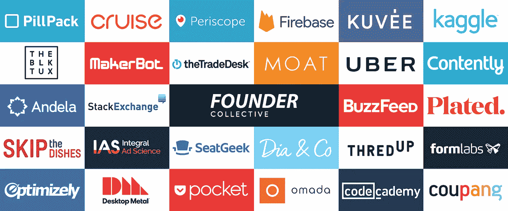

# 为什么我要加入方正集体

> 原文：<https://medium.com/hackernoon/founder-collective-f79d7be702be>

> “不管你是谁，你都需要……当事情变得糟糕透顶的时候——当你命悬一线，而你只有一个电话的时候——一个可以打给你的人。”——本·霍洛维茨，关于硬物的硬物。

我很高兴也很荣幸在过去的七年里建立了早期的[科技](https://hackernoon.com/tagged/technology)公司。我已经筹集了近 1000 万美元，卖掉了一家公司，当我需要使用我的“一通电话”时，[创始人](https://hackernoon.com/tagged/founder) Collective 的电话就会响起。他们总是回答。你可能会问，他们为什么要回答？

*保护自己大量投资的股份？他们不是投资者。*

*赢得融资分配？他们没有看到我的第一家公司，也没有投资我的第二家公司。*

那么，为什么呢？因为他们经历过自己的创业之旅。见识了一些事情。但最重要的是:我相信这是因为埃里克、大卫和迈卡真心在乎。

他们建立的[风险基金](https://techcrunch.com/2016/11/30/founder-collective-easily-finds-75-million-for-fund-three/)Founder Collective 有一个简单的使命,“成为种子期创始人最一致的基金”这对我来说意味着什么:

*   成为所有创始人中最有帮助的投资者。
*   与创始人保持一致(精神上和结构上)。
*   随着公司的发展而稀释。
*   保持苗条。
*   保持谦逊。桌子的另一边更难。
*   要知道 VC 并不是所有问题的正确答案——它是一种可怕的药物。
*   创业成功[并不总是意味着 IPO](https://techcrunch.com/2017/05/16/theres-no-shame-in-a-100m-startup/) 。
*   不要追主题。跟随有远见的企业家走向怪异和奇妙。

在方正集体，没有什么是禁区。硬科技？(巡航)奇怪的市场？(优步)管制市场？(药丸包)全新的业务？(BuzzFeed)。他们做所有的事情。

这似乎是一个非常简单的前提。但是私下里，我已经和足够多的创始人谈过了，我可以肯定地说:这种方法非常罕见。

因此，我非常高兴地告诉大家，**我将加入方正集体**，成为他们投资团队的第五名成员。我将在他们的旧金山办公室工作，在那里我将投资并为下一波创业者服务。

如果你是一个早期的公司创始人，我会这么说:

我还没有上市过一三家公司。我还没老到可以有几十年的山谷“调味”我能提供的很简单:我经历过斗争。

我比以往任何时候都更相信科技以非凡的方式塑造我们的世界。我把想象力留给你——迫不及待地想看看你创造了什么。