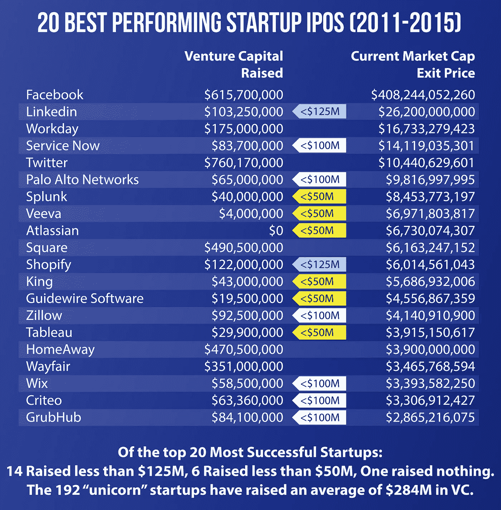
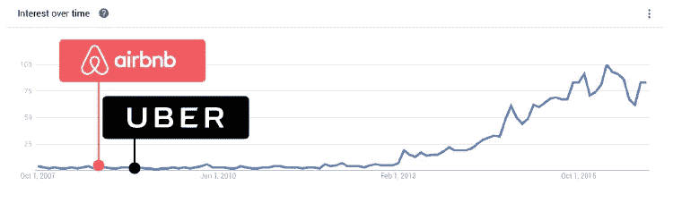
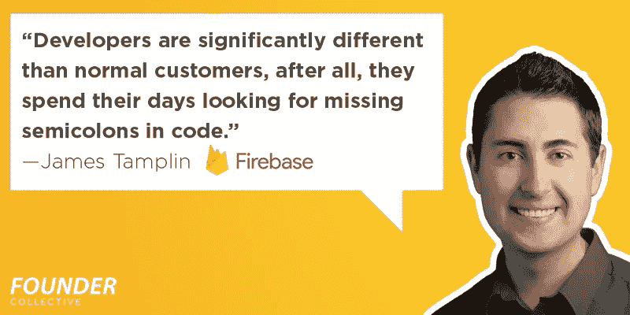
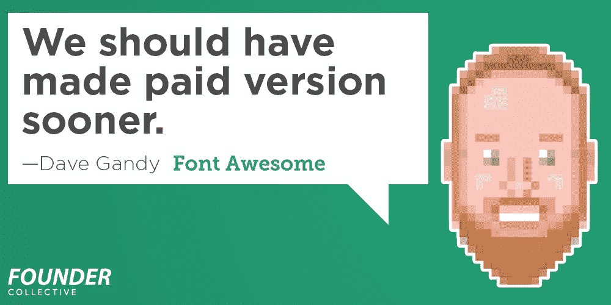
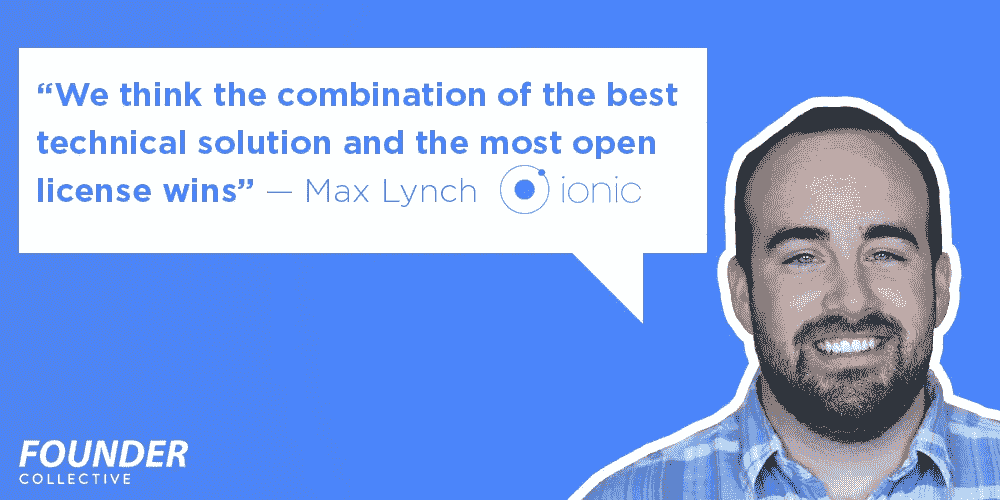
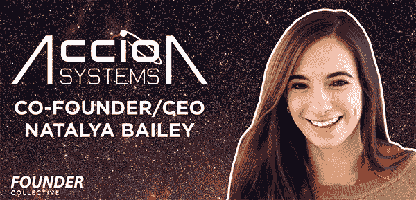
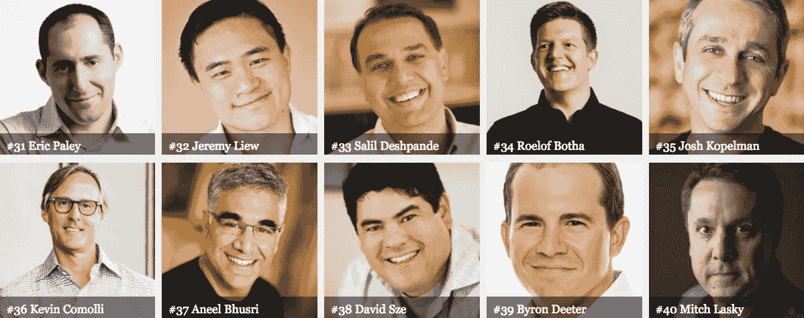

# 创始人集体:好斗与奇怪——2017 年 6 月 2 日

> 原文：<https://medium.com/hackernoon/founder-collective-scrappy-strange-june-2-2017-636ed7af20b7>

这原本出现在我们的时事通讯中，刺儿头&奇怪。 [*在这里报名吧！*](http://eepurl.com/crytmH)

我们的使命是成为种子期创业者最一致的基金。我们相信最有趣的创业公司正在探索尚无法用科技术语描述的怪异而奇妙的空间。我们还认为，拥有更多的资本并不会让一家初创公司更有可能成功。这些想法将推动这份简讯的内容(以及对我们投资组合公司的热爱！)

我们的希望是，我们可以利用这份时事通讯来帮助讲述那些使用杂乱无章的策略来主导有时很奇怪的市场的公司的故事。你可能想知道，我们所说的“好斗”和“奇怪”是什么意思？

斗志昂扬=高效的企业家精神:创业公司需要的资金比人们想象的要少。资本的有效利用将为企业家带来更好的回报。这篇时事通讯将[突出那些以明智的方式利用资本的公司](https://techcrunch.com/2016/10/15/overdosing-on-vc-lessons-from-71-ipos/)并为你分析他们的经验教训。

**奇怪=创始人追求奇怪的&绝妙的想法:**最好的、最具颠覆性的想法[在推出](https://hackernoon.com/startups-shouldnt-chase-the-latest-tech-themes-62be1cf086b)时很少有意义。我们将分享我们如何评估看似奇怪的新想法的想法，初创公司在追求这些想法时面临的挑战，以及一些我们觉得有趣的发展。

我们希望这对您有用。如果你喜欢，请转发给朋友。如果你能想到任何改进的方法，请告诉我们。

# **刺儿头**

管理合伙人埃里克·佩利和内容总监乔·弗莱厄蒂回顾了 2011 年至 2015 年间的所有科技公司 IPO，发现创业公司筹集的风险资本金额和最终成功之间没有正相关关系。事实上，从长远来看，融资较少的公司比融资较多的同行表现更好。

想想这个。在过去五年中最成功的 20 家创业公司中，14 家融资少于 1 . 25 亿美元，6 家融资少于 5000 万美元，1 家零融资。相比之下，192 家活跃的独角兽公司平均筹集了 2.84 亿美元的风险投资。

重要的是要注意，变得“资本高效”永远不会太晚。今夜酒店首席执行官山姆·尚克分享了他如何在短短七个月内将他的公司从不可持续的 T2 转变为盈利的剧本。

# **奇怪的**

## **1。什么样的“主题”会预测到优步或 Airbnb？**

在方正集团，我们自豪地“反主题”当人们开始谈论一个“主题”的时候，在那个领域开始一个大生意可能已经太晚了。例如，从 Airbnb &优步成立到人们开始谈论“共享经济”已经过去了五年 FC 管理合伙人大卫·弗兰科尔在一篇文章中探讨了这一观点， [*为什么今天的科技主题不能很好地预测明天热门的创业公司*](https://hackernoon.com/startups-shouldnt-chase-the-latest-tech-themes-62be1cf086b) 。

## **2。观看阿尔法极客**

大约十年后，极客们周末做的事情往往会成为其他人工作时做的事情。[来自我们投资组合公司 Stack Overflow 的新数据](https://stackoverflow.blog/2017/02/07/what-programming-languages-weekends/)有助于准确说明这在软件方面可能意味着什么。事实证明，Ruby on Rails 作为周末黑客的最爱正在下降，而 Haskell(大数据)、WebGL(基于网络的 3d 图形)和低级汇编语言越来越多地在晚上和周末使用。这些语言会成为下一波创业的关键驱动力吗？

## **3。“复古技术”的兴起**

2016 年，黑胶唱片销量超过 MP3。电子书销量下降了 17%，而[纸质书销量上升了 8%。](https://www.theguardian.com/books/2017/apr/27/how-ebooks-lost-their-shine-kindles-look-clunky-unhip-) [27 个中等城市](https://www.nytimes.com/2017/03/07/us/omahas-answer-to-costly-potholes-go-back-to-gravel-roads.html)正在拆除沥青，回到砾石路，以放弃重铺的成本。这是什么驱动的？GrandTheftAuto V 是去年第六大畅销游戏，最初于 2013 年发布，它可能会提供一个线索，说明为什么老派技术比我们预期的时间更长:

> *现在的人打游戏都打到四五十岁了；他们有钱购买新硬件，但他们可能没有时间或意愿去寻求新的游戏体验。可靠的订书钉的更新版本越来越有吸引力。*

基于这些数据点，可能值得考虑将更多注意力放在了解客户的使用情形上，而不是尝试最新、最棒的技术。

## **4。【无聊的人有福了】**

录像带、垃圾车和离婚旅馆有什么共同点？它们都是乏味的产品类别，最终产生了数十亿美元的业务。[管理合伙人 Micah Rosenbloom 解释了为什么创始人不应该等待他们对其充满热情的想法](https://hackernoon.com/blessed-are-the-boring-9fb800eca775)，而是应该将他们对问题或方法的热情带到一个尚未开发的市场。

# **方正集体新闻**

## **开源社区建设的艺术**

我们很幸运投资了一批为现代网络开发设定标准的公司。我们询问了他们中的三个人，关于他们如何将开发者变成忠实用户，他们如何围绕开源社区建立业务，以及他们推广新工具的秘密。阅读他们的故事:

在 [Medium](/@foundercollective) 上关注我们，阅读我们关于如何将学术研究转化为创业的下一个系列，包括对[Accion Systems](http://www.accion-systems.com/)联合创始人/首席执行官/火箭科学家、 [Natalya Bailey](https://twitter.com/natalya926) 的采访。

## 【2017 福布斯迈达斯排行榜

埃里克·佩利连续第二年登上福布斯顶级风险投资家排行榜。米卡·罗森布鲁姆登上了福布斯新兴投资者名单。我们很激动也很荣幸能与如此令人印象深刻的同行一起被列入名单，但我们敏锐地意识到，我们的成功是我们惊人的投资组合公司的结果，请阅读下面的一些内容！

**投资组合新闻**

*   数据科学的领导者 Kaggle 被 Google 收购
*   [Moat](https://www.wsj.com/articles/oracle-to-acquire-digital-measurement-firm-moat-1492555238?utm_content=buffera3b7f&utm_medium=social&utm_source=twitter.com&utm_campaign=buffer) ，领先的数字测量云公司，被甲骨文*【华尔街日报】*收购
*   [口袋](http://time.com/4549647/best-apps-year-2016)曾是年度*时代杂志* app，几个月后[被 Mozilla](https://blog.mozilla.org/blog/2017/02/27/mozilla-acquires-pocket/) [ *时代】*收购
*   [SeatGeek](http://www.billboard.com/articles/business/7767466/seatgeek-buys-israeli-toptix) 融资 5700 万美元收购 TopTix [ *Billboard]*
*   [Dia &有限公司](http://fortune.com/2017/02/10/fashion-week-dia-plus-size/)在过去 12 个月里收入增长了 35 倍，并从红杉[ *《财富》]* 融资 2000 万美元
*   [Bedly](https://techcrunch.com/2017/04/20/bedly-2-7-million-accomplice-founder-collective/) 筹集 270 万美元，让租房变得不那么可怕*【TechCrunch】*
*   [蓬勃发展](https://www.fastcodesign.com/90109241/this-google-backed-data-viz-platform-was-designed-for-non-coders?partner=rss&utm_content=buffer6b4f2&utm_medium=social&utm_source=twitter.com&utm_campaign=buffer)为记者和机构提供了一种处理数据的方式，无论他们的技术技能如何。[ *快公司]*
*   [Kuvee](https://www.kuvee.com/) 现已出货葡萄酒，全国范围内*Kuvee】*
*   [桌面金属](https://www.technologyreview.com/s/604088/the-3-d-printer-that-could-finally-change-manufacturing/)，最终可能改变制造业的 3d 打印机*科技评论*
*   MissionU 是一所大学的替代品，只有当学生找到工作时才能得到报酬
*   [F](https://t.co/ayxvsdo2Uf) [irebase](https://www-staging.firebase.com/blog/2014-07-11-one-million.html) 现在可以运行超过 100 万个实时应用[ *Firebase]*
*   [Joymode](https://www.pastemagazine.com/articles/2017/04/klouts-co-founder-started-a-new-business-renting-o.html) ，一家设备租赁服务公司希望你用更少的设备做更多的事情
*   [JoyTunes](https://twitter.com/joytunescom/status/808604239907999748?lang=en) 苹果在 iTunes 商店推出创新音乐应用[ *苹果]*
*   [安德拉](http://www.usatoday.com/story/tech/2016/10/31/us-tech-firms-turn-africa-based-developers)最近在尼日利亚拉各斯的办公室接待了新投资者马克·扎克伯格[ *《今日美国》】*
*   [奥马达健康](http://www.mobihealthnews.com/content/study-shows-seniors-risk-diabetes-and-heart-disease-lose-weight-reduce-healthcare-costs)发表了第五项临床研究，验证了他们的糖尿病治疗方法[ *MobiHealthNews]*
*   [form labs](https://formlabs.com/fuse17/)首届用户大会，FUSE 2017 于 6 月 6 日在剑桥举行*【form labs】*
*   [ough](https://charlierose.com/videos/29634)创始人威尔·阿迈德接受查理·罗斯[ *PBS]* 采访，谈论体育科技的未来

> [黑客中午](http://bit.ly/Hackernoon)是黑客如何开始他们的下午。我们是 [@AMI](http://bit.ly/atAMIatAMI) 家庭的一员。我们现在[接受投稿](http://bit.ly/hackernoonsubmission)并乐意[讨论广告&赞助](mailto:partners@amipublications.com)机会。
> 
> 如果你喜欢这个故事，我们推荐你阅读我们的[最新科技故事](http://bit.ly/hackernoonlatestt)和[趋势科技故事](https://hackernoon.com/trending)。直到下一次，不要把世界的现实想当然！

