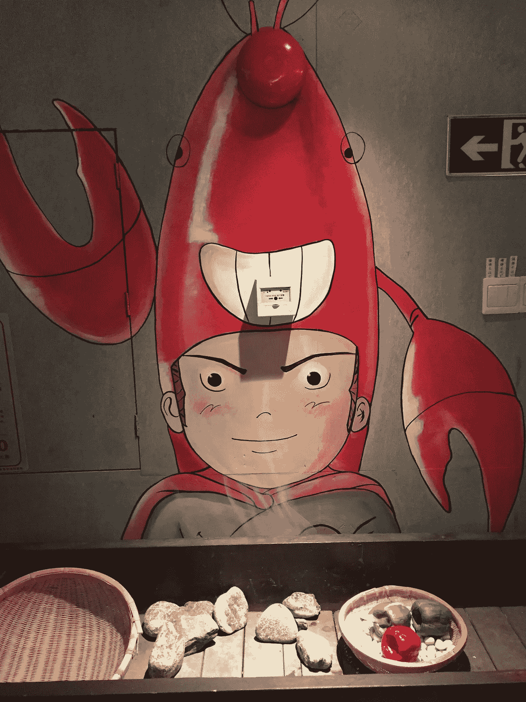

# 创始人抑郁症

> 原文：<https://medium.com/hackernoon/founder-depression-f264d49f6332>

这是一个半严肃的帖子，我认为这是一个严肃的问题。

## 简短版:

作为一名创始人，有时在情感上很难，会形成习惯，会让你兴奋一段时间，但它会变得更好，谈论它=]

## 完整版:

创始人是鸭子。从表面上看(对媒体、公众、利益相关方而言)，我们看起来很冷静，镇定自若地穿过池塘向我们的目标滑行。然而，在表面之下，我们似乎在疯狂地踢着、喊着、尖叫着，想去任何地方！

这是奇怪的部分，我注意到作为创始人，我们实际上很少谈论拳打脚踢、大喊大叫的部分。尤其是当我们个人情绪低落的时候。

创业社区是惊人的，他们的支持是独一无二的。有问题，需要联系或介绍，人们会在一个令人难以置信的 pay it forward 社区中竭尽全力帮助你。

但是，我认为，当世界的重压让创业者感到沮丧时，他们显然很少站出来说话。

这让我很困扰。作为一个以前处理过抑郁情绪时期的人，我理解与他人交谈，无论是朋友、家人还是专业帮助，是清除困扰你头脑的迷雾的最佳/唯一方式。

创业是艰难的，我不会有任何其他方式。我们常常无法想象一个不以这种方式生活的世界。但重要的是要明白这会让你沮丧，当你沮丧时，你不会因为和别人谈论这件事而丢面子。

妈的，我想即使你的投资者也更希望你带着情绪问题去找他们谈，而不是你陷入抑郁的困境，在 6 个月内情绪崩溃，然后再也没有消息。

因此，我鼓励你们所有人互相交谈，尤其是关于个人的低落部分。正如一位非常明智的朋友曾经告诉我的那样，“这些事情是马拉松，不是短跑”。这是我处理压力的方式。

如果你感觉糟透了，就说出来。当有人问你最近怎么样时，不要说“很好”。

> [黑客中午](http://bit.ly/Hackernoon)是黑客如何开始他们的下午。我们是 [@AMI](http://bit.ly/atAMIatAMI) 家庭的一员。我们现在[接受投稿](http://bit.ly/hackernoonsubmission)并乐意[讨论广告&赞助](mailto:partners@amipublications.com)机会。
> 
> 如果你喜欢这个故事，我们推荐你阅读我们的[最新科技故事](http://bit.ly/hackernoonlatestt)和[趋势科技故事](https://hackernoon.com/trending)。直到下一次，不要把世界的现实想当然！

