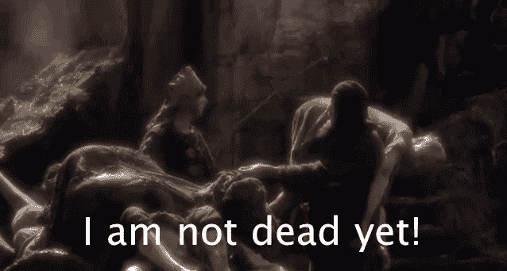
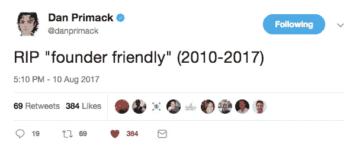
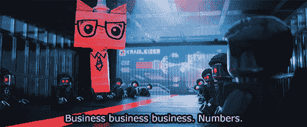
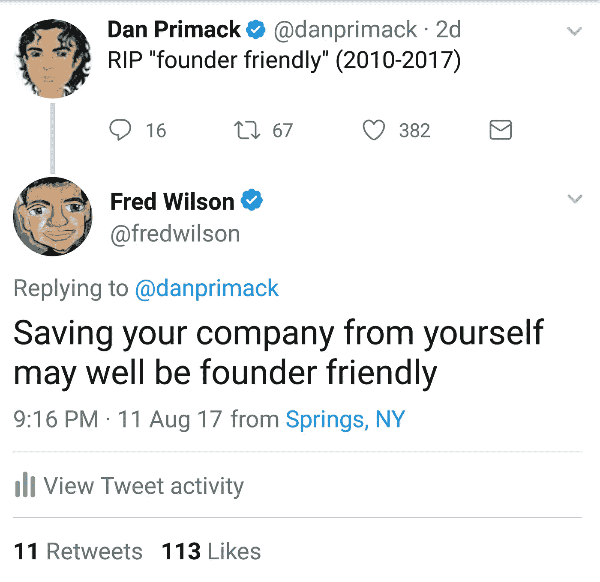
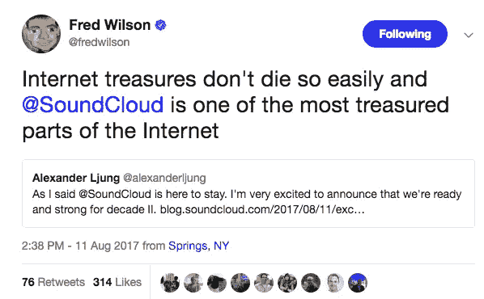

# 方正友好没有死

> 原文：<https://medium.com/hackernoon/founder-friendly-is-not-dead-fb002f281102>

随着优步的戏剧像小报新闻一样继续在我们面前展开，它最终升级为早期投资者起诉创始人。谣言、泄露、证实和猜测猖獗，因为他们是世界上估值最高的私营公司，投资者有数十亿美元的股份，我们真的处于未知领域。我肯定有人正在试图获得这部电影的版权…

我真的不太担心它，因为它是后期阶段，我处理早期。然而，当一位顶级行业记者(他披露了这起诉讼的故事)在推特上说，基于字面上的独角兽问题,“创始人友好”已经死了，我很担心。

[https://twitter.com/danprimack/status/895754344364216320](https://twitter.com/danprimack/status/895754344364216320)

虽然我肯定他是开玩笑的，但他的一些回复是认真的，我担心这可能会改变一些投资者的心态。我只能从我早期几轮增长的经历来说，所以基于这一点，我们(和我们投资的每个人)心里总是有创始人。是的，我们这样做是为了赚钱，但从实际和道德的角度来看，我们和其他人一样，也是为了确保创始人受到激励。当然，这显然是在一个完美的世界里。

去年，我们几乎不会投资一家初创公司，因为创始人将多张票据转换成一轮有价票据，会被严重稀释。这对于他们需要的下一轮来说尤其如此，我们向他们提到了这一点，他们知道，为此做了计划，但并不在乎，因为他们想看到这一切结束。

那么，还有哪些条款能让投资者和条款对创始人更友好呢？

*   早期的估值总是很棘手，因为当一家初创公司还在生存的时候，你如何确定它的价格？我们的平均 pre 为 500 万美元，这似乎在中间，但如果再低，创始人可能会卖得太多，或者卖得太高，你可能会面临下跌等风险。
*   行权 4 年是标准。这基本上是为了确保创始人不会带着他们所有的股份随时离开——他们需要随着时间的推移赢得这些股份。也许你可以根据他们已经工作的时间给他们几个月的回授期，给他们一个更大的悬崖(大块股权)或者设置绩效激励。
*   1x 清算权是标准的，但我们以前也见过 2x 和其他权利。这基本上意味着，当公司清算时(不管是好是坏)，投资者首先得到回报，要么是他们的投资，要么是承担风险的两倍。假设结果不是正面的，投资者首先获得报酬，然后创始人和员工获得剩余的报酬(如果有的话)。
*   创始人早期的薪水通常在 5 万美元到 10 万美元之间，尽管有些人在更大一轮融资之前确实在为血汗股权工作。
*   按比例分配权利在早期应该是标准的，但有时不是——这在某种程度上几乎是对投资者友好的。然而，即使你有合法的权利，我们也被新的资金排挤和剥夺了，但因为我们增加了价值，而且对创始人友好，他们为我们而战，让我们进入。
*   董事会。这是一个更大的话题，是优步现在面临的，对公司有更直接的控制，所以我将在下面详细阐述。

# 董事会

Basically every board meeting

对于一些正在进行种子期的早期创业公司，会成立一个董事会。它通常由 3-5 人组成(多数决定)，包括一两个创始人，通常是主要或最大的投资者，以及由创始人选择的独立人士。要明确的是，顾问委员会是非常不同的，因为他们实际上对你的公司没有真正的权力，他们只是“建议”你。

董事会通常每季度召开一次会议，了解最新情况，做出一些决定，并对一些事情进行投票。在种子阶段，我没有听说过太多的问题(我不在任何董事会)，直到你开始筹集你的 A 轮或更多，当数百万美元处于危险之中时，董事会扩大和/或成员更换。因此，让我们试着想象一下，作为优步董事会的一员，有 8 名成员(扩大到 11 名)，顶级风投、创始人和专业人士，其中一些人实际上拥有数十亿美元的股份。

2011 年，Benchmark 以 6000 万美元的估值领先于 1100 万美元的 A 轮融资，这意味着仅 6 年时间，它们的账面投资就达到了 1000 倍。假设他们投入 500 万美元，根据比例、稀释和后期资本发生的其他疯狂的事情，这些股份大约值 50 亿美元(50 亿美元)。自从那次投资以来，他们已经从几乎所有人那里筹集了 100 亿美元，所以我敢肯定他们的资本表等相当复杂，尤其是在没有首席财务官的情况下。

目前，他们已经对创始人 Travis 提起诉讼，Travis 已经被踢出了公司，原因有很多，其中之一是“诱骗”他们同意将董事会从 8 人增加到 11 人。这是巨大的，因为如果他们失去了董事会/投票控制权，他们可能会被踢出董事会(显然也已经问过)，对公司没有发言权，或以任何方式保护他们的投资。这可不好。

那我为什么要告诉你这些？因为这和创始人友好已经没有关系了。这些问题的规模如此之大，我几乎无法理解，但这不应该影响我们的投资方式，尤其是早期投资或对待创始人的方式。是的，基于它的结果，会有余波和影响，但我们仍然应该尊重创始人，不要假设这种情况会发生。

# 写这篇文章的时候，我读了一些额外的东西

第一条是弗雷德·威尔逊第二天发给丹·普里马克的推特。

我强烈推荐你阅读他的文章，基于他荒谬的经验[http://avc.com/2017/08/founder-friendly/](http://avc.com/2017/08/founder-friendly/)

与此同时，弗雷德也是心爱的 Soundcloud 的董事会成员，该公司刚刚以 1.5 亿美元(之前为 7 亿美元)的价格获得了 1.7 亿美元的投资。他们刚刚更换了公司的创始 CEO(成为董事长)，这只有董事会才能做到，我敢肯定这并不容易。

[https://blog.soundcloud.com/2017/08/11/exciting-news-future-soundcloud/](https://blog.soundcloud.com/2017/08/11/exciting-news-future-soundcloud/)

最后，不幸的是，我非常尊敬的另一位顶级记者 Erin Griffith 写了一篇关于创始人友好的文章。马克·扎克伯格(Mark Zuckerberg)通过股票控制公司的例子令人惊讶地发现，创始人也在做同样的事情，但不幸的是，迄今为止还没有取得公开成功。尽管我确实同意一些创始人需要严厉的爱和治理，但毫无疑问，其他人被溺爱，让他们觉得自己很特别，这肯定会引起问题。

我真正希望确保不会发生的是，投资者现在感到害怕，主动提出对创始人不太友好的条款。我们不需要纵容他们，但也不要假设所有这一切都将发生，并主动试图阻止它——评估每个投资机会并采取相应行动。如果基于风险、创始人、行业和牵引力，某些术语是必要的，那么就尽一切办法争取它们，否则就把它们彼此分开对待。

做生意很难，有时你需要做出并非所有人都喜欢的决定。我半开玩笑地说，出于无数的原因，我从来不鼓励任何人创业，但我们创业是因为你，所以我想确保这不会让任何人气馁，我们仍然可以友好相处。