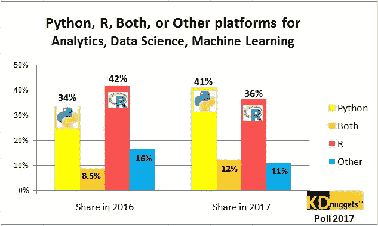
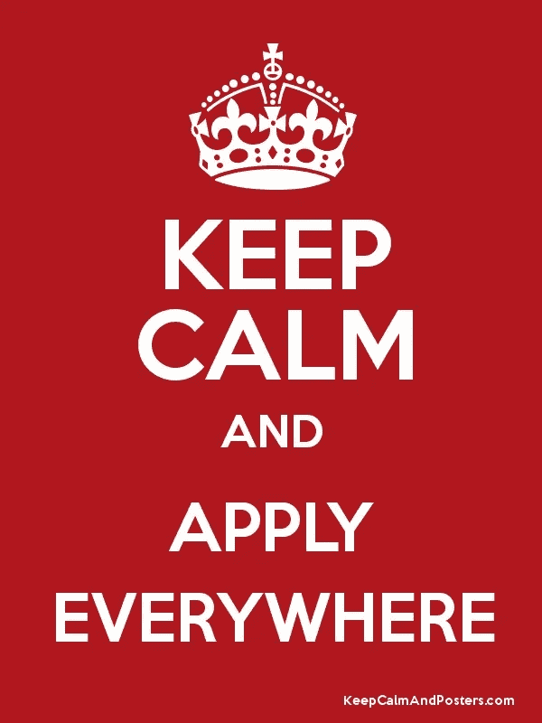

# 寻找数据科学家角色的四个经验教训

> 原文：<https://medium.com/hackernoon/four-lessons-learned-while-hunting-for-a-data-scientist-role-3e1bf05b5440>

在过去的两个月左右的时间里，我花了很大一部分时间进行求职活动，更具体地说是与数据相关的工作(数据科学家和机器学习工程师)。我真的觉得这次经历让我受益匪浅，尽管也很累。一路上我犯了很多错误，并试图在我做的每一个应用程序中提高自己，所以我认为分享这些经验对某人来说是有价值的。

编辑:为了让帖子更有价值，我认为分享我的背景很重要。请记住，我刚刚获得计算机工程学士学位。你可以在我的 [linkedin](https://www.linkedin.com/in/joaogris/) 中找到更详细的信息。

# **第一课:变得实用**

对于一些人来说，这应该是显而易见的，但是让我告诉你一个关于它的故事。在我的第一份工作申请中，我几乎完成了技术面试(主要是统计玩具问题)，看起来我很适合公司文化，但在过程的最后一步(2 天的内部试用)，我收到了负面反馈。这个职位非常侧重于商业(像大多数 DS 角色一样)，我更担心我在试验中面临的问题的理论方面(在他们说出来之前，我对这一点完全一无所知)。

在收到这个反馈后的几天里，我变得相当沮丧，但只有在极少数情况下，你才有机会收到关于你技能的坦率的意见，并有机会提高自己。这件事让我意识到我实际上是多么“不切实际”。我认为原因是我的心态基本上是“学习一切”。但理想的情况是，当你学到足够多的知识去找工作时，你必须改变你的心态，去“应用并创造价值”。

我总是对自己说“只有在你学习了更多的技术之后，再去参加 Kaggle 竞赛”或者“尝试新的工具，而不是完成一个个人项目”。但是我怎么强调都不为过，**参加**一些比赛。如果你把事情做对了，Kaggle 会是一个非常友好的知识来源。我的建议是学习 R 或 Python(我更喜欢 Python，因为它是通用的，但有些人更喜欢使用 R)的[数据科学](https://hackernoon.com/tagged/data-science)的基础工具，并开始探索非常基础的比赛教程，如[泰坦尼克一号](https://www.kaggle.com/c/titanic)。

Data Science Wars!

之后，参加一个积极的竞赛并尝试一下，如果你不知道如何开始，去论坛，人们在那里分享惊人的信息。此外，随着 Kaggle 内核(由 Kaggle 托管的 jupyter 笔记本)的加入，您可以获得这些问题的优秀入门解决方案，并且您可以通过阅读代码学到很多东西。

更令人惊奇的是,**冠军通常会分享他们在过去比赛中使用的策略**,所以你真的可以向最优秀的人学习！

底线是:建立一个项目/竞赛组合！这不仅会帮助你更好地应对公司将向你提出的技术挑战，还会丰富你的简历(是的，复数)。说到简历…

# **第二课:申请每一个你感兴趣的职位**

这确实是一个值得学习的问题。很难在应用程序的质量和数量之间保持平衡。我最初的策略是重视数量，每个职位只用一份简历。但我开始觉得这很没用，所以我为我申请的每份工作定制了我的简历。显然，转换率(我所说的转换率是指至少进入技术挑战阶段)提高了，但机会的数量却减少了。

最后，我意识到我不需要超过半打的简历，每一份都突出我经历的某些部分。让我给你一些想法:数据职位更侧重于应用研究价值的出版物和/或研究经验。机器学习工程师非常不同，除了 ML 技能，你必须展示强大的后端开发经验(RESTful APIs，也许一些 DevOps 和云)。对于侧重于商业的职位，也许你应该证明你有很大的潜力，良好的沟通和领导技能。

所以不要偷懒写了至少三份不同的简历就开始找工作，这就留下了另一个问题，你去哪里找这些工作？

# 第三课:现实一点

如果你还没有意识到这一点，让我告诉你，数据相关的优惠是**极具竞争力的**接收。如果你没有理学硕士或博士学位(显然与 DS 相关的工作)，并且居住在美国和欧洲以外的国家，你可以申请的国家非常有限，除非你有很多专业经验。相信我，我试着向这些国家的许多公司申请，通常我甚至没有收到反馈，或者反馈仅仅是“对不起，我们不能提供签证”。

但我发现有两个国家是个例外，如果你搜索得好，你可以在那里找到更容易获得的初级职位(使用 LinkedIn):德国和荷兰。他们非常灵活地允许外来人员在那里工作，我认为值得在这些国家尝试一下。

最后一条，我觉得是最容易被忽略的。

# 第四课:了解你自己

如果你像我一样，你更喜欢在创业公司和更快节奏的公司工作，而不是官僚主义和重流程的公司。特别是对于创业公司来说，文化和价值观对雇佣你的人来说非常重要。技术面试和带回家的挑战非常重要，不要误解我的意思，但同样重要的是思考你在职业生涯甚至生活中想要优先考虑什么。

除了技术测试，我还与人力资源人员、数据科学家、首席技术官、首席运营官和首席执行官进行了数百次关于文化和价值观的对话。这些人往往会问一些关于你的非常深刻的问题，你的决定，你为什么离开你以前工作过的公司。如果你不了解自己，你就不能诚实地回答这些问题，最终看起来像一个非常肤浅的人。

每天花些时间反思这些事情，以及在你以前的工作环境中，你喜欢什么或不喜欢什么。在你的第一次面试中，也许你没有很好地回答这些问题，但是通过足够的练习(这是我建议你申请很多工作的原因之一)，你会很好地回答招聘人员可能会问的几乎所有“软”问题。

我希望我的错误能对你找工作有所帮助。如果你认为这里有你不同意的地方，或者如果你想讨论或补充一些东西，请在下面留下你的回复。干杯！