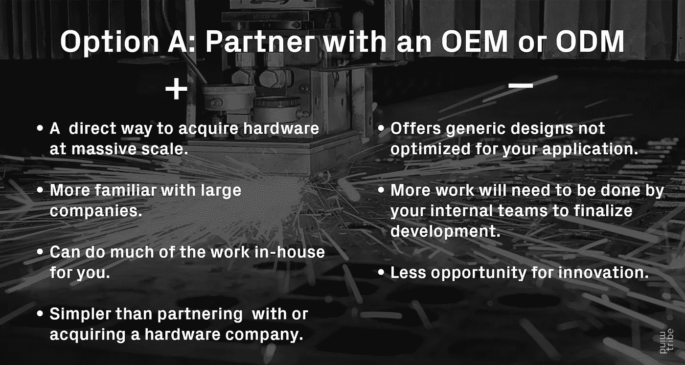
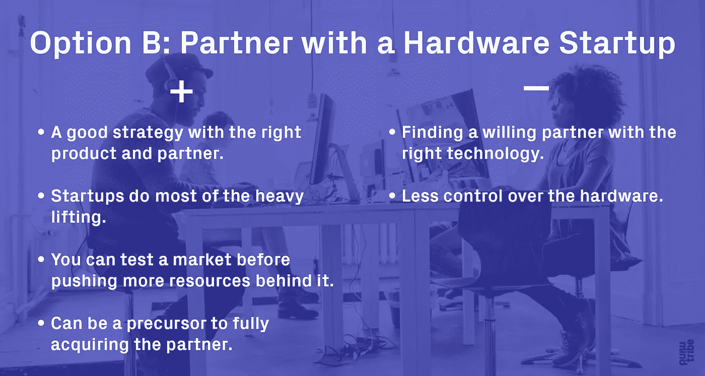
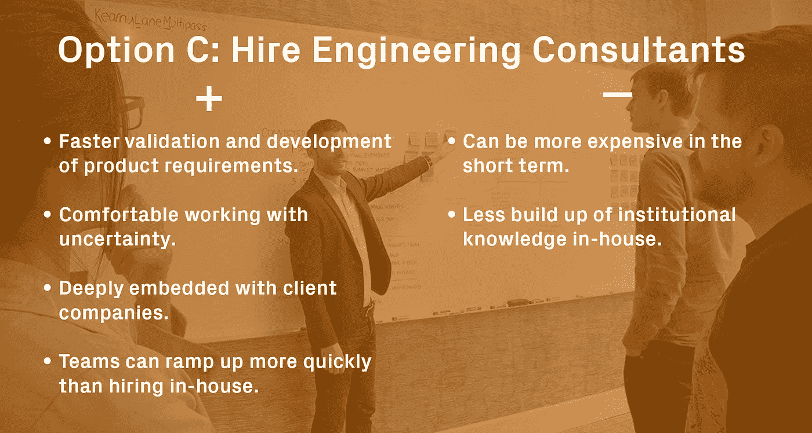
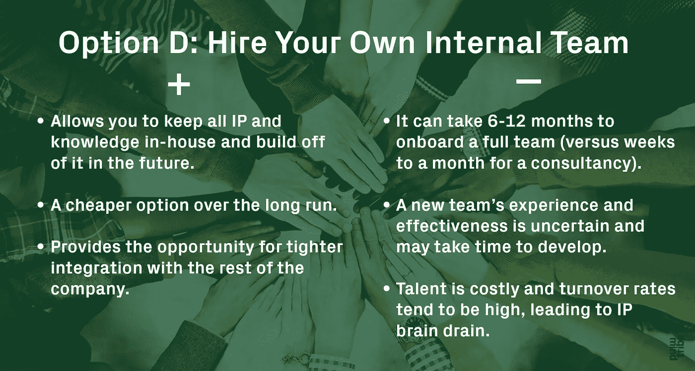

# 作为财富 500 强公司，打造物联网硬件产品的四种选择

> 原文：<https://medium.com/hackernoon/four-options-for-building-an-iot-hardware-product-as-a-fortune-500-company-6cbc39f596c9>

*本文原载于* [*Mindtribe 博客*](http://mindtribe.com/2017/09/four-options-for-building-an-iot-hardware-product-as-a-fortune-500-company/) *。*

*由 Tom Hsiu 导演——节目运营，*[*mind tribe*](http://www.mindtribe.com)*。*

技术现在触及每个行业。越来越多的消费者和客户正在寻找需要硬件创新或独立硬件产品的触觉或互联体验。从 Clorox 到 Ikea，Adobe 到 Johnson and Johnson，许多公司都在尝试联网设备。然而，许多世界上最大的公司在构建硬件方面毫无经验，即使他们正在考虑将硬件组件添加到他们的产品组合中。

那么，一家处于传统的非技术、非硬件领域的公司应该如何起步呢？

在 Mindtribe，我们与数百家公司合作过，包括数十家财富 500 强企业。我们已经看到硬件努力采取许多不同的形式。

以下是我们见过的最常用的成功方法:

## 选项 A:通过与 OEM 或 ODM 合作利用现有硬件

OEM(原始设备制造商)已经有了他们开发和制造的产品目录。如果这些产品中有一个符合或几乎符合您的硬件需求，那么 OEM 可以快速重新命名该产品或根据您的要求对其进行稍微的定制。

另一方面，ODM(原始设计制造商)类似于 OEM，只是它们提供更多的内部工程能力，并且可以进行更复杂的定制。

为了与 OEM 或 ODM 合作,《财富》500 强公司仍然需要建立一个内部团队来管理项目(尽管这个团队比从头开始开发硬件要小得多)。

内部团队可能包括项目管理、运营、产品安全、支持、监管和一些后端工程师，他们与 OEM 合作，将任何服务与现有数据系统集成。

Pure Digital 是 Flip Video 的创建者，他们利用原始设备制造商提供早期的“一次性”数码相机服务。他们没有从零开始开发这些相机，而是利用原始设备制造商来采购他们的品牌相机。

## 选项 B:通过与硬件初创公司合作来利用现有的硬件

通过这种策略，财富 500 强公司可以授权现有公司(通常是专注于开发创新产品的初创公司)销售的硬件，并将其作为自己的品牌进行联合或更名。通常，该硬件合作伙伴甚至可能负责生产加速和产品支持，这两项工作都很重要，否则将需要内部运营团队来完成。

一家初创的硬件公司也已经开发了产品生态系统，包括后端和服务模型。然而，创业公司的产品通常是新的和未经验证的，创新是其成功的核心。

如果合作进展顺利，你可以走向收购。此类收购通常具有战略意义，并且应该符合公司的长期愿景。对于这类交易，金融和法律专家是整个过程的关键。大多数财富 500 强公司都熟悉这类服务的领先供应商。谷歌收购 Nest 时采取了这种方式，思科收购 Linksys 时也采取了类似的路线。

## 选项 C:通过雇佣工程和产品顾问从头开始构建

一家工程和产品咨询公司可以帮助一家大公司打造一款全新的创新产品。定义一个行业的新产品需要新的工程形式，并探索硬件未经证实的方面。咨询公司习惯于探索新技术和巩固新生的产品创意。

咨询公司也可以帮助启动你的内部团队发展，作为你的初始团队，同时帮助你雇佣你的内部团队，然后随着你的内部团队的发展逐步退出。当 Square 和 Tesla 的硬件团队还很小的时候，Mindtribe 就以这种方式协助他们。

## 选项 D:雇佣自己的内部团队，从头开始构建

一个内部工程和产品创新团队可以帮助一家财富 500 强公司探索创意、原型，并更好地了解哪些产品可以制造，以及它们如何影响企业的底线。

总之，对于大公司来说，有几种方法可以打造符合其目标和长期愿景的硬件产品。每个选项都应该仔细权衡——总要做出权衡——但无所作为不会产生任何结果。

随着越来越多的公司利用技术来更好地服务他们的客户，硬件将越来越多地在提高用户满意度和产品实用性方面发挥关键作用。