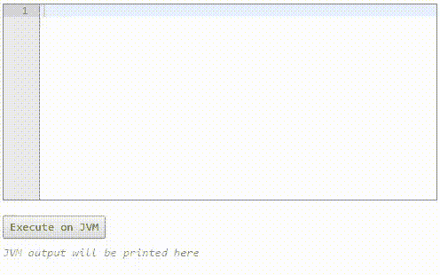
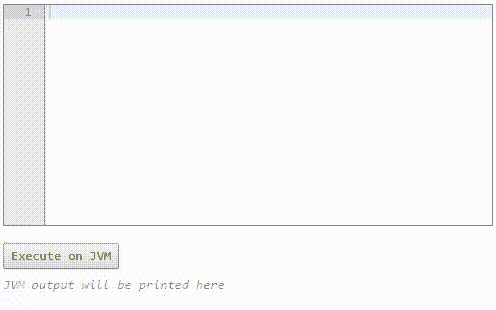
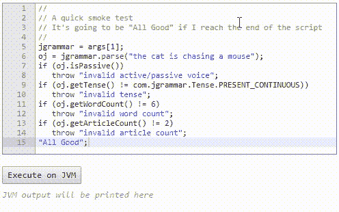
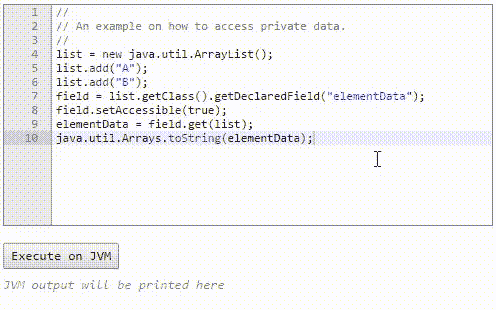

# 使用 nudge4j 的四个理由

> 原文：<https://medium.com/hackernoon/four-reasons-to-use-nudge4j-ac5757320660>

nudge4j 是一段 java 代码，可以让你从浏览器入侵你的 JVM。

在开发过程中使用它有许多正当的理由，其中之一是*肯定是*，因为它很有趣。

但是还有其他的。

## 理由№1 —教师的工具

使用 nudge4j 作为表达式评估器来解释你的儿子/女儿/朋友/同事给定的类是如何工作的。

## 理由№2 —演示你的 Java 库。

假设你写了一个 Java 库或者 API。然后在 nudge4j 中编写一段代码来看看它的运行情况。更好的办法是，邀请你的同事坐在你的办公桌前，让他或她提出一些改变的建议，并随时尝试一些事情。不需要重新编译任何演示代码，只需从浏览器播放。

## 原因№3——冒烟测试(又称为另一项健全性检查)。

除了你现有的单元测试、回归测试、集成测试……你可以保留*一小段 nudge4j 代码*来测试一些关键功能，也许是在最终发布之前。

如果成功了，那太好了。如果它失败了，你可以黑掉它，因为你已经在 JVM 中了。

## 理由№4——它比你想象的还要强大

如果你读过 1、2 和 3，你就知道 nudge4j 可以通过它的公共 API 与任何 java 对象进行交互。但是如果你想更深入呢？如果你想访问一个对象的私有字段呢？事实证明，稍微思考一下*和*，你就可以很容易地到达那里。有时候你可能根本不需要求助于调试器。

## 结论

开始吧，我给了你四个使用 [nudge4j](http://lorenzoongithub.github.io/nudge4j/) 的理由，这是我在结束了比平时更长的地铁旅程时想到的。如果你能想到更多，请告诉我。

感谢你阅读这篇文章。

> [黑客中午](http://bit.ly/Hackernoon)是黑客如何开始他们的下午。我们是 AMI 家庭的一员。我们现在[接受投稿](http://bit.ly/hackernoonsubmission)并乐意[讨论广告&赞助](mailto:partners@amipublications.com)机会。
> 
> 如果你喜欢这个故事，我们推荐你阅读我们的[最新科技故事](http://bit.ly/hackernoonlatestt)和[趋势科技故事](https://hackernoon.com/trending)。直到下一次，不要把世界的现实想当然！

