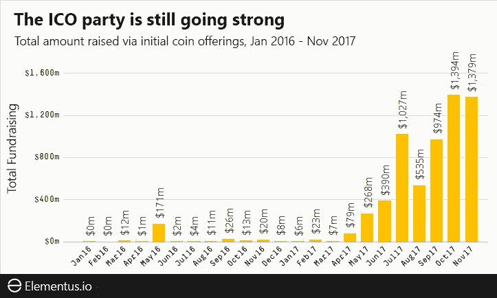
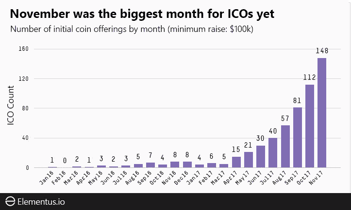
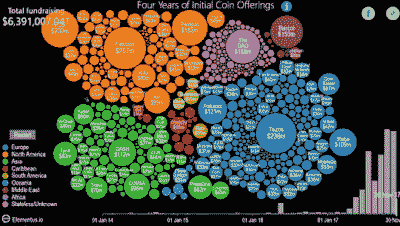

# 四年的代币销售，在一个图形中可视化

> 原文：<https://medium.com/hackernoon/four-years-of-token-sales-visualized-in-one-graphic-dbfe49fec4d7>

*Every token sale from Jan 2014 to Nov 2017 (credit:* [*Elementus*](https://elementus.io/)*)*

[*互动图文*](https://elementus.io/token-sales-history)/[/*Youtube*](https://www.youtube.com/watch?v=ac1P3GXkFxc)

*此图显示了从 2014 年初到 2017 年 11 月上月底，成功筹集至少 10 万美元的每一笔代币销售。底部的条形图显示了每个月筹集的资金总额(详情如下)。*

# ICO(又名代币销售)市场到底有多大？

这似乎是一个很容易回答的问题。毕竟，区块链是[开放的数据层](https://twitter.com/cburniske/status/939872258507624449)，它包含了每一笔交易的完整记录。然而，我们发现这个问题的答案出人意料地难以捉摸。

我们调查了网上代币销售的数据，发现了 100 多个代币上市网站。迄今为止，通过 ico 筹集的资金总额估计在 35 亿到 45 亿美元之间。

为什么会有这么大的差异？

据我们所知，所有这些估计都严格依赖于报告的数字——无论是 ICO 发行者本身还是另一个第三方。这种方法没有错。金融界的许多数据提供商都是通过这种方式收集信息的。然而，当实际数字可以直接从区块链获得时，为什么要严格依赖报道的数字呢？

我们决定直接从源头来估算 ICO 市场的规模。

这篇文章中的数字是基于我们自己对以太坊和比特币区块链的深入研究。我们搜寻了所有能找到的代币、众筹和 multisig 钱包。然后，我们确定了相应的所有者，并合计了捐赠资金的总额——要么来自区块链本身，要么来自募捐者的报告。

总的来说，我们估计迄今为止已经通过 ico 筹集了大约 64 亿美元——比其他地方报道的要高得多。

或许比筹资总额更令人惊讶的是一段时间内的趋势。正如《T21》报道的那样，ICO 市场并没有消亡。还在增长。

# ICOs 的崛起与崛起

这个图表和帖子顶部的一个是一样的，图标了。它显示了每月通过 ICOs 筹集的资金总额。

与通常听到的 ICO 派对即将结束的说法相反，11 月份的 ICO 筹款仅略低于上个月的高点。

目前每月超过 13 亿美元的运行速度超过传统早期融资的数倍。截至 7 月，天使投资和种子期风险投资每月不到 3 亿美元([高盛通过美国消费者新闻与商业频道](https://www.cnbc.com/2017/08/09/initial-coin-offerings-surpass-early-stage-venture-capital-funding.html))。

当你看看每个月结束的 ico 总数*时，这种趋势就更加明显了(最低加薪 10 万美元)。*

以此衡量，代币销售市场不仅依然强劲。它在加速！

11 月创下了 148 笔成交代币销售的新纪录，比上个月增加了 36 笔。

我们认为这个指标，即成功 ico 的数量，比筹资总额更能衡量市场活动。筹集的美元总额不仅容易受到加密汇率波动的影响，还可能受到少数异常值的驱动，可能无法反映真实的潜在趋势。例如，仅仅两个 ico([Tezos](https://www.tezos.com/)和 [EOS](https://eos.io/) ，它们分别筹集了 2 . 36 亿美元和 2 亿美元)就占到了 7 月份总筹资的近一半。

每个月完成的 ico 数量显示了一个更加清晰的趋势，一个没有放缓迹象的趋势。

要自己摆弄图形，请点击此处查看 [**交互式气泡图**](https://elementus.io/token-sales-history) 。

# TL；速度三角形定位法(dead reckoning)

*   迄今为止，ICOs 已经完成了约 64 亿美元的融资。
*   与普遍的看法相反，ICO 市场仍在增长。
*   11 月份的筹资总额比 10 月份的高点略有下降(13.8 亿美元对 13.9 亿美元)。
*   11 月创下了以 **148** 收盘的 ico 数量纪录。

*原载于 2017 年 12 月 12 日*[*elementus . io*](https://elementus.io/blog/token-sales-visualization/)*。*