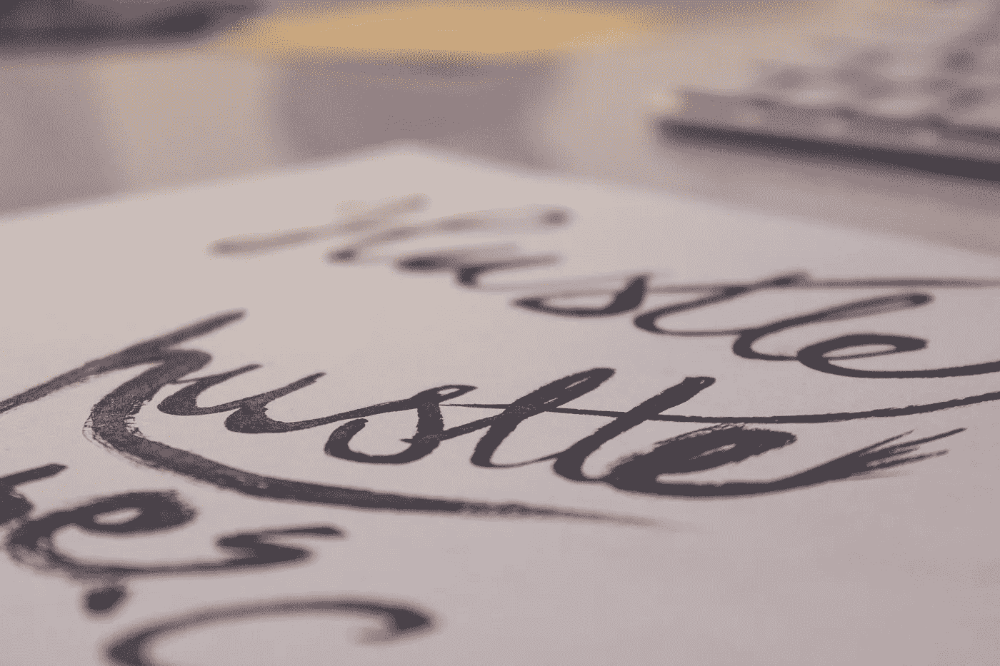

# 冒险进行了 14 天

> 原文：<https://medium.com/hackernoon/fourteen-days-into-the-venture-9278d6e83682>

## 现在 15 岁了。

*本帖最初发表于*[*【allisonmidorireilly.com】*](http://allisonmidorireilly.com/fourteen-days-into-the-venture/)

2015 年底，我决定在 2016 年再次尝试，开始我自己的[冒险](https://hackernoon.com/tagged/venture)，打造我自己的道路。最初，我计划每天(或每隔一天)写一篇博客，记录这段漫长、艰难和孤独的道路，尤其是因为关于旅程开始的信息很难获得。每个人都在成功后谈论，在他们成功后，最有可能的是，在其他人听说他们并想和他们谈谈他们正在做的事情后。

几乎没有人谈论早期，在有吸引力或产品适合市场或付费客户或投资之前。但是，我认为早期的那些日子是最值得谈论的。我认为重要的是公开一些日子有多糟糕，以及需要做多少工作来获得牵引力和产品营销配合。我认为我们真的应该谈谈，当没有顾客出现时，当你的产品不起作用时，当你的钱用完时，当别人告诉你你做不到时，你必须挖掘自己的潜力，才能坚持下去。

## 那我为什么不开始对话呢？

我没有一个好的理由。我不知道在那些我没有任何劳动成果可展示的日子里，我该写些什么。当我没有得到赞助协议，或者当没有人观看流媒体时，除了报道那些事情的发生，还有什么可说的？如果我真的开始写而不是找借口，也许我会想好该写些什么。

我现在明白，不知道写什么是一个可怕的原因，但现在开始总比不开始好，开始我认为应该更经常进行的对话。在我看来，这是一个更真实的对话，因为成功不是一蹴而就的，不管它在外面看起来有多好。我还认为，像这样的对话承认失败和失误是成功过程的一部分，而不是成功的对立面。

## 如果我们谈论的都是赢家，那么这说明了什么是失败？

不是所有的事情都会成功。不是每个人都赢。不是每个人每次都赢。并非每一步都是朝着正确方向迈出的一步。这并不意味着这些步骤是错误或糟糕的。这并不意味着那些没有顾客出现的孤独日子预示着任何个人的或永久的事情。那些感觉你在用头撞墙的日子是打造你自己道路的一部分，也是生活的一部分。事后看来，艰难的时刻更容易被推崇，并融入更大的成功故事中。但是，在那一天，没有后知后觉，这就是糟糕。

但是，失败和失误是可以的。只有当你选择让他们代表你时，他们才代表你是谁。

因此，在我能够把失败和糟糕的日子整齐地融入胜利的叙述之前，我要开始对话，记录下这次冒险中孤独的道路。我知道这需要很多努力和辛勤的工作。我知道伟大的事情不会在一夜之间发生。

我知道很多人会告诉我，我疯了，我应该退出，我做不到，这是不可能的等等。这些评论将会出现。摆脱所有这些说起来容易做起来难。坚持己见说起来容易做起来难。我写这篇文章并不是想进行这样的对话，因为我对自己和自己的能力产生了错觉。我在做这件事，也想做这件事，来展示不做一个人有多难。

> [黑客中午](http://bit.ly/Hackernoon)是黑客如何开始他们的下午。我们是 [@AMI](http://bit.ly/atAMIatAMI) 家庭的一员。我们现在[接受投稿](http://bit.ly/hackernoonsubmission)，并乐意[讨论广告&赞助](mailto:partners@amipublications.com)机会。
> 
> 如果你喜欢这个故事，我们推荐你阅读我们的[最新科技故事](http://bit.ly/hackernoonlatestt)和[趋势科技故事](https://hackernoon.com/trending)。直到下一次，不要把世界的现实想当然！

