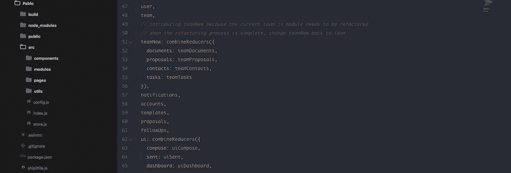
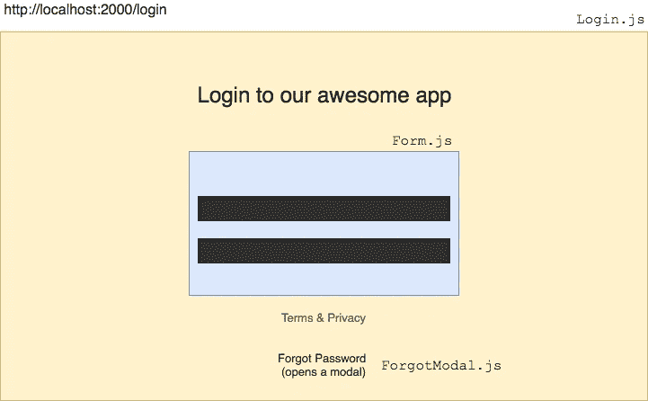
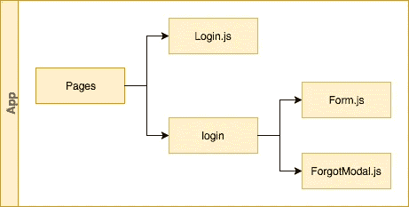
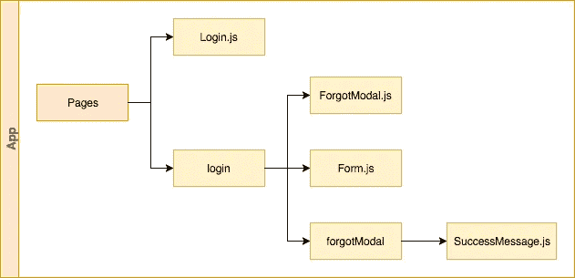
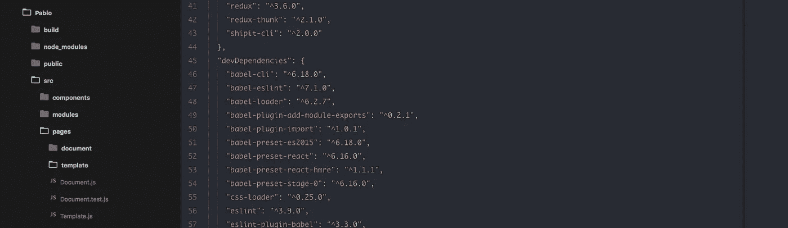
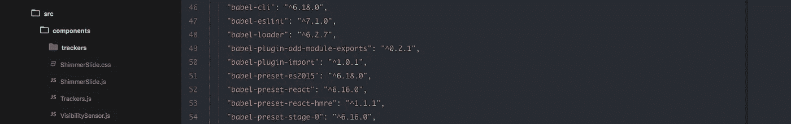
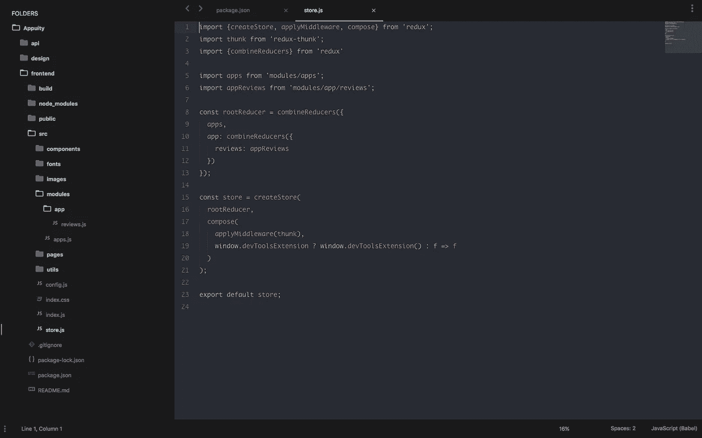

# 分形——一种无限尺度的反应式应用结构

> 原文：<https://medium.com/hackernoon/fractal-a-react-app-structure-for-infinite-scale-4dab943092af>

在与 [React](https://hackernoon.com/tagged/react) 和 flux ( [Redux](https://hackernoon.com/tagged/redux) )合作了超过 8 个重大项目(每个项目超过 100 个屏幕)之后，我们了解了一些关于 React 应用的事情。

随着时间的推移，一种构建项目的方式演变了，这是如此自然，以至于新的前端开发人员(几乎没有 React 经验)的入职变得轻而易举。

我们称之为分形。这是(并将永远是)一项正在进行的工作。

## **分形让你:**

*   关于文件位置的原因
*   管理和创建复杂的用户界面
*   快速迭代
*   并可重复缩放

分形的本质不是一套规则或惯例，而是可以总结为一个指导原则:**所有的单元都可以自我重复。**

# 应用程序布局

把你的 app 想象成一棵树(数据结构)，每个项目给树赋予一个新的形状，但是根节点保持不变。根节点是应用程序布局。这些显示在下面的截图中。

App Layout (Check the sidebar, it shows all the files)

*   **Pablo** 是产品的名称。
*   **build** 是所有构建好的文件存放的地方，除了需要部署的时候，你从来不碰它。
*   **public** 是你的*index.html*文件和< *脚本 src >* 资产去的地方。(在使用 create-react-app 时，它们会自动复制到构建中)
*   src 是你编码的地方。
*   **src.pages** 是根级组件，直接安装在一级路由上。(例如。如果您有一个名为/login 的路由，它装载了一个登录组件，那么 Login.js 将出现在 pages 目录中。
*   **src.modules** 处理你的状态(actions + reducers 使用 ducks 文件结构)。
*   **src.components** 有共享组件，如按钮、输入等。
*   src.utils 有 API 包装器、日期实用程序、字符串实用程序等实用程序。
*   config 是你存储环境变量的地方，比如 API 端点。不要把这个交给 git。
*   **存储**初始化 redux 存储。
*   **索引**注册路线并渲染 app。

我们没有智能组件和非智能组件的概念，因为我们发现这种想法有局限性。

# 分形图案:让所有单元重复

当您试图利用这种能力来组合 React 组件时，神奇的事情就发生了。

A typical login screen

假设一个登录组件安装在/login 上，有一个表单和一个打开密码重置模式的 forgot 按钮。

在本例中，我们将其分为 3 个部分:

*   Login.js
*   Form.js
*   ForgotModal.js

**其结构如下:**

Simple Fractal Structure

Pages 目录有一个 Login.js 组件。

所有部件都用骆驼壳包装。

Login.js 的子组件位于一个名为 Login 的文件夹中。这是有助于设置重复模式的节点。

**所有节点都是小写字母。**所以在这种情况下登录。如果 ForgotModal.js 有另一个子组件来显示成功消息，那么我们可以在登录节点中有一个名为 **forgotModal** 的文件夹，并将 SuccessMessage.js 组件放在那里。

Fractal keeps repeating itself.

下面的截图显示了它在真实应用程序中的样子。

pages have two roots: Document.js and Template.js and two sub-nodes document and template

页面所需的所有组件都位于其节点文件夹中。如果一个以上的组件需要这个组件，比如一个品牌按钮，那么它会被放到 src.components 文件夹中。当你需要将一个组件分解成子组件时，使用分形。下面的截图显示了我们如何以同样的方式使用 Trackers 组件。

Observe a file Trackers.js and a folder named trackers, containing all sub components required by Trackers.js

# **分形状态**

事实证明，管理分形模式中的组件是一种合理的做法，所以我们问自己，我们是否可以对状态做同样的事情？(是的，我们可以。)

我们在例子中使用 redux。假设一个设计，你的前端必须显示一个应用程序列表，每个应用程序可以有许多评论。一个经典的一对多细节流程。在标准 redux 中，我们可以有两个 reducers，一个用于创建、阅读、更新和删除应用程序，另一个用于粗制滥造评论。

因为我们使用了 [ducks 文件结构](https://medium.freecodecamp.org/scaling-your-redux-app-with-ducks-6115955638be)，所以我们应该在模块文件夹中有一个 apps.js 文件和一个 reviews.js 文件。但是这不会帮助我们模拟 API 的形状，并且随着代码库的增长，很难推理出平面存储。

相反，我们使用分形状态来保存模块，如下所示:

Fractal on modules. Observe the modules folder on the left sidebar and the shape of the store on the right (line 9, 10, 11)

通过上面的设计，我们可以直接在商店中模拟数据库的形状。

**问:扪心自问，如果每个应用程序都有评论对象，那么评论模块将何去何从？**

A.如果你选择将它放在 **modules.app** 文件夹中，那么你对分形的理解是正确的。

这给了我们一个惊人的规模。假设每个评论都有一个与之相关联的源，这个源将从一个单独的 API 中获取。我们需要做的就是在 **modules.app** 中创建一个 review 文件夹，并向其中添加一个名为 source.js 的文件，并在第 11 行的 **combineReducers** 中添加另一个 key = **review** 和 value =**combine reducers({ source:review source })。**

# 背景

分形的想法是由我的导师卡皮尔·维尔马提出的。这个想法成功地在基于 Express 的 API 中实现了，并被我用来创建可扩展的 react 应用程序。

这在所有种类和大小的应用程序中对我们都很有效。我们甚至在 python 代码库上试验分形模式。

**高级开发人员注意事项**

*   需要注意的一点是文件夹中没有 index.js。这会导致与模块分辨率的冲突(因为大小写)。
*   作为惯例，示例中的所有导入都是绝对的(我们更喜欢绝对的)。如果你愿意，他们可以是亲戚。

## 更新 1:

一些读者要求提供示例代码。我已经设法把一些小东西放在一起。

 [## shivekkhurana/appuity-frontend

### http://appuity.ml 和 Fractal 演示的 appuity-frontend - React 代码库。

github.com](https://github.com/shivekkhurana/appuity-frontend) 

## 更新二(2018 年 7 月 30 日):

这篇文章刚刚爆了。我在这么多的 subreddits 和 git repos 上看到这一点。人们给我发邮件，问我关于分形的问题。我真的很谦卑，也很高兴能够用我的知识来回报。

为了继续这一努力，我计划创建一个 slack 社区。这将使你能够提出与你的用例相关的问题(关于分形和反应)。它还会让你实时访问我和其他开发人员(在不同的技能水平)。你可以在这里加入它[。](https://join.slack.com/t/iigwr/shared_invite/enQtNDEyMTI4OTM4ODcxLWJkODJjZWU1YTJiMDY1OWMxYmFkMjVjMWU4YTRjNmRhM2FiMTA2MDVjYmNmZWIxMTU4NDQwOWY0NjhlZDFlYzI)

> **如果你喜欢这篇文章并想保持更新，请关注我:**[**Medium**](/@shivekkhurana)**，**[**Github**](https://github.com/shivekkhurana)**或** [**Twitter**](https://twitter.com/shivek_khurana)

您可能还喜欢:

 [## 一个简单的用户界面改进 UX [OCD]

### UI 模型和草图假设用户数据已经存在。例如，下面的模型假设用户…

medium.com](/@shivekkhurana/a-simple-ui-hack-to-improve-onboarding-ux-ocd-93ed5d77247)