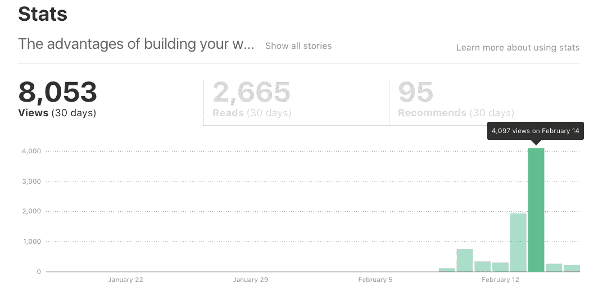

# 什么是框架和库？—我的真实想法

> 原文：<https://medium.com/hackernoon/frameworks-libraries-both-or-none-my-honest-opinion-3a21ddf75323>

## 哦，我被红迪网封杀了。

What are frameworks & libraries?

令我惊讶的是，[我之前的文章](https://hackernoon.com/the-advantages-of-building-your-website-from-scratch-da5748a1baaf#.hvu1qpork)在 Reddit 上疯传，我被讨论评论上的回复和各种反馈惊呆了。早上醒来，我看到我提交的链接下有一百多条评论。起初，看到最初的几条评论时，我感到震惊(其中很多是批评)，但这是一次有趣的讨论。同意或不同意我的文章的开发者之间有一场巨大的争论。

*这篇文章也是对上一篇文章的回应，在我们开始之前，我还有一些想法要分享。如果你想抓住文章的要点，你可以跳过下面的部分。*

Medium 上的统计数据爆炸了(见下图)，这是我最近才开始写这篇文章以来始料未及的。我最没想到的是，不同的读者是如何感知和解读我的文字的。这让我意识到，如果我对我试图传达的信息不彻底，信息可能会模糊不清，被误解。我承认，在展示框架和库到底是什么之前，我可能在这篇文章中走得太远、太快了；我们如何使用它们，为什么它们对我们 web 开发者有用。在[我的第一篇文章](https://hackernoon.com/how-to-radically-improve-your-website-performance-part-1-c728f4e5b08f)中，我只是简单地触及了这个主题。

因此，我没有回答所有的评论，而是想通过更详细地谈论这个问题来纠正我不清楚的错误。不幸的是，那天晚些时候我收到了一封电子邮件，说我被禁止在 [WebDev](https://www.reddit.com/r/webdev/) 和 startups 上发帖。我不知道自己发帖违反了他们的“自我推销”政策。作为 Reddit 的新用户，我只想与他人分享我的帖子，以交流我的知识并获得适当的反馈。嗯，我确实得到了反馈，我从这个快速而重要的经历中学到了很多。

由于现在我甚至不能发布这篇文章来分享我真正想说的话，如果有人能替我发布，我将不胜感激(你可以在下面留下回复让我们都知道)。

我真的刚刚开始写作，分享我每天都喜欢做的专业知识和知识。现在我意识到尽可能的清晰是多么重要，首先也是最重要的是在文章的引言部分。这也是我从这个错误中吸取的重要教训。

不知何故，从我读到的评论来看，很多人认为我想得出的结论是，你应该为每个网站创建自己的成熟框架。他们甚至让我思考，我是否已经忘记了术语*框架*的真正含义。我不明白，可能是我，也可能我说的对，今天很多开发者只通过使用框架和库来看待 web 开发。建立一个网站(比如一个简单的作品集页面)，不需要你定制一个框架。这只是一个静态页面，即使是初级开发人员也可以轻松维护！[这是来自 Reddit](https://www.reddit.com/r/webdev/comments/5tuev5/the_advantages_of_building_your_website_from/) 的讨论链接。

我总是渴望分享我对他人有用或有帮助的知识，让他们跟上进度，并立即达到我花了几年时间才达到和理解的水平。我从来不觉得自私或自我，我总是喜欢帮助我的朋友。我相信有不同的方法(和正确的策略)，你可以用它们来教授和帮助别人更好更清晰地理解这个主题。正如我从朋友和人们的反馈中意识到的那样，我可以把复杂的主题变成简单易懂的内容。我知道，在开始在线教授他人之前，我必须达到相当高的专业水平。我知道我的英语可能不完美，因为这不是我的母语。我尽量说得清楚一些，这样你就能理解核心主题，帮助你入门。这也是我想写[这本书](https://masteringwebdev.com/)的原因。我真的相信有一种更好的方式来介绍和欢迎 web 开发社区的新人，希望这本书能尽最大努力让你兴奋起来，有动力开始。我想帮助其他人了解 web 开发的力量，入门有多容易，以及通过在线展示可以实现多大的成就。

最后，我对所有的反馈和批评都很满意。它教会了我很多东西，让我对这个主题更加清楚，希望对 web 开发社区的其他人也是如此。因此，让我们再一次一起讨论这个问题，并从其他开发人员的角度讨论一些评论和想法。

## 我真正想说的是从零开始建立一个网站

> “redditors 嘲笑这个家伙不使用框架，对此我一点也不感到震惊。显然他们没有意识到所有的网络都是基于规范的，本质上，这是一个大框架。不幸的是，对他们来说，这需要编程和思考的能力，这是 redditors 在生活在“我没有时间”和“不要重新发明轮子，别人的代码经过测试会更好”等保护伞下时不愿做的事情。
> 
> 然后，他们最喜欢的框架/库在三年后被抛弃，他们不再从事这项业务。

这是一个很棒的评论，也正是我在之前的文章中想要指出的。我想在这里进一步讨论这个问题。让我们明确一点，成为某个特定库或框架的专家并没有错，尤其是当这被用于您服务或开发的多个产品时。**你需要知道的是，不要仅仅关注于学习如何只使用框架和库中的方法进行编码**。框架和库是由本地 web 语言本身构建的——HTML、CSS 和 JavaScript。**精通这些语言*首先*，有助于保持务实的学习和前进。框架和库正在成为一种短暂流行的期刊热潮，直到明年出现一种新的框架和库，它具有更好的实现、更轻量级、更好的性能和更多的功能。公司开始绞尽脑汁考虑选择哪个或者升级哪个。首先是 jQuery，然后我们有 AngularJS，然后是 React，现在我们有 Vue.js，还有很多。这将是持续的，与每年发布的其他通用产品一样。了解构成 web 开发基础的真实代码。然后开始熟悉可用的框架或库。**

# 介绍

我将首先讨论什么是框架和库，它们之间的区别，以及它们如何在 web 开发中帮助我们。我将尽可能清楚地说明它们的用法，并参考最适合使用它们的案例场景。希望这能让你更好地理解我上一篇文章的意思。

*旁注—这不是一个详细解释的技术视图。为了让你理解框架和库到底是什么，我试图让它尽可能的简单。*

# 什么是框架？

或者在这种情况下，什么是前端框架？前端框架(如 Bootstrap)是一个文件包，它为 web 开发人员提供了简单快速地构建复杂网站的工具。它通常提供类似“人类语言”的命令，以最少的努力快速达到特定的设计或框架。框架通常也与其他库和插件集成在一起，继续简化复杂功能的处理。例如，下面是一个简单的示例代码，它将一个元素放在屏幕的右侧:

**使用 Bootstrap 框架:**

`

`

**使用内嵌 CSS:**

`

`

对于这个例子，我直接在 HTML

元素中提交 CSS。在通常的实践中，我们在一个单独的样式表(比如 main.css)中提交样式，并在标签中使用一个链接来调用它。框架以类似的方式工作。我们称之为样式表的这些样式表具有类似功能的预构建类，但是开发人员不一定需要学习如何用纯 CSS 编写代码。你可以学习框架的 CSS 类或组件，然后立刻从现成的模板开始开发你的网站。

## **为什么使用它们？**

框架为你在短时间内开发一个完整的网站提供了很好的工具。它们通常被公司、自由职业者和大型复杂的 web 应用程序使用。他们为我们提供了指导方针和易于遵循的文件。一旦你熟悉了框架的环境，你就会意识到完成一个网站是多么的容易和快捷。公司可以很容易地让不同的开发人员维护一个庞大而复杂的网站，因为代码是框架的标准，而不是由单个开发人员创建的。

## 我们应该在什么时候使用它们？

*   如果你是一个大团队，或者与其他开发人员合作，你可以在彼此之间维护一个公共的代码结构。这也有助于保持网站的适应性和对新人的可理解性。
*   你是一名自由职业者，想要以最小的努力快速完成一个特定的设计，以满足截止日期并更快地接受新项目。

## **优点**

*   快速建立网站
*   为初学者建立他们的第一个网站提供了一个良好的起点(取决于框架的复杂程度)
*   可维护和测试的代码
*   巨大的支持(取决于框架的受欢迎程度)

## **缺点**

*   给网站增加不必要的权重(额外的代码)
*   升级、改进和修复依赖于构建框架的社区或公司
*   有时需要编写额外的代码来覆盖类似的功能
*   这个框架可能会失去人气，你所有的知识都会过时

# 什么是图书馆？

前端库是使用 JavaScript 构建的。库(如 jQuery)有助于将复杂的功能处理成简单的单行代码命令。库由不同的 JavaScript 函数组成，这些函数将常用的方法组合在一起，以简化操作和更改 DOM(文档对象模型)的过程。下面是一个改变元素类的例子:

**使用 jQuery:**

`$('#container').removeClass('hidden').addClass('active');`

**使用普通的 JavaScript:**

`var container = document.getElementById('container'); // Fetch element`

`container.classList.remove('hidden'); // Remove class`

`container.classList.add('active'); // Add class`

正如您在上面的例子中看到的，使用 jQuery 您可以很容易地实现这个功能，因为这个库为开发人员提供了可读的代码。虽然这个例子看起来很简单，但是这样的库更强大，特别是处理对服务器的异步 JavaScript 请求，或者实时操作网站数据。

## **为什么使用它们？**

如上所述，库通常用于简化复杂功能的处理。它们利用函数和类，因此作为开发人员，您不需要编写复杂的代码或算法来实现特定的功能。

## 我们应该在什么时候使用它们？

如果要构建的网站或 web 应用程序需要大量复杂的编码和复杂的功能，通常会使用库。如果你的网站将利用模态(弹出)窗口、自定义日期选择器、AJAX 请求或异步加载、DOM 操作等等，那么最好使用现成的库。尽管如此，请记住，我刚刚提到的大多数功能都可以使用普通的 JavaScript 通过一些额外的努力和一些在线研究来实现。

## **优点**

*   将复杂的功能转化为简单、易于理解的命令或查询。
*   用更少的努力和更短的开发时间达到规格
*   代码通常由社区测试，并有广泛的浏览器支持

## **缺点**

*   功能可能仍然有限
*   库上的文件请求非常多(取决于文件大小)
*   更新您的库可能会破坏您以前的功能

# 我应该两个都用吗？

这实际上取决于您选择使用哪个框架或库。大多数框架都与库捆绑在一起，以继续简化构建网站和实现特性的过程。但是这些并不总是必需的，你仍然可以选择一个纯框架包，并进一步附加你可能需要的其他库或插件。

另一方面，库通常被构建为用作独立的特性。有些库是专门为某个特定的功能而构建的，这些库通常是轻量级的，因为它们经过测试并且构建良好，所以可以提供很好的服务。我偶尔会采用小型库——比如 smooth scrolling——只要它们是用纯(普通)JavaScript 编写的，因为这些库通常都是为了获得更好的性能而优化的。其他小型库可以建立在其他库(如 jQuery)的基础上。只要您已经在使用“主”库，这就没问题。但是不要为了一个单一的特性而包含一个巨大的库。这是一种不好的做法，你应该始终记住整个包的大小(所有的网站文件将被浏览器请求)。

# 结束语

## 为什么我一起提到库和框架？

直截了当的回答——它们都将复杂的过程简化为易于使用的函数和类。大多数时候你会注意到它们经常一起使用。一些框架也需要库才能工作。它们都为你的网站增加了额外的权重。请记住，虽然您将编写更少的代码，但实际上您有一堆其他文件需要请求和下载。这不是一个好的方法，尤其是现在数百万的移动设备正在每个人的口袋里扩散。如果你想了解为什么性能很重要，为什么我认为很多开发人员都落后了，可以看看我以前的文章。

## 关于我之前的文章，一些值得一提的评论

> “这是一篇好文章，只是缺少了一些说明。不要在团队中，在大型项目中，在安全敏感的项目中，甚至更多的项目中这样做，但是从头开始有它的位置。”

我同意，正如我们上面讨论的，两种方法都有各自的优点和缺点。

> “我想大致了解一下‘从零开始’是什么样子。这篇文章写得非常模糊，如果他在使用一个框架而没有意识到这一点，我不会感到惊讶。”

当我说一个网站时，我真的只是指一个简单的网站。我从未在文章的任何部分提到过您应该从头开始构建自己的框架。但我知道我本可以说得更清楚。

> “……没有必要重新发明轮子”

对此不予置评……(有些人确实在这个问题上走极端了)。

> “任何建议每个人都应该从头开始编写自己的框架的人从来没有在专业环境中维护过框架，特别是随着时间的推移。”

再一次，我开始觉得那个社区的很多人只是看了评论就继续争论(可能是为了增加自己的业力)。

> **轻松发现 bug、性能缺陷和设计问题** —“最棘手的性能瓶颈可能需要几天甚至几周才能调试完毕。如果你的时间表很紧，你就不会想花大量时间来调试难题。”

你确实说到点子上了。但这就是为什么我明确表示要养成写行注释的习惯，并在开发过程中记录你的代码。

# 结论

有大量的库和框架可供选择。看到这么多选择，你会怀疑自己是否会做出正确的决定。看到所有这些不同的技术和可用的技术开始变得困难和有压力。当然，我的建议是使用那些真正使所有这些框架和库成为可能的语言:HTML、CSS 和 JavaScript。这是你应该开始的地方。一旦你理解了这些是如何一起工作的，你就可以开始理解框架和库是如何工作的。然后你将能够创建你自己需要的功能。如果你想成为一名伟大的网站开发者，这是你应该继续期待的。

我怎么强调都不为过。请记住，web 开发不是你应该害怕的事情。不要让其他 web 开发者吓到你，让你不敢开始使用所有这些头脑博客名称和技术。我在这里的目标是尝试带来一些启示，并向你展示正确的开始方式。HTML、CSS 和 JavaScript 是伟大的、真正强大的语言，它们将随着互联网的发展而不断发展。一旦你熟悉并倾向于本地网络语言，那只会是你的想象力限制了你的成就！

感谢您的阅读！如果你想继续学习网络开发的**关键秘密**，请关注我或者加入我的时事通讯。你也可以看看我的电子书——[精通网络开发](https://masteringwebdev.com/)

# 更从[欧文远](http://owenfar.com/professional-web-developer/?ref=medium):

 [## 网页设计和网页开发有什么区别？

### 我记得在我学习 web 开发的早期阶段，我发现自己对……

hackernoon.com](https://hackernoon.com/what-is-the-difference-between-web-design-and-web-development-cc23171de85c)  [## 从头开始建立网站的优势

### 大多数和我谈论我正在开发的产品或网站的人，倾向于问我是否在使用任何…

hackernoon.com](https://hackernoon.com/the-advantages-of-building-your-website-from-scratch-da5748a1baaf) 

> [黑客中午](http://bit.ly/Hackernoon)是黑客如何开始他们的下午。我们是 [@AMI](http://bit.ly/atAMIatAMI) 家庭的一员。我们现在[接受投稿](http://bit.ly/hackernoonsubmission)并乐意[讨论广告&赞助](mailto:partners@amipublications.com)机会。
> 
> 如果你喜欢这个故事，我们推荐你阅读我们的[最新科技故事](http://bit.ly/hackernoonlatestt)和[趋势科技故事](https://hackernoon.com/trending)。直到下一次，不要把世界的现实想当然！

