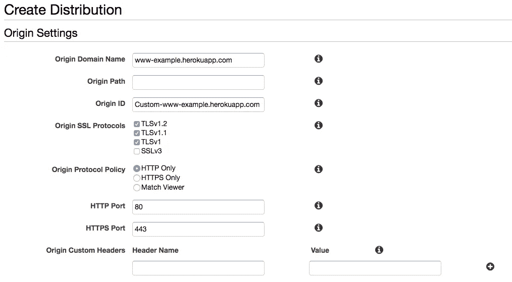
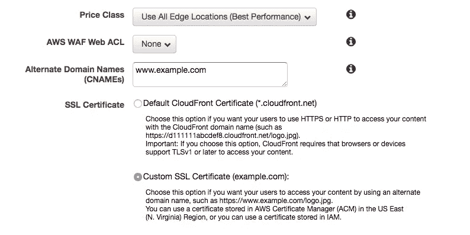

# 免费的 SSL 给大家！

> 原文：<https://medium.com/hackernoon/free-ssl-for-everyone-a3015cabd912>

早在二月份，我就写了一篇文章，详细介绍了免费保护网站的三种方法。从那以后，我一直只用一种方法来保护我和我的团队一直在构建的 API 和网站。

我们使用 [AWS](https://hackernoon.com/tagged/aws) Cloudfront 和 AWS 证书管理器来管理一切。我们在 Heroku 上托管我们的站点和 API，我们只是使用 Cloudfront 的原始域名属性将 Cloudfront 指向我们的 Heroku 应用程序。

## 怎么

首先，登录 AWS，进入证书管理器，为 example.com 创建一个证书。

然后，进入 cloudfront，点击“Create Distribution ”,配置源域名指向你的 herokuapp

当您到达证书部分时，设置所需的子域，如下例所示:

最后，你需要使用一个 CNAME 将你的新域名(【www.example.com】)指向 cloudfront URL。

这需要一点时间来复制大约 10 分钟左右，然后你的网址应该是安全的。这里最大的优势是 AWS 现在会为您处理续订流程。

好的，眼尖的你会注意到你必须为 Cloudfront 付费，然而, [SSL](https://hackernoon.com/tagged/ssl) 是免费的。

免费的 SSL 给大家！

*喜欢这篇文章吗？下面按心❤推荐一下，谢谢。*

> [黑客中午](http://bit.ly/Hackernoon)是黑客如何开始他们的下午。我们是阿妹家庭的一员。我们现在[接受投稿](http://bit.ly/hackernoonsubmission)并乐意[讨论广告&赞助](mailto:partners@amipublications.com)机会。
> 
> 如果你喜欢这个故事，我们推荐你阅读我们的[最新科技故事](http://bit.ly/hackernoonlatestt)和[趋势科技故事](https://hackernoon.com/trending)。直到下一次，不要把世界的现实想当然！

