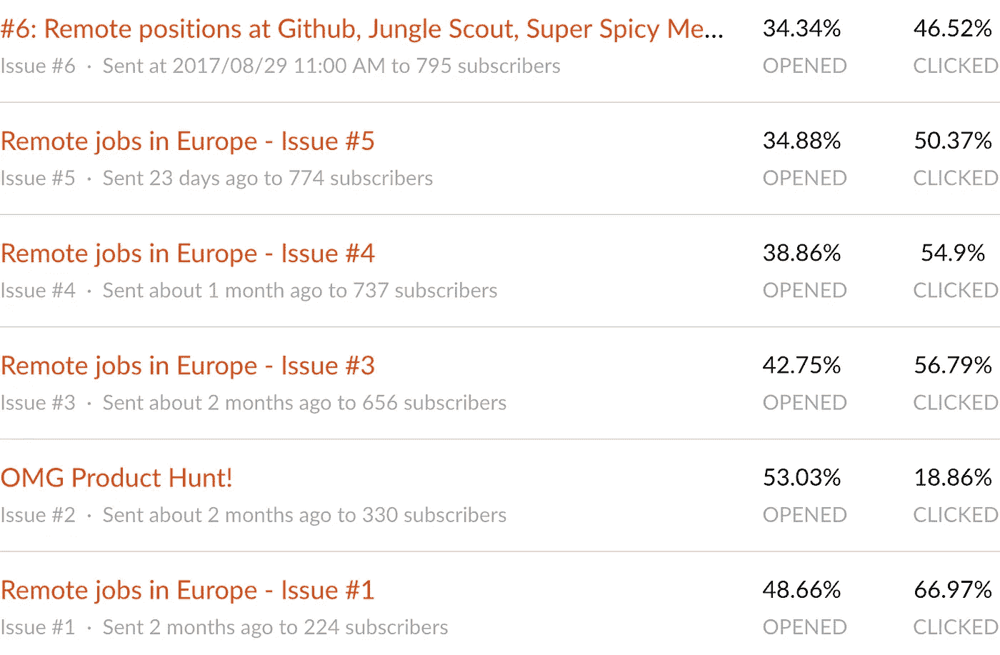
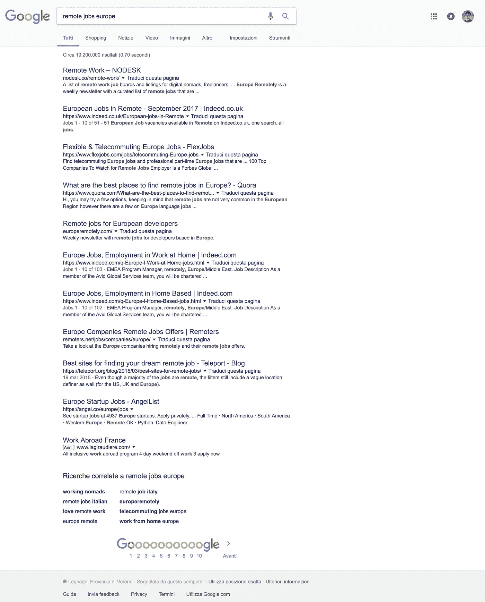

# 30 天内从 0 到 737 个用户

> 原文：<https://medium.com/hackernoon/from-0-to-737-subscribers-in-30-days-bc204ade43eb>

## 我是如何在没有观众的情况下用€53 启动 Remoteur 的

Photo by [Carlos Alberto Gómez Iñiguez](https://unsplash.com/photos/jqiAU_JQGyk?utm_source=unsplash&utm_medium=referral&utm_content=creditCopyText) on [Unsplash](https://unsplash.com/?utm_source=unsplash&utm_medium=referral&utm_content=creditCopyText)

[**Remoteur**](http://www.remoteur.com) **是一份面向欧洲职业人士的远程工作双周刊**。这是我如何建造和发射它的故事。

# 6 月 27 日星期二

## 想法

> 远程工作板大多以美国为中心，欧洲呢？

我对 [Google Trends](https://g.co/trends/29ZUX) 、 [Google Search](https://www.google.com/search?q=remote+jobs&pws=0&gl=us) (具体来说就是“与远程工作相关的搜索”)、 [Twitter](https://twitter.com/search?q=remote%20jobs%20europe) 、 [Quora](https://www.quora.com/What-are-the-best-places-to-find-remote-jobs-in-Europe) 和 [Hacker News](https://news.ycombinator.com/item?id=9599292) 的研究说服我建立一个 MVP。起初我想到了另一个招聘平台，然后我决定做一些更快更容易发布的东西:时事通讯。

## 名字

首先，我需要一个简短、有意义且容易记忆的名字。

这个[大 Tuts](https://www.producthunt.com/posts/big-tuts) 实验(两年前我和[我提出了赠送的想法，让人们在推特上谈论 Remoteur。](https://medium.com/u/8b2988f2aa48# 6:Github、丛林侦察兵、超辣传媒和其他公司的远程职位”；</em></li><li id=)

[与此同时，我编辑了 Revue 默认的欢迎信息:](https://medium.com/u/8b2988f2aa48# 6:Github、丛林侦察兵、超辣传媒和其他公司的远程职位”；</em></li><li id=)

> [**感谢您订阅 Remoteur！**](https://medium.com/u/8b2988f2aa48# 6:Github、丛林侦察兵、超辣传媒和其他公司的远程职位”；</em></li><li id=)
> 
> [您将直接在收件箱中收到更新，但您也可以查看](https://medium.com/u/8b2988f2aa48# 6:Github、丛林侦察兵、超辣传媒和其他公司的远程职位”；</em></li><li id=)[个人资料页面](http://em.getrevue.co/wf/click?upn=HbcPq3lf-2BfMXSmFZgMuO-2B1J9bdJR-2BeUuTki7g9ib-2FA8-3D_-2F-2B-2FWxp4a36-2Bl7GKYKuAC7S4qvDE0ap8AqSHI1FzuLq-2F0k9cKDpOY99Y857Q6UPeCNr-2FGEYj-2B5sRlQRQj0Gq0B-2BU3ujGjRB-2BxlirQpkKyuyY1ZYsvgNy2cy3TQo-2FJEwMiiL7CV3K-2BAYYRxeZTvX9xfejnizUc3OWpcP24HNyaNQ1rDeNnmdlyN-2FJACFKb0GpyQhUIUUf7aUjfBdxnoErzqFY-2FTu3-2BPhYPcwMa3w4EWds-3D)了解过去和未来的问题。
> 
> 哦，顺便说一下，我不介意你通过推特或脸书给我的文摘一些爱

对这一个:

> **万岁，你已经订阅了 Remoteur！**
> 
> 你会直接在收件箱里收到更新，但你也可以查看 remoteur.com 过去的问题。
> 
> 再次感谢订阅，非常感谢。我每隔一周的星期二发一次，所以尽快寻找下一期。
> 
> 来自意大利的极品！
> ——[西尔维奥](https://twitter.com/ailith)
> 
> 附言[这里有一条方便的预先填充的推文](https://ctt.ec/K6GEo)，帮助你传播关于遥控器的信息:)

最近我编辑了附言部分，提到了赠品:

> 又及:我正计划做一个小的**赠品**一旦我们跨越了 1000 订户线，请随意[与任何你认为可能会觉得有用的人分享](https://clicktotweet.com/e93Sk) Remoteur:)

最后，我改了一下*“跟我一起关注这份简讯吧？Remoteur*

# 出了什么问题，下一步是什么

## 缓慢增长

由于每天大约有 3 封新邮件，自最初的发布高峰以来，订户增长一直相当缓慢但稳定。打开率和点击率都在降低，但我猜这是八月的正常生理反应:我错了很快就会发现。

> 自最初的发布高峰以来，用户增长一直相当缓慢但稳定

3 new subscribers per day since the Product Hunt spike

## **谷歌排名差**

Remoteur 的 WooRank 分数只有 54.7，所以还有相当大的提升空间。但我得把 Revue 的登陆页面换成自定义的。

O Remoteur, where art thou? :(

## 很少 RTs

我在 Twitter 上提到的大多数公司都忽略了“他们的”推文:老实说，我本以为会有更多的转发。也许我可以用像 [Canva](https://www.canva.com) 或 [Pablo](https://pablo.buffer.com) 这样的工具让我的帖子更“视觉化”，但是我担心这会花太长时间。

Relax Jungle Scout, I’m not talking about you :)

## 下一步是什么

以下是我短期内要做的事情:

*   庆祝 1000 名订户的赠书；
*   一个定制的登录页面，以获得 100%的控制，并克服 Revue 在 SEO，分析和展开方面的限制(Remoteur 预览在社交媒体和消息平台上的外观)；
*   我会考虑(再次)在脸书上做广告和/或赞助一份与 Remoteur 利基市场相关的电子邮件简讯；
*   我会尽量让我们的**和**定期参加我最近加入的 1-5 个脸书目标群体。

# 感谢阅读！

我很想听听你的想法，请在下面分享你的评论。如果你是一名在欧洲工作的远程工作者，请点击**。**