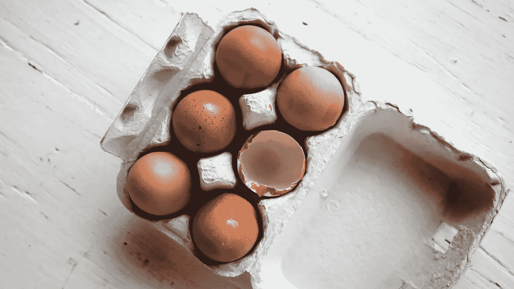

# 从 45 岁到谦逊

> 原文：<https://medium.com/hackernoon/from-45-to-humility-ab6129ef246a>

我昨天 45 岁了。

我总是说我会活到 90 岁，所以希望这是中间点。

我度过了幸运的半生。

我有一个伟大的、支持我的、充满爱心的家庭，以及世界各地成百上千的好朋友。

我已经有了一个相当不可思议的职业生涯，对此我感到幸运和感激。在我 20 多岁的时候，我在克林顿政府中获得了一个重要的职位，我在年轻的时候经历并成长了很多。在我三四十岁的时候，我在商业上取得了一些成功，也经历了一些引人注目的挫折。我是那种挨了一拳就马上弹回的人，现在还在打。

这是一次激动人心、收获颇丰的旅程。

随着年龄的增长，我努力成为一个更好的人，一个更好的朋友，一个更好的同事，一个更好的导师，一个更好的学生。这是一个持续的过程，一个永久的测试。我比大多数人承担更多的风险，这意味着更多的错误，而且总是有改进的空间。

20 年前，别人最常用来形容我的一个词是:不知疲倦。

15 年前:雄心勃勃。

10 年前:激烈。

8 年前:自信。

5 年前:快。

45 岁时，我仍然是所有这些东西，但我也在我的工具箱里拥抱了一个新的[工具](https://hackernoon.com/tagged/tool)。

上周，一位风险投资家在会议结束时特意告诉我:“你比我想象的要‘谦虚’得多。”

今天:谦逊——一个和上面的词非常不同的词。

那是故意的。我一直在努力。我开始了解并欣赏[谦逊](https://hackernoon.com/tagged/humility)对任何人来说都是最有价值的品质之一，尤其是对一个领导者来说。我开始意识到，有缺点是正常的，我们都是成长的项目，你通过支持他人获得的能量比你自己强加的要多。我开始明白，当你拥抱你不知道的东西时，你可以冒更多更好的风险，而当你说服自己从一开始就知道一切时。你永远不会因为太老或太聪明而不去寻求建议。活到老学到老——听比说学到的更多。你应该为你的挫折和失败承担大部分责任，而你的成功只应得到一部分荣誉。

在过去的几年里，我的人生哲学发生了很大的变化。我过去总是去一些地方，总是在下一个拐角处寻找。现在，我活在当下，专注于此时此地。我过去常常愁眉苦脸。现在，我满脸笑容。我曾经要求。现在，我尝试教练，我让自己被教练。我过去脾气暴躁，对可以避免的错误几乎没有容忍度。现在，我放下了很多，知道大多数事情都是可以解决的，如果不能，这将成为我们集体旅程中的一个教学时刻。虽然我总是很匆忙，但我变得更有耐心了。我曾经相信，快速取得成果是不友善的借口，我们会在事后做出友善的回应。现在，我为旅行而活。

我想我已经冷静下来并获得了洞察力。

从 1998 年到 2014 年，我搬了 10 次城市，住过超过 15 个家庭。今天，我无法想象自己会搬到哪里去；克里斯和我已经在柏林找到了家，我把在那里的快乐归功于它是世界上最不做作、最做自己的地方。

最重要的是，在 45 岁的时候，我可以自信地说，我比以往任何时候都更了解今天的自己。我对自己、对自己是谁、对自己擅长什么、对自己哪里有缺点感到自在和有自知之明。

谦逊的加入让我觉得比以往任何时候都更强大，更有能力。

为什么我要分享这一切？

部分原因是大多数人不知道——尤其是科技企业家。最近有人引用我的话说“[科技不需要如此](http://www.msn.com/en-us/news/us/tech-doesnt-need-to-be-so-douchey-all-the-time-jason-goldberg/vp-AAmeR9l)愚蠢。”我真的相信这一点，而且我在过去也确实贡献了我的一部分。

部分原因是因为我们的白宫总统可能是世界上最不谦逊的人。这个世界现在需要一些谦卑的拥抱。

而且，很大程度上是因为我希望很久以前就能和年轻时的自己聊一聊。你可以具备成为一名优秀企业家的所有特质:不知疲倦、雄心勃勃、热情、自信和快速，但除非你对此保持谦逊并有自知之明，否则你就没有全力以赴。当然，有一些成功企业家的高调例子，他们似乎缺乏同理心基因，但不要以他们为榜样:以最优雅的你为榜样。这听起来可能违反直觉，但这是真的:谦逊的领导是更自信的领导——因为你更清楚自己是谁，做什么。

附言:我很清楚写谦逊会被认为不谦逊。我谦卑地请求你的理解。

> [黑客中午](http://bit.ly/Hackernoon)是黑客如何开始他们的下午。我们是 [@AMI](http://bit.ly/atAMIatAMI) 家庭的一员。我们现在[接受投稿](http://bit.ly/hackernoonsubmission)，并乐意[讨论广告&赞助](mailto:partners@amipublications.com)机会。
> 
> 如果你喜欢这个故事，我们推荐你阅读我们的[最新科技故事](http://bit.ly/hackernoonlatestt)和[趋势科技故事](https://hackernoon.com/trending)。直到下一次，不要把世界的现实想当然！

