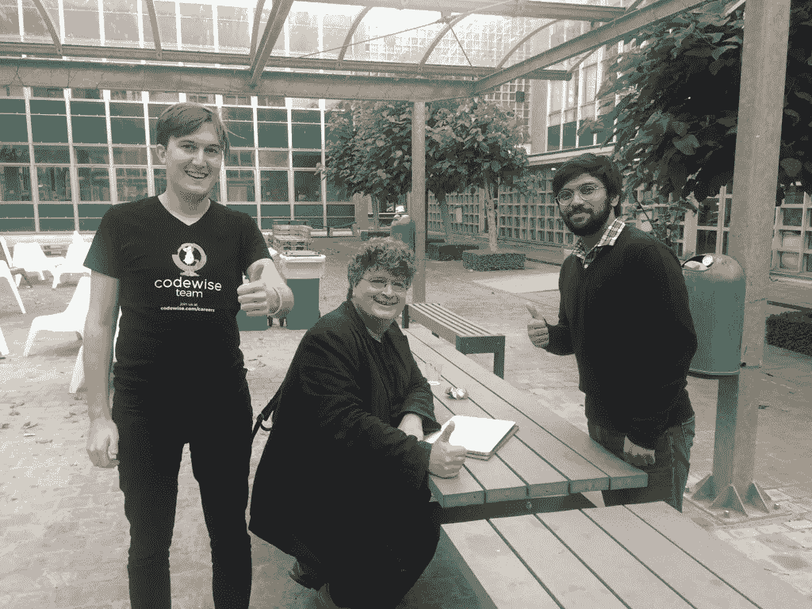

# 从一名高中程序员到一名国际科技演说家——阿伦·迈克尔·杜萨访谈

> 原文：<https://medium.com/hackernoon/from-a-high-school-coder-to-an-international-tech-speaker-interview-with-arun-michael-dsouza-47886c4d4652>

了解和学习一个 web 开发人员的历程总是令人着迷的。世界上有 1850 万程序员，其中 1100 万是专业人员，750 万是业余爱好者。如果我们继续了解谁是真正的计算机程序员？我想强调一下[比尔·盖茨](https://www.gatesnotes.com/)曾经说过的话。 ***“我选择一个懒惰的人去做一件艰苦的工作。因为一个懒惰的人会找到一个简单的方法去做。”程序员是简单的问题解决者，因为他们为最困难的问题找到最简单的方法。有时在控制复杂性的过程中，这些程序员创造了一个，而有时问题刚刚解决，他们一直在想，怎么解决？这些专业人士和业余爱好者在某些方面都很有经验。在这里，我想分享我对一位如此热情的程序员的采访，他是几个已经被下载了 12000 多次的开源库的作者。***

Arun Michael DSO uza[是一名技术爱好者，他用 C++编写了自己的第一个大型 ERP 应用程序，当时他还在上高中，做了五年的前端程序员，目前在印度最热门的 AdTech 软件初创公司之一](http://arunmichaeldsouza.com/) [Adpushup](https://www.adpushup.com/) 担任全栈开发人员。他的开源贡献出现在顶级在线论坛上，如 [JavaScript Daily](https://twitter.com/JavaScriptDaily/status/865334496920563714) 、 [NodeWeekly](https://nodeweekly.com/issues/188) 、 [ProductHunt](https://www.producthunt.com/posts/css-mint) 。迈克尔也是一个渴望成为设计师的人，他擅长设计完美的用户界面。他建立了印度第一个大学间社交网络[T21，将学生、教师和校友联系起来。他拥有多种编程语言的经验，如 C、C++、JavaScript、Python，并且有学习更多的热情。](https://hackernoon.com/tagged/network)

凭借八年多的编码专业知识，Michael 最近在 JSConf Belgium[上发表了一篇关于 **"**](https://jsconf.be/en/2017) [**JavaScript 模块和模块捆绑**](http://bit.ly/The-era-of-module-bundlers-speakerdeck) **"** 的精彩演讲。让我们回顾一下他最近演讲的采访要点:

**是什么促使你在比利时 JSConf 大会上发言？**

**Michael:** “我是 JSConf 的超级粉丝，从我开始 Web 开发的早期就开始关注他们。我一直喜欢能够与社区分享你的学习和第一手经验的想法。我知道比利时版的 JSConf 正在举行，也是在布鲁日(我梦想中的城市之一)，所以我开始为我的提议准备一套材料。我在截止日期前很久就提交了我的提案，并耐心等待。过了一会儿，主办方联系我，告诉我我的提案被选中了！”

**JSConf, Belgium:** A picture with [Kacper Sokołowski](https://twitter.com/kaapa_s) and [Peter-Paul Koch](https://twitter.com/ppk)

**本次会议的主题是什么？你是怎么想出来的？**

**Michael:** “我决定做一些不平凡的事情，在前端领域即将到来的技术堆栈。在过去的十年中，网络发展很快(随着 [NodeJS](https://nodejs.org/en/) 、 [ReactJS](https://facebook.github.io/react/) 和 ES6】的到来)，开发和交付 JavaScript 应用程序的整个想法已经完全改变了。我们现在处于一个应用程序要求极其苛刻的时代，这些类型的应用程序需要复杂的工具来开发和交付。所以我决定选择一个主题，涵盖这个工具领域以及围绕它的必要优化。它被命名为**‘模块打捆机时代’，**甲板可用 [**此处**](http://bit.ly/The-era-of-module-bundlers-speakerdeck) 。在这次演讲中，我试图涵盖各种模块系统和捆绑工具，以及它们是如何发展的，坚持使用最好的捆绑工具之一— [Webpack](https://webpack.js.org/) ，并涵盖一些优化技术，使您的代码肯定可以投入生产。”

**你认为模块系统和工具在过去几十年里有什么样的发展？**

**Michael:** “模块系统已经存在很长时间了，社区在开发和发布它们方面做得非常出色。在 ES6 之前，语言中没有原生模块系统支持，所以我们不得不使用这些社区驱动的模块系统(像 CommonJS，AMD 等。)，他们在保持我们的代码库模块化方面做得非常出色。但是随着客户端对模块系统越来越熟悉，围绕它们的工具也发展起来了。我们从运行时处理和脚本注入转向构建时处理和优化，这就是模块捆绑器的用武之地。之前并没有资产捆绑的概念，但是随着类似 [Browserify](http://browserify.org/) 、 [Rollup](https://github.com/rollup/rollup) 、Webpack 等相关工具的出现，很明显，为什么我们应该和他们一起去。”

**模块打包器是如何工作的？**

**Michael:** “简单来说，模块捆绑器是一种将所有模块捆绑或连接在一起的工具。它生成所有 JavaScript 模块的依赖图，这是一个抽象的语法树。然后，它将遍历依赖关系图，递归地查看每个模块和该模块的依赖关系，并将它们添加到可以提供给客户端的单个 JavaScript 包中。”

**browser ify 如何帮助我们在浏览器端使用 NPM 模块？**

**Michael:**“browser ify 是第一个引入以“节点方式”要求模块的思想的模块捆绑器，即使用 require 语句。这意味着我们可以通过 Browserify 使用任何 CommonJS 模块。由于 CommonJS 是与 Node JS 一起工作的事实上的模块系统，所以我们可以利用它，并通过 Browserify 要求任何 CommonJS 模块。嘭！这边请..客户端的 NPM 模块。

只需使用 NPM 安装一个模块，在你的代码中需要它，并使用 Browserify 捆绑它。"

**什么是 webpack？如何在 webpack 中优化一个包？**

**Michael:**“web pack 也是一个模块捆绑器，可以提供更多功能！值得一提的是，Webpack 团队在他们的开源计划方面做得非常出色，频繁发布 Webpack 和修复 bug，并维护整个项目。对于如何理解模块，Webpack 有不同的哲学。每个输入条目都充当 Webpack 的一个模块，无论是 JavaScript、CSS、SASS、CoffeeScript 等等。你只需要一个合适的[加载器](https://webpack.js.org/loaders/)来处理文件类型，Webpack 会处理剩下的事情。Webpack 最突出的特点之一是它捆绑了优化工具，所以你可以获得对像[树摇动](https://webpack.js.org/guides/tree-shaking/)、[代码分割](https://webpack.js.org/guides/code-splitting/)等事情的支持。，开箱即用！不需要第三方插件。

**JSConf, Belgium: The talk by Arun Michael Dsouza**

有多种方法可以优化 Webpack 中的捆绑包-

1.  你可以使用[丑化](https://webpack.js.org/guides/production/#minification)插件(与 Webpack 捆绑在一起)，它非常容易使用。它将为您缩小输出包。
2.  您可以使用-p 标志在[生产模式](https://webpack.js.org/guides/production/)下运行 Webpack，它会自动为您触发丑化和相关优化。
3.  缩小你的 CSS 也是一个好主意，CSS 加载器[可以用来这样做。](https://github.com/webpack-contrib/css-loader)
4.  摇动未使用的导出是一个很棒的技巧，可以用在 ES6 上。它可以大大减少您的包大小。你可以在[这里](https://webpack.js.org/guides/tree-shaking/)阅读更多信息
5.  您还可以利用代码分割来帮助模块的延迟加载，也称为按需模块加载。你可以查看官方 webpack 文档来了解如何开始使用它。
6.  有关如何使用 Webpack 开始捆绑优化的更多信息，请随意查看我为演讲[制作的幻灯片，或者看看](https://speakerdeck.com/arunmichaeldsouza/the-era-of-module-bundlers)[演讲](http://bit.ly/2sKN8Fl)本身。"

**JSConf, Belgium: Some cool stuff received from the organizers**

从他与社区的谈话中可以学到更多东西。您可以在此查看演讲[。他最近的项目，](http://bit.ly/2sKN8Fl) [Woodlot](http://adpushup.github.io/woodlot/) : *一个一体化的 JSON 日志记录实用程序，支持 Express JS HTTP 日志记录、自定义日志记录，提供多格式输出和一个易于使用的事件 API* ，已经证明是一个巨大的成功。更令人兴奋的是，在过去的三年中，Michael 还为各种初创公司/公司构建/扩展其客户端应用做出了重大贡献。你可以在 [Twitter](https://twitter.com/amdsouza92) 和 [LinkedIn](https://in.linkedin.com/in/arunmichaeldsouza) 上和他联系，在 [Github](https://github.com/ArunMichaelDsouza) 上关注他的工作。

你可以通过 Erica Louise Space 了解更多这样的成功故事。:)