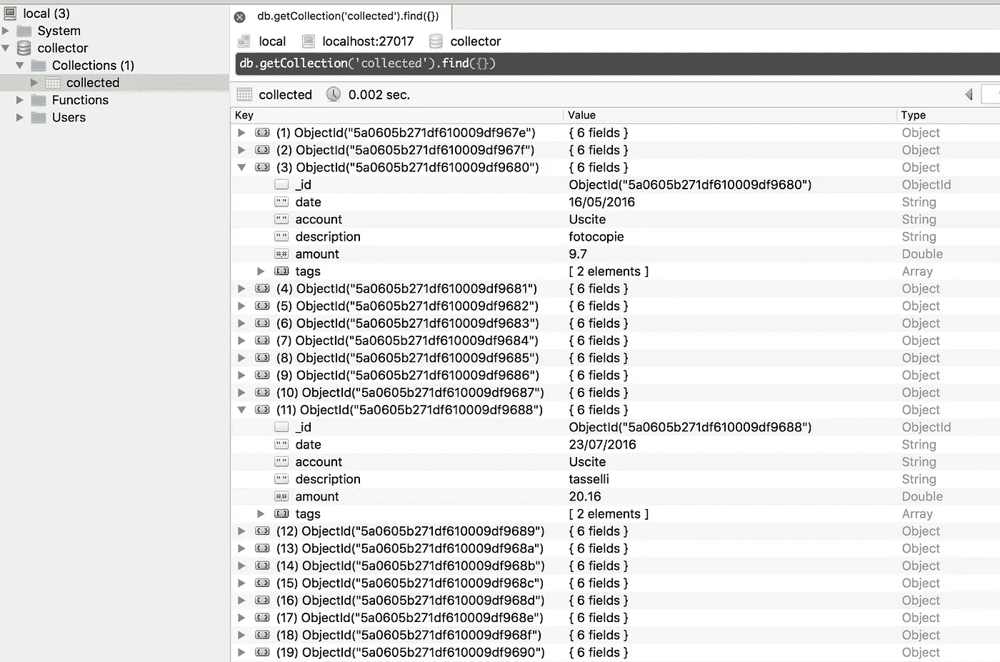

# 从 CSV 到 Buxfer:意想不到的旅程——收藏家

> 原文：<https://medium.com/hackernoon/from-csv-to-buxfer-an-unexpected-journey-collector-4dbde92c1e7b>

## 第 3 部分——收集器:关于如何编写一个收集纯数据集的程序的故事


# 序文

在[Cleaner-Part 2](https://hackernoon.com/from-csv-to-buxfer-an-unexpected-journey-cleaner-c87e8a77fda6)中，我已经编写了这个项目的第一个程序，清理原始数据并使其可用于第二个程序:收集器📦！

收集器必须从 CSV 文件中读取干净的数据，并使用在[第 1 部分](https://hackernoon.com/from-csv-to-buxfer-an-unexpected-journey-introduction-ba43ef768fe2)中定义的数据模型将其存储在 [MongoDB](https://hackernoon.com/tagged/mongodb) 实例中。

## 旅行

在本文中，我将介绍这一旅程的第三部分:

1.  [第一部分:简介](/@wilk/from-csv-to-buxfer-an-unexpected-journey-introduction-ba43ef768fe2)
2.  [第 2 部分:清洁剂](https://hackernoon.com/from-csv-to-buxfer-an-unexpected-journey-cleaner-c87e8a77fda6)
3.  第三部分(本部分):收藏家
4.  [第 4 部分:Goxfer](/@wilk/from-csv-to-buxfer-an-unexpected-journey-goxfer-88d8a14e8905)
5.  [第 5 部分:结论](/@wilk/from-csv-to-buxfer-an-unexpected-journey-conclusions-b1274aa9841e)

# 入门指南

这是这次冒险的第二个重要区块:**收集者**。
过程类似于清理器:更新 docker-compose.yml 文件，然后用 [Python](https://hackernoon.com/tagged/python) 编写程序。

因此，与清理程序一样，收集服务程序使用相同的 Python 映像，装载相同的卷，启动类似的命令，并使用清理程序的一些环境变量。
让我们更新收集服务程序:

实际上，连接器需要更多的东西:例如，附加一个 MongoDB 实例！
好了，连接 MongoDB 需要一些变量…耶，环境变量！
当然，收集器服务将依赖于 *mongodb* 服务，所以我将重写它:

很好！我几乎已经准备好了开始编写收集器程序的一切:我还需要一些信息。
例如，我想为每个文件定制帐户名，比如*费用*和*收入*，并用我的新定制标签映射交易标签。
如前所述，我将它们放在环境空间内:

现在， *TAGS_FILE* 是对一个文件的引用，我将 CSV 文件中的这些标记与我自己的定制标记进行映射，如下所示:

```
{
  "expenses.csv": {
    "Abbigliamento": ["Abbigliamento", "Uscite / Annuali"]
  }
}
```

我必须这样做，因为我当前的事务每个都有多个标记。
因此，对于这样的交易:

```
04/06/2016,Abbigliamento,maglietta,"5,00"
```

结果将是一个新的事务，它有两个相关联的标签: **Abbigliamento** 和 **Uscite / Annuali** 。

*费用 _ 账户*和*收入 _ 账户*分别定义费用和收入交易的账户。

# 收藏者

是时候定义收集器过程了:

1.  **连接到 MongoDB**
2.  **读取 CSV** 已清理文件
3.  对于每一行，映射正确的**帐户和标签**
4.  对于每一行，**创建**一个 MongoDB 文档
5.  **检查**增加的交易数量

好的，首先，我需要收集器检查被清理的文件夹是否存在:

然后，数据库连接，接着是用于清除以前执行的擦除过程:

太好了！
让我们来读一些文件:

**标签**是一个字典，用于映射旧标签和新标签，而 **csv_files** 保存 csv 文件引用。

现在，是时候编写收集器核心逻辑了:

长话短说:对于每个 CSV 文件，在 MongoDB 中放置一个新的事务，使用一个字典来表示它。
交易模型由一个日期( [**datetime**](https://docs.python.org/3.6/library/datetime.html) 包在这些情况下非常有用)、一个帐户(定义交易的类型)、一个描述、一个金额(通过将 string 转换为 float 构建)和一个 tag 列表(将 TAGS_FILE 与原始交易的 tag 结合在一起)组成。
然后更新一些计数器，如 **transactions_counter** 和 **total_counter** ，因为它们将用于最终测试。

## 测试

当收集器的执行完成后，我需要检查从 CSV 文件中读取的事务量是否等于 MongoDB 中插入的事务量:我需要检查计数器和总量。
使用**断言**，我可以测试 **total_counter** (即添加的交易数)和 **total_amount** (添加的每笔交易的总和)是否等于 **collection_counter** 和 **amount_counter** (对应的，从 DB 中读取并计算)。

此时，在 cleaner 之后运行 collector 可以很容易地用清理后的数据填充数据库，从而有新的事务准备推送到 Buxfer 上！

遵循 **collector.py** 的源代码:

# 第 3 部分结束

在收集器出现之前，我只有一堆 CSV 文件，包含如下数据:

```
02/01/2016,Alimentari,spesa,"17,64"
26/03/2016,Hobby,libri,"30,46"
04/06/2016,Abbigliamento,maglietta,"5,00"
```

但是，我有更好的东西！看一看:



好多了😁

因此，Collector 将清理后的非结构化数据提升为 MongoDB 中定义良好、结构良好的文档。
这对于**数据分析**很有用，它绝对是 Python 和 GoLang 之间的桥梁(在下一步中使用)。

如果你喜欢这篇文章，不要忘记分享它！
在[第四部:转移](/@wilk/from-csv-to-buxfer-an-unexpected-journey-goxfer-88d8a14e8905)再见！

## 扰流器

源代码已经可以在这里获得:[https://github.com/wilk/from-csv-to-buxfer](https://github.com/wilk/from-csv-to-buxfer)