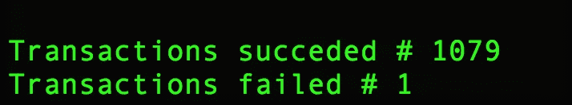

# 从 CSV 到 Buxfer:意想不到的旅程——go xfer

> 原文：<https://medium.com/hackernoon/from-csv-to-buxfer-an-unexpected-journey-goxfer-88d8a14e8905>

## 第 4 部分——Goxfer:关于在线推送交易数据集的故事


# 序文

在[收集器-第 3 部分](/@wilk/from-csv-to-buxfer-an-unexpected-journey-collector-4dbde92c1e7b)中，我已经编写了收集器程序，将清理后的数据放入一个 [MongoDB](https://hackernoon.com/tagged/mongodb) 实例中。
现在，是时候使用 Buxfer 的 API 将整个数据集放到网上了！

[Goxfer](https://hackernoon.com/tagged/goxfer) 是一个从 MongoDB 中读取结构化数据，然后通过 [Buxfer 的 API](http://buxfer.com/help/api)将其推送到网上的程序。

## 旅行

在本文中，我将介绍这一旅程的第四部分:

1.  [第 1 部分:简介](/@wilk/from-csv-to-buxfer-an-unexpected-journey-introduction-ba43ef768fe2)
2.  [第二部分:清洁剂](https://hackernoon.com/from-csv-to-buxfer-an-unexpected-journey-cleaner-c87e8a77fda6)
3.  [第 3 部分:收集器](/@wilk/from-csv-to-buxfer-an-unexpected-journey-collector-4dbde92c1e7b)
4.  第四部分(本部分):Goxfer
5.  [第 5 部分:结论](/@wilk/from-csv-to-buxfer-an-unexpected-journey-conclusions-b1274aa9841e)

# 设置

这个新程序将用 GoLang 编码:这意味着我需要构建一个定制的 docker 镜像，并通过最好的 Go 包管理器之一 [**glide**](https://github.com/Masterminds/glide) 安装任何依赖项。

好了，从 docker 开始吧！
首先，我需要更新 **setup-golang** 服务来构建容器映像:

然后，构建图像并进入容器:

```
$ docker-compose build setup-golang
$ docker-compose run --rm setup-golang bash
```

Goxfer 需要一些依赖项，如[**MgO**](https://github.com/go-mgo/mgo/tree/v2)(GoLang 的 MongoDB 驱动程序)和 [**gorequest**](https://github.com/parnurzeal/gorequest) (少数 HTTP 客户端):我必须用 glide 来获得它们，因为它将使用锁文件来跟踪它们，这对于在另一个系统上恢复项目非常有用。

```
# from inside the setup-golang container
$ glide create
$ glide get github.com/parnurzeal/gorequest
$ glide get gopkg.in/mgo.v2
```

用 **glide 创建**两个新文件被添加到项目中:

1.  glide.yaml :这是 glide 清单，其中列出了所有的依赖项，并按照语义版本规范标记了固定版本
2.  **glide.lock** :这是一个锁文件，用于确保确定性恢复过程

使用 **glide get** 将依赖项下载到新的本地**供应商**文件夹中，并添加到 glide.yaml 和 glide.lock 文件中。

现在，使用 docker-compose 可以在任何系统上恢复/初始化项目:

```
$ docker-compose run --rm setup-golang
```

# 手放在上面！

那么，Goxfer 要做什么呢？
我们来定义一下程序流程:

1.  连接到 MongoDB
2.  初始化 Buxfer 的会话
3.  检索 Buxfer 的帐户列表
4.  从数据库中提取事务并构建事务的批量
5.  通过 Buxfer 的 API 在线推送批量交易

我必须一步一步来锻造它。

## 数据库ˌ资料库

我需要编码的第一件事是数据库连接。
**mgo** 是一个 MongoDB 驱动程序，它只需要数据库主机建立连接，加上数据库名称和它将查询的事务集合的名称。
我需要将 **docker-compose.yml** 中的那些信息定义为 **goxfer 服务**的环境变量，已经在[第 1 部分](https://hackernoon.com/from-csv-to-buxfer-an-unexpected-journey-introduction-ba43ef768fe2)中起草:

太好了！环境变量永远是从外部配置事物的最佳选择，[正如十二因子 App 教导的](https://12factor.net/config)。

现在，我必须使用 mgo 驱动程序来连接 MongoDB。但是首先，我必须得到那些环境变量… **os。Getenv** 会帮我做的:

是时候创建 MongoDB 连接并获取事务集合了:

下一步需要数据库连接，所以如果执行失败，我必须停止程序:[](https://golang.org/pkg/builtin/#panic)**不会有问题。**

## **巴克斯费尔会议**

**Buxfer 为每个执行的请求要求一个**认证令牌**；所以，在继续之前，我必须建立一个新的会话。我将使用 gorequest，它是一个 HTTP 客户端，具有实用且易于使用的界面。
[登录 API](https://www.buxfer.com/help/api#login) 需要用户名和密码，所以我必须在 docker-compose.yml 文件中放置新的环境变量:**

**然后，我必须在 Goxfer 中执行 HTTP 请求:**

**当然，我还定义了 **LoginResponse** 结构来存储登录响应。然后，我检查了 lib 和 http 错误:如果一切正常，那么我可以使用从响应中获取的令牌。**

## **帐户列表**

**在进行交易之前，我需要获得帐户列表，因为稍后我将需要每个帐户的 id。因此，现在，我只需要将支出和收入账户与它们的 id 对应起来:**

**同样在这里，我使用了 gorequest 来执行 HTTP GET 调用。
buffer 的 API 认证是通过会话令牌完成的，所以我将它附加到 querystring ( *)。查询(" token=" + token)* )。
然后，响应被存储在自定义结构**accounts list response**中:下一个步骤也需要这一步，所以如果至少出现了一个错误，我就会惊慌失措。如果一切顺利，我可以检查账目清单。我只有两个账户，所以控制权可以是独占的。**

**现在，我需要用 **EXPENSE_ACCOUNT_BUXFER** 和 **INCOME_ACCOUNT_BUXFER** 常量更新 docker-compose.yml 文件，这样上面的代码就不会中断:**

**太好了！
继续前进！**

## **交易的批量**

**现在，我想做的是从 MongoDB 获取所有事务，然后
将它们推送到 Buxfer 上。
但是，有一个问题:Buxfer 的 API 是有限的。事实上，每次只推送一个事务是可能的:[https://www.buxfer.com/help/api#add_transaction](https://www.buxfer.com/help/api#add_transaction)
嗯，我不想等到每个请求结束后再执行一个新的，也不想并行执行 1000 个调用。
所以，我想我会选择每次 20 笔的批量交易。要做到这一点，我需要两样东西:**

1.  **将事务打包到一个矩阵中(**批量数组**(基本上是数组的数组))**
2.  **(ab)使用 [**GoLang 的 goroutines**](https://gobyexample.com/goroutines) 并行执行 HTTP 调用**

**每个 bulk 都有一个固定的大小，由环境变量 **BULK_LENGTH** 定义，我将把它放在 docker-compose.yml 文件中:**

**现在，让我们定义从数据库获取交易并填充批量矩阵的过程:**

**开始时，事务存储在变量 **results** 中，该变量是**事务**(事务的模型)的数组(GoLang 中的[片](https://gobyexample.com/slices))。然后，我通过将事务列表的长度除以 BULK_LEN 来计算填充事务矩阵的迭代次数。
如果交易量不是 BULK_LEN 的倍数，则进行第二次迭代。**

## **推向巴克斯费尔**

**好了，这是**最难的部分**。
正如我所说，我想推动 20 次交易的批量。这意味着我必须并行启动 **20 个 goroutines】，然后等待它们完成。全部都是。然后，我可以开始一个新的批量等等。****

**[**sync**](https://golang.org/pkg/sync/) 将帮助我处理并发的 goroutines 执行:在这个包中有 [**WaitGroup**](https://golang.org/pkg/sync/#WaitGroup) ，它基本上提供了三种方法:**

1.  **[增加](https://golang.org/pkg/sync/#WaitGroup.Add):增加工人计数器**
2.  **[等待](https://golang.org/pkg/sync/#WaitGroup.Wait):停止主线程，直到 workers 计数器等于零**
3.  **[完成](https://golang.org/pkg/sync/#WaitGroup.Done):减少工人计数器**

**所以，我要做的是:**

*   **通过批量矩阵循环**
*   **然后，对于每一行(也称为 bulk ),我必须通过增加 bulk 的长度来增加 WaitGroup 计数器**
*   **然后，我需要遍历当前的批量数据，并为每个事务实例化一个新的 goroutine，以将数据推送到 Buxfer 上**
*   **对于每个已经完成的 goroutine，我需要通过 Done 方法递减 WaitGroup 计数器**
*   **最终，我不得不使用 WaitGroup 的 Wait 方法停止，直到整个批量操作完成，这样循环才能继续处理矩阵的下一行**

**在这个过程中，我想存储已经添加了多少事务，还有多少没有添加。稍后我会记录这些信息。**

**下面是代码，除了对 Buxfer 的实际请求:**

**现在，最后要编写的是 **addTransaction** 函数。
这将是一个函数，如果在线推动交易时出错，它可能会返回一个错误，遵循[GoLang 如何将错误视为错误而不是异常](https://blog.golang.org/error-handling-and-go):**

**简言之，HTTP 请求有效负载由以下字段组成:**

*   ****描述**:交易的描述**
*   ****金额**:交易金额**
*   ****accountId** :与之前提取的 Buxfer 账户列表匹配计算**
*   ****标签**:转换成逗号分隔字符串的交易标签**
*   ****日期**:采用 **YYYY-MM-DD** 格式的日期**
*   ****令牌**:会话令牌**
*   ****类型**:交易的类型，计算方式与 accountId 相同**

**然后发出请求，并将响应存储在新结构 **AddResponseBody** 中:如果没有发生错误，它将返回 **nil** 。**

**把所有东西放在一起(在 github 上因为太长无法在这里展示):[https://github . com/wilk/from-CSV-to-buxfer/blob/master/go/src/goxfer . go](https://github.com/wilk/from-csv-to-buxfer/blob/master/go/src/goxfer.go)**

## **快跑，伙计！**

**最后一步:启动它🚀！**

```
$ docker-compose run --rm goxfer
```

**(美)雅皮士(属于中上阶层的年轻专业人士)🎉**

# **第 4 部分结束**

**哇，这最后一部分很难😵这需要大量的工作和测试。事实上，最初在 Buxfer 上添加交易的 API 是不同的(**和 bugged** )，它在 10 月底进行了更改(**并修复了**)。我不得不修改源代码，在运行程序安全之前，用 [PostMan](https://www.getpostman.com/) 和 [curl](https://curl.haxx.se/) 执行新的测试。**

**然而，即使我事先测试了所有东西，我还是得到了这个:**

****

**无话可说。我意识到了这个缺陷(事实上，我没有准备任何日志来跟踪未刷新的事务)，但是我还是想尝试一下，把我所有的信任都投入到我之前做的手工测试中。这需要我手动在成千上万的日志中搜索:这很痛苦，但这是我应得的，所以没关系😬**

**但是现在，**我已经把我 2016 年的所有交易都放在 Buxfer** 上了🎉
我想在这部分花更多的话，但我会在下一部分: [**结论**](/@wilk/from-csv-to-buxfer-an-unexpected-journey-conclusions-b1274aa9841e) ！**

**如果你喜欢这篇文章，不要忘记分享它！
第五部分:结论见！**

## **来源**

**源代码可以在这里找到:[https://github.com/wilk/from-csv-to-buxfer](https://github.com/wilk/from-csv-to-buxfer)**

## **更新**

**我改进了未清空的事务日志，发现其中一个原始事务被破坏了:它的日期是 **29/11/1898** ，这就是 Buxfer 拒绝接受它的原因。总之，清洁工、清洁工和搬运工完成了工作，而且他们做得很好！**