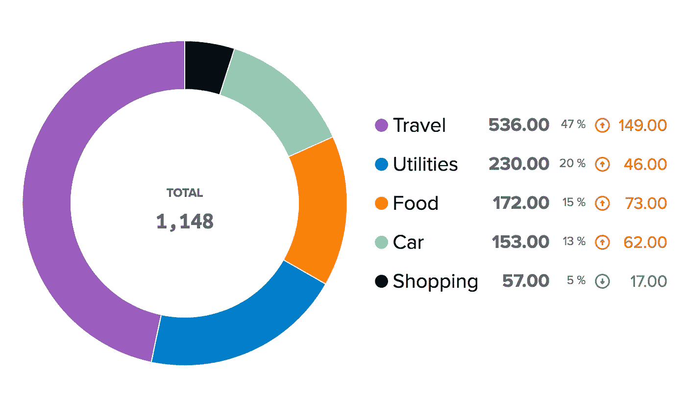

# 从 CSV 到 Buxfer:意想不到的旅程—简介

> 原文：<https://medium.com/hackernoon/from-csv-to-buxfer-an-unexpected-journey-introduction-ba43ef768fe2>

## 第 1 部分—基础设施:对挑战的介绍和对一般项目基础设施的概述



# 介绍

读者朋友，我来和你分享一下，这个和 **Buxfer** 以及各种开发工具和编程语言的冒险。
这是什么，你在想？
这是我学习新东西，当然也是做一些有用的事情的旅程的第一部分。
其实那叫**黑客**。你说到点子上了。

## 旅行

这段旅程让我经历了以下几个里程碑:

1.  第一部分(本部分):导言
2.  [第二部分:清洁剂](/@wilk/from-csv-to-buxfer-an-unexpected-journey-cleaner-c87e8a77fda6)
3.  [第三部分:收集器](/@wilk/from-csv-to-buxfer-an-unexpected-journey-collector-4dbde92c1e7b)
4.  [第 4 部分:Goxfer](/@wilk/from-csv-to-buxfer-an-unexpected-journey-goxfer-88d8a14e8905)
5.  [第 5 部分:结论](/@wilk/from-csv-to-buxfer-an-unexpected-journey-conclusions-b1274aa9841e)

## 但是，等等，Buxfer 是什么？

> Buxfer 帮助您在一个地方查看所有帐户，了解您的资金去向，减少不必要的支出，并为未来的目标储蓄。

换句话说，它是一种在线存储服务，可以存储你的财务数据，有很酷的图表、表格和非常有用的功能，比如预算、预测和提醒。

我是在去年发现它的，因为以前我把我的交易保存在 Excel 文件中，或者使用像 GnuCash 这样的程序。我尝试过的所有解决方案都不令我满意，我一直在寻找更好的解决方案。作为富兰克林，一开始我的研究集中在自由软件上；然后我开始寻找优质解决方案，这时巴克斯费尔出现了。

## 为什么是巴克斯佛？

我研究的**要求**是:

*   一个在线响应网络应用程序，所以我可以在任何只有浏览器的设备上使用它
*   web API，所以我可以把数据放入其中/从其中获取数据
*   自动图表、网格、预测，所以我可以实时看到发生了什么
*   标签，所以我不仅可以用分层的形式，也可以用平面的形式来处理我的数据

Buxfer 满足这些要求。
当然不是唯一的，也许也不是最好的:富兰克林，我不知道，也不在乎。对我和我的需求来说这是最好的。
反正调研过程中吸引我的一点就是团队(你可以在 [*关于*](https://www.buxfer.com/about) 页里面找到):一个软件工程师，一个设计师，3 个投资人。
哇哦。
这么少。他们做到了。他们做得很好。
那么，为什么不给他们机会呢？

# 挑战

**将我的所有数据加载到 Buxfer 上，并开始分析。**
让我们来看看，每年:

*   2014: Excel 文件
*   2015:不同的 Excel 文件
*   2016: GnuCash 文件

如你所见，我很聪明，年复一年地改变数据结构，打破了“向后兼容”的规则。很聪明，是吧？现在，抛开遗憾，让我们面对现实:我有很多不同的数据需要放到网上。

# 入门指南

> 如果你有一个梦想，你可以花一生的时间去学习、计划和准备。你应该做的是开始行动。
> **德鲁斯顿**


好的，首先，我需要做些什么来实现我的目标？

1.  选择**技术堆栈**
2.  设置开发**环境**
3.  **以通用格式导出**数据
4.  定义**数据模型**
5.  **清理**数据([第二部分](/@wilk/from-csv-to-buxfer-an-unexpected-journey-cleaner-c87e8a77fda6))
6.  **收集**数据([第三部分](/@wilk/from-csv-to-buxfer-an-unexpected-journey-collector-4dbde92c1e7b))
7.  使用[**buffer API**](https://www.buxfer.com/help/api)将数据放到网上([第 4 部分](/@wilk/from-csv-to-buxfer-an-unexpected-journey-goxfer-88d8a14e8905))
8.  得出结论([第五部分](/@wilk/from-csv-to-buxfer-an-unexpected-journey-conclusions-b1274aa9841e))

## 技术栈

那么，我要用什么样的语言呢？
我非常擅长 *Javascript* 但是你知道吗？我每天都用，所以，*就是没有*。
[**Python**](https://www.python.org/) 这很有趣，对数据操作非常有用:检查！
哦，不要忘记 [**virtualenv**](https://virtualenv.pypa.io/en/stable/) 和 [Python](https://hackernoon.com/tagged/python) 因为我想把所有东西都隔离在项目内部。
我需要一些快速的东西，可以并行执行 HTTP 调用，因为我想在几秒钟内加载所有数据(不幸的是，你可以用 Buxfer APIs 每次只添加一个事务):那么 [**GoLang**](https://golang.org/) 怎么样？它很快，有对并行的本地支持，并且有明确的类型:我需要它！除了 Python 和 GoLang，我还需要包管理器 [**pip**](https://pypi.python.org/pypi/pip) 和 [**glide**](https://github.com/Masterminds/glide) 。嗯，实际上 glide 不是 GoLang 的官方版本，但它真的很好。

**数据存储在哪里？** 很重要的一点就是数据存储。我不需要模式，也不需要表之间的关系:我只需要用事务填充的东西。所以，我想我会选择面向文档的数据库。[MongoDBT42？是的，为什么不呢？我对存储没有特别的要求，我知道](https://www.mongodb.com) [MongoDB](https://hackernoon.com/tagged/mongodb) ，所以，去做吧！

**还有什么？**
嗯，我不想在我的操作系统上安装那个版本的 Python，也不想安装那个版本的 GoLang，更不想安装那个版本的 MongoDB。我需要容器。**码头工人 FTW** 。
只是码头工人？
不，让我们使用 **docker-compose** 来简化安装/拆卸过程。

## 环境设置


我需要工作台准备好，这样当艰难时刻到来时，我会准备好用上面列出的所有闪亮的工具去面对它。

首先要设置的是项目文件夹:

```
.
├── LICENSE
├── README.md
├── go
└── python
```

*go* 和 *python* 文件夹会保留项目源代码。
现在，是时候设置 docker 和 docker-compose 了，所以让我们添加[**Docker-compose . yml**](https://docs.docker.com/compose/compose-file/)文件和 Docker 文件夹:

```
.
├── LICENSE
├── README.md
├── docker-compose.yml
├── go
└── python
```

目前，docker-compose.yml 是空的，但稍后它将被服务填充。
相反，让我们定义每个子项目(go 和 python)内部的 **docker** 结构:

```
docker
├── Dockerfile
└── entrypoint.sh
```

我刚刚为每种语言(Python 和 GoLang)添加了一些 docker 定义，所以我将为每种服务添加依赖项和需求。
docker-compose 将使用这些 docker 文件来构建所有的图像，而入口点仅用于向容器传递命令。
好，目前来说，这就够了。
项目文件夹结构如下所示:

```
.
├── LICENSE
├── README.md
├── docker-compose.yml
├── go
│   └── docker
│       ├── Dockerfile
│       └── entrypoint.sh
└── python
    └── docker
        ├── Dockerfile
        └── entrypoint.sh
```

好了，现在该起草 docker-compose.yml 文件了！
我需要的是:

1.  用于**设置**Python 容器的服务
2.  设置 GoLang 容器的服务
3.  每个程序一个服务(**清洁工、清洁工、搬运工**
4.  为**数据库**提供服务
5.  DB 的一个**全局音量**

它应该是这样的:

没错。setup-python 和 setup-golang 将只使用一次来构建图像。cleaner、collector 和 goxfer 构成了这个项目的核心:后两者依赖于 mongodb 服务。mongodb，嗯，是 db。db_mongo 是一个存储数据库数据的全局卷。

我将在后面的旅程中定义每个服务和 Dockerfiles。
现在，够了！

## 数据导出

好的，这很简单。每个程序，像 Excel 和 GnuCash，通常都有一个**导出过程**，它允许你以一种通用的格式获取数据。
**CSV** ，就这样。使用 GnuCash，你也可以获得数据的 JSON，但是我不想解析不同的格式。
还是用 CSV 吧。顺便说一下，有很多用于解析 CSV 的库:例如，Python 有一个对它的本地支持**。**

## 数据模型

这个过程的另一个重要部分是定义一个在每个程序(cleaner、collector 和 goxfer)中使用的通用模型:

```
Model {
  description: String,
  amount: Float,
  tags: String[],
  account: String,
  date: String
}
```

Buxfer 需要这些信息，如描述、标签、帐户等。
所以，我要做的是把下面的数据转换成那个模型:

```
04/06/2016,Abbigliamento,maglietta,"5,00"
```

该 CSV 行可以这样查看:

```
<date>,<tag>,<description>,<amount>
```

但是等等:账户在哪里？
实际上，账户被硬编码在文件名中，就像 *expenses.csv* 一样:当我读取 csv 文件时，我知道它是否必须被标记为费用或收入。

# 第 1 部分结束

我知道，我知道，这部分很棘手，但我需要它来画出整个画面，并定义这个项目的结构。在开始之前，写下你将要做的事情的“蓝图”总是一件好事。
现在，我已经有了项目框架，我可以开始开发主要功能了。

如果你喜欢这篇文章，不要忘记分享它！
第二部[再见:清洁工](/@wilk/from-csv-to-buxfer-an-unexpected-journey-cleaner-c87e8a77fda6)！

## 扰流器

源代码已经在这里:[https://github.com/wilk/from-csv-to-buxfer](https://github.com/wilk/from-csv-to-buxfer)