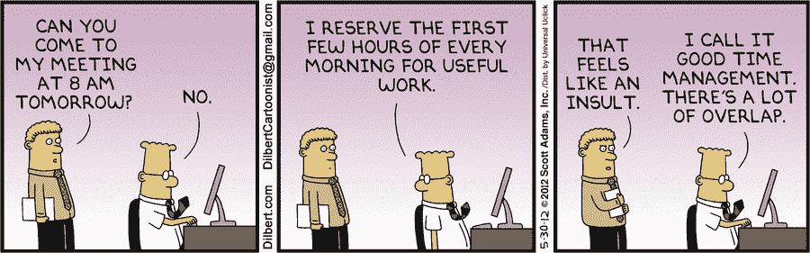

# 从工程师到经理:保持你的技术技能

> 原文：<https://medium.com/hackernoon/from-engineer-to-manager-keeping-your-technical-skills-40579cc8ea00>

两年前，我成为了一名工程经理。在这段时间里，我面临的主要挑战之一就是在我对团队的领导职责和我坚持编码的愿望之间找到平衡。

我想我一定不是唯一一个在这方面挣扎的人，所以我想我应该给出我的意见。

# 为什么工程经理应该具备技术能力

在我看来，**事必躬亲、技术过硬的经理是工程团队的最佳领导者**(也是大多数时候逃避[呆伯特原则](https://en.wikipedia.org/wiki/Dilbert_principle)的人)。作为一名技术能力强的经理，您将:

*   能够理解与你的团队必须执行的任务相关联的**隐藏的复杂性**，使与团队成员的沟通变得更加容易，并为产品或营销等非技术利益相关者简化信息。
*   **更有效地指导**您的工程师团队，并能够**在技术领域以身作则**。
*   注意你的团队可能使用的新工具和框架，并且能够给**更好的技术指导**。
*   更有可能被他们的工程师团队信任和尊重。这并不是说非技术型经理不能被尊重或信任。
*   保持**选项开放**以便将来返回个人贡献者轨道。

好的，我们同意保持和提高你的工程技能是一个非常好的主意。但这并非没有挑战。

# 程序员 vs 导师

你可能面临的第一个挑战是你的*工程师自我*和*导师自我*之间的冲突:你的工程师自我会想要解决你的团队面临的所有有趣的技术挑战。另一方面，你的导师应该想把问题交给团队成员，他们可以利用这些问题来提高他们的技能，成为更好的开发人员。

这个问题在有许多初级成员并且缺少高级工程师来指导他们的团队中会很尖锐。在这种情况下，工程经理将不得不更加重视她的角色的指导方面。

## 让你的团队成功

你的团队和你的人是第一位的，在任何编码之前。这是一个必要条件:*当且仅当*你的团队成功时，你才能投入一些时间去编码。

作为一名经理，你不是在打造一个产品，而是在打造一个知道如何打造产品的团队。因此，让你的团队成功应该是你的首要目标和自我评估的标准。如果你领导着一个由快乐的工程师组成的成功团队，这个团队的成功是不言而喻的，你将需要花更少的时间在会议上向你的同事和上级解释或推销你的成就。

一个由授权的个人组成的自给自足的团队，你不是决策的瓶颈，会给你一些额外的带宽去做其他的事情。

# 你的话更有分量

我面临的另一个挑战是，当团队讨论如何解决技术问题时，我的声音太大或表达意见太强烈。直到一名团队成员在与整个团队的公开反馈会议上让我知道了这个问题，我才意识到这个问题。她说了类似“*在我们的技术讨论中你太固执己见了…你应该给其他人更多的空间*

虽然有些经理确实非常直言不讳，并使用*权力演讲*，但我从惨痛的教训中得知，这将阻止其他人表达任何不同/反对的意见，你很可能会以更糟糕的解决方案结束你的问题。

我的建议？

## 总是最后发言，提出问题而不是给出答案

我怎么强调这有多重要都不为过。亲力亲为的经理必须充分意识到，他们说的或写的每一句话都可能以某种方式压制团队成员的想法或建议。

James Everingham 甚至更进一步，用他的[量子力学类比](http://firstround.com/review/the-principles-of-quantum-team-management/)表明，仅仅通过观察，一个管理者已经在改变一个项目的结果:

> ***观察者效应在职场中是真实存在的，你作为管理者只要插入自己就可以影响任何项目的结果。*** *通常，当他们开始在白板上画草图时，经理会把他们的团队带到一个房间，说:“这是我们需要做的，”或者“这是我一直在想的”，或者“这是我们可以考虑的一种方法……”。他们试图增加价值。我们总是想增加价值。但是如果你在任何权威的位置上，你这样做，你只是限制了结果的数量和你的成功之路。*

# 制造者 vs 管理者

我面临的一个更具逻辑性的挑战是试图将制造商的时间表和经理的时间表融合在一起。用保罗·格拉厄姆的话说(着重部分由作者标明):

> 大多数有权有势的人都在经理的日程表上。这是指挥时间表。但是还有另一种利用时间的方式，这种方式在程序员和作家等制造东西的人中很常见。他们通常喜欢以至少半天为单位来使用时间。 ***你不可能以一小时为单位写好或编好程序。这点时间刚刚够开始。***

简而言之，**经理们支离破碎的、被动的和会议驱动的日程安排与集中编码需求**(这是一种 [*深度工作*](https://www.amazon.com/Deep-Work-Focused-Success-Distracted/dp/1455586692) )根本不是好兆头。有人可能会说，管理者和创造者的时间表的特点是对立的:一名工程师需要尽可能少的干扰，而一名不参加会议或不与其他团队互动的管理者可能会因“在组织中不够显眼”而受到惩罚。

## 不要混淆这两个时间表

[http://dilbert.com/strip/2012-05-30](http://dilbert.com/strip/2012-05-30)

想都别想。这是感到沮丧和没有效率的秘诀。就像水和油一样，最好是保持它们的自然状态:彼此分离和独立。

我试着用午餐休息这样的自然干扰来分开我的时间表。将我所有的会议安排在上午，虽然会让我精神疲惫，但让我下午可以自由地戴上我的创造者帽子，专注于棘手的编程问题。我试着一周至少做两次。

我发现，拥有充足的午餐休息时间，如果可能的话，在办公室外面散散步，对我的大脑来说是完美的，可以从会议中脱离出来并重新设置，然后精力充沛地回来高效地编码。

当你戴着你的创造者的帽子时，你应该避免一切可能的干扰。首先，关掉电子邮件。然后，关闭浏览器中所有分散注意力的标签，如 *ehem、脸书、ehem* ，或者打开一个新的浏览器窗口，查阅你需要的文档。最后，我也会关掉 HipChat/Slack。当然，你应该始终为紧急问题留出一些沟通渠道，以便在必要时让合适的人(你的团队)联系到你。

能够高效和专注很大程度上取决于你身体和精神所处的环境。通过调整和调整你的环境(在不同的桌子/地方工作，听某种类型的音乐，任何适合你的)，你可以在很大程度上触发正确的心理环境，尽可能地提高工作效率。

在加州纽波特[的*深度作品*](https://www.amazon.com/Deep-Work-Focused-Success-Distracted/dp/1455586692) 中，你可以获得更多关于如何处理*浅层*与*深层*作品的技巧。

# 成为代码瓶颈

鉴于您繁忙的日程安排，您可能会发现很难及时完成任何编码任务，这意味着您可能会阻止某些功能被合并和部署到生产中。更糟糕的是，如果出现问题，您可能无法处理紧急的技术问题，如现场问题或管道破裂。

作为团队领导，你应该忙着保护你的团队不受分散注意力的会议和对话的影响，而他们可以专注于编码。同样，你的工作不是编码，而是确保你的团队能够有效地编码，并帮助你的团队将他们的成就社会化。

## 您的代码不一定要发布

当我们谈论事必躬亲的技术经理时，一位好朋友给了我这样的建议:

> *你不能成为你团队的瓶颈。你需要训练和指导你的团队成员，使他们能够在没有你的帮助下解决所有的技术挑战。* ***你应该永远不需要写生产代码*** *。编码时间的一个很大用途就是非特性的脏活。加快构建速度，将一些共享行为提取到一个不错的库中。寻找对团队来说更有效率或更有趣的事情。你也可以通过专注于编写概念的* ***证明来保持你的技术技能，探索新技术供你的团队使用，或者在公司内或自己做兼职项目*** *。*

我把这个建议记在心里，我对结果非常满意。知道我不是团队的技术瓶颈，我不仅感到压力较小，而且我的团队成员有更多的机会自己面对挑战，在这个过程中学习并成为更好的开发人员。

为了传递我的技术知识，我将有趣的问题与代码配对，我还举办“干净代码会议”,整个团队通过 mob 编程一起解决技术问题，或者只是分享一些技术知识和观点。

如今，我的大部分代码都是在业余项目上编写的，要么是在 Expedia 上(比如 Expedia Alexa 技能(T15))，要么是我自己的业余项目，比如 markpress(T17)，或者是我的看起来没用但很酷的劳力士 Chrome Start tab 扩展(T21)。

# 结论

做一个会编码的经理就像有两份工作一样。这需要努力工作和大量的奉献。如果你没有很好地处理好领导和发展团队与磨练技术之间的平衡，很容易感到不知所措或筋疲力尽。

我想说你需要热爱领导和编码来完成它，因为你需要花大量的*空闲时间*来提高你的管理者自我和/或创造者自我，但是，嘿，这是值得的！毕竟，[这是生命](https://www.youtube.com/watch?v=L9VBpbnXhWk)。

# 进一步阅读

*   [开发人员变成经理](https://stackoverflow.blog/2015/08/developer-turned-manager/)——stack overflow 的文章[大卫·哈尼](https://stackoverflow.blog/authors/haneycodes/)
*   [普通管理者 vs 伟大管理者](/the-year-of-the-looking-glass/average-manager-vs-great-manager-cf8a2e30907d#.l2ee53gzt) —的文章[朱莉·卓](/@joulee)
*   [制造者的时间表，管理者的时间表](http://paulgraham.com/makersschedule.html) —保罗·格拉厄姆的文章
*   [深度作品](https://www.amazon.com/Deep-Work-Focused-Success-Distracted/dp/1455586692) —由加州纽波特出版
*   团队中的团队:复杂世界的新交战规则——斯坦利·麦克里斯特尔将军著
*   [量子团队管理的原则](http://firstround.com/review/the-principles-of-quantum-team-management/) —文章作者[詹姆斯·埃弗林汉姆](https://www.linkedin.com/in/jevering) *，*insta gram 工程主管。

*如果你喜欢这篇文章，你可能也会喜欢* [*我对高绩效团队及其文化的看法*](https://hackernoon.com/just-do-as-expected-544385144f14) *。*

  I 感谢您的阅读，希望您觉得有用。如果你喜欢它，请**考虑订阅** [ **灰色事件** ](https://graymatters.substack.com/) **🧠** ，这是我与[马里奥·查莫罗](https://medium.com/u/6291e977af46?source=post_page-----40579cc8ea00--------------------------------)共同撰写的每周时事通讯，我们在这里讨论生产力、科技、新常态以及介于两者之间的一切。