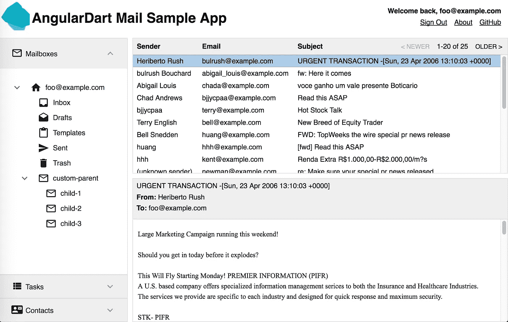
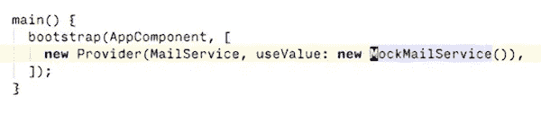
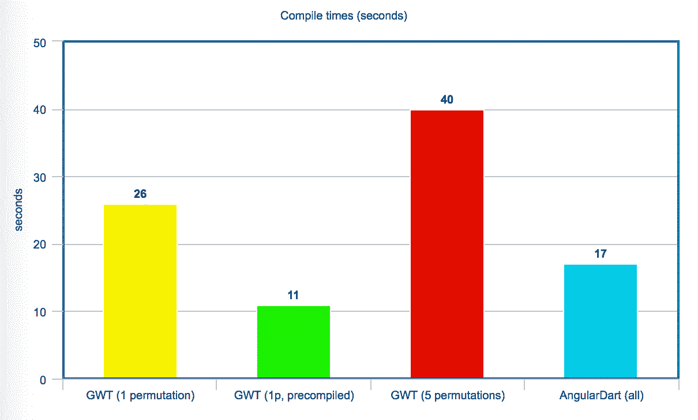

# 从 GWT 到安古拉达特:一个有源代码的案例研究

> 原文：<https://medium.com/hackernoon/from-gwt-to-angulardart-a-case-study-with-source-code-a049ba8b6df3>

今年早些时候，有人问我是否有一个好方法来比较在 [Google Web Toolkit](http://www.gwtproject.org/) (GWT)和 [Dart](https://www.dartlang.org/) ，特别是 [AngularDart](https://webdev.dartlang.org/angular) 中开发 web UIs。在与 GWT 和达特合作之后，我对它们的区别有了很好的了解，但随着我思考得越来越多，我开始怀疑将一个 GWT 应用程序移植到 AngularDart 会有多难。这篇文章描述了我在做这件事时的发现。

GWT [邮件示例](http://samples.gwtproject.org/samples/Mail/Mail.html)是一个理想的起点:它不仅仅是一个简单的例子，具有多样的特性和复杂的 UI 交互，但是它的大小仍然是可管理的。

如果你赶时间，可以看看[工作演示](https://isoos.github.io/gwt_mail_sample/)和[源代码](https://github.com/isoos/gwt_mail_sample)，或者滚动到底部查看结论。



Screenshot of the [demo](https://isoos.github.io/gwt_mail_sample/).

# 迁移的方法

我在没有任何自动化编译器的情况下完成了移植。虽然可以编写一个工具来自动将 GWT 模板转换成 Angular，或者将支持 Java 代码转换成 Dart，但我不建议这样做。模板、样式或 Java 代码使用的模式很可能更适合新方法。我将在下一节列出其中的一些新方法。

我的过程非常简单。我将 GWT 和 AngularDart 代码放在同一个 git 存储库中，并执行了以下循环:

1.  从 GWT 代码库中选择一个小型或中型的代码块。通常这是一个单独的部件，或者是一个复杂部件的一小部分。
2.  仔细研究代码中的特性和边缘情况。大多数专有代码库都是一些人塞进去的边缘案例。如果有 5 个以上的边缘情况，这很好地表明任务太大，需要分成多个块。
3.  在 AngularDart 中实现所选零件。这听起来很简单，因为很简单。:-)
4.  从 GWT 代码库中删除所选零件。GWT 应用程序将不再构建，但是您可以轻松地跟踪尚未迁移的部分。

你可以通过观察[提交历史](https://github.com/isoos/gwt_mail_sample/commits/master)，或者通过查看 [log.md](https://github.com/isoos/gwt_mail_sample/blob/master/log.md) 文件来检查我的进度和每个步骤，我在做修改的时候一直在写这个文件。一个有趣的观察:**写下更改比在 AngularDart** 中实现代码花费更多的时间。

# 旧解决方案与新解决方案

大部分的迁移都很简单:简单的模板和样式可以很容易地映射到它们对应的角度。我不会在微小的细节上浪费你的时间；相反，我将只谈论不同的部分。

第一个也是最明显的区别是设计:Angular 版本使用了 [angular2_components](https://pub.dartlang.org/packages/angular2_components) 包中的材质小部件。这个包有很多有用的组件，如果你是从 AngularDart 开始，你应该试着使用它。虽然这两个堆栈都有大量可供选择的现成组件，并且大多数组件在特性和设置方面都有 1:1 的映射，但有时您需要自己判断使用或选择哪一个。

Watch the new version alongside the old one. AngularDart Components make it easy to have nice animations and consistent component views.

我错过了 AngularDart 组件中还没有的一些东西，比如表和树组件。然而，正如你在日志中看到的，用 Angular 的`*ngFor`模板实现它们真的很容易。例如，邮件条目列表由下面的模板处理，这比 MailList.java[中 GWT 的表初始化简单得多:](https://github.com/isoos/gwt_mail_sample/blob/master/gwt/original/src/com/google/gwt/sample/mail/client/MailList.java)

```
<div *ngFor="let item of items"
     class="row"
     (click)="selectRow(item)"
     [class.selected]="isSelectedRow(item)">
  <div class="col sender">{{item.sender}}</div>
  <div class="col email">{{item.email}}</div>
  <div class="col subject">{{item.subject}}</div>
  <material-ripple></material-ripple>
</div>
```

我被告知团队正在开源更多的组件；祈祷一个更复杂的表将很快被包含进来。

不太有趣，但一个重要的区别是缺少静态变量和对单例实例的处理。在 GWT 版本中，电子邮件列表存储在 MailItems.java[的静态字段中。在 Dart 版本中，相同(以及更多)的功能由](https://github.com/isoos/gwt_mail_sample/blob/master/gwt/original/src/com/google/gwt/sample/mail/client/MailItems.java) [MailService](https://github.com/isoos/gwt_mail_sample/blob/master/lib/mail/mail_service.dart) 处理，它是注入的，更适合单元测试。

为了更容易开发(也是为了匹配 GWT 版本)，我从一个[模拟](https://github.com/isoos/gwt_mail_sample/blob/master/lib/mail/mock_mail_service.dart)实现开始，之后很容易在 web 客户端后面插入一个真正的 API。例如，配置注入就像下面的代码一样简单。切换到真正的实现将只是改变它的`useValue:`部分。



Change to real implementation when ready.

从更主观的角度来说，我发现 AngularDart 在代码、HTML 模板和 CSS 样式的分离方面比 GWT 好得多。GWT 代码库允许在 Java 代码中加入样式细节和模板构造，而这些部分是最难移植到更简洁版本的。

# 数字的最终结果

虽然 AngularDart 版本有更多的功能，我也实现了像 tree 这样的定制组件，但总的来说，它比 GWT 版本的代码少。取决于你如何计算，**代码大小减少了 30%** 。

我使用 Dartium 开发应用程序，所以我不需要将 Dart 代码编译成 JavaScript 一切都是通过低延迟的类型-保存-刷新周期完成的。然而，最终结果需要被编译成 JS，并且它可能提供比较数字的值。在我的 Macbook Pro 上，GWT 应用程序的编译时间是:

*   1 次置换需要 26 秒，
*   如果 Java 源代码已经编译，则为 11 秒，并且
*   所有 5 种排列需要 40 秒。

Dart 版本花了大约 15-20 秒编译成跨浏览器的 ES5。这并不是非常快，但是比 GWT 编译器快**。**



Compile times (in seconds)

最后，关于输出 JavaScript 的大小有一些注意事项。GWT 编译器为每个排列产生不同的 JS 版本(目标浏览器)，而 Dart 编译器只发出一个编译版本。GWT 的输出大约是 207 KB /排列(当压缩时，所有 5，84kb/排列总共 100 万)，而 AngularDart 版本的输出是 689 KB(压缩了 178 KB)。

考虑到应用程序逻辑更加复杂(例如:多样化的小部件、涟漪、更详细的邮件项目处理)，较大的 JS 大小并不令人惊讶，尽管我希望它会更小。对我们来说幸运的是，其中很大一部分是“固定成本”，额外的组件只增加了一点点大小(与其复杂性成比例)。

# 结论

这两种技术都源于 Google，都能够支持更大的团队规模，但是它们代表了两个非常不同的时代。我发现 GWT 代码更难阅读和推理；AngularDart 版本对我来说更紧凑更简单。但是不要盲目相信我的观点。我强烈建议你[亲自试用](https://isoos.github.io/gwt_mail_sample/)该应用程序并检查[源代码](https://github.com/isoos/gwt_mail_sample)。

我还发现材料成分令人耳目一新，大多数时候它们都不碍事。相比之下，设计和定制 GWT 组件更难，需要的时间花在应用程序本身上会更好。

如果你想把你的 GWT 应用迁移到更新的 T4 技术上，AngularDart 是一个可行的选择。毕竟，[谷歌](https://hackernoon.com/tagged/google)也在做同样的事情:他们正在将关键应用从 GWT 迁移到 Dart(见他们的 [AdSense](http://news.dartlang.org/2016/10/google-adsense-angular-dart.html) 和 [AdWords](http://news.dartlang.org/2016/03/the-new-adwords-ui-uses-dart-we-asked.html) 采访)。

[](http://bit.ly/HackernoonFB)[](https://goo.gl/k7XYbx)[](https://goo.gl/4ofytp)

> [黑客中午](http://bit.ly/Hackernoon)是黑客如何开始他们的下午。我们是 AMI 家庭的一员。我们现在[接受投稿](http://bit.ly/hackernoonsubmission)并乐意[讨论广告&赞助](mailto:partners@amipublications.com)机会。
> 
> 如果你喜欢这个故事，我们推荐你阅读我们的[最新科技故事](http://bit.ly/hackernoonlatestt)和[趋势科技故事](https://hackernoon.com/trending)。直到下一次，不要把世界的现实想当然！

