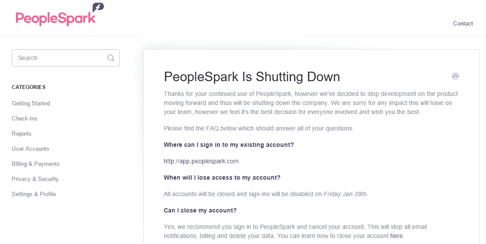

# 从启动到筹集 100 万美元再到在 3 个月内关闭

> 原文：<https://medium.com/hackernoon/from-launch-to-raising-us-1m-to-closure-in-3-months-54c97541cebf>

自从我在[的员工脉搏调查初创公司](http://www.6q.io)于 11 月推出 8 个月后，我对另一个澳大利亚员工脉搏调查工具 [PeopleSpark](http://www.peoplespark.com) 产生了兴趣。

我钦佩地看着，因为他们真的在运作公关机器，在发布时有大量的媒体报道。

当[仅仅几周后宣布 100 万美元的种子基金](http://www.startupdaily.net/2015/12/bigcommerce-cofounder-mitchell-harper-goes-all-in-on-new-platform-peoplespark-leading-usd1-million-seed-round/)时，我惊呆了。哇，这真是飞速的增长。我不得不承认我很嫉妒。我很想给我们不起眼的初创公司投点钱。我坚信 6Q 可以帮助许多其他组织，就像它帮助了我们一样，这是它成立的最初原因。

就在声明发布几天后，竞争对手 155 的联合创始人兼首席执行官大卫·哈塞尔(David Hassell)在 12 月初写了一篇文章，题为[当竞争对手完全剽窃你的整个公司时是什么感觉(我正看着你，米切尔·哈珀)](/life-learning/what-it-feels-like-when-a-competitor-utterly-rips-off-your-entire-company-i-m-looking-at-you-def1e0528fa3#.ihzqr857e)然后米切尔·哈珀也在 Medium 上写了一篇回应；[与冷漠竞争](/@mitchellharper/competing-against-indifference-c5c0f6e79c05#.550e6mw12)。

我不知道那些文章的主题背后的故事到底是什么，我也不打算给出任何意见。然而，我确实知道，当我们在 2014 年 9 月建造 [6Q](http://www.6q.io) 时，我还没有听说过[155](http://www.15five.com)；直到接近 2015 年 3 月我们的实际发布时，我才看到我们有竞争，也有很棒的产品。是的，我在做竞争分析时失败了。

今天，我刚刚听说仅仅三个月后， [PeopleSpark 宣布关闭](http://www.startupsmart.com.au/planning/business-planning/australian-startup-with-us1-million-in-funding-shuts-down-after-three-months/2016012816360.html)，立即生效。

New page when accessing peoplespark.com (28 Jan 2016)

PeopleSpark 的故事必须是澳大利亚创业历史上最快的启动、融资和关闭，甚至可能是世界上最快的。上个月，澳大利亚还发生了其他一些关于初创公司的负面新闻，比如 Sociabl 的寿命非常短，这是否表明，由于担心快速倒闭或投资者，以及担心快速亏损，客户将会回避初创公司？

我相信经验丰富的企业家 Mitchell Harper 很快会带着另一家企业回来(他已经创建了 five prior ),并将继续取得进一步的成功，然而它确实提出了一个问题，PeopleSpark 发生了什么，这是否会对所有澳大利亚初创公司产生不良影响？

感谢您的评论或分享。

> [黑客中午](http://bit.ly/Hackernoon)是黑客如何开始他们的下午。我们是 [@AMI](http://bit.ly/atAMIatAMI) 家庭的一员。我们现在[接受投稿](http://bit.ly/hackernoonsubmission)并乐意[讨论广告&赞助](mailto:partners@amipublications.com)机会。
> 
> 如果你喜欢这个故事，我们推荐你阅读我们的[最新科技故事](http://bit.ly/hackernoonlatestt)和[趋势科技故事](https://hackernoon.com/trending)。直到下一次，不要把世界的现实想当然！

