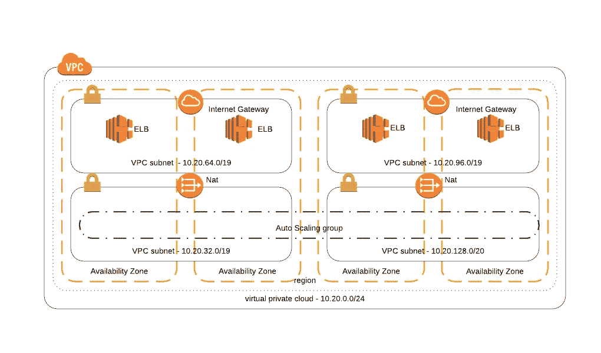
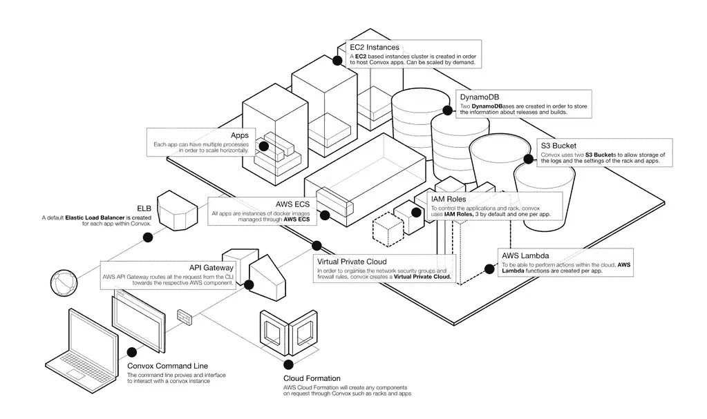

# 从内部部署到 AWS 再到 ECS 等等。在亚瑟王数字媒体公司的过去 5 年。

> 原文：<https://medium.com/hackernoon/from-on-prem-to-aws-to-ecs-and-beyond-the-past-5-years-at-arthrex-digital-media-f68bc2bc534e>

今年 12 月标志着我在 Arthrex 数字媒体部门工作了 5 年(当我开始工作时，这个部门还不存在)。Arthrex 是一家医疗保健公司，专门从事矫形器械、硬件和技术。数字媒体团队特别关注外科医生和患者教育、手术结果跟踪等。

回顾这 5 年的里程碑，我觉得这是一个值得分享的基础设施发展故事。我们最初从由另一个内部团队管理的本地虚拟机迁移到 AWS 云的故事。然后，您可以跟随我们从以 EC2 为中心的部署到当前 ECS 方法的迁移。然后，我们可以展望一下不久的将来，并涵盖我们 2018 年的计划。我将掩饰我们使用过的过时/退役的技术，并在我们的部署更新时提供更多细节。

第一天:2012 年 12 月 17 日，离所谓的世界末日还有短短的 4 天，我们负责的少数 web 应用程序是用 coldfusion 或 flex 编写的。我们这个时代的研究主题将是 arthrex.com，它托管在两个 Windows 2008 虚拟机和一个裸机 Windows 系统上(被亲切地称为“节点 a”、b 和 c)。这些应用服务器由 Cisco NetScaler 进行负载平衡。当时，我们所有应用程序的数据存储是一个 2008 MSSQL server 设置，用于跨数据中心进行手动故障转移。

软件和系统补丁以及部署都是手动完成的，最多需要从负载平衡器中删除节点、打补丁并重新启动机器，然后再手动将它们重新添加到负载平衡器中，完全不需要自动化。至少在部署过程中需要重启应用服务器。

随着时间的推移，这些节点开始显示它们的年龄，主要是在部署期间，这在当时有一个坏习惯，即在一天的晚些时候发生。每当一个节点必须重启时，我们都不确定它是否会及时恢复。再加上负载均衡器上的请求备份，当非常慢的(当时的)应用服务器准备好服务并返回负载均衡器时，它们就会过载。我们最终不得不在添加节点之前预热它们，通过 WebEx 协调将它们加入和退出负载平衡组。

我们刚刚谈到的所有这些资源，以及 DNS、电子邮件、监控(或缺乏监控)都是由我们部门之外的基础架构团队管理的。在一个成长中的公司中，相互冲突的优先级和不同的技术意识形态有时会给变更、规划部署甚至故障排除带来困难。

事情需要改变，是时候把我们的命运掌握在自己手中了。

让我们跳到一年后的 2013 年第四季度，以及 surgicaloutcomesystems.com(SOS)的背景，这是一个内部开发的 Rails 应用程序，已准备好进行部署。这个应用程序是对当时包含 PHI 的本地 flex 应用程序的重写。随着它从 flex 转移到 rails，问题是，我们如何托管它？我们是否可以提交一张服务台票证，并通过电子邮件发送给基础架构团队，然后随时待命？经过许多内部辩论、与 AWS 的讨论以及许多会议之后，商业案例被提出并被同意转移到 AWS。据我所知，我们是首批签署 AWS HIPAA 合规性 BAA 的公司之一。当然，至少 SOS 会成为第一个托管在云中的 Arthrex 应用程序。

舞台已经搭好，繁文缛节已经取消，手铐也已经取下。order，one rails 应用程序在 AWS 上以高可用性、HIPAA 兼容的方式托管。基础设施即代码是我们 DevOps 团队的核心租户。对于配置管理，Puppet solo 会将系统与我们期望的状态同步。编排是通过嵌套的云信息堆栈完成的，这些堆栈在网络、计算、数据存储等方面进行了逻辑分区。至于 CI 和部署工作，我们安装了一个 Jenkins 服务器，在这里我们还安装了 [Hubot](https://github.com/hubotio/hubot) 用于 Hipchat 中 ChatOps 驱动的部署。为了监控，我们带来了新的遗物。OpenVPN 将为开发人员、质量保证人员、数据库管理员和运营人员提供我们需要的任何私有[网络](https://hackernoon.com/tagged/network)。

我们的 VPC 设计将公共子网用于带有互联网网关的 elb，将带有 EC2 nat 实例的私有子网用于我们的应用程序和数据库服务器。为了将 AWS 最佳实践与高可用性相结合，我们在具有预烘焙 ami 的自动扩展组中跨多个 AZs *部署了我们的 EC2 实例，这意味着不再有宠物节点 a、b 和心爱的节点 c。在自动扩展组中和 EC2 上，这些应用节点必须是无状态的，这里没有本地会话存储，因为现在它们可能随时消失，这与本地不同。

VPC 设计(简化版):



在任何生产代码变更过程中，一旦它已经过 QA 测试并签字同意，我们将对单个节点进行金丝雀部署。一旦看起来不错，我们就基于那个节点烘焙一个新的 AMI，用新的 AMI 更新一个 cloudformation 参数，用滚动部署更新我们的自动伸缩组。为了开始这个全自动的过程，您将运行`hubot deploy production`来做金丝雀，运行`hubot ship production`来烘焙 AMI 并更新云形成。

*跨区域部署仍然是我们希望完成的事情，新的[跨区域 VPC 对等](https://aws.amazon.com/about-aws/whats-new/2017/11/announcing-support-for-inter-region-vpc-peering/)让这变得更加令人兴奋！

为了检查合规性，我们仅限于 AWS 服务的一个子集，其中一些有特定的限制，一些要求今天仍然存在。任何 EC2 资源都必须位于专用的 VPC 内，所有 PHI 都必须在静态和传输中加密，ELB 只能在 tcp/ssl 模式下运行，这使得捕获请求者的真实远程 ip 变得更加困难，没有 RDS 支持，这样的例子不胜枚举。

数据迁移计划已准备好从旧模式迁移到新模式。DNS 已准备好更新。基础设施、监控和部署流程都已就绪。2014 年初，SOS 在 AWS 上重新启动，并继续运行相同的代码库，但基础架构和流程发生了巨大变化。

SOS 中使用的基础设施架构模式被应用到团队承担的所有新建项目中。我们有一些由 yaml 驱动的可预处理的 cloudformation 模板，您可以更简洁地在其中声明应用程序，以便轻松地遵循该模式。我们也可以将一些网站转移到 s3 静态网站。到 2014 年底，我们在 AWS 上有了稳固的立足点，但我们在内部仍有相当大的份额，包括 arthrex.com 及其不断增长的各种问题。

我们开始部署和迁移更多的支持企业[工具](https://hackernoon.com/tagged/tools)到云，如吉拉、Confluence 和 Github，考虑到我们公司办公室有许多用户，在办公室使用 AWS VPN 连接建立 VPN 连接是有意义的。我们还将我们的整体部署划分为多个 VPC，以实现职责的逻辑分离，并通过 VPN 连接将每个新的 VPC 连接到办公室。这演变成了基于职责的多帐户策略，我们可以使用 IAM 角色来控制跨帐户的权限和访问。

2015 年，进入我们的容器采用时代。作为一个 DevOps 团队，我们花了一段时间来寻找将容器引入工作流的方法，以及如何运行生产 docker 集群。实验横跨 K8s、Deis、Flynn、Panamax、ECS 等。当时，其中一些还不成熟，或者运行它们意味着 DIY etcd 或 ceph 管理和 HA 架构……经过一段时间的实验后，我发现这不值得付出额外的开销或压力，至少当有一个很好的开源管理的 AWS ECS 产品叫做 [Convox](https://convox.com/) 时，它可以立即用于本地开发和生产质量部署。

Convox AWS 架构:



Convox 提供了一个核心的预处理 cloudformation 模板，它为您提供了上述架构(或接近它的日期图),它在 AWS ECS 中运行自己的 api。

Convox 强大的`convox start`命令在 cwd 中查找 Dockerfile 和“docker-compose.yml”文件。它们支持 docker compose v2 的子集来描述本地开发和部署。`convox start`将在后台运行一个`docker-compose up`命令，连接代码同步，从您的应用程序中附加 stdout 日志，并将它们路由到您的终端。

要在 AWS 上安装你的应用程序，你可以创建`convox apps create my-app`，然后通过`convox deploy -a my-app -f docker-compose.prod.yml`部署你的应用程序，这反过来又会创建一个新的 cloudformation 堆栈。我们使用多个 docker-compose。*.yml 文件来控制我们是否需要某个容器或端口配置用于不同的目的。这个新的应用程序堆栈将创建一个负载平衡器，在每个 docker compose 进程的基础上公开 docker-compose.yml 文件中定义的端口。它还将使用您的 docker 文件创建 ECS 任务定义和 ECS 服务，docker 文件附加到调配的负载平衡器。还有一些其他的 AWS 服务，但这些是最重要的。

最初，我必须添加对专用网络和定制 VPC CIDR 设计的支持，以便我们能够部署生产负载和连接我们的 VPN。但除此之外，开箱即用的它提供了我们需要的一切，让我们所有的应用程序容器化，并准备开始使用标准的 CI 管道。综上所述，我们已经找到了我们的容器平台，并开始了对剩余的遗留本地应用程序和现有的基于 ec2 的应用程序进行容器化的艰难过程。从这一点开始，在 2016 年初，所有新的开发都是基于 docker 的。到目前为止，Convox 一直是一个很好的操作和部署平台，并在有限的资源下加速了我们最初的容器采用。

对于使用 convox/ecs 的服务发现，我们使用 [kong](https://github.com/Kong/kong) 和 [kongfig](https://github.com/mybuilder/kongfig) 来声明我们的 API。Kong 是一个开源 API 网关，其中我们为 dev 运行一个 kong 节点，为 prod 运行一个集群。我们将它用于 web 应用的 DNS，并作为微服务的真正 api 网关，包括报头注入、JWT 认证等等。我们在这一层保持服务发现的不可知性和声明性，以确保它在应用程序之间是可重复的和一致的。

我们在三个环境中运行 kong，本地、开发和生产。每个都有自己的一组 api 消费者、JWT 秘密和通过基于主机名的路由可到达的 api 端点，允许我们将地址和端口映射到 DNS 名称，这正是我们需要寻址到我们的单个容器的名称，而不必担心端口，任何东西都可以使用:443 和:80，而不管我们的 elb 上暴露了什么。当然，Kong 本身作为一个容器部署在我们的 convox local 或 ecs 集群上。

每个 kong 环境在 route53 中获得 2 个映射到其 ELB 的 dns 条目，一个直接映射到 kong api，即`mydevdomain.com`，以及一个通配符条目，用于该节点将托管的任何 api，即`*.mydevdomain.com`，其说明了在`myservice.mydevdomain.com`或`mybetterservice.mydevdomain.com`暴露的 kong API，而无需直接在 route53 中注册。

进一步看一下本地开发，我们正在运行一套容器来提供更好的开发-生产对等性，即 kong 及其支持容器、postgres 和 kong dashboard。Kong 仪表板用于查看本地和部署的 kong 并对其进行故障排除。该套件在 docker-compose 应用程序中描述，当安装 docker.sock 时，该应用程序还提供用户定义的网络。我们将它隐藏在本地 cli 后面，但其内部工作原理如下:

创建或启动名为“arthrex”的应用程序，并分离流程:

`docker-compose --project-name arthrex up -d --force-recreate`。

而这里是对应的 docker-compose.yml:

```
version: '2'
services:
  kong-database:
    image: postgres:9.4
    ports:
      - 5432:5432
    networks:
      dev:
        aliases:
         - kong-database.arthrex.xyz
  kong:
    image: kong:0.9.3
    ports:
      - 80:8000
      - 443:8443
      - 8001:8001
      - 7946:7946
      - 7946:7946/udp
    environment:
      - KONG_PG_HOST=kong-database.arthrex.xyz
      - KONG_PG_DATABASE=postgres
      - KONG_PG_USER=postgres
      - KONG_PG_PASSWORD=postgres
    restart: always
    security_opt:
      - seccomp:unconfined
    networks:
      dev:
        aliases:
          - kong.arthrex.xyz
  kongdashboard:
    image: pgbi/kong-dashboard:v2.0.0
    ports:
      - 3070:8080
    networks:
      dev:
        aliases:
          - kong-dashboard.arthrex.xyz
  mailcatcher:
    image: yappabe/mailcatcher:latest
    ports:
      - 1025:1025
      - 1080:1080
    networks:
      dev:
        aliases:
          - mailcatcher.arthrex.xyz
networks:
  dev:
    driver: bridge
```

现在，让我们来看一个用 kongfigure 引导的示例应用程序，用于在`convox start`和`convox deploy`上进行自我声明。

```
version: "2"
services:
  kongfigure:
    build: ./kongfigure
    environment:
      - WWW_NAME
      - KONG_HOST
      - WWW_VIRTUAL_HOST
      - API_URL
    links:
      - www
    volumes:
      - /var/run/docker.sock:/var/run/docker.sock
  www:
    build: ./www
    environment:
      - API_URL
    ports:
      - 4200
networks:
  dev:
    external:
      name: arthrex_dev
```

。/kongfigure/Dockerfile

`FROM arthrex/kongfigure:0.3`

。/kongfigure/kongfig.yml

```
apis:
  - name: $WWW_NAME
    attributes:
      request_host: $WWW_VIRTUAL_HOST
      upstream_url: "[http://$WWW_HOST:$WWW_PORT](http://$WWW_HOST:$WWW_PORT)"
```

当应用程序启动时，kongfigure 执行其在 ONBUILD 中烘焙的命令`kongfig apply`。这将使用本地 kongfig.yml 文件向 kong 注册应用程序负载平衡器。`$KONG_HOST`变量决定了我们的目标是哪个 kong 环境，本地、开发还是生产。通过与 docker-compose.yml 链接部分的集成来填充`$WWW_NAME`和其他变量。

Kongfigure 还管理我们的 docker-compose.yml 文件“arthrex_dev”中指定的应用程序专用网络配置，该网络只存在于本地。这只是由基础设施作为代码驱动的另一种方法，这里我们有由代码声明的服务路由。

到 2016 年底，我们将最后一个应用从内部迁移到 docker，到 2017 年初，我们所有的应用都在 convox 上运行。极大地简化和通用化了我们的 rails、go、coldfusion、node 和其他应用的操作。目前大约有 35 个 docker 节点、130 多个应用程序实例和 300 多个容器。

2017 年是我们改造基础设施以使其更易于使用和操作的又一年。两个 DevOps 团队成员的加入大大加速了这一过程，所以现在我们实际上有了一个真正的团队，而不是一个人的军队！今年的一些重大改进包括环境变量的标准化、从 MSSQL 到 Postgresql 的迁移、PRs 现在创建并部署到用于隔离测试的按需容器中、我们引入 vault 作为我们配置的单一真实来源等等！

Vault 现在是 hashicorp 的中央配置和秘密存储。我们在其中存储多种类型的数据，包括第三方工具凭据、数据库凭据、服务器凭据、应用程序配置和机密，不胜枚举。我们建立这样一个商店的主要原因之一是为了应用程序配置的编程访问，以支持我们的自动化计划。

我的新(ish)同事，高级 DevOps 工程师 Braxton Beyer，一直忙着用基于 github hook 的 CircleCI 替换我们基于 hipchat/hubot/jenkins 的部署方案。这个新平台已经经历了几次考验，从 circle 1，到 circle 2，再到一个定制的 docker 构建映像，该映像托管了一个用 ruby 编写的通用构建 pipline。ruby built pipeline 允许跨我们所有应用程序的标准化部署，因为管道与我们的应用程序的接触点是 Convox 级别，它不知道它正在部署什么。从运营的角度来看，现在只需学习一个部署流程，但无需动手。从开发人员的角度来看，他们的 github PR 现在都是部署的动力和接口。展望未来，这个标准管道是开始实施代码质量检查、林挺、静态分析和其他与您的服务/应用程序的可部署性相关的自定义检查的最佳位置，所有这些都在一个位置，并且一次针对所有适用的应用程序。

这个管道中的一个关键步骤是实现一个长期持有的想法，即从 github PR's 创建按需环境。每当在我们的一个回购上打开一个新的 PR 时，circleci 都会启动一个新的 convox/ecs 应用程序的供应流程。

遵循我们的约定，我们然后将变量`$APP_NAME`和`$APP_ENVIRONMENT`注入到构建管道中，这基于 github 分支或 PR 名称。然后，我们从 vault 中提取模板化的 env 文件，并对其进行评估，即:

```
MY_SECRET=thisissecret
VIRTUAL_HOST=$APP_NAME.$APP_ENVIRONMENT.mydevdomain.com
NEW_RELIC_NAME=$APP_NAME-$APP_ENVIRONMENT
```

鉴于`APP_NAME=myapp`和`APP_ENVIRONMENT=shiny-feature`。这个 env 文件变成

```
MY_SECRET=thisissecret
VIRTUAL_HOST=myapp.shiny-feature.mydevdomain.com
NEW_RELIC_NAME=myapp-shiny-feature
```

接下来，我们通过`convox env set`将环境注入到 convox 中。然后，我们通过`convox deploy`部署您的应用程序，从那里，您的应用程序将启动，kongfigure 将运行并声明您的应用程序路由配置，hipchat/github 将收到构建成功的通知并提供新生成的端点。快速冒烟测试、全面的 QA 测试或开发人员评审可以在代码的实时版本上进行，而不必在本地克隆和运行。这些环境是临时的，并且被设置为在 PR 合并时被销毁。

这个 github PR 管道是所有管道中最健壮的，由于它是我们标准开发 CI 环境和生产环境部署过程的超集，我们的整个基础设施作为代码画面变得非常枯燥。

为了向开发人员公开应用程序配置控制，他们每个人都可以通过 vault-web UI 访问 vault，并且能够将他们的应用程序实例的条目更新为 JSON 对象。我们在集群上运行一个守护进程，确保应用程序配置的状态在我们的 convox 集群上得到满足。从我们的 PR 管道生成的评估后的 env 文件也被写回到 vault 中，以提供对新应用程序配置的访问。

因此，我们在这里，结束了 2017 年，仍然将我们的旧应用程序纳入 PR 管道流程，并开始超越我们的 convox 部署，展望未来。AWS 托管 EKS 看起来非常令人兴奋，k8s 提供的控制平面功能是首屈一指的，AWS 上的托管产品是一大胜利。我们在 Convox 和 ECS 方面的经验将极大地推动我们对这个新平台进行审查，如果准备好了，就可以投入使用。

我们还希望采取进一步措施来定义关键应用元数据，这些元数据用于为新的和现有的应用提供和推动从概念到部署后监控的整个自动化管道，缩短新服务的启动时间，同时让我们的传统应用与当前的内部最佳实践保持一致。这种顶级元数据将进一步推动下游集成、基础设施和应用程序的配置。

如果这些听起来对你有吸引力，Arthrex 正在从 dev、devops 等部门招聘许多职位，请发电子邮件到 cleblanc@arthrex.com 给我。