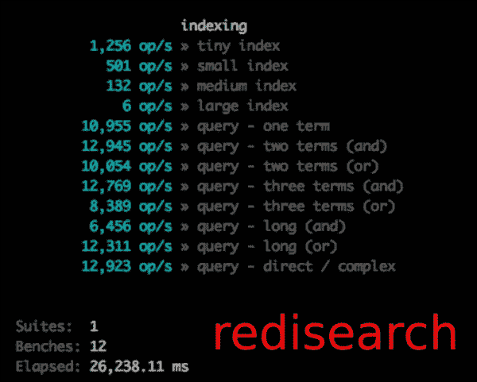
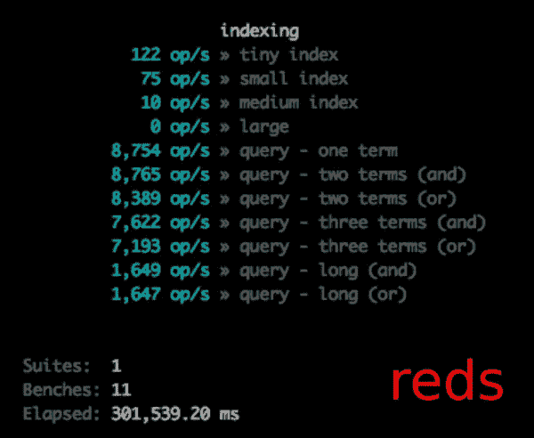

# 从红色到再研究

> 原文：<https://medium.com/hackernoon/from-reds-to-redisearch-680f79257420>

## Redis 搜索变得更有趣了

你听说了吗？Redis 4.0 出来了。这意味着**模块**。不仅仅是在理论上，不应该在生产中运行。意思是黄金时间。把它们扔到你的生产服务器上然后走人。

*注意:Redis(数据库)和 node . JS(JS 运行时)都使用“模块”这一术语来表示不同的概念——这里的语言需要稍加修饰才能清楚和区分。*

最近我[写了关于](/@stockholmux/the-road-to-redis-chapter-3-b9796362c809) [红人](https://www.npmjs.com/package/reds)， [Node.js](https://hackernoon.com/tagged/node-js) /Redis 搜索引擎模块。red 相当不错——我已经围绕它构建了完整的 web 服务，它们运行得非常快。然而，Node.js 是 [Javascript](https://hackernoon.com/tagged/javascript) ，Javascript 虽然速度相当快，但仍然被解释，并且与数据库(Redis)在完全不同的层上。然而，模块是用编译语言构建的，在逻辑和数据之间没有网络层。他们必须更快，对吗？这就是我的任务——模块比脚本快多少。让我们来了解一下！

## 输入:重新搜索

我维护 red 已经很多年了，我非常熟悉代码和脚本的使用。几个月来，我也一直在关注再搜索的发展(这篇关于再搜索的白皮书引起了我的兴趣)。它已经从简单的东西发展成非常强大的东西:

*   RediSearch 有自己的模块系统用于扩展*(触发艾勒比图像宏关于模块内部的模块)*
*   在 RedisConf 17 期间，展示了一个 RediSearch 集群实现的预览演示，它以 100k documents/sec 的速度索引了超过 10 亿(是的，a **b** )个文档。

除了变音位索引，[redsearch](http://redisearch.io/)拥有 red 拥有的一切，甚至更多。我的目标是看看我是否能设计出 Reds 功能来重新搜索并创建一个(或多或少)语法兼容的 Node.js 模块:RedRediSearch。语法兼容性将允许 red 的现有用户进行相当轻松的“推倒重来”。

## 微小的差异

不幸的是，你不能仅仅指向 Reds 数据的重新搜索并神奇地获得性能，你需要重新索引你的数据。RediSearch 是一个 Redis 模块，与使用原生 zsets 的 red 相比，它使用不同的(坦率地说，更有效的)定制数据类型。除此之外，它是无痛的。你会发现索引非常快。

“自然语言处理”功能不能映射，尽管您可能不需要它，或者可以通过对您的索引进行一些调整来实现(我将在后面介绍)。另一件事是，创建索引在概念上是不同的——在 red*中，red . create search*只准备 Node.js 接受数据。然而，在 RediSearch 中，创建一个索引是一个真正的 Redis 调用( [FT。创建](http://redisearch.io/Commands/#ftcreate)，因此需要回调。除此之外，搜索和索引是相同的语法。改编我的一些脚本就像调整 3-4 行代码一样简单。我还添加了一个函数来确认模块的存在。我就是这么好的人。

## 你从红方的再研究中得到了什么？

你会有更好的表现。在同一台机器上对相同的数据运行 [Reds 基准](https://github.com/tj/reds/blob/master/benchmarks/index.js)，我在索引时的 Reds 重搜索性能提高了 6.6 到 13 倍(取决于文档的大小)。查询速度也更快—快了 1.2 到 7.4 倍。整个基准测试的完成速度提高了 12 倍。这是一个巨大的进步。



Yowza! Note: “ops” here are whole documents or search queries indexed per sec, not Redis operations per second!

这是在一台普通的笔记本电脑上，没有安装 OSS Redis。

切换到 RedRediSearch 的另一个好处是一个更丰富、更灵活的查询系统。

切换到 RedRediSearch 的另一个好处是一个更丰富、更灵活的查询系统。

red 有两种搜索能力:AND 和 OR。也就是说，您只能查询包含其中一个查询关键字或所有查询关键字的文档。有用，但是不太灵活。

有了 RediSearch，你就有了一个丰富的查询语言，可以让你做所有 red 能做的事情，还可以进行精确短语搜索、否定搜索、前缀搜索、可选关键字和组合搜索。开箱即用，RedRediSearch 可以适应语法兼容的搜索:

```
//defaults to an "AND" search
search
  .query('cat dog')
  .end(function(err, documents){
     /* ... */
  });//using the `type` fn to get an "OR" search
search
  .query('cat dog')
  .type('or')
  .end(function(err, documents){
     /* ... */
  });
```

但是您也可以通过指定如下的直接搜索来利用这种很酷的查询语言:

```
//documents without 'dog' but with 'cat'
search
  .query('cat -dog')
  .type('direct')
  .end(function(err, documents){
     /* ... */
  });//documents with 'dog' and optionally with 'cat' but having 'cat' will boost placement
search
  .query('cat ~dog')
  .type('direct')
  .end(function(err, documents){
     /* ... */
  });//complex and combinations are also possible
search
  .query('(cat|dog) (felix|lassie)') //must have cat or dog AND felix or lassie
  .type('direct')
  .end(function(err, documents){
     /* ... */
  });
```

现在，虽然所有这些都超级酷和有用——它实际上是一个用于重新搜索的笨客户端。再研究可以做更多的事情:

*   过滤器
*   分类
*   索引和返回散列
*   使用相关地理信息进行搜索
*   在(' slop ')之间搜索单词 *n*
*   搜索数值字段的范围，而不仅仅是文本

可能还有更多我尚未完全理解或发现的特性。

您还可以使用重新搜索来管理建议(也称为自动完成)。建议完全脱离了索引过程，您可以添加和删除建议列表中的项目，然后获得所有以相同字母开头的项目。在需要精确匹配的地方，您甚至可以进行“模糊”搜索。这里有一个简短的例子:

关于建议的想法是基于进入搜索的查询维护建议列表，添加不是搜索遗漏的结果。当用户开始输入时，自动完成可以从后端异步获取，并在用户输入时呈现给用户。

RediSearch 确实是一个非常完整的工具包。

## 与再搜索互动

前面我提到过，您可以利用的不仅仅是 Node.js 模块中包含的内容。Node_redis 能够直接向 redis 发送命令，这在需要一些特殊参数时非常有用，而且，好家伙，RediSearch 有额外的参数吗？red 和 RedRediSearch 实际上只是直接向 Redis 发送命令的包装器。如果 Node.js 模块中还不存在某个特性，您完全可以一起使用它们。

例如，假设您想要一个最小的“停用词”集，在索引和查询中会忽略这些停用词。现有的(red)语法对停用词使用回调函数，但是在最初创建 index 之前，可以手动调用 FT。创建类似于:

```
client.send_command(
   'FT.CREATE',
   [ myKey,'SCHEMA','payload','TEXT','STOPWORDS','2','bunny','rabbits'
   ],
   function(err,response) {
      /* ... */
   }
);
```

这将产生两个停用词——“兔子”和“兔子”，它们将被完全忽略。因此，如果一个特性还不被支持，那么很容易打破现有的限制，利用重新搜索模块的全部功能。

## 使用 Redis 模块

首先你需要安装 Redis 4.0(如果你还没有的话)，然后安装模块。我用的是 0.19.3，但是**查一下**[**redisearch . io**](http://redisearch.io/)**或者**[**github 发布页面**](https://github.com/RedisLabsModules/RediSearch/releases) **为最新版本。**

```
$ wget [https://github.com/RedisLabsModules/RediSearch/archive/v0.19.3.tar.gz](https://github.com/RedisLabsModules/RediSearch/archive/v0.18.1.tar.gz)
*...Download messages...*$ tar -xvzf v0.19.3.tar.gz
*...decompression messages...*
```

这会产生一个名为/*rede search-0 . 19 . 3 的目录。*切换到那个目录，我们将*做*一切。

```
/RediSearch-0.19.3$ make all
*...build messages...*
```

现在，在 Redis 4.0+ redis.conf 文件的末尾，添加模块加载命令:

```
loadmodule /path/to/RediSearch-0.19.3/src/redisearch.so
```

如果您在不同的地方解压缩 tarball 或者使用不同的版本，您的路径可能需要调整，但是最相关的部分是文件( *redisearch.so* )和最后一个目录( *src* )。

此时，您应该重新加载 *redis-server* 并用 *redis-cli* 测试您的模块安装:

```
> ft.create
(error) ERR wrong number of arguments for 'ft.create' command
```

这个错误是好的——这意味着你的服务器知道命令的数量。创造需求。如果模块没有加载，就会出现这种情况:

```
> ft.create
(error) ERR unknown command 'ft.create'
```

在验证了模块的安装之后，我们需要做的就是使用 Node.js 模块。如果你习惯于 red，使用 RedRediSearch 模块是非常简单的:

## 我应该从 red 转到 RediSearch 吗？

一般来说，我会说“是的，绝对的。”然而，你可能需要推迟。如果您正在使用开源 Redis，并且您的数据适合单个实例，那么现在就去使用它。如果你使用的是 Redis Enterprise Pack，你需要有一点耐心，因为他们正在对 Redis search+Redis Enterprise Pack 进行最后的润色，这将启用跨越整个集群的索引(想想可能性！).如果你使用的是 [Redis 企业云](https://redislabs.com/products/redis-cloud/)，坚持使用 red 作为模块，(因此)RediSearch 不可用。然而，这将很快成为 [Redis 私有云](https://redislabs.com/products/redis-cloud-private/)的一个选项，敬请关注。在所有这些情况下，[Red]redsearch 或 Red，你都被覆盖了，因为你的应用级逻辑将保持不变。希望 RedRediSearch 将继续发展，以包含 RediSearch 的所有特性，并保持与 red 语法的向后兼容性。你可以在 [Github](https://github.com/stockholmux/redredisearch) 上或者通过 [NPM](https://www.npmjs.com/package/redredisearch) 获取模块。