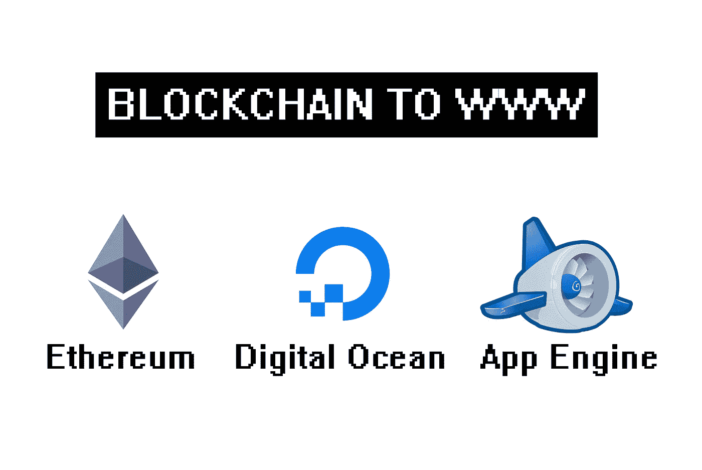
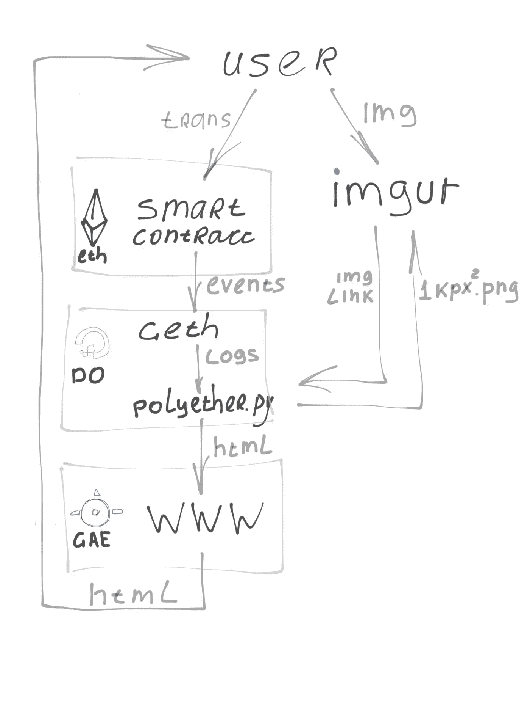
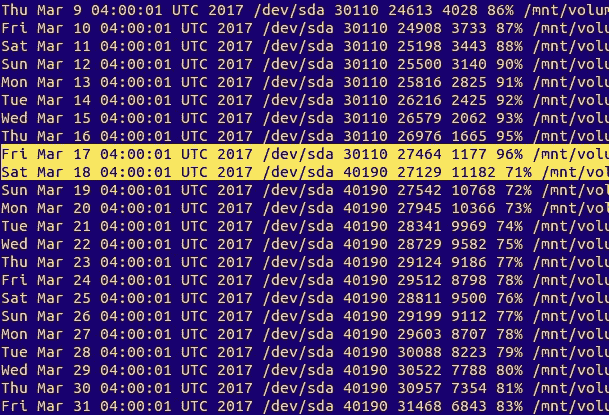

# 从以太坊的区块链到数字海洋，再到谷歌云

> 原文：<https://medium.com/hackernoon/from-the-blockchain-of-ethereum-through-the-digital-ocean-and-to-the-google-clouds-cf228e5f000f>

## 我的设置将智能合同数据推送到网站——可扩展、安全且几乎免费



Blockchain to www

# 问题—如何连接我的智能合同和网站

百万以太主页及其底层智能合约(一个去中心化的广告平台)的一个关键特征是，所有收入都在推荐人和慈善机构之间分享。这意味着有一种情况，我得到很少或根本没有钱(因为我也只是一个推荐人)。这为我连接智能合约和互联网的基础设施提出了第一个要求——它必须成本非常低或免费。

第二个需求来自于我的主要目标。也就是在媒体上得到尽可能多的宣传。这又意味着平台必须承受非常高且不一致的负载。所以便宜不应该意味着牺牲速度或安全性。

当然，这个平台必须是用户友好的，开发和维护起来相当简单。

换句话说，我需要在廉价、可扩展、安全、简单和用户友好之间取得平衡。

# 解决方案

我决定不在我的智能合同上附加任何自定义 GUI(至少现在，至少对于 [MVP](https://en.wikipedia.org/wiki/Minimum_viable_product) )。由于进入区块链的门槛已经很高，我认为如果我给我的用户提供一个由区块链客户端自动生成的 GUI，门槛不会高太多(参见[企业家智能合同指南](https://hackernoon.com/an-entrepreneur-programmer-and-user-walk-into-a-smart-contract-the-ultimate-ethereum-blockchain-7b8dbd0c8463)以了解 GUI 是如何附加的)。这将让我建立超级轻量级和超级简单的网页。网页将只代表智能合同的状态，需要很少的流量。

百万以太主页是一个 1000×1000 像素的区域，任何人都可以在这里购买(或出售)像素和放置广告。这意味着我需要在某个地方存储广告图像。为此，我决定使用 Imgur.com 来进一步减少流量。

根据定义，任何智能合约都是廉价且可扩展的(我努力打造一个安全、简单且用户友好的合约)。反过来，Imgur 是一个无限持久的资源(免费、可伸缩、安全等)。).所以现在真正的问题是，如何让我的智能合约与外界互动。或者**如何将数据从以太坊区块链推送到网站**。

我的解决方案包括 5 个部分:

1.  [智能合约](https://github.com/porobov/MillionEtherHomepage/blob/master/MillionEther.sol)除了业务逻辑和数据库外，还提供 UI(无 G)
2.  【Imgur.com】T2 主持人图片
3.  [Geth 以太坊节点](https://github.com/ethereum/go-ethereum/wiki/geth) at [数字海洋](https://www.digitalocean.com/) droplet 提供区块链访问
4.  Python 应用程序(polyether.py)同时执行 droplet 监听合同、处理数据并将其推送到 TheMillionEtherHomepage.com 网站
5.  [谷歌应用引擎](https://appengine.google.com)托管网站



Pushing smart contract data to www

接下来，我将向您展示当用户放置新广告时会发生什么。或者换句话说使用[***place image***](https://github.com/porobov/MillionEtherHomepage/blob/master/MillionEther.sol#L287)功能的百万智能合约。

*像这样的斜体注释显示了我的决策、附加信息和备选方案。*

# 它是如何工作的

## 1.用户上传图像到 Imgur

***placeImage*** 功能的契约需要一个图片链接。所以用户的第一步是得到它——把一个广告拖到 imgur.com 并复制链接。

我坚持 Imgur.com，因为每个人都知道。对于非商业和开源项目是免费的。它有使用率限制“每天大约 1，250 次上传或每天大约 12，500 次请求”。它有[*API*](https://api.imgur.com/)*和* [*python 库*](https://github.com/Imgur/imgurpython) *。我所要做的就是* [*注册我的应用*](https://api.imgur.com/#registerapp) *，获得一个令牌(应用密码)并开始使用它。*

作为 Imgur 的替代方案，我可以让用户用 64 进制 *对他们的图像进行* [*编码，并将这些字节直接发送到智能合同。但这样一来，合同将无法与任何图像托管或群存储(进一步一句话)。这意味着对于用户来说太不灵活和太复杂。另一种解决方案是使用以太坊的*](https://www.base64-image.de/) [*蜂群存储*](https://swarm-guide.readthedocs.io/en/latest/introduction.html) *。但对我来说，它仍然太 beta，太复杂。虽然我的合同与 swarm 兼容，但我很确定，以后我将能够切换到它。目前——Imgur。*

## 2.用户与智能合同交互

用户通过由区块链客户端([MyEtherWallet.com](http://www.myetherwallet.com/)或[以太网桌面应用](https://github.com/ethereum/mist/releases))自动生成的 GUI 与智能合约进行交互。如果你不熟悉这个过程，看看这个[视频](https://www.youtube.com/watch?v=mTgXJVlBVdI&feature=youtu.be)。

投放广告需要向 ***placeImage*** 函数发送所需坐标(在 1000x1000px 字段内)、图像 url(从 imgur 复制)、用户网站链接和广告文本。用户提交交易后，合同会为图像分配一个 ID 并触发一个事件:

```
NewImage(numImages, fromX, fromY, toX, toY, imageSourceUrl, adUrl, adText);
```

在事务被挖掘到一个块中之后，任何同步的区块链客户端都可以使用它的带有事件日志的收据。这就是 [placeImage 函数收据](https://etherscan.io/tx/0xd5d42dd466e1e8ed40a24e576d3945e3b6d269fa82ac7ee4412ce761caa1bf2e)在 Etherescan.io 区块链资源管理器上的样子(点击 ***转换成 Ascii*** 看一些人类可读的东西)。

*智能合同信息的获取方式有两种:* [*常量函数*](http://solidity.readthedocs.io/en/develop/contracts.html#constant-functions) *(不修改合同状态，即写入合同)和事件。从外部应用程序访问合同数据的最简单方法是使用事件。另一个合同访问合同数据的唯一方法是* [*使用函数调用*](/@ConsenSys/a-101-noob-intro-to-programming-smart-contracts-on-ethereum-695d15c1dab4#da4d) *。我的聚醚. py 监听事件，但百万醚契约有* [*常量函数*](https://github.com/porobov/MillionEtherHomepage/blob/master/MillionEther.sol#L357) *也让其他开发者附加自己的扩展(契约)。*

## 3.Geth 随事务下载一个块

在 Digital Ocean droplet 中，使用以下命令运行 Geth:

```
geth --cache=16 --rpc --rpcport 8545 --rpccorsdomain "localhost"
```

让任何本地应用程序通过 [JavaScript API](https://github.com/ethereum/wiki/wiki/JavaScript-API) 与之交互。

Geth 不断下载新块(同步)。现在它收到一个包含事件的块。

*我用的是最便宜的数字海洋水滴，附带 40 GB 容量。它让我可以同时运行完整的以太坊节点和我的 python 应用程序。下面是* [*如何配置*](https://hackernoon.com/how-to-run-geth-at-512mb-ram-digital-ocean-droplet-e346986cf666) *。*

*有几种* [*连接 geth*](https://github.com/ethereum/go-ethereum/wiki/Command-Line-Options) *的方式:ipc(通过一个本地文件)、rpc(通过 http 协议)、ws(通过 web-socket)。我用 rpc。下面会展示它的好处。*

## 4.Python 应用程序询问 geth 是否有任何新事件，如果有，就处理它们

聚醚. py 以与 Geth 相同的 DO 液滴运行。它每分钟都会询问 Geth 是否有新事件。

*同*[*EthJsonRpc*](https://github.com/ConsenSys/ethjsonrpc)*库听 evens 是轻而易举的事。这里是获取特定智能合约事件的所有日志所需的几乎所有代码(我将很快发布我的 ethereum _ gateway.py 请关注我以获取帖子)。*

```
self.client = EthJsonRpc('127.0.0.1', 8545) 
params = { 
      "fromBlock": hex(from_block), 
      "toBlock": "latest", 
      "address": 0x15dbdB25f870f21eaf9105e68e249E0426DaE916, # million_ether contract address 
      "topics": [event_definition["signature"]]
      } 
logs = self.client.eth_getLogs(params)
```

*[*Geth 和聚醚. py 都被 monit*](https://hackernoon.com/how-to-monitor-geth-and-autorestart-it-on-crashes-with-monit-a6668de9b961) *监控，防止它们崩溃(如果发生不好的事情，monit 会自动重启两者)。**

*如果一组块有任何新的 ***NewImage*** 事件的 ***MillionEther*** 智能合约聚醚. py 接收并解码它们。然后，该应用程序验证 Imgur 链接，下载和存储新图像，生成 1000 x 1000 像素的图像，并将其上传回 Imgur(作为回报，会收到 url)。*

**用* [*Infura.io(远程区块链客户端)*](https://infura.io/) *和纯*[*JavaScript*](https://github.com/ethereum/wiki/wiki/JavaScript-API)*我可以在用户浏览器中正确生成 1000 乘 1000 的图像。但是图像在本地呈现有两个原因:1 .对区块链节点获取所有广告图像的查询非常繁重，而且随着时间的推移会越来越重(因为检查事件的块的数量增长很快)。将所有过去的事件和图像写入本地数据库并每隔一分钟搜索几个街区内的新事件更便宜。2.对于大多数计算机来说，从 10000 个小图像中生成 1000 乘 1000 的图像是难以承受的任务。**

*使用链接到 1000x1000 图像和广告细节聚醚. py 生成新的网页(整个网页 html)，哈希求和并通过 POST 方法以 JSON 格式发送到一个带有长密码的秘密 GAE url。*

*我可以将原始数据传递给应用引擎，并在那里生成网页，但我已经为 DO droplet 付费了。所以我尽量减少应用程序引擎的负载。*

## *5.谷歌应用引擎接收网页*

*GAE 应用程序接收 POST 请求，检查散列值和密码，并将网页放入数据库。*

**据我所知，我可以使用*[*App Engine API*](https://cloud.google.com/appengine/docs/standard/python/refdocs/)*代替那些 POST 请求，直接、安全、可靠地将数据写入数据库。但是谷歌文档…嗯，你知道…很复杂。**

**在 Google 云平台上可以(至少)有 6 种方式存储数据:Bigtable、Cloud SQL、Datastore、Storage、Persistence disk 和 Spanner。我使用的是 Datastore——“一个用于非关系数据的高可伸缩的 NoSQL 数据库”。我发现这是最简单的。此外，每个数据库查询都被自动缓存。我的网页虽然存储在数据库中，但通常是从缓存中加载的，缓存有更高的空闲配额，而且比它们更便宜。或者，我可以将我的网页存储在存储器中，这(可能)是为静态文件设计的，而且(可能)更便宜，但是……还是……谷歌文档。**

## *6.GAE 将网页交付给用户*

*通常情况下，用户会通过一个类似于[http://themillionetherhome page . com/0 xf 51 f 08910 EC 370 db 5977 cf F3 d 01 df F4 DFB 06 BF be 1](http://themillionetherhomepage.com/0xF51f08910eC370DB5977Cff3D01dF4DfB06BfBe1)的 url 到达。斜杠后的 42 个字符串是邀请用户的推荐的以太坊地址。*

*引荐地址以与图像相同的方式到达 GAE 应用程序: [***登录***](https://github.com/porobov/MillionEtherHomepage/blob/master/MillionEther.sol#L151) 智能合同的功能触发 ***新用户*** 事件- > Geth - >聚醚. py - > GAE，地址保存在同一个数据库中。*

*当有人访问该链接时，app engine 所经历的唯一负载是检查该地址是否在数据库中，并加载网页的当前版本。这两种操作通常都是使用缓存数据来执行的，这样既快又便宜。*

**我使用 Google engine 是因为它的可扩展性和它的* [*免费配额*](https://cloud.google.com/appengine/quotas) *。我认为我的超级轻量级应用程序应该能够每天免费服务大约 1000 个请求，除此之外几乎不需要任何费用。**

# *结论*

*我想要便宜、可扩展、安全和简单的基础设施，将数据从以太坊推送到互联网，并尽可能保持平台的用户友好性。这是我得到的。*

*我花了 20 美分将我的智能合约部署到区块链，它将永远免费。我每月为 DO 支付 5 美元，为额外的磁盘空间支付 4 美元(我很快就会摆脱这些空间)。app engine 仍为 0 美元。Imgur 是免费的。ReadTheDocs.com 的医生是免费的。Youtube 上免费的视频指导。便宜。*

*智能合约可以承受几乎任何负载(相当于整个以太坊区块链可以处理的负载)。Imgur 深不见底。数字海洋设置没有繁重的任务，如果需要可以在任何计算机上复制(我不是已经说过了吗？).如果支付得当，App engine 可以承受比整个 Imgur.com 更大的负载。希望缓存的数据将节省我的账单。可扩展。*

*假设我的智能合同是安全的(并且我努力遵守这些官方安全规则(),唯一受到攻击的地方就是网站。但是那里几乎没有代码(也没什么可偷的)。另外，我很确定(因为我在文档中的某个地方看到过，但是再也找不到了)我的应用引擎有现成的 DOS 保护。安全。*

*简单。我花了很多时间来建造这一切。我不能说这很简单，但肯定很有趣。我希望我能让你更简单。*

*方便用户。就像区块链科技目前让它变得对用户友好一样。*

*我达到我的要求了吗？我想是的。当然完美是没有限制的…*

# *奖金。如何让它工作得更好(更便宜)*

*目前，由于我运行完整的 geth node，我每个月都要处理 7 GB 的磁盘空间链数据，并且必须购买越来越多的 GB。我无法弥补。我想通过 [Infura](https://infura.io/) 摆脱本地节点，切换到远程节点*

**

*Buying additional disk space*

*它的核心就像只修改一行代码一样简单:*

```
*- self.client = EthJsonRpc('127.0.0.1', 8545) 
+ self.client = EthJsonRpc('mainnet.infura.io/my-secret-token',443,True) # True for ssl*
```

*只要把 http 改成 https，把 localhost 改成 infura.io 就行了！漂亮吧？如果由另一个节点(例如[以太网扫描](https://etherscan.io/apis))和本地[轻型客户端](https://blog.ethereum.org/2016/11/17/whoa-geth-1-5/)支持，效果会更好。*

***感谢您的阅读。如果您觉得这很有用，请点赞，分享并关注我，以便将来获得更多类似的文章。再见！***

*[](http://bit.ly/HackernoonFB)**[](https://goo.gl/k7XYbx)**[](https://goo.gl/4ofytp)*

> *[黑客中午](http://bit.ly/Hackernoon)是黑客如何开始他们的下午。我们是阿妹家庭的一员。我们现在[接受投稿](http://bit.ly/hackernoonsubmission)并乐意[讨论广告&赞助](mailto:partners@amipublications.com)机会。*
> 
> *如果你喜欢这个故事，我们推荐你阅读我们的[最新科技故事](http://bit.ly/hackernoonlatestt)和[趋势科技故事](https://hackernoon.com/trending)。直到下一次，不要把世界的现实想当然！*

**