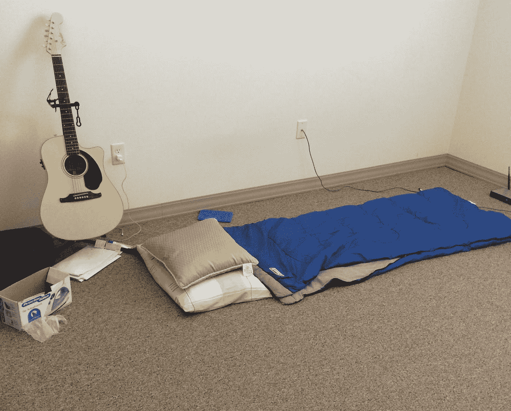
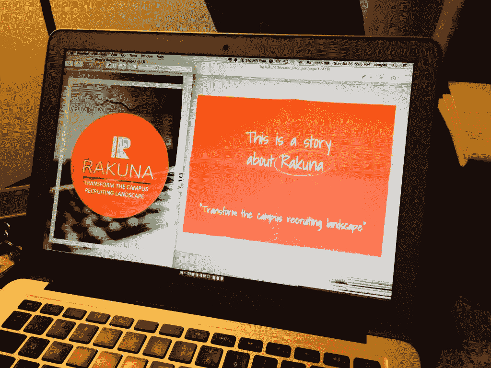
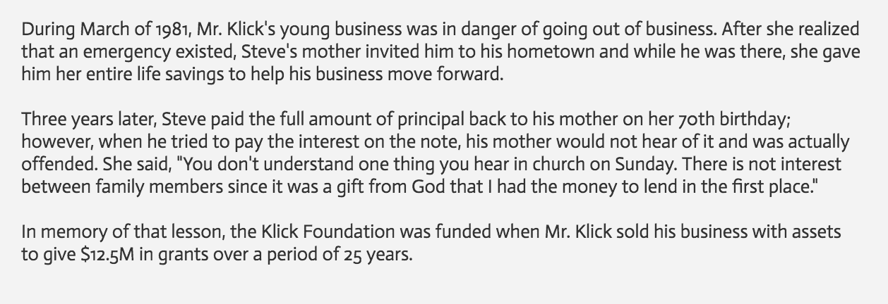

# 从教室到山谷

> 原文：<https://medium.com/hackernoon/from-the-classroom-to-the-valley-4744b27c5742>

去年，我和妻子都是苦苦挣扎的研究生，更糟糕的是，我失去了签证担保，我们的孩子也快出生了。感谢明尼苏达大学的创业班，我们的商业头脑，以及一个伟大的导师团队，一年后，我们正在招募一个新兴的 [*创业公司*](https://hackernoon.com/tagged/startup) *，旧金山创始人空间的校友，拥有一个小型的专门团队，今年将全面启动。这是我们的故事，也是我们 app 的故事，*[*Rakuna*](https://www.rakuna.co)*。*

从我职业生涯的第一天起，我就知道招聘有问题。

在波士顿科技公司担任项目经理期间，我参与开发了一款 iPad 招聘应用程序，并赢得了移动黑客马拉松比赛。我最终放弃了这个项目，去明尼苏达大学攻读医疗器械创新硕士学位，但不久之后，我又开始琢磨招聘问题的解决方案。

2015 年 1 月对我和妻子 Ngan 来说是一段艰难的日子。当我辞去在波士顿的工作时，我失去了签证担保，为了追求我们的商业目标，我们不得不卖掉所有东西，从我们的汽车、电视到旧衣服。有一段时间，我睡在睡袋里的地板上，骑自行车上下班，在颜怀孕的几个月里，我们没有医疗保险。

Cozy bedroom

她把我拉进了创业班，这是一门让学生有能力接触潜在客户并完善其商业理念的课程。我们采访了 30 多名校园招聘人员和 70 名学生，面对当今招聘中最大的问题之一:线下和线上经历的脱节。在与来自 30 家公司的超过 35 名招聘人员交谈后，超过 50%的人声称没有解决这个问题的好办法，我们知道我们正在做一些事情。大多数人明确要求一个校园专用工具，我们很快就被公司(一些非常大的公司，如百思买)的电子邮件和电话淹没，要求解决方案。学生们表示，这种不满是双向的，他们感觉就像掉进了简历黑洞，与潜在雇主没有任何个人联系。

正是从这些对话中，我们开始构思自己的创业想法:一个能让校园招聘过程更简单、更个性化、更有效的产品。我们想出了这个名字， [Rakuna](https://www.rakuna.co/) ，在日语中的意思是*毫不费力*。

我们的想法很好，市场甚至在他们看到原型之前就做出了反应，这只会鼓励我们埋头苦干，做出一些可行的东西。我们的精益创业课程在这里至关重要，我们的想法不一定是原创的，它源于市场需求，我们试图通过在客户开发过程中验证我们的想法来保持精益。

Final deliverables for Minnesota Cup 2015

不到两个月后，我们有了一个原型，并参加了全国最大的全州商业竞赛——明尼苏达杯。2015 年有 1300+家公司参与竞争。我们从第一天开始就充满信心，但我们是本着学习和试水的精神参加比赛的。很快我们进入了半决赛，60 强公司，并带来了两位新的导师——人力资源行业的资深人士、Jobs2Web 的前首席执行官、Virteva 的现任董事 Ken Holec 和风险投资家、早期创业顾问 Rick Brimacomb。创始人布里马科姆联合公司。我仍然清楚地记得 Rick 的反馈:“我见过很多平庸的商业计划和幻灯片，你知道吗？脱颖而出的方法是让它看起来像好莱坞品牌。你想要一个好莱坞封面，设计精良，视觉上吸引人，并有一个伟大的故事来连接观众的情感。”我们认真考虑了他们的所有建议，并进入了最后一轮:从 1300 多家公司中选出前 18 名。

我清楚地记得那天我的推销。我已经练习了几十次，和我们的顾问一起检查了每一个细节——我已经准备好了，但是有些事情我觉得我需要向评委们透露。“从今天早上开始，”我说。“我们了解到我们有机会去旧金山的顶级孵化器之一，我们认为那是我们应该去的地方。”评委们很热情，感谢我的诚实，但提醒我这仍然是明尼苏达杯，旨在支持明尼苏达州的商业。我理解他们的观点，我们在我们的类别中获得了第三名，不管我们的位置如何，明尼苏达杯上的经历和联系都是令人难以置信的。

An inspiring founder’s story

是时候前往旧金山和创始人空间了，但我从容不迫，在明尼苏达州和海湾地区之间的每一个国家公园停下来拍照和减压。在巴德兰兹的一个早晨，我接到史蒂夫·克里克的电话，他是明尼苏达杯的评委，也是一名企业家，他把母亲一生的积蓄都变成了一次成功的退出。我们就商业、职业道德和愿景进行了一次很好的交谈，听到他有兴趣为我们提供一些资金，我既谦卑又激动。

在 Steve 的帮助下，以及在明尼苏达杯上吸取的经验教训，我们能够启动并运行我们的第一个真正的 MVP(最小可行产品)。虽然我们在 [Founder's Space](http://www.foundersspace.com/) 的时间让我们融入了硅谷的生态系统，并教会了我们如何将产品推向市场，但我们做的第一件事是将它带回明尼苏达州。我们想在招聘会和招聘活动中测试拉库纳。它只是一个 MVP，但我们是成功的。一位公司高管带我参观了一次活动，向我介绍了其他公司，我意识到我们不仅仅是在创造客户，我们也在创造拥护者。

我非常为拉库纳感到骄傲，我们到目前为止所取得的成就，我不能等待未来。最终，有一件事真正让我们与众不同:该产品让招聘人员能够与候选人有 100%的互动体验。想想现在的解决方案，纸和笔？iPad kiosk 站？你派招聘人员和员工到校园里去建立关系，获得重要线索。最糟糕的经历是浪费优秀候选人的时间，让他们填写表格或在平板电脑上打字。我们简化，我们把它放在你已经有的设备里，所以它将适合与候选人的对话，它自然发生。当他们交换信息时，他们的指尖上有一个应用程序来捕捉信息。这是一种 100%的参与体验，在任何其他解决方案中都看不到。

现在，我们的重点是让移动应用(iOS)和网络应用为大众市场做好准备。我们正在组建我们的团队，并通过我们的销售周期努力工作，以获得客户，并为今年 9 月的全面发布做准备。

从创意到产品，再到商业的旅程是漫长的。这需要耐心、努力和奉献，但也是我做过的最有收获的事情之一。但是，关于创业的成长，关于将想法转化为实践，有几件事情没有得到足够的讨论:运气和感恩。我永远不会放弃我们的愿景或我们的工作，但我们感到非常幸运，能够遇到我们有机会一起工作的顾问、导师和投资者，我们感到非常幸运，来自明尼苏达州的生态系统如此支持和有利于新想法，我们也很幸运，我们能够每天做一些对我们来说意义重大的事情。同样，我们也要心怀感激——感谢那些指导我们、支持我们的伟大思想，感谢那些欢迎我们、支持我们的社区，即使我们已经搬家或换了地方，因为说到底，任何人都可以有一个伟大的想法，但要把想法变成现实，需要一个团队。所以，对于那些一路上帮助过我们的人，那些继续支持我们的人，或者计划在未来帮助我们的人:谢谢你们！

> [黑客中午](http://bit.ly/Hackernoon)是黑客如何开始他们的下午。我们是 [@AMI](http://bit.ly/atAMIatAMI) 家庭的一员。我们现在[接受投稿](http://bit.ly/hackernoonsubmission)，并乐意[讨论广告&赞助](mailto:partners@amipublications.com)机会。
> 
> 如果你喜欢这个故事，我们推荐你阅读我们的[最新科技故事](http://bit.ly/hackernoonlatestt)和[趋势科技故事](https://hackernoon.com/trending)。直到下一次，不要把世界的现实想当然！

