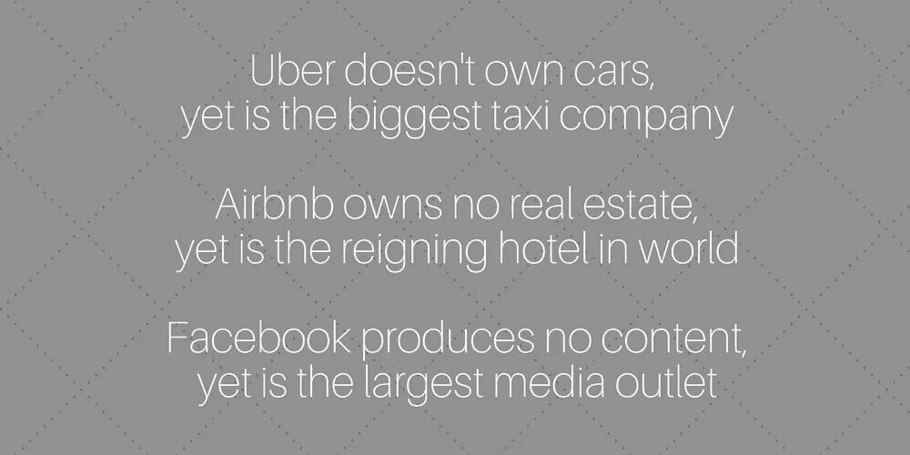
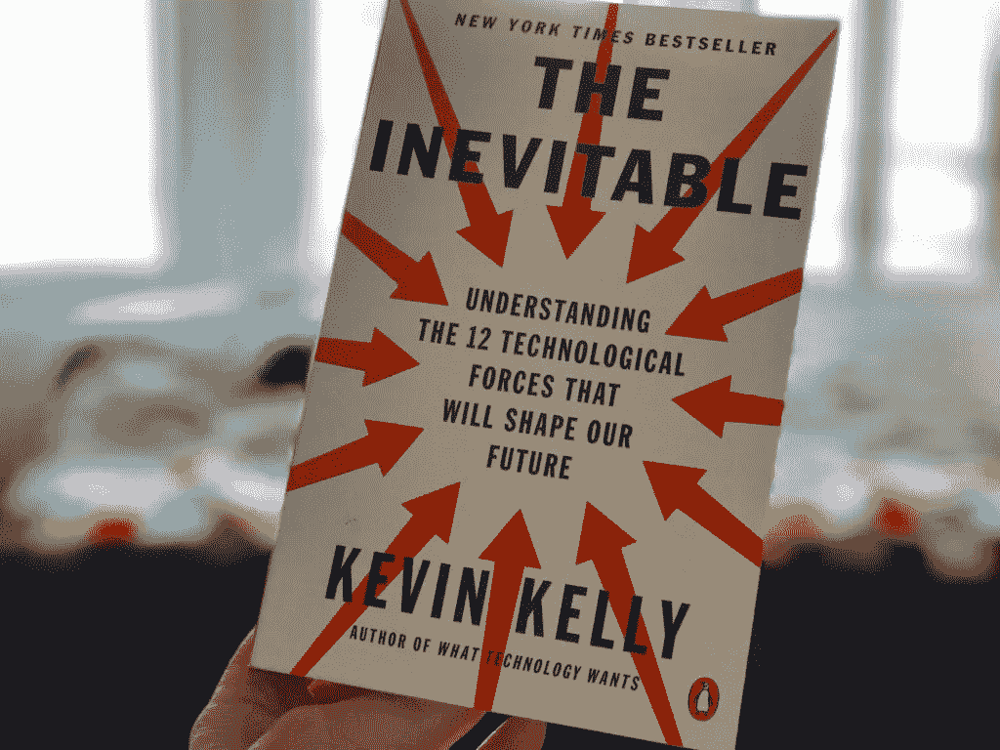
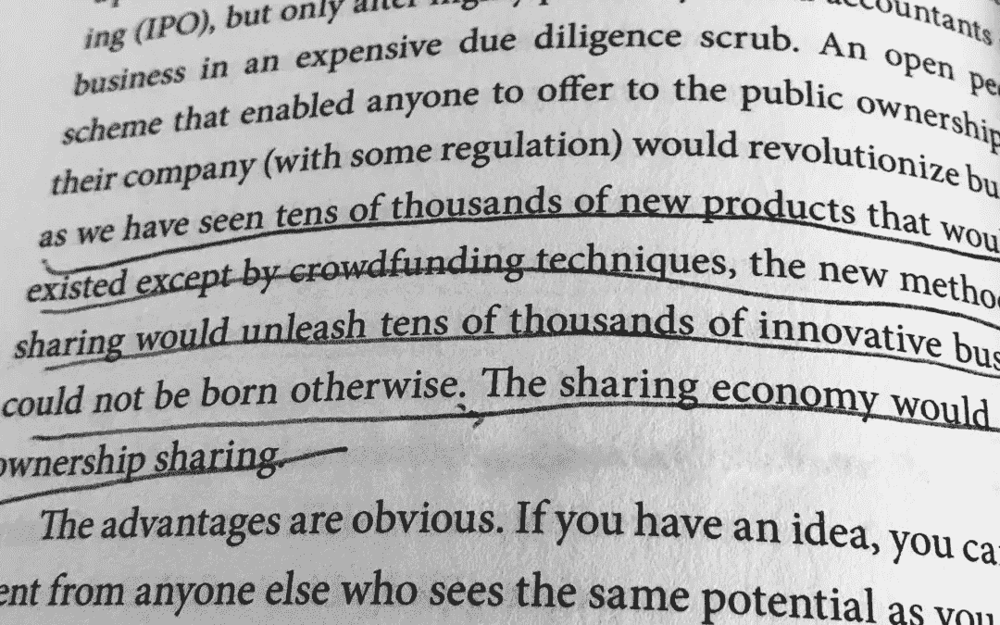
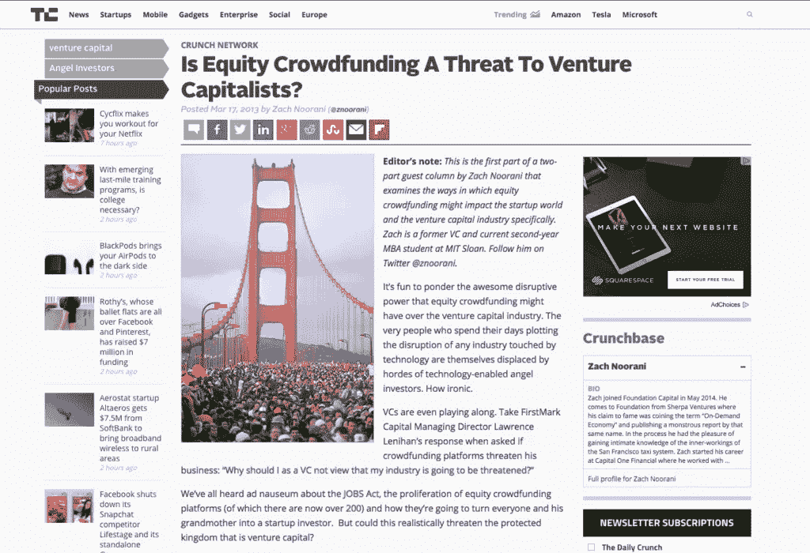
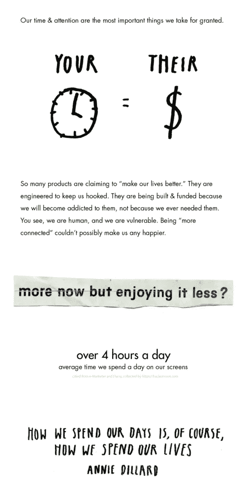

# 从共享经济到股权众筹

> 原文：<https://medium.com/hackernoon/from-the-sharing-economy-to-equity-crowdfunding-d65652c8a3e3>

## 共享经济如何指向组织中的共享价值

共享经济的下一波浪潮会比上一波更有影响力吗？从备用卧室到自行车、办公空间和汽车，我们分享一切。今天，有一种新的分享方式——超越了分享东西的界限，进入了分享价值。

虽然共享资产在商业上创造了好处，但共享经济刚刚开始扩展到共享金融价值。

共享经济阐明了这类市场是如何蓬勃发展的——从价值贡献者开始，他们在许多情况下是劳动者、财产或汽车所有者、司机或主人。

例如，Airbnb 是世界上最成功的酒店公司之一，却没有房地产。优步正在取代出租车行业，但却没有汽车。举个数字方面的例子，脸书比其他任何媒体公司都大，而且没有一个付费记者。

创造价值的人，通常使用他们自己的资源，通常没有以长期价值或所有权的形式得到补偿，即使他们是组织成功的基础。虽然共享经济明显反映了这一点，但大多数企业都是这样运作的。

投资由精选的少数人持有。创始人吸收其余的。顾客消费。

在共享经济的下一波浪潮中，价值可以分配到创造价值的地方。无论公司规模大小，客户、员工和用户都可以成为社区成员所有者，在公司受益时受益。

# 进入股权众筹

人们现在能够基于*共同价值观和共享价值观*走到一起，将他们的需求与对未来的集体愿景交织在一起，实现梦想，并相互支持。

想象一下这样一个世界，Airbnb 的主人和优步的司机很早就被邀请成为他们帮助建立的组织的投资者。而且，即使自动驾驶汽车取代了优步司机，它们也能获得丰厚的回报。想象一下，随着 Airbnb 成长为一家 1000 亿美元的公司，早期的主机也投入了他们的时间和资源，分享了这一估值。

虽然这些共享经济的例子有助于说明共享价值可能是什么样子，但任何公司都可以通过股权众筹让他们的社区投资。

# 看谁在谈论这种进化

正如凯文·凯利在他的新书《不可避免》中所言，“……股权分享的新方法将释放成千上万的创新企业，否则这些企业将无法诞生。共享经济现在将包括所有权共享。”

畅销书作家道格拉斯·拉什科夫(Douglas Rushkoff)在他的新书《向谷歌巴士扔石头》(through Rocks in The Google Bus)中写道:“抽取式增长的时代已经结束。相反，企业必须给予人们交换价值和相互投资的能力。”

股权众筹自 2016 年 5 月 16 日起合法，受 SEC 监管。这个空间正在涌现和成长。事实上，如果众筹资金保持每年翻一番的话，[筹集的资金将超过所有典型的天使和风险投资资金来源](https://www.chipin.com/crowdfunding-threat-venture-capital/)。

# 股权众筹是如何运作的？

股权众筹通常最适合需要早期资金、有可行的商业计划、有一群热情的客户的新公司。

一些平台比其他平台更类似于股权众筹的价值共享方面，尤其是在考虑共享价值整合时。例如， [Republic](http://www.republic.co/) 明确寻找使命驱动的公司，并帮助[服务不足的创始人聚集人群，让他们各自的企业起步](https://republic.co/blog/79-of-funding-to-women-founders)。

当不到 4%的风投资金流向女性和有色人种时，这一点就显得格外重要。除了 Republic，其他领先的股权众筹平台包括 [WeFunder](http://www.wefunder.com/) 、 [Seed Invest](http://www.seedinvest.com/) 和[micro ventures First Democracy VC](https://equity.indiegogo.com/)，后者通过与 Indiegogo 的合作开展活动。

# 股权众筹活动的例子

股权众筹是早期采用者支持他们希望看到实现的产品或服务的一种很好的方式。这可以是任何东西，从当地的啤酒厂到让生活更简单、更用心、与他人相连的设备，比如轻型手机[，其制造商目前正在开展一项股权众筹活动](https://republic.co/light)。如果你投资 500 美元或更多，你将得到一部属于你自己的轻型手机作为额外津贴！

最棒的是，人们实际上说出了他们投资 Republic 的原因，所以你可以在每个活动的底部看到他们的理由。例如，最近一位轻型手机投资者 Ariel R .评论说，“这款手机不仅仅是另一款产品。它是帮助我们过上更好、更幸福生活的工具。在一个太多插头接入的世界里，我们需要学会如何拔掉插头来享受生活本身，而光就是这方面的电话。”

[盒子农场](https://republic.co/farm-from-a-box)完全解决了一个不同的问题，通过点对点、脱离电网的农业，让“为大众制造的食物实际上是由大众制造的”。“盒子农场”通过发送一个装满种植几英亩土地所需一切的集装箱，使这一过程变得简单。这包括太阳能、灌溉系统和跟踪运营效率的智能技术。该工具包可用于食物匮乏地区、学校教育、创建小型商业农场，以及产生可持续的食物来源。

投资像“从箱子里装农场”这样的项目不仅看起来是一个聪明的全球商业机会，也是一种支持生殖健康食品来源和战略以帮助缓解营养不良和饥饿的方式。此次活动成功筹集了 135，543 美元的股权众筹资金。

8 个月前投资的 Krena S .也同意这一观点:“我是一名工程学女生，也是一名经济学家，我知道健康始于食物的质量。我喜欢解决世界饥饿问题的创意和解决方案，它解决了环境问题、地方经济和文化相对主义。”

# 通过分享价值，成为投资者和被投资者

你看，*你可以成为投资者，然后被投资*，一路分享价值。

股权众筹为以所有权的形式创造共享价值提供了一个美好的基础，此外，它还让任何人都有能力将自己的资金投入到他们的价值所在的地方。

支持你相信的公司，支持你喜欢的创始人和未来愿景，同时购买你希望看到实现的公司的股权，这代表着共享经济更深入、更基本的应用。

随着业务的发展，包括客户作为所有者，我们肯定会看到组织更符合他们的利益相关者，激励支持他们服务的人。

作为一名投资者，你将成为变革的一部分！