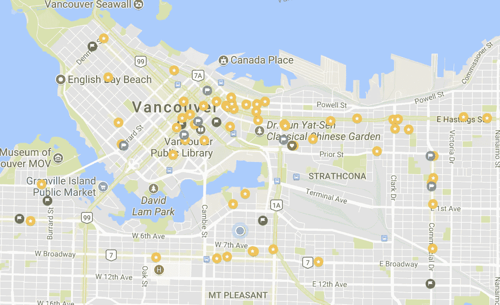
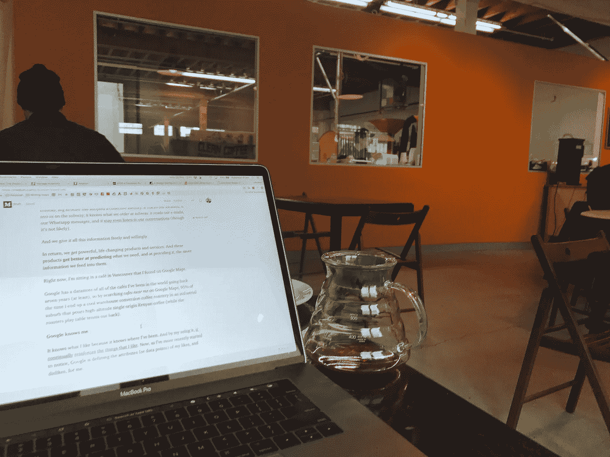
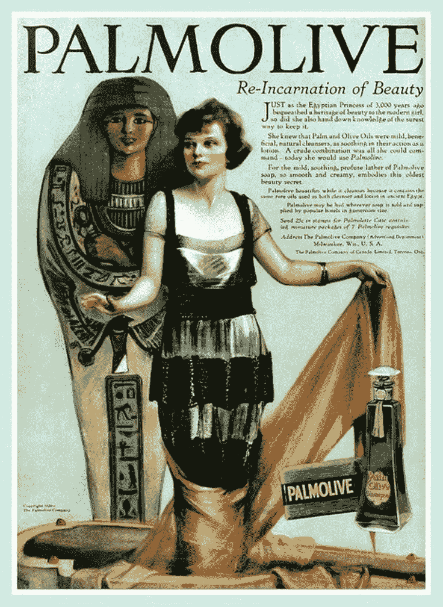
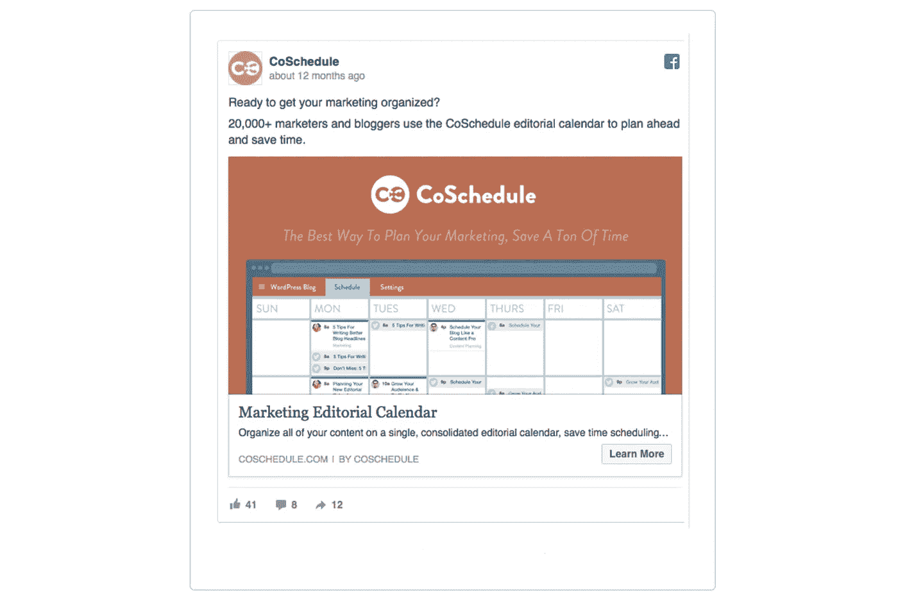
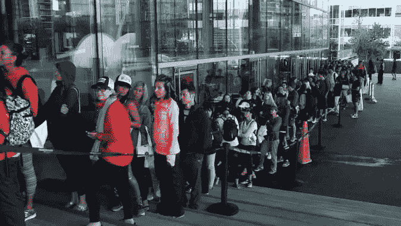
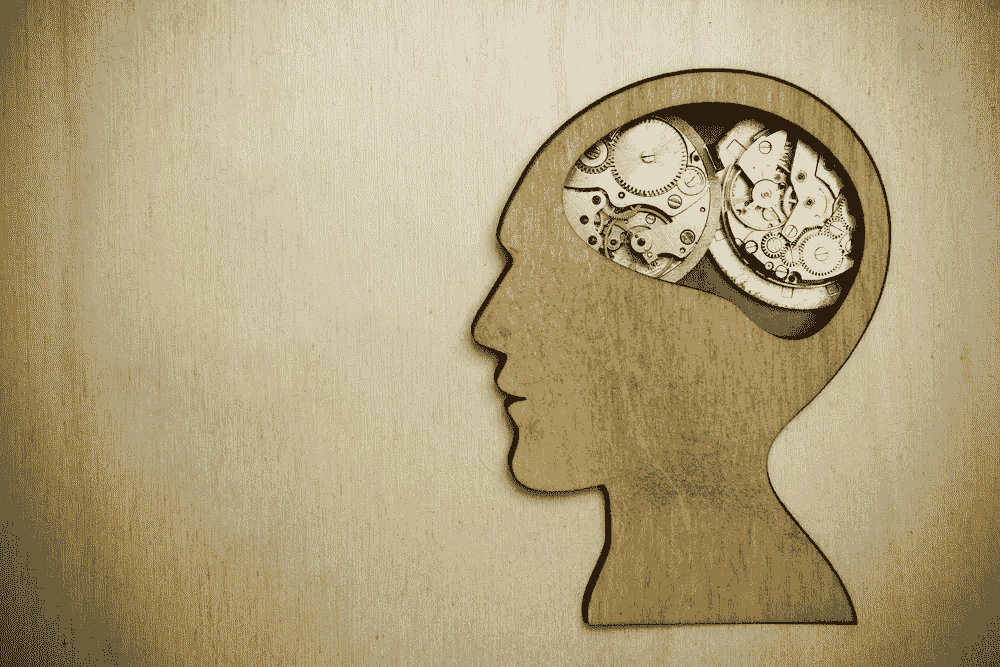

# 从点击到点击:如何停止点击你的新闻提要中的广告

> 原文：<https://medium.com/hackernoon/from-tick-to-click-how-to-stop-clicking-the-ads-in-your-news-feed-5cbaae7a2ce2>

## 但是……鞋子？

你在浏览你的新闻提要。朋友、家人的照片和猫从沙发上跳下来的 gif 照片飞快地掠过，但你没有停下来，仍然在刷，等待有什么东西伸出来抓住你的注意力。

然后，嘣！

*鞋子*。你从你凌晨 2 点的“我差点买了它们，但后来又没有买，因为我的天啊，我下周要付房租”购物狂欢中认出了它们。

它们是*美丽的*。

清晰、高清晰度的产品照片照亮了您的屏幕。沿着旋转木马，狗仔队偷拍了你最喜欢的名人穿着它们在罗迪欧大道购物的照片，让你又靠近了一英寸。

图片上方的两行文字不紧不慢地解释了为什么你如此需要它们。

> 不要错过。限量版[在此插入标签]仅发售两周。受到[在此插入名人]的喜爱。很快就会被你爱上。去拿你的吧。

你浏览广告。

价格无处可见。但是该死的她/他穿那些看起来很好。

**你**可能长这样。你会被爱的。你会得到你应得的尊重。如果你错过了得到它们的机会，你会后悔的，我的意思是，它们只能用 2 周！

然后呢？会卖光吗？再也找不到了？

你一想到就不寒而栗。

只需点击一下，对吗？没有伤害。就稍微偷看一下，看看价格到底有没有降下来；再说一遍价格是多少？

好吧，肯定最好看看这个…***点击***

# 点击心理学

本文灵感来源于罗伯特·恰尔迪尼的著作 [*影响力:劝导心理学*](https://www.amazon.ca/dp/B002BD2UUC/ref=dp-kindle-redirect?_encoding=UTF8&btkr=1) 。

*影响力*是一位朋友推荐给我的，他认为这是一篇关于**如何说服人们做事的开创性文章。**

这本书深入探讨了我们为什么要做别人告诉我们要做的事情的原因，以及 Cialdini 称之为“合规专家”的策略，以确保我们倾听和行动(点击！).

恰尔迪尼试图帮助我们理解，我们的动物本能是如何在一天中的每一分钟被我们消费的内容、我们交往的人以及我们接触的广告所操纵的。

然而，教我们如何说服他人做我们想做的事，并不是他的主要目标。

*影响*是教我们自己**检查我们的本能和防御顺从策略**，这样我们就可以在面对持续的、有说服力的刺激时保持表面上的控制。

# 什么是合规？

自从《影响》于 1984 年出版(是的，是 1984 年)以来，发生了很多变化。

世界变得更加紧密相连。正如奥威尔所设想的，老大哥并不是一个单一的、全能的实体，监视着我们，控制着我们的一举一动。

相反，老大哥采用了集体身份。它追踪我们的位置，它*在地铁上看到我们*，它知道我们*在地铁*点了什么，它阅读我们的电子邮件，我们的 Whatsapp 信息，它[甚至可能会听我们的对话](https://gimletmedia.com/episode/109-facebook-spying/)(尽管这不太可能)。

我们免费并自愿地给它所有这些信息。

作为回报，我们得到强大的、改变生活的产品和服务。这些产品**在预测**我们需要什么方面变得更好，在提供我们需要的信息方面，我们提供给它们的信息越多。

现在，我正坐在谷歌地图上找到的温哥华的一家咖啡馆里。

Hollywood of the North — bet you didn’t think Vancouver was so filled with ***stars!*** *#dadjokes*

谷歌有一个数据库，里面有我过去(至少)七年去过的世界上所有咖啡馆的数据，所以通过在谷歌地图上搜索我附近的咖啡馆，95%的时间我会在一个工业郊区的仓库改造的咖啡烘焙房结束，那里倒高海拔的单一产地肯尼亚咖啡(烘焙房在后院打乒乓球)。

Converted Warehouse Coffee Roastery. See — I wasn’t joking.

**谷歌认识我** *。*

它知道我喜欢什么，因为它知道我去过哪里。通过我的使用，[它不断强化我喜欢的东西](https://www.theatlantic.com/magazine/archive/2008/07/is-google-making-us-stupid/306868/)。现在，正如我最近开始注意到的，谷歌正在为我定义我喜欢和不喜欢的属性(或数据点)。

这是合规的一个例子。

我遵守与谷歌、脸书、Whatsapp 和其他公司的协议条款，因为它们让我的生活变得更容易(如果不一定更好的话)。

我为服务提供商创建的作为此类协议对价的数据被输入这台老大哥式的合规机器，以便营销人员、零售商、音乐家、艺术家能够更好地锁定最有可能使用他们产品或服务的人。

Casey Affleck (Kirk McKoy / Los Angeles Times) — Soon to the be the star of the film adaptation of **“**[**Stoner**](https://en.wikipedia.org/wiki/Stoner_(novel))**”** by American novelist John Williams. A stark, depressingly real **depiction of total compliance.**

这个**顺从机器**是大量的工具和产品，它们利用我们如此自由地放弃的信息来说服我们需要另一个*设备*、*服务*或*东西*。

这台机器的信息比以往任何时候都多。毕竟这是大数据时代——我们每天大约产生 [2.5 万亿字节](https://www.domo.com/learn/data-never-sleeps-5?aid=ogsm072517_1&sf100871281=1)，[2017 年产生的数据](https://appdevelopermagazine.com/4773/2016/12/23/more-data-will-be-created-in-2017-than-the-previous-5,000-years-of-humanity-/)比人类过去 5000 年产生的数据还多。我们与合规机器的互动越多，它就变得越强大。

这种海量数据的生成和收集对我们是好是坏的问题是我们这个时代的重大问题之一，也是哲学辩论的主题。

不管道德和哲学含义如何，实际结果是，公司和营销人员已经变得非常擅长**操纵我们的喜好、欲望和行为**向我们销售商品。

但是如果我们不想参与呢？解决办法是关掉你所有的设备，你的冰箱，洗衣机，手机上的 GPS，扔掉你的信用卡——对吗？

哦，不。别傻了。

为了真正反击这些说服的力量，我们需要了解它们是如何工作的。

让我们来看看当今公司使用的可能是最普遍和最普遍的合规机制，以接触到超目标、高度参与的受众。

# 脸书广告

简而言之，脸书的广告是有史以来数十亿广告的又一次重复，目的是让我们相信我们需要一些东西。埃及人在图坦卡蒙时代就这样做了，在钢铁上雕刻广告(是的，古埃及人是坏蛋)。

**Jokes**, I couldn’t find any pictures of the ads carved in Steel — but trust Western culture to appropriate another to sell dishwashing detergent!

**使用说服性语言**和**心理学**来鼓励观众购买某样东西的实际过程是最近才发生的。

下面的例子是 1657 年 5 月 26 日 *Publick Advisor* 上的一则[咖啡](https://blogs.ubc.ca/etec540sept10/2010/11/29/the-evolution-of-advertising-from-papyrus-to-youtube/)(不需要劝说我的朋友)广告:

> 在巴塞洛缪巷，在旧交易所的后面，有一种叫咖啡的饮料，这是一种非常有益于健康的饮料，有许多极好的味道，能关闭胃脘，增强体内的热量，帮助消化，加速精神，使心脏明亮，对眼睛疼痛，咳嗽，或感冒，豆科植物，消耗，头痛，水肿，痛风，坏血病，国王的邪恶和许多其他疾病有好处；将在上午和下午三点出售。
> 
> 伍德，J. P. (1958)。*广告的故事*。纽约:罗纳德出版社]

作为我们为我的营养公司经营的许多广告的作者之一，这种广告对我来说非常熟悉——除了许多嵌入条款[，典型的 17 和 18 世纪的写作](http://nautil.us/issue/54/the-unspoken/the-rise-and-fall-of-the-english-sentence)。

事实上，这个 1657 年的咖啡广告看起来很像我见过的某个[某个奶油浸泡咖啡公司的一些内容](https://blog.bulletproof.com/6-common-questions-about-bulletproof-coffee/)那个，**用咖啡的力量和** [**脑辛烷油**](http://www.bulletproof.com/brain-octane-oil-16-oz?utm_source=post&utm_campaign=common_questions_coffee&utm_medium=blog) 自称:

> -让你吃饱几个小时
> 
> 遏制饥饿
> 
> -促进思维清晰
> 
> -增加脂肪燃烧
> 
> -支持你的荷尔蒙
> 
> -味道棒极了

是的，声明变得不那么具体了，语言也简单多了。这些内容的作者在宣传具体的健康益处时，很可能已经被监管机构控制住了。

这些诱导遵从的努力——点击广告，购买产品——**不再是告诉接受者该采取什么行动，而是更多地告诉接受者所采取的任何行动将如何提供在其他地方找不到的好处。**

聪明的营销人员不会试图在医生的可信伪装下，或者用像*公共顾问*这样有声望的名字，在杂志或[电视节目中向你推销一种神奇的疗法，而是迎合你的动物心理。](https://www.washingtonpost.com/news/morning-mix/wp/2015/01/28/how-a-fake-doctor-made-millions-from-the-dr-oz-effect-and-a-bogus-weight-loss-supplement/)

广告不再仅仅是销售产品，而是改变我们的行为以适应一种模式，这将增加我们再次购买的可能性。营销人员将长期参与其中。

**再比如:**

Example sourced from [https://klientboost.com/ppc/facebook-ad-examples/](https://klientboost.com/ppc/facebook-ad-examples/)

这个广告**告诉你关于它的接收者**的什么？怎么样——一个电子商务成长黑客，经营一个小型数字营销团队，远程办公。

在*影响*中，恰尔迪尼详细介绍了合规专业人士让我们采取行动的许多策略。为了简洁起见，我在下面的书中总结了六个关键策略中的四个:

*   **稀缺性。**这是指作者确定可提供的报价数量有限，或者有多个潜在买家争相购买同一件商品。想想亚马逊上的库存只剩下 7 个，或者爱马仕柏金包的[明显的等待名单](https://baghunter.com/blogs/insights/how-to-get-birkin-bag-from-hermes)。通过让产品显得稀缺，我们赋予它更高的价值。
*   **尿急。“**快！折扣截止到 2017 年 11 月 25 日！”。这是即使是最业余的合规专家也会采用的经典策略。通过对一个提议设定时间限制，我们会相信我们利用它的时间是有限的；而实际上，如果我们提出要求，公司很可能会随时向我们提供服务。
*   **社会证明。**有多少次，你只是因为看起来、听起来或感觉有点像你的其他人也买了一样东西而买了它？然后在网上写了一篇好评？并且似乎解决了您在上述评估过程中遇到的所有相同问题？这就是社会证据:当你看到某个产品或服务适合你的人群的证据时，你也会想要它。
*   **FOMO** 或*害怕错过*。虽然它只是在过去几年才获得自己的缩写，FOMO 已经成为营销人员拥有的最有效的合规工具之一。它将稀缺性、紧迫性、**社会证明**和**恐惧**结合成一个简洁的小包装，其理念是**你可能会错过**你的同龄人正在获得的一些好处。创建真正的很难，但世界上一些最成功的公司都建立在它的基础上(想想:第一部 iPhone，设计师耐克 kicks，林手动米兰达的“汉密尔顿”，Lululemon 的限量版健身装备)。

那么上面的广告呢？有什么策略可以让像我这样的人开始使用 CoSchedule 的内容日历？

# 当广告比你自己更了解你的时候

如果你说**社会证明，**那么是的，这是一个好的开始。CoSchedule 利用他们拥有超过 2 万名用户的事实来表明他们拥有高质量的产品，仅仅是因为他们庞大的客户数量。

但是这里还有别的事情。

实际上有一种内在的暗示，当涉及到他们的内容日历时，作为广告接收者的我实际上还没有组织好。

这暗示我**没有提前计划，**，事实上**没有共同计划是在浪费时间**。

这让我害怕。我开始担心我可能没有一直做到最好。很明显，还有另一种方式与我这个人是一致的，我只是幸运地在这个下雨的下午接触到了它。

幸运的我。恐惧+社会证明= FOMO。

No, this isn’t an Apple Store queue, it’s for Limited Edition Lululemon Gear in Vancouver. Source: [https://www.straight.com/blogra/754126/lululemons-seawheeze-pop-draws-record-lineup-over-8000-shoppers-first-day](https://www.straight.com/blogra/754126/lululemons-seawheeze-pop-draws-record-lineup-over-8000-shoppers-first-day)

收件人开始质疑他们是否真的组织得足够好，是否没有更好的方式来做事，然后 CoSchedule 在广告的图像内容中提醒他们，他们的解决方案实际上是“**最好的方式……”。**

突然，你发现自己很痒，心烦意乱，想着也许你应该点击进入，这样你就不会错过一个把工作做得更好的潜在机会，或者比你的同事有明显的优势。

这就是脸书广告的魅力和力量。你每天都能在朋友、家人和你喜欢的事物的照片中看到它们。**社交证明是内置的。**

点击广告的成本相对来说是微不足道的(一秒钟的时间？)与对广告客户的潜在价值(新客户、通过更多广告重新瞄准的新线索)相比。

因此，在线营销人员已经变得非常擅长搞清楚是什么让我们“点击”。

# 停止点击，开始关注。

那么**你如何避免**成为合规机器的另一个输入呢？

正如恰尔蒂尼所说，关键在于，当你接触到迫使你参与其中的内容或情况时，停止你的动物本能的“咔嗒声、呼呼声”和“T21 声”。

换句话说，你需要让你努力的头脑(你的系统 2 思维)来抵消你的身体在面对上述顺从策略时进化出来的自动反应(系统 1 思维)。

当然，这种深思熟虑、小心翼翼的回应并不总是可能的，也不总是可取的。

我们以这种方式进化是有原因的——我们的本能是为了保护我们免受危险和威胁，并帮助我们在广泛的输入下有效地做出快速决策。很多时候，甚至大多数时候，这些本能帮助我们做出正确的决定。

但是随着越来越多的媒体旨在说服我们采取具体行动或购买某些产品或服务，我们必须更加警惕。

我们必须开始用不同的方式处理信息。

我们必须阻止自动“点击”的发生，并在我们做出反应之前花时间处理我们看到的东西。

就像许多维多利亚时代的人把大脑想象成一台机器或者时钟一样，数字时代的模型似乎就是计算机。

Clock on, clock off. I think this is maybe how [Mr. Frederick Winslow Taylor](https://en.wikipedia.org/wiki/Frederick_Winslow_Taylor) saw the brain.

**但我们不是机器。**计算机没有本能。时钟也不会。(是的，写那句话有点意思)

我们不能根据*别人*已经预定义的一套规则和函数来处理我们收到的所有信息，就像我们不能对所有输入做出机械可预测性的反应一样。

我们应该评估什么时候我们允许自己相信自己的直觉，什么时候我们在做决定之前停下来检查摆在我们面前的证据和内容。

这不是一门完美的科学，决策。判断上一定会有错误，让我们学会什么时候行动，什么时候思考。

我们确实有能力更有意识地意识到有什么在试图说服我们购买或相信。

# 欢乐时光！和一些令人挠头的东西

感谢阅读。我们在上面几个相当沉重、密集的话题之间跳来跳去，没有深究任何特别的东西。我写这篇文章的目的是试图概述在日常生活中影响我们做决定的许多事情。

我很想听听你的想法！欢迎任何意见、问题和投诉。

如果你愿意，我也有几个问题要问你:

*   你采取什么措施来避免被社交媒体上的广告影响？
*   你最喜欢的广告是什么？为什么你认为它对你有这么大的影响？
*   你认为大脑的下一个隐喻是什么？

希望你喜欢这个！如果你这样做了，为我鼓掌，我会感到非常鼓舞，在未来继续张贴更多这样的作品。