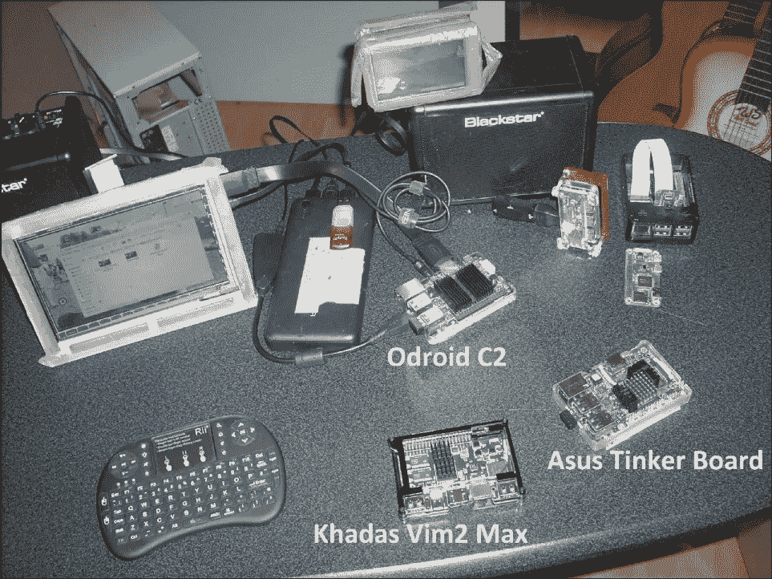
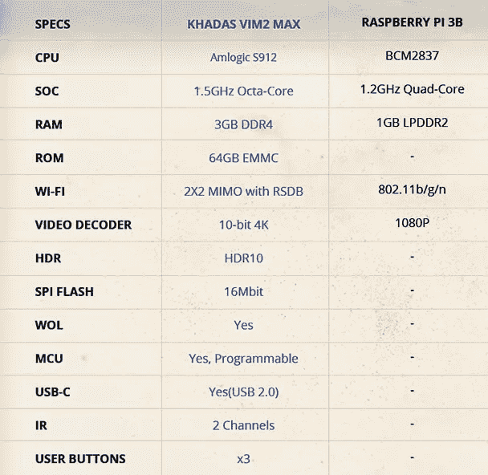
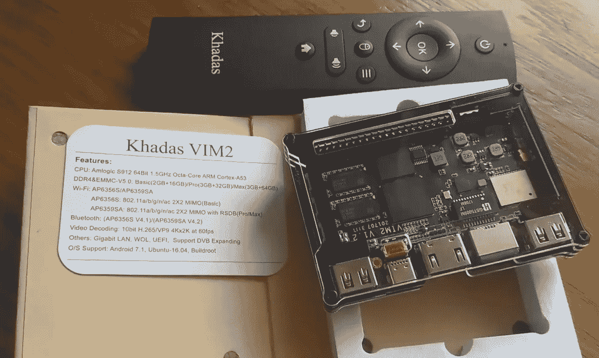
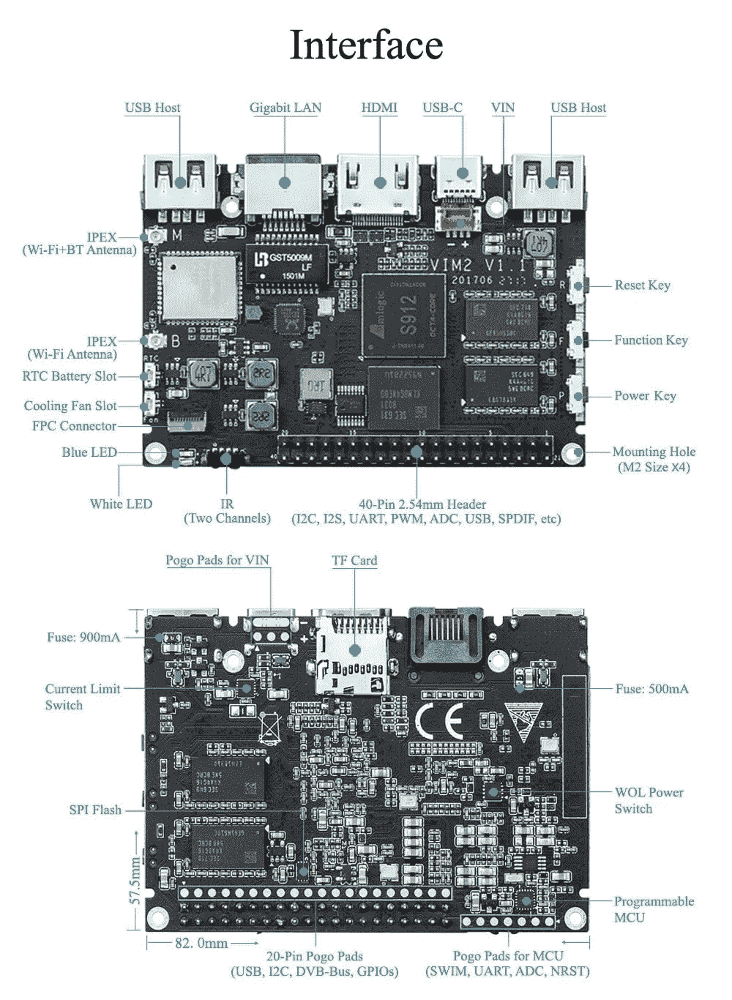
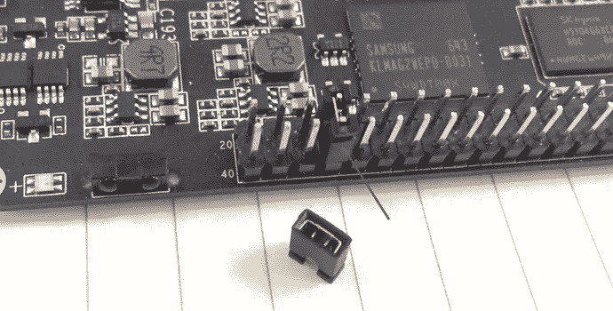
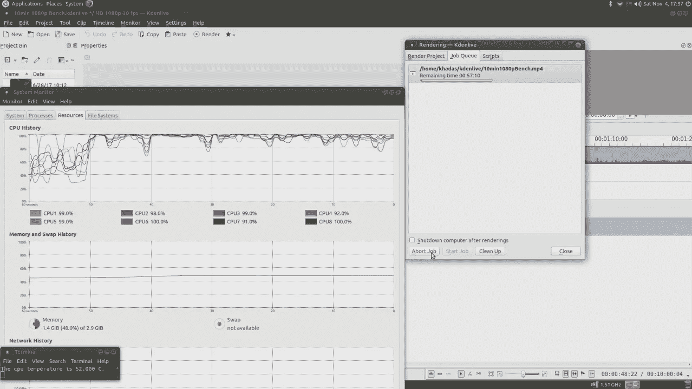

# 从电视机顶盒到高性能单板计算机:在 Khadas VIM2 MAX 上运行 Linux。

> 原文：<https://medium.com/hackernoon/from-tv-box-to-high-performance-single-board-computer-running-linux-on-the-khadas-vim2-max-5c00f6e95aa4>

我已经拥有并使用了许多 arm 单板计算机，普通的如 [Raspberry Pi](https://hackernoon.com/tagged/raspberry-pi) ，Odroid，Orange Pi 和一些 OpenWrt 路由器，主要是使用 atheros 芯片组的。我喜欢 Raspberry Pi 板，因为它们有很大的社区和优秀的 [linux](https://hackernoon.com/tagged/linux) 和 armbian 支持。然而，我有一种感觉，目前的 Raspi 板动力不足，缺乏有用的板上功能，如硬件按钮或 RTC。

经过几天的研究，我找到了最适合我的新主板， [119 美元](https://www.gearbest.com/tv-box/pp_676880.html?lkid=12279373)，几天后我得到了我的[Khadas vim 2 MAX](https://www.gearbest.com/tv-box/pp_676880.html?lkid=12279373)Amlogic Cortex A53 Octacore。



VIM2 MAX vs Raspberry Pi3

Khadas Vim 2 开发板由 Khadas 为业余爱好者、制造商和电子迷设计和发布，它实际上是一个 Android 电视盒子。不要被这个原本设计用来看你喜欢的电视剧的板子所迷惑。当前的家庭影院电脑需求，如流式 4K 视频、跨边界观看高清互联网电视的快速 VPN 或游戏控制台模拟器，导致这些主板拥有其他廉价主板上不常见的高级功能，如双频 WiFi 交流支持、强大的 GPU、基于 eMMC 的快速存储和大量 RAM。

大多数基于 Android 的电视机顶盒都有大量的二进制 blobs，再加上缺乏硬件文档，使得在其上运行 Linux 非常困难，甚至是不可能的。对于 Khadas 来说并非如此，正如你在他的 github uboot/kernel/drivers 仓库中看到的，制造商坚定地致力于开源。Khadas VIM2 显然是在筛选目标，瞄准与极其流行的 Raspberry Pi 相同的以黑客为中心的市场。

[](https://github.com/khadas/) [## 卡达斯

### GitHub 是人们构建软件的地方。超过 2600 万人使用 GitHub 来发现、分享和贡献超过…

github.com](https://github.com/khadas/) 

在规格方面，它由八核 Amlogic S912 驱动，运行 Android Nougat——谷歌移动操作系统的最新版本之一。它们还具有千兆以太网、802.11ac 和蓝牙功能。根据你购买的型号，价格为 75 美元以上，它还将配备 2-3GB 的 DDR4 RAM 和 16-64GB 的板载存储，Pro 和 Max 型号也提供更高性能的 wifi 芯片。



虽然电视盒子的传统显而易见，但 Khadas VIM2 的 DIY 美学不容否认。它装在一个优雅的透明丙烯酸外壳中，很好地展示了迷你电脑的勇气。各种端口都有切口，包括设备顶部的 40 针接头。正面有一个电源 LED 和双红外接收器、电源、用户功能和复位键。该单元的背面有 2 个 USB 端口、以太网、HDMI 和一个 USB Type-C 端口。



默认情况下，Khadas VIM2 带有 Android 操作系统，但使用制造商网站上的工具和图像，您可以在其上安装 Ubuntu Linux 操作系统。[固件资源页面](http://docs.khadas.com/basics/FirmwareResources/)中可用的操作系统列表。

改变操作系统的最好方法，通过 [USB-C 线](https://www.gearbest.com/cables-connectors/pp_638444.html?lkid=12279487)升级的方法。这样，你需要从固件资源页面下载操作系统镜像，同时下载 [Khadas USB 升级工具](http://docs.khadas.com/bootcamp/UpgradeViaUSBCable/)并安装。现在按照以下步骤进行:

```
Open USB Burning Tool, click File-->Import image to chose an image for VIM2.Connect VIM2 and PC with an USB-C cable (VIM will power on automatically). Let VIM2 enter into upgrade mode to complete the upgrading:Long press Power key without release
Short press Reset key and release
Count 2-3 seconds and release the Power key to enter into upgrade modeYour PC should have found VIM2 device as upgrade mode if you correctly follow the above operations. Now all you need to do is to click Start button of the tool and wait the upgrading to complete.User: khadas
Password: khadas 
```

一定要注意 USB 烧录工具 app 中提供的提示。至于刷新固件，虽然刷新固件时肯定总会有一些风险，但这种风险非常低。即使这样也不用担心升级失败，因为有一个恢复 [Maskrom 模式升级。](http://docs.khadas.com/develop/HowtoBootIntoUpgradeMode/)

如果使用双 OS 镜像(Android 和 Ubuntu)镜像，要在两个操作系统之间切换需要做以下工作:



1 >不带跳线的引导:默认为 Android
2>带跳线的引导:默认为 Ubuntu

Khadas VIM2 为那些想要更强大的 Raspberry Pi 替代品的人提供了一个有趣的单板计算机解决方案。它不太可能获得与每个人最喜爱的迷你 PC 相同水平的支持，但如果你想要一个运行 Linux 的高性能平台或只是修补一下，Khadas VIM2 肯定是一个有趣的设备



Maxing out the VIM2 MAX with Kdenlive+Blender

我希望这个快速安装指南会让你感兴趣。